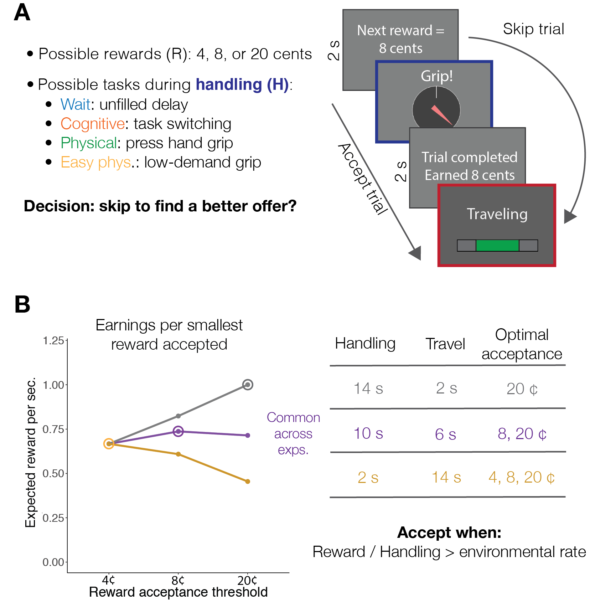
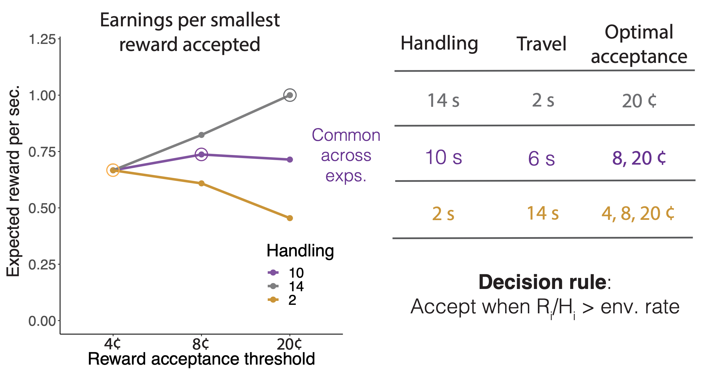
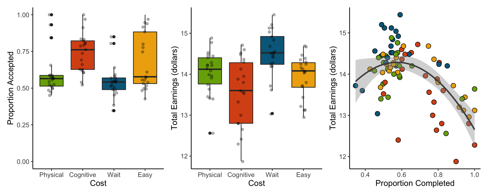
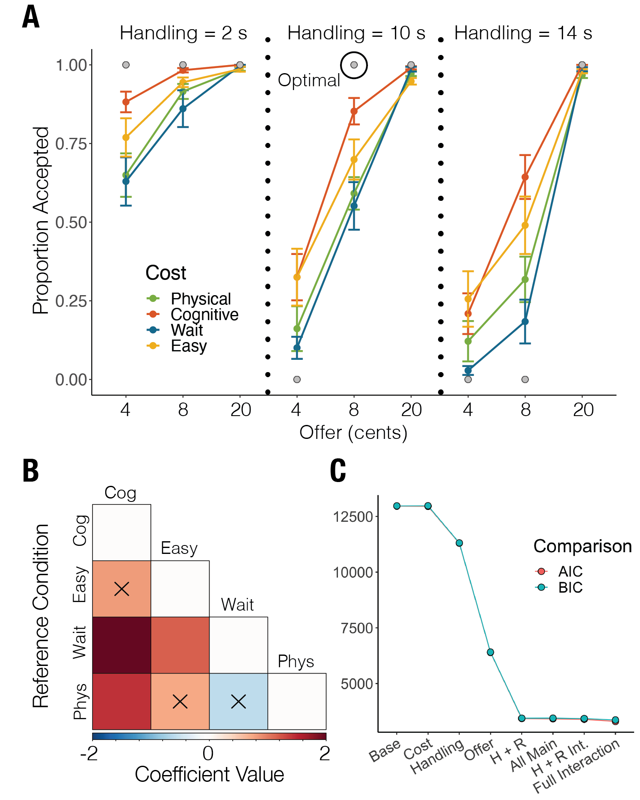
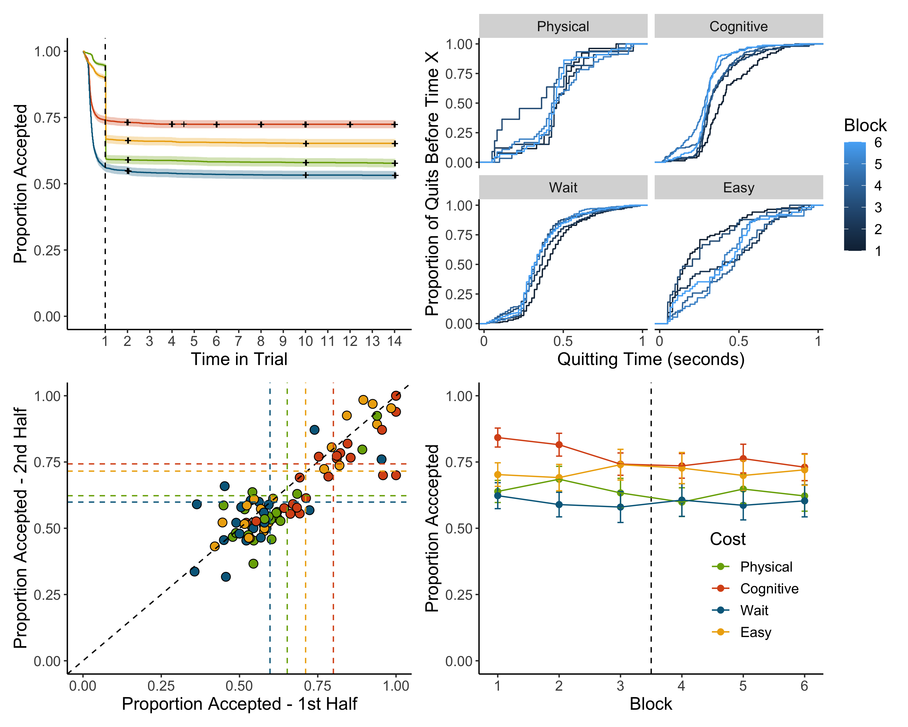
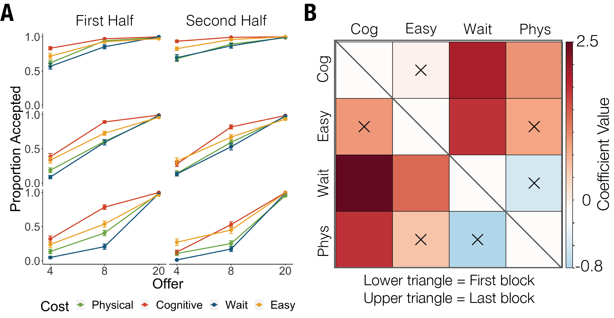
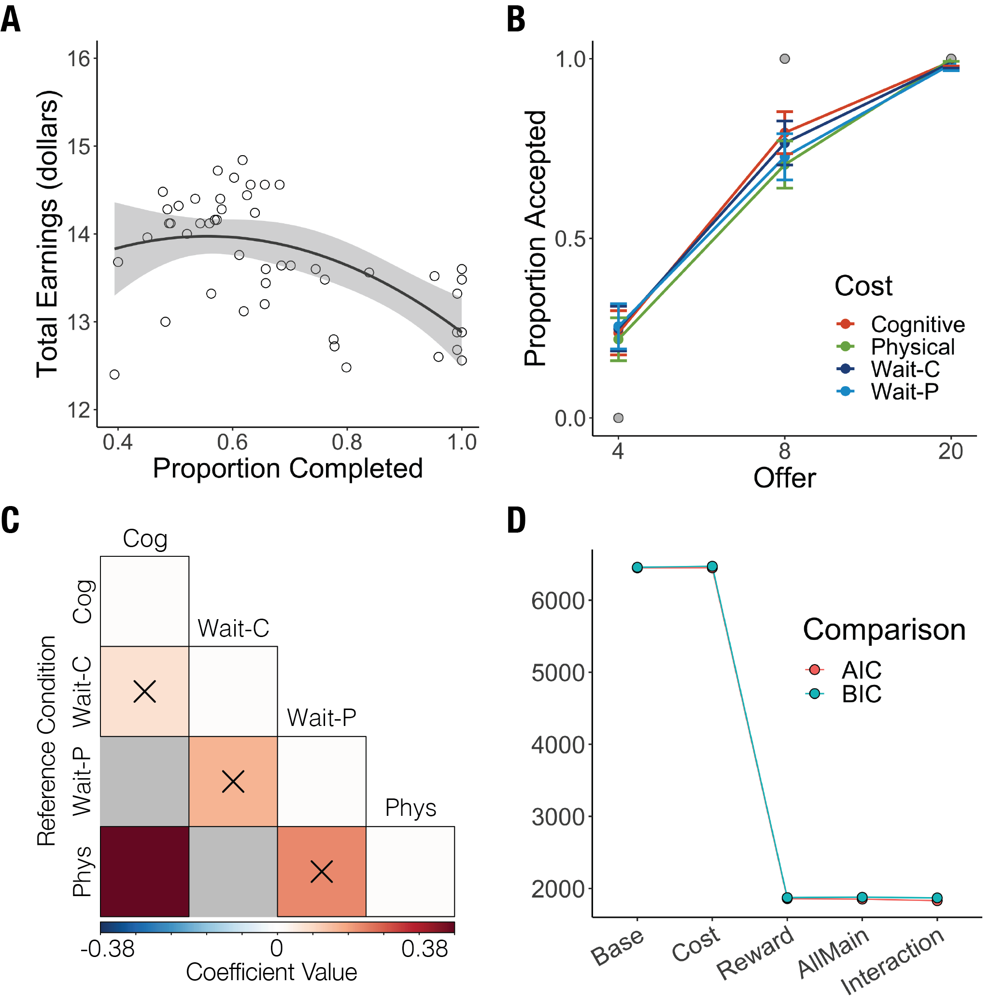
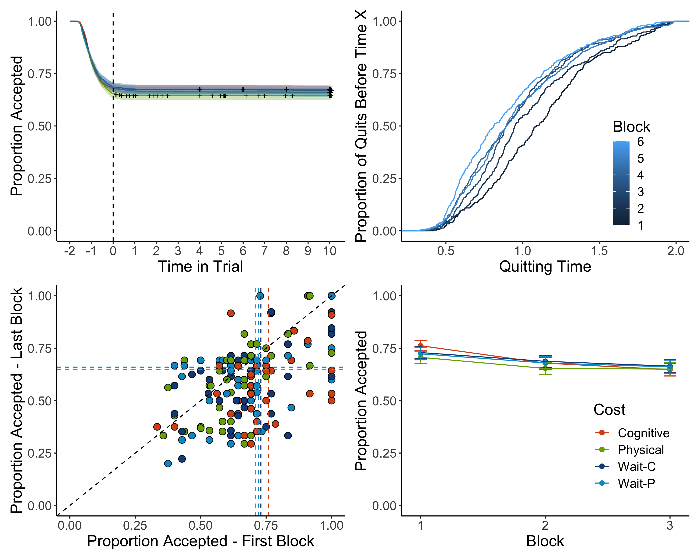
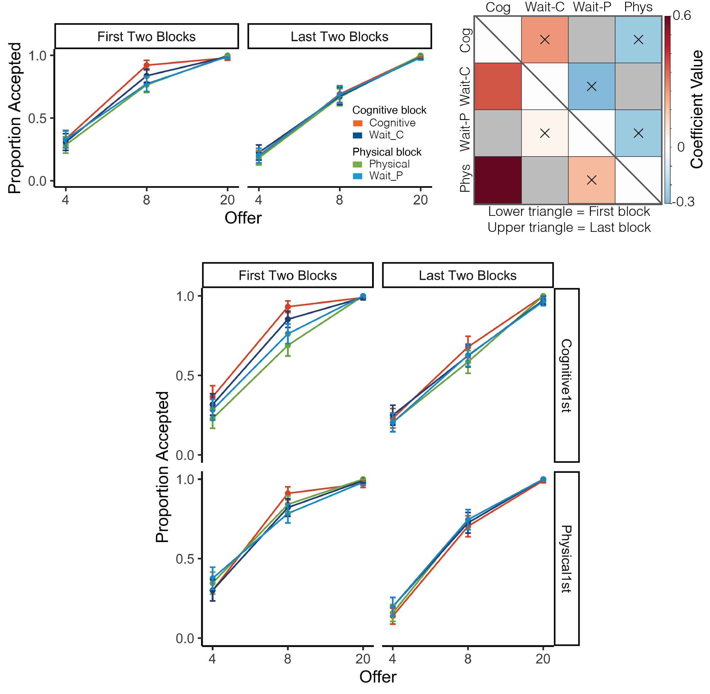
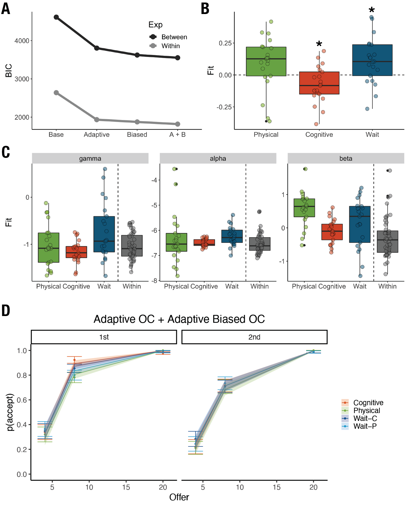

<!-- NOTE: 
If you're using Rstudio on a mac, you can press 'ctrl + option + o' to compress all chunks and look at the paper + code outline. 
-->


```{r Global options, include = FALSE}
knitr::opts_chunk$set(echo = FALSE, warning = FALSE, fig.pos = 'H')
```

```{r Setups, include = FALSE, warning = FALSE}
## libraries
library(tidyverse)
library(ggfortify)
library(knitr)
library(pander) 
library(nloptr)
library(pwr)
library(lme4)
#library(lmerTest)
library(gridExtra)
library(reshape2)
library(corrplot)
library(survival)
library(ggfortify)
library(patchwork)
library(data.table)

## figures at the end of the manuscript?
figsEnd <- TRUE


## aesthetic options
lbls <- c("Wait","Cognitive","Physical","Easy") # between subj
colsBtw = c("#78AB05","#D9541A","deepskyblue4", "darkgoldenrod2") # plot colors (wait, effort)
colsWth <- c("#D9541A", "#78AB05", "dodgerblue4", "deepskyblue3")#"grey30", "grey70") # plot colors (wait, effort)
lthick = 2 # line thickness for plots

## functions
# parameter recovery function
testParams <- function(params = list(Gamma = 1), model = expr(params$Gamma * Handling), subjData, handling = c(2, 10, 14), offer = c(4, 8, 20), plot = F) {
  
  # this just computes choices made by a given parameterized model
  # or compares a putative model with participant choices
  #
  # params: a list of parameters that can be called by the model (besides behavioral observations from subjData)
  # model: must use expr() and call for extra parameters from params if needed (see default)
  # subjData: optional data to be compared
  # handling / offer: in case new experimental parameters should be tested (probably won't use)
  # plot: T/F whether to plot the comparison between modeled and actual behavior
  #
  
  # if no subject data was provided, use the default options and only output the recovered data
  if (missing(subjData)) {
    
    # compute
    df <- expand.grid(Handling = handling, Offer = offer) %>% 
      mutate(OC = eval(model),
             Choice = ifelse(Offer > OC, 1, 0))
    
    # plot
    if (plot) {
      
      ggplot(data = df, aes(interaction(Offer, Handling), Choice, color = Gamma)) +
        geom_line(aes(group = interaction(Handling, Gamma)), size = 1) +
        geom_point(size = 3) +
        labs(x = "Offer.Handling", y = "Proportion Accepted") +
        facet_wrap(vars(Gamma), ncol = 2) +
        theme(legend.key = element_blank(),
              panel.grid.major = element_blank(),
              panel.grid.minor = element_blank(),
              panel.background = element_blank(),
              axis.line = element_line(colour = "black"),
              text = element_text(size = 16))
      
    }
    
    # otherwise give a comparison between recovered and observed choice for a subject's data + gamma
  } else {
    
    # compute
    df <- subjData %>% 
      mutate(OC = eval(model),
             Choice = ifelse(Offer > OC, 1, 0))
    
    # plot
    if (plot) {
      
      print(ggplot(data = df) +
        geom_line(aes(interaction(Offer, Handling), propAccept, group = Handling), size = 1, color = "darkgreen") +
        geom_line(aes(interaction(Offer, Handling), Choice, group = Handling), size = 1, color = "blue") +
        geom_point(aes(interaction(Offer, Handling), propAccept), size = 3, color = "darkgreen") +
        geom_point(aes(interaction(Offer, Handling), Choice), size = 3, color = "blue") +
        labs(x = "Offer.Handling", y = "Proportion Accepted") +
        #scale_color_manual()
        theme(legend.key = element_blank(),
              panel.grid.major = element_blank(),
              panel.grid.minor = element_blank(),
              panel.background = element_blank(),
              axis.line = element_line(colour = "black"),
              text = element_text(size = 16)))
    }
    
  }
  
  return(df)
  
}
  
# get the number of continuous quits before current trial
seqQuits <- function(subjData = 1){
  
    # get the lag
    tempSeq <- sequence(rle(subjData)$lengths) # sequence
    tempSeq[subjData==1] <- 0 # not interested in completed runs, just quits
    tempSeq <- c(0,tempSeq) # lag it so it can be used as a t-1 regressor

    # return data so that the length is equivalent
    out <- tempSeq[1:length(subjData)]
    
    return(out)
    
}

# Cohen's D for 2 groups (could just use DesctTools...)
# for a more flexible approach, make the data input to be a list with entries for n groups, 
# then do length(list) for the number of groups. 
cohenD <- function(group1 = 1, group2 = 2){
  
      # means
      mean1 <- mean(group1, na.rm = T)
      mean2 <- mean(group2, na.rm = T)
      
      # variance
      var1 <- var(group1, na.rm = T)
      var2 <- var(group2, na.rm = T)
      
      # equation
      out <- (mean1 - mean2) / sqrt((var1 + var2)/2)
      
      return(out)
  
}

# generic permutation for 2 groups
permute <- function(group1 = 1, group2 = 2, statType = mean, nPerms = 5000, paired = FALSE, simple = FALSE){
  
    # prep data
    summaryPerm <- list()
    lOne <- length(group1)
    lTwo <- length(group2)
    bigSample <- c(group1,group2)  
    
    if (paired == FALSE) {
      
        
        for (i in 1:nPerms){
          
            # relabel samples
            tempBig <- sample(bigSample)
            tempOne <- tempBig[1:lOne]
            tempTwo <- tempBig[(lOne+1):length(bigSample)]
            
            # stats
            tempDiffs <- statType(tempOne,na.rm=T) - statType(tempTwo,na.rm=T)
            summaryPerm$jointDist[i] <- tempDiffs # statType(tempDiffs, na.rm = T) 
          
        }  
        
    } else {
      
        for (i in 1:nPerms){
          
            # shift labels in a pairwise fashion
            tempDiffs <- statType((-1)^rbinom(lOne,1,0.5) * (group1 - group2))
            summaryPerm$jointDist[i] <- tempDiffs
          
        }
      
    }
  
    # get the observed difference
    diffs <- statType(group1,na.rm=T) - statType(group2,na.rm=T)
    observedAbs <- abs(diffs) # maybe leave it as means here
    observed <- diffs
    summaryPerm$Pval <- 2 * (1 - ecdf(summaryPerm$jointDist)(observedAbs))
    if (length(unique(abs(summaryPerm$jointDist))) == 1) {summaryPerm$Pval <- 1} # if the difference is always the same, then p = 1
    summaryPerm$Observed <- observed
    
    # return the results
    if (simple) {
      
      return(summaryPerm$Pval)
      
    } else if (!simple) {
      
      return(summaryPerm)
      
    }
    
}

# Non-parametric Bootstrap for a single group
bootstrap <- function(group = 1, statType = mean, B = 5000){
  
    # prep param
    bootStats <- rep(0,B)
    
    # iterate
    for(b in 1:B){
      
      # wait group
      x <- sample(group,length(group),replace=T)  
      bootStats[b] <- statType(x,na.rm = T)
      
    }
    
    return(bootStats)
    
}

# basic power calculation for a one way ANOVA
powerCalc <- function(d = 1.2, Za = 1.96, Zb = 0.842){
  
  out <- 2*((Za + Zb)/d)^2 + (0.25*(Za^2))
  
  return(round(out))
  
}

# OC-specific computation of the negative log likelihood for model optimization
negLogLik <- function(params, choice, handling, reward) {
  gamma <- exp(params[2]) * handling
  model <- exp(params[1]) * (reward - gamma)
  p = 1 / (1 + exp(-model))
  p[p == 1] <- 0.999
  p[p == 0] <- 0.001
  tempChoice <- rep(NA, length(choice))
  tempChoice[choice == 1] <- log(p[choice == 1])
  tempChoice[choice == 0] <- log(1 - p[choice == 0]) # log of probability of choice 1 when choice 0 occurred
  negLL <- -sum(tempChoice) 
  return(negLL)
}

# optimize the OC model
optimizeOCModel <- function(Data, Algorithm = "NLOPT_LN_NEWUOA", simplify = F, optfun = negLogLik) {
  
  # Data: The participant's log
  # Algorithm: probably let be
  # optfun: an external function to minimize (in this case OC, separately defined as negloglik)
  
  # Prep data
  handling <- Data$Handling
  reward <- Data$Offer
  choice <- Data$Choice
  
  # Prep list of results to be returned
  out <- list()
  out$percentQuit <- mean(choice == 0) * 100
  out$percentAccept <- mean(choice == 1) * 100 
  miss <- (choice != 1) & (choice != 0)
  out$percentMiss <- mean(miss)  * 100
  choice <- choice[!miss]
  reward <- as.numeric(reward[!miss])
  handling <- as.numeric(handling[!miss])
  
  # Establish lower and upper bounds
  LB <- round(log((min(reward)/max(handling)) * 0.99), digits = 4)
  UB <- round(log((max(reward)/min(handling)) * 1.01), digits = 4) # in reality this should be the second largest, since no one would reject the highest val
  
  # Begin defining parameters
  # If choices are one-sided (i.e. all accepted), assign the upper or lower bound
  if ((sum(choice) == length(choice)) | (sum(choice) == 0)) {
    ifelse(sum(choice) == length(choice), out$Gamma <- exp(LB), out$Gamma <- exp(UB)) 
    out$temperature <- 1 # it was NA, but in theory a temperature of 1 also indicates noiseless estimates, and allows for easier fit computations
    out$LL <- 0
  } else {
    # Create a feasible region (search space)
    params <- as.matrix(expand.grid(temperature = c(-1, 1), gamma = seq(LB, UB, length = 3)))
    # Create a list to check the minimization of the negative log lik.
    info <- list()
    info$negLL <- Inf
    # Define the options to be used during optimization
    # Consider looking into other optimization algorithms and global minima
    opts <- list("algorithm" = Algorithm,
               "xtol_rel" = 1.0e-8)
    # Optimize the sOC over all possible combinations of starting points
    for (i in seq(nrow(params))) {
      tempInfo <- nloptr(x0 = params[i, ], 
                   eval_f = optfun, 
                   lb = c(log(0.001), LB),
                   ub = c(-log(0.001), UB),
                   opts = opts,
                   choice = choice, 
                   handling = handling,
                   reward = reward)
      if (tempInfo$objective < info$negLL) {
        #print("Minimized")
        info$negLL <- tempInfo$objective
        info$params <- tempInfo$solution
      }
    }
    out$Gamma <- exp(info$params[2])
    out$temperature <- exp(info$params[1])
    out$LL <- -info$negLL
  }
  
  # Summarize the outputs
  out$LL0 <- log(0.5) * length(choice)
  out$Rsquared <- 1 - (out$LL/out$LL0) # pseudo r-squred, quantifying the proportion of deviance reduction vs chance
  out$subjOC <- out$Gamma * handling
  out$probAccept <- 1 / (1 + exp(-(out$Scale*(reward - out$subjOC))))
  out$predicted <- reward > out$subjOC
  out$predicted[out$predicted == TRUE] <- 1
  out$percentPredicted <- mean(out$predicted == choice) 
  
  # adjust the probabilities in case of extreme gammas
  if (out$Gamma <= exp(LB)) {
    out$Gamma <- exp(LB) # temporary condition because Nlopt is not respecting the lower bound
    out$probAccept <- rep(1, length(choice))
  } else if (out$Gamma == exp(UB)) {
    out$probAccept <- rep(0, length(choice))
  } 
  
  # if doing this with dplyr::do(), return a simplified data.frame instead with the important parameters
  if (simplify) {
    out <- data.frame(out[c(seq(8), 12)])
  }   
  
  return(out)

}

# simpler form of optimization that allows inputting any model expression into a single function call
optimizeModel <- function(subjData, params, model, simplify = F) {
  # this function finds the combination of parameter values that minimizes the neg log likelihood of a logistic regression
  # used to rely on NLOPTR, but it's too cumbersome for the low-dimensional estimates I'm performing.
  #
  # subjData: a participant's log
  # params: a list of vectors. Each vector is the possible values a given parameter can take. Names in list must match model expression
  # model: using `expr()`, define the model (use <param>[[1]] for free parameters to be estimated. R limitation.). Ex: expr(temp[[1]] * (reward - (gamma[[1]] * handling)))
  
  
  # extract basic choice information
  handling <- subjData$Handling
  reward <- subjData$Offer
  choice <- subjData$Choice
  rt <- subjData$RT
  cost <- subjData$Cost
  trial <- subjData$TrialN
  rawChoice <- subjData$rawChoice
  
  # combine parameters into every possible combination
  params <- expand.grid(params)
  
  # Prep list of results to be returned
  out <- list()
  out$percentQuit <- mean(choice == 0) * 100
  out$percentAccept <- mean(choice == 1) * 100 
  
  LLs <- sapply(seq(nrow(params)), function(i) {
    
    # isolate the parameters for this iteration
    # and then store them as variables
    # FIGURE OUT HOW TO NOT STORE THEM AS DATAFRAMES
    pars <- params[i, ]
    lapply(seq_along(pars), function(variable) {assign(colnames(pars)[variable], pars[variable], envir = .GlobalEnv)})
    
    # estimate the probability of acceptance per the model
    p = 1 / (1 + exp(-eval(model)))
    p[p == 1] <- 0.999
    p[p == 0] <- 0.001
    
    # get the likelihood of the observations based on the model
    tempChoice <- rep(NA, length(choice))
    tempChoice[choice == 1] <- log(p[choice == 1])
    tempChoice[choice == 0] <- log(1 - p[choice == 0]) # log of probability of choice 1 when choice 0 occurred
    negLL <- -sum(tempChoice)
  })
  
  # chosen parameters  
  out$LL <- min(LLs)
  chosen_params <- params[which(LLs == out$LL), ]
  lapply(seq_along(chosen_params), function(variable) {assign(colnames(chosen_params)[variable], chosen_params[variable], envir = .GlobalEnv)})
  
  # Summarize the outputs
  out$LL0 <- -(log(0.5) * length(choice))
  out$Rsquared <- 1 - (out$LL / out$LL0) # pseudo r-squred, quantifying the proportion of deviance reduction vs chance
  out$probAccept <- 1 / (1 + exp(-eval(model)))
  out$Params <- chosen_params
  #out$predicted <- reward > out$subjOC
  #out$predicted[out$predicted == TRUE] <- 1
  #out$percentPredicted <- mean(out$predicted == choice) 
  
  # if doing this with dplyr::do(), return a simplified data.frame instead with the important parameters
  if (simplify) {
    out <- round(data.frame(out[-6]), digits = 2)
    colnames(out) <- c("percentQuit",
                       "percentAccept",
                       "LL",
                       "LL0",
                       "Rsq",
                       colnames(chosen_params))
  }
  
  return(out)
}

# summary matrices for refrence-changing models
betaMatrix <- function(model, rearrange = NA) {
# get a similarity matrix of the resulting coefficient pairings for the cost conditions
# first, do a full_join based on column names on the list of coefficient vectors from each dummy code relevel
# then match the names of columns and rows so NAs are in the diagonal
  
  # get the names of the reference group per model iteration
  refnames <- names(model)
  
  # coefficient matrix
  temp <- lapply(model, function(data) {coefficients(data)$SubjID[1, 2:4]})
  mixCoeffs <- bind_rows(temp) 
  preln <- ifelse("Cost" %in% substr(names(mixCoeffs), 1, 4), 4, 5) # count how many characters precede the name of each cost (diff across studies)
  dimnames(mixCoeffs) <- list(refnames, substr(names(mixCoeffs), preln + 1, 20))
  mixCoeffs <- as.matrix(mixCoeffs[, match(rownames(mixCoeffs), colnames(mixCoeffs))])
  mixCoeffs[is.na(mixCoeffs)] <- 0
  
  # now the pvals
  temp <- lapply(model, function(data) {as.list(summary(data)$coefficients[2:4, 4])})
  mixPvals <- as.matrix(bind_rows(temp)) 
  dimnames(mixPvals) <- list(refnames, substr(colnames(mixPvals), preln + 1, 20))
  mixPvals <- as.matrix(mixPvals[, match(rownames(mixPvals), colnames(mixPvals))])
  mixPvals[is.na(mixPvals)] <- 1

  # if you would like to re-arrange the coefficient order, supply a vector with the desired sequence
  if (length(rearrange) > 1) {
    mixCoeffs <- mixCoeffs[rearrange, rearrange]
    dimnames(mixCoeffs) <- list(rearrange, rearrange)
    mixPvals <- mixPvals[rearrange, rearrange]
    dimnames(mixPvals) <- list(rearrange, rearrange)
  }
  
  # combine matrices into list to return
  out <- list(Betas = round(mixCoeffs, digits = 2),
              Pvals = round(mixPvals, digits = 5))
  
  return(out)
  
}

# gather basic data (this is better as a function, then rbind)
summarizeData <- function(Data = waitData, nSubs = nSubsW, type = "Wait"){
  
  tempSummary <- data.frame(group = rep(type, nSubs))
  
  if (type == "Cognitive") {
    
    for (subj in seq(nSubs)){
      
        # Choice index
        tempChoice <- Data[[subj]]$Choice
        
        # Proportion complete
        tempSummary[subj,2] <- mean(tempChoice)
      
        # earnings
        tempSummary[subj,3] <- sum(Data[[subj]]$Offer[tempChoice==1])
        
        # RTs
        tempSummary[subj,4] <- median(Data[[subj]]$`Choice RT`[tempChoice==0])
    
        # Mistakes (only for cognitive effort group)
        tempMistakes <- sum(cogDataLong[[subj]]$`Trial Outcome`=="Forced travel") # how many forced travel trials
        tempTrialnum <- length(Data[[subj]]$Choice) # how many decision trials
        tempSummary[subj,5] <- tempMistakes / (tempMistakes + tempTrialnum) # proportion of forced travels throughout the exp        
    
    }    
    
  } else {
    
    for (subj in seq(nSubs)){
        
        # choice index
        tempChoice <- Data[[subj]]$Choice
      
        # propotion complete
        tempSummary[subj,2] <- mean(tempChoice)
        
        # earnings
        tempSummary[subj,3] <- sum(Data[[subj]]$Offer[tempChoice==1])
        
        # RTs
        tempSummary[subj,4] <- median(Data[[subj]]$RT[tempChoice==0])
        
        # Mistakes (to allow for mistakes on the cognitive group)
        tempSummary[subj,5] <- NA
        
    }
  
  }
  
  return(tempSummary)
  
}

# this helps clean p-values for inclusion in text
# it takes the value, and reports < 0.001 if needed, or rounds to the second digit otherwise
report_p <- function(pval) {
  # make sure the p-values entered are numeric (sometimes they can be characters..thanks R)
  pval <- as.numeric(pval)
  
  # do p < 0.001 or round depending on the value
  # maybe adapt with case_when(), so there are three levels: observed, < 0.01, and < 0.001
  adapted_p <- ifelse(pval < 0.001, "< 0.001", paste("=", round(pval, digits = 3)))
  
  return(adapted_p)
}

# remove break time and start counting from 0
standardize_time <- function(subjData) {
  # remove the break time (variable across subjects) and start counting time from 0 (otherwise it can add physical effort calibration)
  breakTime <- min(subjData$ExpTime[subjData$Block == 4]) - max(subjData$ExpTime[subjData$Block == 3])
  subjData$ExpTime[which(subjData$Block > 3)] <- subjData$ExpTime[which(subjData$Block > 3)] - breakTime + 16
  subjData$ExpTime <- subjData$ExpTime - min(subjData$ExpTime)
  
  return(subjData)
}
```

```{r Load data for between-subject experiment, echo = FALSE, warning = F}
### data loading and cleaning up
# forced travels are switched to acceptances, as they reflect a preference for that trial
# rawChoice will be used to compute the # of mistakes
# The RT is upper-bounded because a glitch in the code made two 14s trials last longer (among all p's) 
setwd("./Cost2/data")
files <- dir(pattern = '_log.csv')

# load data
dataBtw <- tibble(SubjID = files) %>%
  mutate(contents = map(SubjID, ~ suppressWarnings(read_csv(., col_types = cols()))))  %>%
  mutate(Cost = substring(SubjID, 5, 8),
         Cost = case_when(Cost == "wait" ~ "Wait",
                          Cost == "cogT" ~ "Cognitive",
                          Cost == "phys" ~ "Physical",
                          Cost == "phea" ~ "Easy"),
         SubjID = as.integer(substring(SubjID, 0, 3))) %>%
  unnest() %>%
  rename(TrialN = X1,
         ExpTime = Experiment.Time) %>%
  mutate(rawChoice = Choice, 
         RT = ifelse(RT > 14.1, 14, RT),
         Choice = ifelse(Choice == 2, 1, Choice), # forced travels (2) become acceptances (1)
         Completed = ifelse(rawChoice == 2, 0, rawChoice),
         Half = ifelse(Block < 4, "Half_1", "Half_2"),
         Cost = factor(Cost, levels = c("Physical", "Cognitive", "Wait", "Easy")),
         optimal = case_when(
          (Handling == 10 & Offer < 8) ~ 0,
          (Handling == 14 & Offer < 20) ~ 0,
          TRUE ~ 1
          )
         ) %>%
  group_by(SubjID) %>% 
  do(standardize_time(.)) %>% 
  group_by(SubjID, Block) %>%
  mutate(blockTime = ExpTime - min(ExpTime),
         blockElapsed = blockTime - dplyr::lag(blockTime, default = 0)) %>% # how much time elapsed between trials, counting per block
  ungroup()

# load the cognitive task performance logs
setwd("./extras")
files <- dir(pattern = '_log.csv')

dataBtw_coglogs <- tibble(SubjID = files) %>%
  mutate(contents = map(SubjID, ~ suppressWarnings(read_csv(., col_types = cols()))))  %>%
  unnest() %>%
  rename(Offer = Reward) %>%
  mutate(SubjID = substring(SubjID, 8, 10),
         Trial_Time = round(Choice.RT),
         Choice = ifelse(Choice == 2, 1, Choice), # forced travels (2) become acceptances (1)
         Half = ifelse(Block < 4, "Half_1", "Half_2"),
         optimal = case_when(
          (Handling == 10 & Offer < 8) ~ 0,
          (Handling == 14 & Offer < 20) ~ 0,
          TRUE ~ 1
          )
         ) 

# get a simple subject list and the number of subjects
subjList_btw <- unique(dataBtw$SubjID)
nSubjs_btw <- length(subjList_btw)

```

```{r Load data for within-subject experiment, echo = FALSE, warning = F}
# First looks at the new data
# The RT is upper-bounded because a glitch in the code made one 10s last 14s
setwd('./Cost3/data/')
files <- dir(pattern = 'main_log.csv')

# load the data and remove extreme subjects
dataWth <- data_frame(SubjID = files) %>% 
  mutate(contents = map(SubjID, ~ suppressWarnings(read_csv(., col_types = cols()))))  %>%
  mutate(SubjID = substring(SubjID, 0, 3)) %>%
  unnest() %>%
  mutate(RT = ifelse(RT > 10.1, 10, RT),
         Half = ifelse(Block < 4, "Half_1", "Half_2"),
         Btype = BlockType) %>%
  unite(Cost, Cost, BlockType) %>%
  rename(TrialN = X1) %>%
  mutate(rawChoice = Choice,
         Choice = ifelse(Choice == 2, 1, Choice),
         Completed = ifelse(rawChoice == 2, 0, rawChoice),
         Cost = case_when(Cost == "WAIT_0" ~ "Wait-C",
                           Cost == "COGNITIVE_0" ~ "Cognitive",
                           Cost == "GRIP_1" ~ "Physical",
                           Cost == "WAIT_1" ~ "Wait-P"),
         Cost = as.factor(Cost)) %>%
  group_by(SubjID) %>%
  mutate(BlockOrder = ifelse(Btype[1] == 0, "Cognitive1st", "Physical1st")) %>%
  group_by(SubjID) %>% 
  do(standardize_time(.)) %>% 
  group_by(SubjID, Block) %>%
  mutate(blockTime = ExpTime - min(ExpTime)) %>%
  ungroup()

# load the cognitive task performance logs
files <- dir(pattern = 'coglog')
colname <- c("Handling", "Offer", "Outcome", "RT", "Trial_Time", "ExpTime", "Trial_outcome","Type", "Setup")

dataWth_coglogs <- data_frame(SubjID = files) %>% 
  mutate(contents = map(SubjID, ~ suppressWarnings(read_csv(., col_names = colname, col_types = cols()))),
         SubjID = substring(SubjID, 8, 10)) %>%
  unnest() %>%
  mutate(Trial_time = ifelse(RT > 10.1, 10, RT),
         Trial_Time = round(Trial_Time)) %>%
  group_by(SubjID) %>%
  mutate(Half = ifelse(ExpTime < (max(ExpTime) / 2), "Half_1", "Half_2")) %>%
  ungroup()


# Get just the subject list and number of subjects
subjList_wth <- unique(dataWth$SubjID)
nSubjs_wth <- length(subjList_wth)
```

1.  Department of Psychological and Brain Sciences, Boston University, Boston, USA

2.  Center for Systems Neuroscience, Boston University, Boston, USA

\bigskip

Corresponding authors: Claudio Toro-Serey (ctoro@bu.edu) & Joseph T. McGuire (jtmcg@bu.edu)


\newpage

## Abstract

  Cognitive and physical effort are typically regarded as costly, but recent findings have suggested that exerting effort can boost the value of prospects under certain conditions. Here we embedded mental and physical effort in a "diet choice" foraging task, which required decision makers not only to evaluate the magnitude and delay of a focal prospective reward, but also to estimate the general opportunity cost of time. In two experiments, independent sets of participants collected rewards that required equivalent periods of cognitive effort, physical effort, or unfilled delay. Monetary offers varied per trial, and the two experiments differed in whether the type of effort or delay cost was the same on every trial (between-subjects, n=21 per condition), or varied across trials (within-subjects, n=48).When participants faced only one type of cost, cognitive effort persistently produced the highest acceptance rate compared to trials with an equivalent period of either physical effort or unfilled delay. We theorized that if cognitive effort were intrinsically rewarding, we would observe the same pattern of preferences when participants foraged for varying cost types in addition to rewards. In the within-subject experiment, an initially higher acceptance rate for cognitive effort trials disappeared over time amid an overall decline in acceptance rates as participants gained experience with all three conditions. Our results extend the view that cognitive demands may reduce the discounting effect of delays, but also suggest that differences in cost can eventually fade if individuals actively experience alternative forms of demand. Rather than assigning intrinsic value to cognitive effort, our findings support the idea that a cognitive effort requirement might influence contextual factors such as subjective delay durations. Such altered estimations can be recalibrated if multiple forms of demand are interleaved.

\newpage

## Introduction

  Evaluating whether to pursue a desirable outcome often entails assessing the demands required for obtaining it. In psychology and economics, demands for both time and effort have traditionally been identified as costs that detract from the net subjective value of rewards [@Shenhav2017 ;@Westbrook2015; @Frederick2002; Walton2006]. Indeed, decision makers tend to prefer low-effort and immediate rewards over larger rewards that demand longer delays and higher effort [@Ainslie1975; @Hull1943; @Kool2010; @Kool2018; @Treadway2009; @Westbrook2013]. However, people still needlessly pursue effortful courses of action in everyday decisions. Emerging experimental and theoretical work has chiefly explained this phenomenon by suggesting a reciprocal relationship between effort and outcomes, whereby exerting effort boosts the perceived value of its outcomes [@HernandezLallement2014; @Kacelnik2002; @Mochon2012], and positive outcomes imbue value into their preceding effortful behavior [i.e. learned industriousness; @Eisenberger1992]. Though intuitively valid and empirically supported, this explanation leaves open questions about what features of an effortful task can make it attractive in its own right, and how contextual factors mold its perceived costs [Inzlicht2018]. Understanding what governs the intrinsic costs and rewards of effort could improve our ability to motivate completion of effortful daily activities, such as schoolwork or physical exercise. 
  
	Recent work has proposed that the subjective costs produced by delays and cognitive effort are modulated by the possibility of missing out on better concurrent alternatives, implying that decision makers track the opportunity cost of time [OC; Fawcett2012; Kurzban2013; Otto2019]. Preferences for effortful courses of action could therefore arise from the presence of other types of demands and opportunities in the same choice environment [Kool2018]. For example, exerting high effort for a reward might be aversive, but the same level of work might be appealing in comparison to the boredom of an equivalent period of passive waiting (e.g. taking the cumbersome way home rather than waiting for a delayed train, even if the resulting time of arrival is the same). This effect of context on effort preferences has been illustrated by experiments on charitable giving, in a which high-effort donation method (such as a run) attracted larger donations than a low-effort method (such as a picnic) when either was available alone (the “martyrdom effect”), but the high-effort event was disfavored when both options were offered as alternatives [Olivola & Shafir, 2013]. 
	
	Standard models in neuroeconomics and behavioral economics cannot readily address this possibility. The effects on valuation of different types of effort or delay have traditionally been formalized with discounting functions that capture how much less appealing a reward becomes as a function of the associated amount of effort or delay [Ainslie1975; Frederick2002; Green1994; Kable2007; Klein-Flugge2015; Kool2010; Westbrook2013]. An advantage of relying on these standardized functions is that they can circumvent a key confound when comparing effort and delay, namely that increasingly effortful tasks also tend to take longer to perform. However, although this line of work suggests that discounting functions are similar for delay and effort [Massar2015; Prevost2010; Seaman2018], there is ongoing debate about the shape of the discounting function across types of demands [Arulpragasam2018; Białaszek2017; Chong2017; Hartmann2013; Klein-Flugge2016; Kool2018; Prevost2010], and the degree to which discount rates correlate across cost domains [Seaman2018; Westbrook2013]. Further, this approach does not directly probe which type of demand people would prefer if given the option, and constrains the understanding of behavioral demands to one in which such demands are bound to reduce the value of prospects.
	
	This evidence sets the stage for examining what people would actually select in environments that intermixed multiple types of demands, including cognitive, physical effort, and delay. Single choice foraging paradigms provide a natural way to interrogate preferences among demands, by asking individuals whether the current offer outweighs what could be obtained and experienced during the same time period instead (Constantino & Daw, 2015; Garrett & Daw, 2020; Krebs, Erichsen, & Webber, 1977; Mobbs et al., 2018; Stephens & Krebs, 1986). Such paradigms probe the perceived opportunity cost of time, which has been hypothesized to underlie the evaluation of behavioral costs (Kurzban et al., 2013). Specifically, foragers must decide whether to spend their limited time by harvesting their currently available resource or by seeking out more profitable (or less costly) alternatives. This could involve, for example, deciding when to leave a patch of depleting richness (e.g. when to quit a job that provides diminishing opportunities for growth), or choosing whether to pursue or forgo offers presented serially (e.g. whether to accept your first job offer or wait for new potential ones). Here we focus on this latter type of foraging, traditionally called prey foraging (Krebs et al., 1977), as it provides a means to examine how choices to accept or reject individual prospects are influenced by contextual knowledge about other potentially obtainable alternatives in the same environment.
	
	Foraging has recently attracted high scientific interest due to its ecological validity, which is rooted in evolutionarily conserved choice behaviors (Hayden, 2018; Mobbs et al., 2018), and offers a number of desirable qualities to address our question. First, it allows for the estimation of optimal, reward maximizing choice patterns on the basis of the opportunity cost of time (Charnov, 1976; Krebs et al., 1977). The opportunity cost depends on the richness of the environment, which can be experimentally manipulated by balancing the amount of time it takes to harvest an offer (handling time) versus to search for new ones (travel time). We can then interpret observed deviations from such optimal behavior, and examine how foraging behavior changes when the handling time is filled with cognitive effort or physical effort in comparison with unfilled delay (thus disentangling effort from delay duration). Second, in contrast to multi-alternative economic choice paradigms that often treat choices as independent observations, the sequential nature of foraging encourages individuals to consider both focal and global elements of the decision context. For example, the cost (or value) of effort and delay could globally depend on the availability of alternative demands, impacting the perceived opportunity cost of time. Alternatively, it could be intrinsic and robust to such manipulation, and/or depend on task-specific factors that are adjusted once individuals experience different forms of behavioral costs. Foraging rests on an abundant modeling history that provides computational tools to formalize relevant decision variables (Stephens & Krebs, 1986).
	
	Across two behavioral experiments, we tested the overarching hypothesis that preferences would vary depending on whether individuals faced a single type or multiple types of behavioral demands (i.e. cognitive effort, physical effort, and delay). Experiment 1 used a between-subject design in which participants foraged for rewards of varying magnitudes that imposed varying durations of a single form of demand. Experiment 2 used a within-subject design in which individuals foraged for varying forms of demand in addition to varying reward magnitudes. We leveraged the ecological and computational richness of foraging paradigms to provide new insights on a number of open questions (Inzlicht et al., 2018). First, we examined whether the discounting effects consistently observed in multi-alternative economic choice paradigms persisted when these options were presented serially, and whether the resulting foraging patterns depended on the demands imposed to obtain rewards. The existence of a well-defined optimal, reward-maximizing choice strategy helped us identify when demands boosted or detracted from the value of rewards (signified by tendencies to overharvest poor offers or underharvest advantageous offers, respectively). Second, we probed whether the perceived cost (or value) of demands was intrinsic or dependent on either task-specific or contextual characteristics. For instance, varying the level of exposure to multiple types of demands across experiments allowed us to assess whether cost evaluation was dependent on the availability of alternative avenues of action. Further, including cognitive demands and physical demands let us examine whether such effects might apply differently to distinct types of effort.
	
	Our results provided mixed support for our pre-registered hypotheses, which are detailed in https://osf.io/2rsgm/. For Experiment 1, we hypothesized that 1) decision makers would integrate reward and timing information in order to approximate optimal foraging strategies, as reflected by acceptance rates; 2) acceptance rates would be higher for trials that demanded physical effort and cognitive effort than for unfilled delay or effortless engagement (based on the apparent value of effort displayed by charitable donors, as described above); and 3) choices would be consistent within trials, reflected by few choice reversals, and acceptance rates for each type of demand would remain stable over time. Confirming our predictions, we found that individuals could approximate optimality by preferring higher rewards and shorter delays, regardless of the richness of the environment. We also found that people in the cognitive effort group accepted more trials than optimal, whereas physical effort and wait groups under-accepted, partially matching our predictions and highlighting that cognitive effort can add value to outcomes. Finally, acceptances (and differences among demands) were both consistent and stable within each cost condition, in line with expectations. For Experiment 2, we hypothesized that 1) acceptance rates would once again approximate optimality, and would show effects of reward magnitude similar to those seen in Experiment 1; 2) in contrast to Experiment 1, participants would gravitate towards unfilled delays to obtain rewards; and 3) that choices would be consistent and stable over time. As before, decision makers approached the optimal strategy for the foraging environment, resembling the pattern observed in Experiment 1. Contrary to our second and third hypotheses, we found that a preference for cognitive effort was present initially but disappeared over time as decision makers foraged for types of demands in addition to rewards. 
	
	Computational modeling results suggested that the normative predictions of traditional foraging models were insufficient to explain our data. Instead, the data supported a model in which demands imposed a bias on the estimated opportunity cost of time, which converged as individuals gained experienced with interleaved types of demands. We hypothesize that this bias arises from modulations of subjective time. For instance, cognitive effort could have become appealing by virtue of compressing the perceived trial time, a perception that could be recalibrated with exposure to alternative demands. The subjective shortening of experienced durations during cognitive effort could be due to the ongoing recruitment of working memory (e.g. preventing individuals from estimating the elapsed time), or because the discrete events within the cognitive task subdivided the time interval. These results expand our understanding of the attractiveness of effort, suggesting potential reward-independent factors that could be leveraged to motivate effort engagement in diverse, everyday scenarios.


-----------------------------------

  Evaluating whether to pursue a desirable outcome often requires assessing the demands required for obtaining it. In psychology and economics, demands for both time and effort have traditionally been identified as costs that detract from the net subjective value of rewards [@Shenhav2017 ;@Westbrook2015; @Frederick2002; Walton2006]. Indeed, decision makers tend to prefer low-effort and immediate rewards over larger rewards that demand longer delays and higher effort [@Ainslie1975; @Hull1943; @Kool2010; @Kool2018; @Treadway2009; @Westbrook2013]. However, people often change their attitudes towards exerting effort in everyday decisions, resulting in pursual of effortful avenues instead. Emerging experimental and theoretical work has chiefly explained this phenomenon by suggesting a reciprocal relationship between effort and outcome, whereby exerting effort boosts the perceived value of its outcomes [@HernandezLallement2014; @Kacelnik2002; @Mochon2012], and positive outcomes imbue value into their preceding effortful behavior [i.e. learned industriousness; @Eisenberger1992]. Though intuitively valid and empirically supported, this explanation leaves open questions about what features of an effortful task can make it attractive in its own right, and how contextual factors mold its perceived costs [@Inzlicht2018]. Understanding these intrinsic qualities could improve our ability to motivate completion of effortful daily activities, such as schoolwork or physical exercise.
  
  What is often missing from existing accounts is the common case of choosing among types of behavioral demands. Studies have traditionally compared the reduction of subjective value imposed by each type of demand, often through discounting functions that capture how much less appealing a reward becomes as a function of the amount or intensity of its associated behavior [@Ainslie1975; @Frederick2002; @Green1994; @Kable2007; @Kool2010; @Westbrook2013]. Although this line of work suggests that discounting functions are similar for delay and effort [@Massar2015; @Prevost2010; @Seaman2018], there is ongoing debate about the shape of the discounting function across types of demands [@Arulpragasam2018; @Biaaszek2017; @Chong2017; @Hartmann2013; @Klein-Flugge2016; @Kool2018; @Prevost2010], and discount rates do not always correlate across cost domains [@Seaman2018; @Westbrook2013]. However, sporadic preferences for effort could arise from the availability of other types of demands in the same choice environment—in other words, from its context [@Kool2018]. For example, exerting high effort for a reward might be aversive, but the same level of work might become valuable when compared to the boredom of passive waiting (e.g. taking the cumbersome way home rather than waiting for a delayed train, even if the resulting time of arrival is the same). Conversely, even though people tend to donate more to charitable events that require them to perform effortful activities (i.e. the martyrdom effect), they are also less likely to engage in such events once an easier alternative to raise funds becomes available [@Olivola2013]. Recent work has proposed that the subjective costs produced by delays and cognitive effort is modulated by the possibility of missing out on better concurrent alternatives, namely the opportunity cost of time [OC; @Fawcett2012; @Kurzban2013; @Otto2019]. This evidence sets the stage for examining what people would actually select when given the option for multiple types of demands, including the mostly unexplored question of deciding between cognitive and physical effort [@Inzlicht2018; @Kool2018].

  Single choice foraging paradigms provide a natural way to probe preferences among demands, by asking individuals whether the current offer outweighs what could be obtained and experienced during that time instead [@Stephens2019]. Foraging has recently attracted high scientific interest due to its ecological validity, which is rooted in evolutionary choice behaviors [@Hayden2018; @Mobbs2018], and offers a number of desirable qualities. First, it allows for the estimation of optimal, reward maximizing choice patterns based on the opportunity cost of time [@Charnov1976; @Krebs1977]. We can interpret observed deviations in acceptance rates from such optimal behavior in addition to comparing them among demands. Second, the sequential nature of foraging allows individuals to emphasize different elements of the decision context. For example, the cost (or value) of effort and delay could globally depend on the availability of alternative demands (as suggested above), impacting the perceived opportunity cost of time. Alternatively, it could be intrinsic and robust to such manipulation, and/or depend on task-specific factors that are adjusted once individuals experience different forms of behavioral costs. Foraging rests on an abundant modeling history that can help to computationally capture such emphases [@Stephens2019].

  In this study, we tested the hypothesis that preferences would vary depending on whether individuals face a single or multiple types of behavioral demands (i.e. cognitive effort, physical effort, and delay). We explored this question in two foraging experiments: a between-subjects design in which participants foraged for rewards while performing a single demand, and a within-subjects extension where individuals foraged for demands in addition to rewards. We leveraged the ecological and computational richness of foraging paradigms to provide new insights on a number of open questions [@Inzlicht2018]. First, the existence of a well-defined optimal choice strategy helped us identify when demands boost the value of rewards (i.e. overharvesting poor offers). Second, increasing the level of exposure to types of demands across experiments allowed us to asses whether their cost was intrinsic or relative. Finally, confronting participants with both mental and physical effort let us probe whether these preferences were domain general or task-specific, and in the case of the latter, isolate factors that influenced preferences beyond the often-cited associative relationship between effort and outcome.

  Our results provided mixed support for our pre-registered hypotheses, which are detailed in https://osf.io/2rsgm/. Confirming our predictions, we found that individuals could approximate optimality by preferring higher rewards and shorter delays, regardless of the richness of the environment or whether they faced a single or intermixed demands. When faced with a single type of demand, people in the cognitive effort group accepted more trials than optimal, whereas physical effort and wait groups under-accepted, partially matching our predictions and highlighting that cognitive effort can add value to outcomes. However, against our expectations, we found that a similar preference for cognitive effort disappeared over time as decision makers foraged for types of demands in addition to rewards. Computational modeling suggested that the normative predictions of traditional foraging models were insufficient to explain our results. Instead, we found that demands imposed a bias on the estimation of the opportunity cost of time, which converged over time if individuals were exposed to interleaving types of demands. We hypothesize that this bias arises from modulations of subjective time. For instance, cognitive effort could have become appealing by virtue of compressing the perceived trial time, a perception that could be recalibrated with exposure to alternative demands. The construal of such shorter experienced durations could be due to the ongoing recruitment of working memory (e.g. preventing individuals from estimating the elapsed time), or because of the discrete nature of the cognitive task, which allowed individuals to count instead of thinking about time (versus a continuous configuration of the physical and wait tasks). These results expand our understanding of the attractiveness of effort, bringing forth outcome-independent features that can be leveraged to motivate effort engagement in diverse everyday scenarios. 

## Experiment 1: Between-subjects comparison of costs

### *Methods*
#### **Participants**

  Both between- and within-subject experiments were pregeristered with the Open Science Framework (https://osf.io/2rsgm/registrations). All experimental procedures were approved by the Boston University Institutional Review Board, and written consent was acquired for all participants. For the between-subject experiment, we recruited individuals until a desired number of 84 eligible participants was achieved (58 Female, median age = 21, range = 18 - 31; number excluded before reaching goal = 8). The sample size was determined by means of power analysis (ANOVA), using a significance level of 0.05, power of 0.8, an effect size of f = 0.45 (calculated from a pilot study), and three groups (one for each cost type). The resulting per-group sample was 20, which we increased to 21 in order to match three possible block orders. We added an extra group of 21 participants who experienced a minimally effortful condition in order to determine whether effort or pure engagement were driving our results.
  
We excluded participant datasets based on four preregistered criteria: 1) Consent: If they withdrew their participation; 2) Inattentiveness: a catch trial was placed at the end of each experimental block, asking participants to press a key within 3 seconds (time requirement based on pilot study response times). A participant who failed two or more of these checks was excluded and replaced. 3) Improbable choice behavior: The task was structured so that one reward amount must always be accepted. A participant who quit every trial in at least one block was assumed not to have followed or understood task instructions, or to have disengaged from the task altogether. 4) Performance: Participants were forced to travel if they made 2 mistakes in a cognitive effort trial (see task procedures below), or if they gripped below threshold during physical trials. Any participant with more than 30% forced travels was excluded.


#### **Foraging Task** 

  All experimental tasks were implemented using PsychoPy 2 [v1.85.1, @Peirce2019] on a Macbook Pro laptop. In this task, participants foraged for monetary rewards in an environment in which each trial required either physical effort or cognitive effort for a set period of time (the “handling time”), or an equivalent unfilled delay (Figure 1). Their goal was to maximize their gains within a fixed amount of time. On each trial a monetary offer was displayed for 2 s, and participants had the opportunity to expend time and/or effort during the handling time in order to earn it. Upon completion of a trial participants saw a 2 s window displaying the reward obtained, which was followed by a travel time to the next offer. Alternatively, the participant could quit at any point during the handling time by pressing the spacebar on the computer, and immediately start traveling. 
  
  Each participant was assigned to one of three types of costs (cognitive effort, physical effort, or delay), and a fourth group of equal size faced an effortless physical task that involved minimal gripping. Each group was unaware that other cost conditions existed. Participants exerted physical effort by maintaining grip on a handheld dynamometer (Biopac Systems, United States) using their dominant hand. Gripping requirements were calibrated at 20% of maximum voluntary contraction (MVC, acquired at the beginning of the session). Cognitive effort entailed switching among Stroop, dot motion coherence, and flanker tasks. In Stroop, one of three color names was displayed on the screen (red, blue or green), with a font color that was either congruent (e.g. word red painted in red) or incongruent (e.g. word red painted in blue). Participants had to select the color of the font, not the word displayed (i.e. they had to suppress their tendency to read the word). For motion coherence, 100 solid white dots moved on the screen. A fraction of these dots moved cohesively to the left or right, while the rest moved in random directions (coherence could be either 30% or 40%, uniformly sampled). Participants had to respond with the direction of the cohesive set of dots. In flanker, rows of arrowheads pointed either to the left or the right (maximum of 3 rows, 3 to 13 arrowheads per row). Participants responded with the direction of the center arrowhead, which could point in the same or opposite direction from its neighbors. These tasks were configured so that responses always involved a left or right key press (e.g. for Stroop, two colored circles were presented at each side of the screen). During the handling time, cognitive tasks and their configurations were randomly sampled, and were presented for 1 s followed by a 1 s inter-stimulus interval. Participants were asked to respond within each task’s presentation time. Before the experiment, participants trained in each cognitive task until they correctly performed six consecutive tasks of each kind. While in the handling time, if participants failed to maintain above-threshold gripping or made two mistakes during the cognitive task, they were forced to travel and missed the reward.  
  
  There were three block types, in which handling times of 2, 10, or 14 seconds were paired with travel times of 14, 6, and 2 seconds, respectively (note that all combinations add up to 16 seconds). Timing parameters were held constant within each 7-min block. Each of these blocks was experienced in a pseudo-randomized order, and repeated in the same order after a short break in order to probe choice stability (total session length = 42 minutes). Reward amounts varied uniformly per trial (4, 8, or 20 cents), with the constraint that every reward was presented twice every six trials. This prevented sequences from being dominated by a single amount during any window of time. Timing information was disclosed at the beginning of each block, and rewards displayed during a 2 s offer window before each trial began. Participants received training prior to the experimental session, and were told about all possible environmental statistics in order to preclude biases due to experience-dependent learning [@Dundon2020; @Garrett2020]. 

```{r Trial plot (Fig. 1), eval = !figsEnd, out.width = "80%", fig.align = "center", fig.cap= "General foraging trial structure. On each trial, participants were offered to earn money (4, 8, or 20 cents) by sustaining effort or waiting during the handling time (2, 10, or 14 s). The end of a trial was followed by a travel time (handling and travel times always added up to 16 s). Participants could skip unfavorable trials and immediately start traveling to a potentially better offer. In the between-subject experiment, cost was fixed per participant and handling time varied per block. In the within-subject version, handling time was fixed at 10 s, but a combination of effort and delay trials changed per block. Possible costs, handling times, and rewards were fully disclosed in order to avoid experience-dependent learning."}

#Task design and optimal behavior. A: General foraging trial structure. On each trial, participants were offered to earn money by sustaining effort or waiting during the handling time (2, 10, or 14 s). The end of a trial was followed by a travel time (handling and travel times always added up to 16 s). Participants could skip unfavorable trials and immediately start traveling to a potentially better offer. In the between-subject experiment, cost was fixed per participant and handling time varied per block. In the within-subject version, handling time was fixed at 10 s, but a combination of effort and delay trials changed per block. B: Possible earnings per second for each acceptance threshold (i.e. the smallest amount accepted) for each handling time. Circles denote the reward-maximizing threshold for each block, which is described in the table. Experiments shared the 10 s handling block, in which it was optimal to skip all 4 cent offers.


```


#### **Operationalization of Cost**

  Foraging theory posits that accepting a delayed reward should depend on the opportunity cost (OC) of time incurred in obtaining it, given by the richness of the environment [@Charnov1976; @Stephens2019]. In this study, the richness of the environment was manipulated by the length of the handling and travel times, whereby shorter travel times produced richer environments. Since time combinations were fixed per block, we calculated each block’s optimal accept/reject strategy by computing all decision strategies according to the following equation:
  
$$\begin{aligned} 
g(*) = \dfrac {\sum p_i R_i} { 3\text{Time}_\text{offer} + (\sum p_i H + \text{Time}_\text{reward}) + 3T},p \in \{0, 1\}
\end{aligned}$$
  
  where *R* and *p* are the reward and acceptance probability of offer i, respectively, *H* is the handling time for the block, $Time_{offer/reward}$ are the windows when offers and rewards were disclosed, and *T* its associated travel time. This gave us the total reward per second attainable in each block as a function of the acceptance threshold (i.e. the lowest amount accepted). Figure 2 shows possible earnings per second for each choice strategy, as well as the lowest amount participants should accept in order to maximize their rewards (circled dots). For example, a participant in a 10 s handling block should accept 8-cent and 20-cent rewards (and reject 4-cent rewards) to maximize their reward rate. Note that accepting every offer was often detrimental to participant earnings. Significant deviations from the optimal strategy can be understood as reflecting changes in subjective OC. This approach allowed us to test if certain demands boosted the value of offers, expressed as a subjective OC that fell below the optimal rate.

```{r Optimal plot (Fig. 2), eval = !figsEnd, out.width = "80%", fig.align = "center", fig.cap= "Possible earnings per second for each acceptance threshold (i.e. the smallest amount accepted) for each handling time. Circles denote the reward-maximizing threshold for each block, which is described in the table. Experiments shared the 10 s handling block, in which it was optimal to skip all 4 cent offers."}


```

#### **Analyses**

  All analyses were performed in R 3.5.2 [@RTeam2018]. First we tested whether decision makers integrated delay and reward information. To address the prediction that participants would be more likely to accept higher reward and shorter handling time trials, we fit a mixed-effects logistic regression to predict trial-wise acceptances [using the lme4 package, @Bates2015], giving a random intercept to each subject to account for biases in participant behavior. We included regressors for handling time and reward, as well as two covariates that probed the influence of recent history on choices. The first was an autoregressive regressor containing the number of consecutive offer misses prior to a given trial (misses could be due to quits or forced travels). The second regressor tracked the sum of the previous *n* offers. We identified the *n* that minimized Akaike's Information Criterion (AIC) among 6 versions of the model (tracing from 2 previous trials up to 7, beyond which the model failed to converge), and reported all coefficients from the winning model.
  
  Our foraging task was configured such that over and under accepting were detrimental to total earnings. To confirm this, we fit a general linear model with constant, linear, and quadratic terms to estimate the correspondence between proportion of trials completed (independent variable) and total earnings (dependent variable). A significant quadratic coefficient thus would signal that the task statistics operated as expected. Next, to determine the optimality of each group’s decisions, we performed two-sided one-sample t-tests to see if the proportion of acceptances for each time/reward combination was significantly different from the optimal rate (see Operationalization of Cost). This resulted in 36 independent tests (3 rewards amounts, 3 handling/travel time combinations, and 4 groups), so we corrected for multiple comparisons using False Discovery Rate [FDR, @Benjamini2001].
  
  Next, we compared preferences among cost conditions. We first performed a one-way ANOVA on the proportion of trials accepted using group as a factor. We then compared the proportion completed among all 4 groups using non-parametric permutation contrasts (6 tests). On each of 5000 permutation iterations, the group assignment was randomly shuffled without replacement, and the difference in mean acceptance rates across iterations created a putative null distribution. The unpermuted group mean difference was then evaluated against this permuted distribution. The same approach was used for total earnings. This gave us an initial glimpse on the potential differences in cost among conditions. 
  
  In order to further look at the effect of handling, offer, and cost type, we computed the probability of accepting a trial with a mixed-effects logistic regression. Based on the task structure and our main question, our a priori model of interest included cost condition, handling time, and reward amount as fixed main effects, and a random intercept per subject. Cost condition was modeled with three categorical terms, with the fourth condition as the reference condition. We ran three versions of the model with different reference conditions, in order to test all pairwise differences among the four cost conditions. We then examined whether this a priori model outperformed both simpler and more complex models. We used both AIC and Bayesian Information Criterion (BIC) to determine the model that minimized the negative log-likelihood while penalizing the addition of parameters. The regression with each combination of predictors was fitted in a forward order: 1) intercept only; 2) condition only; 3) handling time only; 4) offer amount only; 5) handling time and offer amount (added to the preregistered comparison); 6) condition, handling time, and reward main effects (a priori model from above); 7) adding a handling-by-reward interaction; and 8) all possible two-way interactions. We predicted that model 6 (the a priori setup) would have the lowest AIC and BIC. Nested models with similar AIC were statistically compared using an analysis-of-deviance. The significance test was computed as the probability of the reduction in deviance, based on a chi-square distribution with degrees of freedom equal to the difference in the number of parameters between models.
  
  Next, we examined whether participants were consistent and stable in their choices. For consistency, we visually examined survival curves indicating at what point during the handling time participants quit a trial (censored points included trial completions and forced travels), in addition to quitting time distributions. We interrogated stability by computing each participant’s total proportion of acceptances pre- and post-midpoint for every block type, comparing the mean proportion of acceptances using paired permutations (5000 iterations). We then tested whether the observed differences in costs were still present on each half of the experiment by applying winning model from the mixed-effects logistic comparison to each half separately. In each case, the reference cost category was rotated in order to assess pairwise differences among all costs. We evaluated the consistency of the relative costs by visually comparing the patterns of significant differences between experimental halves.

### *Results*
#### **Between-subjects: Tests of whether decision makers integrate delay and reward information**

``` {r BTW: 16.1.1. Individual logistic, fig.align="center", fig.width = 4, fig.height = 4, echo = FALSE}
# filter out errors and compute R + H logistic per subject, then get coefficients
logisRH <- dataBtw %>%
  filter(Choice < 2) %>%
  plyr::dlply("SubjID", identity) %>%
  lapply(function(data) {glm(Choice ~ Handling + Offer, data = data, family = "binomial")}) %>%
  sapply(coefficients)

# coefficient summaries
coeffRH_mean <- apply(logisRH, 1, mean)
coeffRH_se <- apply(logisRH, 1, sd) / sqrt(nSubjs_btw)

# Rank sum tests
rankHand <- wilcox.test(logisRH["Handling", ])
rankOffer <- wilcox.test(logisRH["Offer", ])

# Plot coeffs
temp <- melt(logisRH[c("Handling", "Offer"), ])
plot_handoffer <- qplot(data = temp, x = Var1, y = value, geom = "boxplot") + 
                    labs(x = "", y = "Coefficients") +
                    geom_hline(yintercept = 0, linetype = "dashed") +
                    theme(legend.position = c(0.9, 0.7),
                         panel.grid.major = element_blank(), 
                         panel.grid.minor = element_blank(), 
                         panel.background = element_blank(), 
                         axis.line = element_line(colour = "black"),
                         text = element_text(size = 22))
```

``` {r BTW: 16.1.2. AR sequential effects, echo = FALSE, include = FALSE}

# history
# Instead of quits, I'm now doing completions. This is because one would expect forced travels to also affect choice.
# First, iterate over the recent history to identify which sum length reduces the AIC the most
# tracing the history beyond 7 trials produces non-convergence
historySize_btw <- lapply(seq(2, 7), function(tail) {
  dat <- dataBtw %>%
    #filter(Cost != "Wait") %>%
    group_by(SubjID) %>%
    mutate(recentTravels = seqQuits(Completed),
           recentOffers = ifelse(TrialN < (tail + 1), Offer, Reduce(`+`, shift(Offer, 1:tail)))) 
  
  glmer(Choice ~ Handling + Offer + recentTravels + recentOffers + (1 | SubjID), data = dat, family = "binomial")
})

# then get the summary of the tail length that reduced the AIC the most
historyIndex_btw <- which(sapply(historySize_btw, function(iter) {AIC(iter)}) == min(sapply(historySize_btw, function(iter) {AIC(iter)})))

historyCoeffs_btw <- round(summary(historySize_btw[[historyIndex_btw]])$coefficients, digits = 2)

# # Idea: do AIC to compare models per participant
# # add an AR regressor to track recent quits
# logisRHAR <- dataBtw %>%
#               filter(Choice < 2) %>%
#               group_by(SubjID) %>%
#               mutate(AR = seqQuits(Choice)) %>%
#               plyr::dlply("SubjID", identity) %>%
#               lapply(function(data) {suppressWarnings(glm(Choice ~ Handling + Offer + AR, data = data, family = "binomial"))}) 
#   
# # get the AR CIs per participant 
# AR_CIs <- sapply(logisRHAR, function(x) {tryCatch(suppressWarnings(confint(x)[4, ]), error = function(e){c(0, 0)})}) %>%
#   replace_na(0) %>%
#   t() %>%
#   apply(1, function(x) (x[1] <= 0 & x[2] >= 0))
# 
# # coefficient summaries
# logisRHAR <- sapply(logisRHAR, coefficients)
# coeffRHAR_mean <- apply(logisRHAR, 1, mean, na.rm = T)
# coeffRHAR_se <- apply(logisRHAR, 1, sd, na.rm = T) / sqrt(nSubjs_btw)
# 
# # Rank sum test
# rankRHAR <- wilcox.test(logisRHAR["AR", ])
```

``` {r BTW: 16.1.3. Earnings, echo = FALSE, fig.align = "center", fig.width = 6, fig.height = 4}
## calculate the proportions and earnings per subject, while keeping group info
temp <- dataBtw %>%
  filter(rawChoice < 2) %>%
  group_by(SubjID, Cost) %>%
  summarise(Earnings = sum(Offer[Choice == 1] / 100),
            pComplete = mean(Choice)) %>%
  mutate(pComplete2 = pComplete^2) %>%
  ungroup()


## linear fit of earnings x prop accept
lmEarn <- lm(Earnings ~ pComplete + pComplete2, data = temp)


## plot
earnFitplot_btw <- ggplot(data = temp, aes(pComplete, Earnings)) +
         scale_color_manual(values = colsBtw) +
         geom_point(aes(fill = Cost), pch = 21, color = "black", size = 3, show.legend = F) +
         stat_smooth(aes(y = Earnings), method = "lm", formula = y ~ x + I(x^2), color = "grey30") +
         labs(x = "Proportion Completed", y = "Total Earnings (dollars)") +
         scale_fill_manual(values = colsBtw) +
         theme(panel.grid.major = element_blank(),
           panel.grid.minor = element_blank(),
           panel.background = element_blank(),
           axis.line = element_line(colour = "black"),
           text = element_text(size = 12))

# Summary table for the linear model
# panderOptions("digits", 2)
# pander(lmEarn, style = "rmarkdown")

```

  In this experiment, groups faced with different behavioral costs (physical effort, cognitive effort, or delay) chose their preferred strategy to maximize rewards in fully-disclosed foraging environments of variable richness. Environmental richness was dictated by the time it took to obtain a reward (the handling time) and the time between trials (the travel time). We hypothesized 1) that participants would approximate reward-maximizing behavior by preferring higher rewards and shorter delays, but that 2) participants confronted with effortful demands would be more likely to accept trials than those faced with passive delay, regardless of handling time and reward amount.
  
  We performed a mixed effects logistic regression to address the first hypothesis. Since participants in the effort groups were forced to travel when they failed to perform above threshold (see Methods), we distinguish between acceptances (entering the handling period) and completions (successfully obtaining a reward). In line with our predictions, larger reward amounts significantly increased acceptance probabilities ($\beta$ = `r historyCoeffs_btw["Offer", "Estimate"]`, SE = `r historyCoeffs_btw["Offer", "Std. Error"]`, *p* `r report_p(historyCoeffs_btw["Offer", "Pr(>|z|)"])`), whereas longer delays decreased them ($\beta$ = `r historyCoeffs_btw["Handling", "Estimate"]`, SE = `r historyCoeffs_btw["Handling", "Std. Error"]`, *p* `r report_p(historyCoeffs_btw["Handling", "Pr(>|z|)"])`). Two additional regressors showed that having missed out on consecutive rewards decreased the probability of acceptance ($\beta$ = `r historyCoeffs_btw["recentTravels", "Estimate"]`, SE = `r historyCoeffs_btw["recentTravels", "Std. Error"]`, *p* `r report_p(historyCoeffs_btw["recentOffers", "Pr(>|z|)"])`), and that participants became more selective when recent offer history was richer ($\beta$ = `r historyCoeffs_btw["recentOffers", "Estimate"]`, SE = `r historyCoeffs_btw["recentOffers", "Std. Error"]`, *p* `r report_p(historyCoeffs_btw["recentOffers", "Pr(>|z|)"])`). The reduction in acceptances from recent misses was driven by the wait group (removing this group from the model yielded a *p* > 0.1), likely because this group accepted the least amount of offers. Comparing likelihood fits among lengths of offer history (e.g. sum over 2 or 3 past trials) suggested that participants were influenced by the `r historyIndex_btw + 1` most recent rewards (AIC = `r round(AIC(historySize_btw[[historyIndex_btw]]), digits = 2)`), which matched the offer presentation rotation (see Methods). 

#### **Between-subjects: Comparisons among the four delay and effort conditions**

``` {r BTW: 16.1.4. Optimality (move to acceptance comparison eventually), echo = FALSE}
# # in order
# # clean data, 
# # calculate each individual's prop. accept,
# # calculate t.tests with optimality as null mean,
# # correct pvalues with FDR
# temp <- dataBtw %>%
#   filter(Choice < 2) %>%
#   group_by(SubjID, Handling, Offer, Cost) %>%
#   summarise(pAccept = mean(Choice)) %>%
#   mutate(optimal = case_when(
#           (Handling == 10 & Offer < 8) ~ 0,
#           (Handling == 14 & Offer < 20) ~ 0,
#           TRUE ~ 1
#         )) %>% 
#   group_by(Handling, Offer, Cost) %>%
#   summarise(meanAccept = mean(pAccept),
#             sdAccept = sd(pAccept),
#             optimal = unique(optimal),
#             pvals = tryCatch(t.test(pAccept, mu = unique(optimal))$p.value, error = function(e) {1})) %>%
#   mutate(FDR = p.adjust(pvals, method = "BY"),
#          significant = FDR < 0.05)
# 
# 
# # proportion of significant ones
# # eventually find a way to plot this (or just place it further down)
# # alternative per block: temp %>% group_by(Handling) %>% summarise(prop = mean(significant, na.rm = T))
# optimalProp <- mean(temp$significant, na.rm = T) * 100
# 
# # proportion accepted per cost condition
# optimalProp_cost <- temp %>% 
#   group_by(Cost) %>% 
#   summarise(propDeviations = round(mean(significant) * 100))


## if you want to replicate the cost 3 method
# this says that all but easy deviated from optimality in the observed direction
temp <- dataBtw %>%
  group_by(Cost) %>%
  filter(Offer < 20) %>%
  summarize(propAccept = mean(Choice),
            accept = sum(Choice),
            quit = sum(Choice == 0))

temp2 <- apply(temp, 1, function(row) {prop.test(as.numeric(row[3]), sum(as.numeric(row[3:4])), p = 0.5, conf.level = 0.95)})


# store stats in a dataframe
optimalProp_cost <- data.frame(probability = sapply(temp2, "[[", "estimate"),
                                   chisquared = sapply(temp2, "[[", "statistic"),
                                   confint = t(sapply(temp2, "[[", "conf.int")),
                                   pval = sapply(temp2, "[[", "p.value"))
rownames(optimalProp_cost) <- temp$Cost


```

``` {r BTW: 16.2.1. Overall Proportion/Earnings, fig.align = "center", fig.width = 8, fig.height = 4, echo = FALSE}  
## earnings and proportion accepted per cost type
# note that earnings are based on successful completions, not just acceptances
temp <- dataBtw %>%
        group_by(SubjID, Cost) %>%
        summarise(Earnings = sum(Offer[(Choice == 1) & (rawChoice < 2)] / 100),
                  pAccept = mean(Choice))


## summaries
overallSumms <- temp %>% 
  group_by(Cost) %>% 
  summarise (mProp = mean(pAccept), 
             sdProp = sd(pAccept), 
             mEarn = mean(Earnings), 
             sdEarn = sd(Earnings)) %>%
  mutate_if(is.numeric, round, digits = 2)

## formal testing 
# proportion completed
propAov <- summary(aov(pAccept ~ Cost, data = temp))

propTests <- temp %>% 
  plyr::dlply("Cost", identity) %>%
  sapply("[[", "pAccept") %>%
  as.data.frame() %>%
  combn(2, simplify = F) %>%
  sapply(function(x) {
    c(contrast = paste(colnames(x), collapse = ifelse(cohenD(x[, 1], x[, 2]) < 0, " < ", " > ")), 
      permPval = round(permute(x[, 1], x[, 2], simple = T), digits = 3),
      cohenD = abs(round(cohenD(x[, 1], x[, 2]), digits = 2)))
  }) %>% 
  t() %>%
  as_tibble()

# pairwise.wilcox.test(temp$pComplete, temp$Cost)

# earnings 
earnAov <- summary(aov(Earnings ~ Cost, data = temp))

earnTests <- temp %>% 
  plyr::dlply("Cost", identity) %>%
  sapply("[[", "Earnings") %>%
  as.data.frame() %>%
  combn(2, simplify = F) %>%
  sapply(function(x) {
    c(contrast = paste(colnames(x), collapse = ifelse(cohenD(x[, 1], x[, 2]) < 0, " < ", " > ")), 
      permPval = round(permute(x[, 1], x[, 2], simple = T), digits = 3),
      cohenD = abs(round(cohenD(x[, 1], x[, 2]), digits = 2)))
  }) %>% 
  t() %>%
  as_tibble()

## plots
# pAccepted
prop1 <- ggplot(temp, aes(Cost, pAccept, fill = Cost)) + 
        geom_boxplot(show.legend = F) +
        geom_jitter(width = 0.1, alpha = 0.3, show.legend = F) +
        scale_fill_manual(values = colsBtw) +
        ylim(c(0, 1)) +
        labs(y = "Proportion Accepted") +
        theme(panel.grid.major = element_blank(), 
            panel.grid.minor = element_blank(), 
            panel.background = element_blank(), 
            axis.line = element_line(colour = "black"),
            text = element_text(size = 12))

# earnings
earnings1 <- ggplot(temp, aes(Cost, Earnings, fill = Cost)) + 
        geom_boxplot(show.legend = F) +
        geom_jitter(width = 0.1, alpha = 0.3, show.legend = F) +
        scale_fill_manual(values = colsBtw) +
        labs(y = "Total Earnings (dollars)") +
        theme(panel.grid.major = element_blank(), 
            panel.grid.minor = element_blank(), 
            panel.background = element_blank(), 
            axis.line = element_line(colour = "black"),
            text = element_text(size = 12))


# Proportion of performance-based forced travels per subject and cost type
# move to 16.2.1.
propFails <- dataBtw %>% 
  filter(Cost != "Wait") %>% 
  group_by(SubjID, Cost) %>% 
  summarise(propFails = mean(rawChoice == 2)) %>%
  group_by(Cost) %>% 
  summarise(meanFT = mean(propFails),
            sdFT = sd(propFails))


## MAYBE BETTER WAY TO DO PAIRWISE COMPARISONS, USING VECTORIZE FROM BELOW
# OCanova$perms <- summaryOC_btw$all %>%
#   select(Cost, Gamma) %>%
#   plyr::dlply("Cost", identity) %>%
#   do.call(cbind, .) %>%
#   select_if(is.numeric) %>%
#   rename(Physical = Physical.Gamma,
#          Cognitive = Cognitive.Gamma,
#          Wait = Wait.Gamma,
#          Easy = Easy.Gamma) %>%
#   outer(., ., FUN = Vectorize(permute), simple = T)
# diag(OCanova$perms) <- 1

```

```{r General prop & earnings plots (Fig. 3), eval = !figsEnd, fig.width = 10, fig.height = 4, fig.align = "center", fig.cap = "Overall choice behavior in the between-subjects experiment. Left: Proportion accepted per cost. Middle: Total number of dollars earned by each group by the end of the experiment. Right: The relationship between proportion accepted and total earned. Consistent with the foraging design, participants who over and under accepted earned the least. These figures suggests a preference for cognitive effort at the expense of earnings."}
# plots generated in 16.2.1. and 16.1.3.
#(propPlot <- prop1 | earnings1 | earnFitplot_btw)
#ggsave("./Images/FIG3_props.png", propPlot, device = "png", height = 4, width = 10)



```

  The next set of analyses examined the hypothesis that effort group would uniformly accept more trials. Figure 3 (left) shows that the cognitive effort group consistently accepted more offers, which resulted in lower earnings (middle). One-way ANOVAs showed that differences among groups were significant both for overall acceptance rates (F(`r propAov[[1]]$Df[1]`, `r propAov[[1]]$Df[2]`) = `r round(propAov[[1]][1, 4], digits = 2)`, *p* `r report_p(propAov[[1]][1, 5])`), and total earnings (F(`r earnAov[[1]]$Df[1]`, `r earnAov[[1]]$Df[2]`) = `r round(earnAov[[1]][1, 4], digits = 2)`, *p* `r report_p(earnAov[[1]][1, 5])`). Post-hoc permutations (5000 iterations) comparing mean acceptance rates between every pair of costs confirmed that acceptance rates of the cognitive effort group (mean = `r filter(overallSumms, Cost == "Cognitive")$mProp`, SD = `r filter(overallSumms, Cost == "Cognitive")$sdProp`) were higher than those of the physical (mean = `r filter(overallSumms, Cost == "Physical")$mProp`, SD = `r filter(overallSumms, Cost == "Physical")$sdProp`; *p* `r report_p(filter(propTests, contrast == "Physical < Cognitive")$permPval)`, Cohen's D = `r filter(propTests, contrast == "Physical < Cognitive")$cohenD`) and wait groups (mean = `r filter(overallSumms, Cost == "Wait")$mProp`, SD = `r filter(overallSumms, Cost == "Wait")$sdProp`; *p* `r report_p(filter(propTests, contrast == "Cognitive > Wait")$permPval)`, Cohen's D = `r filter(propTests, contrast == "Cognitive > Wait")$cohenD`). It also showed that those faced with the easy task accepted more than those in the wait group, although responses from the easy group were more variable (mean Easy = `r filter(overallSumms, Cost == "Easy")$mProp`, SD = `r filter(overallSumms, Cost == "Easy")$sdProp`; *p* `r report_p(filter(propTests, contrast == "Wait < Easy")$permPval)`, Cohen's D = `r filter(propTests, contrast == "Wait < Easy")$cohenD`) (all other *p* > 0.05). The higher acceptance rates produced by the cognitive effort group resulted in significantly lower earnings (mean = `r filter(overallSumms, Cost == "Cognitive")$mEarn`, SD = `r filter(overallSumms, Cost == "Cognitive")$sdEarn`) than both physical (mean = `r filter(overallSumms, Cost == "Physical")$mEarn`, SD = `r filter(overallSumms, Cost == "Physical")$sdEarn`; *p* `r report_p(filter(earnTests, contrast == "Physical > Cognitive")$permPval)`, Cohen's D = `r filter(earnTests, contrast == "Physical > Cognitive")$cohenD`) and wait groups (mean = `r filter(overallSumms, Cost == "Wait")$mEarn`, SD = `r filter(overallSumms, Cost == "Wait")$sdEarn`; *p* `r report_p(filter(earnTests, contrast == "Cognitive < Wait")$permPval)`, Cohen's D = `r filter(earnTests, contrast == "Cognitive < Wait")$cohenD`). In addition, we found that the wait group earned more than the physical (*p* `r report_p(filter(earnTests, contrast == "Physical < Wait")$permPval)`, Cohen's D = `r filter(earnTests, contrast == "Physical < Wait")$cohenD`) and easy groups (mean Easy = `r filter(overallSumms, Cost == "Easy")$mEarn`, SD = `r filter(overallSumms, Cost == "Easy")$sdEarn`; *p* `r report_p(filter(earnTests, contrast == "Wait > Easy")$permPval)`, Cohen's D = `r filter(earnTests, contrast == "Wait > Easy")$cohenD`). The percentage of forced travels for cognitive effort was `r round(propFails[2, 2] * 100, digits = 2)`% across participants, and 0% for either physical or easy conditions, making performance an unlikely explanation for the observed differences in choice.
  
  We next examined the optimality of these decisions. The foraging task was configured so that there was a single reward-maximizing strategy per block type (see Operationalization of Cost in Methods), and participants were warned that accepting everything would not maximize their gains. Accordingly, participants who over- or under-accepted earned the least (Figure 3, right; general linear model with quadratic term, F = `r round(summary(lmEarn)$fstatistic[1], digits = 2)`, Beta = `r round(summary(lmEarn)$coefficients[3,1], digits = 2)`, SE = `r round(summary(lmEarn)$coefficients[3, 2], digits = 2)`, $R^2$ = `r round(summary(lmEarn)$r.squared, digits = 2)`, *p* `r report_p(summary(lmEarn)$coefficients[3, 4])`). We performed group-level chi-squared tests of proportions to examine whether each cost biased decision makers to under- or over-accept 4 and 8 cent offers, which together should have been accepted 50% of the time. We found a significant over-acceptance of these trials by the cognitive effort group (proportion accepted = `r round(optimalProp_cost["Cognitive", "probability"], digits = 2)`; $\chi^2$ = `r round(optimalProp_cost["Cognitive", "chisquared"], digits = 2)`, *p* `r report_p(optimalProp_cost["Cognitive", "pval"])`), but under-acceptances by the physical (proportion accepted = `r round(optimalProp_cost["Physical", "probability"], digits = 2)`; $\chi^2$ = `r round(optimalProp_cost["Physical", "chisquared"], digits = 2)`, *p* `r report_p(optimalProp_cost["Physical", "pval"])`) and wait (proportion accepted = `r round(optimalProp_cost["Physical", "probability"], digits = 2)`; $\chi^2$ = `r round(optimalProp_cost["Physical", "chisquared"], digits = 2)`, *p* `r report_p(optimalProp_cost["Physical", "pval"])`) groups (no significant difference for the Easy group). Together, these findings show that even though participants did not always perform optimally, they adequately integrated the statistics of the environment as they tracked their recent experience. Further, they suggest that cognitive effort can boost the value of an offer, as reflected by higher acceptances at the expense of earnings.

``` {r BTW: 16.2.2. rmANOVA, echo=FALSE,fig.align="center",fig.width=5,fig.height=4, results = 'asis'}
## This section was removed because it was deemed redundant. The interaction is addressed once the a priori mixed effects logistic model is evaluated against multiple forms of interaction effects (16.2.4.).
# temp <- dataBtw %>%
#         filter(Choice < 2) %>%
#         group_by(SubjID, Cost, Handling, Offer) %>%
#         summarise(pAccept = mean(Choice))
# 
# ## REPEATED MEASURES ANOVA
# # I think I like this the most
# prop.aov <- with(temp, aov(pAccept ~ factor(Cost) * Handling * Offer + 
#                                  Error(SubjID / (Handling * Offer))))
# 
# ## NOTES ON RESULTS
# # According to the logistic fit, there are main effects for all predictors, but no interactions. It also says that the overall odds for the wait group to accept versus the effort is around 16%. Similarly, increasing the handling time results in a decrease in the multiplicative odds of ~25%. Increments in reward increase the odds of acceptance by ~40%.
```

``` {r BTW: 16.2.2. rmANOVA plot, echo = FALSE, fig.align = "center", fig.width = 10, fig.height = 6}
# # code to calculate the rwd/sec rate for each acceptance threshold per handling (calculate the optimal solution)
# rwd <- c(4, 8, 20)
# handling <- c(14, 10, 2) + 2 # add 2 to H and T to account for offer and reward disclosure windows
# travel <- c(2, 6, 14) + 2
# rwdRates <- sapply(3:1, function(thresh) {(sum(tail(rwd, n = thresh))) / ((handling * thresh) + (travel * 3))}) 
# mean(apply(rwdRates, 1, max))
# 
# as_tibble(rwdRates) %>% 
#   mutate(Handling = handling) %>%
#   rename(Five = V1,
#          Eight = V2,
#          Twenty = V3) %>%
#   gather(Reward, Rate, -Handling) %>%
#   mutate(Reward = factor(Reward, levels = list("Five", "Eight", "Twenty")),
#          Handling = as.character(Handling)) %>%
#   group_by(Handling) %>%
#   mutate(Optimal = ifelse(Rate == max(Rate), max(Rate), -1)) %>%
#   ungroup() %>%
#   ggplot(aes(Reward, Rate, group = Handling, color = Handling)) +
#     geom_point(size = 3) +
#     geom_line(size = 1.5) +
#     geom_point(aes(Reward, Optimal), pch = 21, color = "black", fill = NA, size = 7, show.legend = F) +
#     scale_color_manual(values = c("purple", "grey50", "darkgoldenrod3")) +
#     ylim(0, 1.2) +
#     labs(y = "Expected reward per sec.", x = "Reward acceptance threshold") +
#     theme(legend.position = c(0.85, 0.2),
#           legend.key = element_blank(),
#           panel.grid.major = element_blank(), 
#           panel.grid.minor = element_blank(), 
#           panel.background = element_blank(), 
#           axis.line = element_line(colour = "black"),
#           text = element_text(size = 22))

# and plot
hrPlot_btw <- dataBtw %>%
        filter(Choice < 2, Cost != "Easy") %>%
        group_by(SubjID, Cost, Handling, Offer, optimal) %>%
        summarise(pAccept = mean(Choice)) %>%
        group_by(Cost, Handling, Offer, optimal) %>%
        summarise(meanComplete = mean(pAccept),
                  SE = sd(pAccept) / sqrt(length(pAccept))) %>%
   ggplot(aes(interaction(Offer, Handling), meanComplete, color = Cost)) + 
        geom_point(size = 3) + 
        geom_errorbar(aes(ymin = meanComplete - SE, ymax = meanComplete + SE), width = 0.2, size = 1) +
        geom_line(aes(group = interaction(Handling, Cost)), size = 1) +
        geom_point(aes(y = round(optimal)), shape = 21, fill = "grey75", color = "grey30", size = 3, show.legend = F) +
        labs(x = "Offer.Handling", y = "Proportion Accepted") +
        scale_color_manual(values = colsBtw) +
        theme(legend.key = element_blank(),
              panel.grid.major = element_blank(), 
              panel.grid.minor = element_blank(), 
              panel.background = element_blank(), 
              axis.line = element_line(colour = "black"),
              text = element_text(size = 12))

# snippet on rmANOVA
# These intuitions were formally tested using a repeated measures ANOVA, whose results are presented in the table below. Overall, the analysis partially confirmed our predictions. While all main effects were significant, there was an unexpected significant condition-by-reward interaction, which could be due to the performance of the "easy" group relative to their peers. Importantly, we found that the interaction between all three main parameters was not significant, thus suggesting that the effects of handling and reward on choices were not different across groups.

```

``` {r BTW: 16.2.2. rmANOVA table, pander}
# # anova table
# x <- summary(prop.aov)   
# x <- x$`Error: Within`
# panderOptions("digits", 2)
# pander(x, style = "rmarkdown", split.table = 110)
```

``` {r BTW: 16.2.3. Mixed Effects Model, echo = FALSE, fig.align = "center", fig.width = 5, fig.height = 4, include = FALSE}
# clean the data so the total acceptances and quits per subj x handling x reward are ready for modeling
mixLogis_main_btw <- list()
mixData <- dataBtw %>%
  #filter(Choice < 2) %>% analysis performed on acceptances, not completions
  group_by(SubjID, Cost, Handling, Offer) %>%
  summarize(totalChoices = length(Choice),
            totalAccepted = sum(Choice),
            totalQuits = sum(Choice == 0),
            propAccepted = mean(Choice)) %>%
  ungroup()


# model with a random intercept, then relevel the cost to get all pairwise comparisons
# the correct way to model a logistic with proportions as dependent vars is by providing n of hits and quits as a matrix
# the pre-registered version has random intercepts per subject: (1 | SubjID) - So, for the SubjID grouping, get a random intercept (1)
# or, for each subject, random intercept and slopes for handling and offer: (1 + Handling + Offer | SubjID)
# one can add random H + R slopes for each Cost group with: (0 + Handling + Offer | Cost)
# so far, the best qualitative and AIC-based fit comes from random HR slopes + intercept per subject, plus random HR slopes per cost group:  (1 + Handling + Offer | SubjID) + (0 + Handling + Offer | Cost)
# though that produces warnings too
mixData <- within(mixData, Cost <- relevel(Cost, ref = "Wait"))
mixLogis_main_btw$Wait <- glmer(cbind(totalAccepted, totalQuits) ~ Cost + Handling + Offer + (1 | SubjID), family = "binomial", data = mixData)
mixData <- within(mixData, Cost <- relevel(Cost, ref = "Cognitive"))
mixLogis_main_btw$Cognitive <- glmer(cbind(totalAccepted, totalQuits) ~ Cost + Handling + Offer + (1 | SubjID), family = "binomial", data = mixData)
mixData <- within(mixData, Cost <- relevel(Cost, ref = "Physical"))
mixLogis_main_btw$Physical <- glmer(cbind(totalAccepted, totalQuits) ~ Cost + Handling + Offer + (1 | SubjID), family = "binomial", data = mixData)
mixData <- within(mixData, Cost <- relevel(Cost, ref = "Easy"))
mixLogis_main_btw$Easy <- glmer(cbind(totalAccepted, totalQuits) ~ Cost + Handling + Offer + (1 | SubjID), family = "binomial", data = mixData)

# matrix of coefficients and pvalues
rearrange <- c("Cognitive", "Easy", "Wait", "Physical") # to kinda match the order in Cost 3
mixSummary_btw <- betaMatrix(mixLogis_main_btw, rearrange = rearrange)
diag(mixSummary_btw$Pvals) <- NA


# plot coefficients and pvalues in a matrix
# invert colors
col2 <- colorRampPalette(c("#053061", "#2166AC", "#4393C3", "#92C5DE", "#D1E5F0", "#FFFFFF", "#FDDBC7", "#F4A582", "#D6604D", "#B2182B", "#67001F"))
# 
# corrplot(mixSummary_btw$Betas, 
#          is.corr = F, 
#          p.mat = mixSummary_btw$Pvals, 
#          type = "lower",
#          outline = T,
#          #insig = "p-value",
#          sig.level = 0.05, 
#          na.label = "square", 
#          na.label.col = "grey",
#          method = "color", 
#          tl.col = "black",
#          tl.cex = 0.8,
#          col = col2(200))

```

``` {r BTW: 16.2.3. Mixed Effects Model plot rand intercepts, echo = FALSE, fig.align = "center", fig.width = 5, fig.height = 4}
# # random intercepts for each subject, with cost group and overall acceptances
# RI <- ranef(mixLogis_main_btw$Wait)$SubjID[, 1]
# RI <- dataBtw %>% 
#   group_by(SubjID, Cost) %>% 
#   summarise(pAccept = mean(Choice)) %>% 
#   ungroup() %>%
#   mutate(RI = RI)
# 
# # plot relationship between random intercept (RI) and proportion accepted per cost group
# RI1 <- ggplot(data = RI, aes(RI, pAccept, color = Cost)) + 
#   geom_vline(xintercept = 0, linetype = "dashed") +
#   geom_smooth() + 
#   geom_point(alpha = 0.5) + 
#   scale_color_manual(values = colsBtw) +
#   theme_classic()
```

``` {r BTW: 16.2.4. Model comparison, echo = FALSE, fig.align = "center", fig.width = 6, fig.height = 4}
# relevel, since the wait-reference model is used from the previous section
mixData <- within(mixData, Cost <- relevel(Cost, ref = "Wait"))

## model fitting
mixLogis_compare_btw <- list()
mixLogis_compare_btw$Base <- glmer(cbind(totalAccepted, totalQuits) ~ 1 + (1 | SubjID), family = "binomial", data = mixData) # intercept only
mixLogis_compare_btw$Cost <- glmer(cbind(totalAccepted, totalQuits) ~ Cost + (1 | SubjID), family = "binomial", data = mixData)
mixLogis_compare_btw$Handling <- glmer(cbind(totalAccepted, totalQuits) ~ Handling + (1 | SubjID), family = "binomial", data = mixData)
mixLogis_compare_btw$Offer <- glmer(cbind(totalAccepted, totalQuits) ~ Offer + (1 | SubjID), family = "binomial", data = mixData)
mixLogis_compare_btw$HR <- glmer(cbind(totalAccepted, totalQuits) ~ Offer + Handling + (1 | SubjID), family = "binomial", data = mixData)
mixLogis_compare_btw$AllMain <- mixLogis_main_btw$Wait
mixLogis_compare_btw$HR_interaction <- glmer(cbind(totalAccepted, totalQuits) ~ Cost + Offer * Handling + (1 | SubjID), family = "binomial", data = mixData, control=glmerControl(optimizer="bobyqa",optCtrl=list(maxfun=2e5)))
mixLogis_compare_btw$Interaction <- glmer(cbind(totalAccepted, totalQuits) ~ (Cost + Handling + Offer)^2 + (1 | SubjID), family = "binomial", data = mixData)


## Model selection 
# AIC/BIC
ME_evals <- list()
ME_evals$abicLogis_compare <- data.frame(Model = names(mixLogis_compare_btw),
                                AIC = sapply(mixLogis_compare_btw, AIC),
                                BIC = sapply(mixLogis_compare_btw, BIC)) %>%
                                  mutate_at(vars(AIC:BIC), round)
  
# analysis of deviance for models with similar AIC
ME_evals$HRvMain <- anova(mixLogis_compare_btw$HR, mixLogis_compare_btw$AllMain)
ME_evals$MainvHRint <- anova(mixLogis_compare_btw$AllMain, mixLogis_compare_btw$HR_interaction)
ME_evals$MainvAllint <- anova(mixLogis_compare_btw$AllMain, mixLogis_compare_btw$Interaction)

# effect size for the main model
mixLogis_compare_btw$AllMainRsq <- 1 - (deviance(mixLogis_compare_btw$AllMain)/deviance(mixLogis_compare_btw$Base)) # denominator is the null deviance
```

``` {r BTW: 16.2.4. Plot Deviance comparison, echo = FALSE, fig.align = "center", fig.width = 6,fig.height = 4}
# plot AIC and BIC
ABIC_plot_btw <- ME_evals$abicLogis_compare %>% 
  gather(Comparison, Value, AIC:BIC) %>%
  mutate(Model = factor(Model, levels = names(mixLogis_compare_btw))) %>%
  ggplot(aes(Model, Value, group = Comparison, fill = Comparison)) +
    geom_line(aes(color = Comparison)) +
    geom_point(color = "black", pch = 21, size = 3) +
    labs(x = "", y = "") +
    scale_x_discrete(labels = c("Base", "Cost", "Handling", "Offer", "H + R", "All Main", "H + R Int.", "Full Interaction")) +
    theme(legend.position = c(0.8, 0.7),
          axis.text.x = element_text(angle = 30, hjust = 1),
          panel.grid.major = element_blank(),
          panel.grid.minor = element_blank(),
          panel.background = element_blank(),
          axis.line = element_line(colour = "black"),
          legend.key=element_blank(),
          text = element_text(size = 20))
    
```

```{r mixed effects plots (Fig. 4), eval = !figsEnd, out.width = "80%", fig.align = "center", fig.cap = "Comparing acceptance rates among costs for each reward and handling combination. A: Proportion accepted by each group for every combination of handling time and reward. Grey dots indicate the reward-maximizing acceptance for each combination. B: Matrix portraying the coefficients (color scale) and significance that resulted from switching the reference cost condition (crosses mark non-significant comparisons). Each entry shows how much more likely a group was to accept compared to the reference condition (row). C: AIC and BIC values for a forward mixed-effects model comparison, ranging from a base intercept-only to a full-interaction model."}
#hrPlot_btw / (ABIC_plot_btw | ME_matrix_btw) # doesn't work with corrplot.. oh well

```

  We next probed whether these results held uniformly across all parameter combinations. Figure 4A shows the mean proportion of acceptances (± SEM) per combination of handling time, reward, and cost, with optimal acceptance rates depicted by the gray circles. Qualitatively, the figure confirms two important predictions. First, participants adapted to the richness of the each timing block, gravitating towards optimality regardless of the cost they faced. Second, differences in cost were consistent across blocks, and acceptances were uniformly highest for the cognitive effort group. We tested these observations with a mixed-effects logistic regression, computing the probability of accepting an offer as a function of handling time, reward amount, and demand type (see Methods for details). As before, the model showed significant main effects of handling time (global intercept = `r round(fixef(mixLogis_main_btw$Wait)["(Intercept)"], digits = 2)`, $\beta$ = `r round(fixef(mixLogis_main_btw$Wait)["Handling"], digits = 2)`, SE = `r round(summary(mixLogis_main_btw$Wait)[[10]]["Handling", "Std. Error"], digits = 2)`, *p* `r report_p(summary(mixLogis_main_btw$Wait)[[10]]["Handling", "Pr(>|z|)"])`) and offer amount ($\beta$ = `r round(fixef(mixLogis_main_btw$Wait)["Offer"], digits = 2)`, SE = `r round(summary(mixLogis_main_btw$Wait)[[10]]["Offer", "Std. Error"], digits = 2)`, *p* `r report_p(summary(mixLogis_main_btw$Wait)[[10]]["Offer", "Pr(>|z|)"])`). Comparisons among all conditions are shown on Figure 4B. The matrix of coefficients conveys that the cognitive effort group was significantly more likely to accept any offer than the physical ($\beta$ = `r round(mixSummary_btw$Betas["Physical", "Cognitive"], digits = 2)`, *p* `r report_p(mixSummary_btw$Pvals["Physical", "Cognitive"])`) and wait groups ($\beta$ = `r round(mixSummary_btw$Betas["Wait", "Cognitive"], digits = 2)`, *p* `r report_p(mixSummary_btw$Pvals["Wait", "Cognitive"])`), but not the easy group.
  
  These observations could not be better explained by simpler or more complex regression models. Figure 4C shows AIC and BIC values for models of increasing complexity, starting with an intercept-only configuration (see Methods for details). Here we focus on AIC, as both metrics yielded comparable results. As predicted, the a priori model with all main effects performed better than those relying on a single parameter (a priori model $R^2$ = `r round(mixLogis_compare_btw$AllMainRsq, digits = 2)`), as well as the model with main effects for handling time and reward amount (AIC~a-priori~ = `r filter(ME_evals$abicLogis_compare, Model == "AllMain")$AIC`, AIC~handling/reward~ = `r filter(ME_evals$abicLogis_compare, Model == "HR")$AIC`, $\chi^2$(`r ME_evals$HRvMain[[7]][2]`) = `r round(ME_evals$HRvMain$Chisq[2], digits = 2)`, *p* `r report_p(ME_evals$HRvMain[[8]][2])`). However, against our expectations, the a priori model was outperformed by models that added an interaction between handling and reward (AIC~HR_interaction~ = `r filter(ME_evals$abicLogis_compare, Model == "HR_interaction")$AIC`, $\chi^2$(`r ME_evals$MainvHRint[[7]][2]`) = `r round(ME_evals$MainvHRint$Chisq[2], digits = 2)`, *p* `r report_p(ME_evals$MainvHRint[[8]][2])`) as well as one that considered all possible interactions (AIC~all_interactions~ = `r filter(ME_evals$abicLogis_compare, Model == "Interaction")$AIC`, $\chi^2$(`r ME_evals$MainvAllint[[7]][2]`) = `r round(ME_evals$MainvAllint$Chisq[2], digits = 2)`, *p* `r report_p(ME_evals$MainvAllint[[8]][2])`). These improvements were driven by the fact that differences in offer acceptances among costs were never present for 20 cents (all *p* values for interactions containing offer amount < 0.001). As the highest reward should always be accepted in prey foraging environments, we conclude that the most parsimonious explanation of choice behavior came from the a priori model containing all main effects. These results further support the hypotheses that handling and reward amounts were similarly integrated across groups, and that the absolute rate of acceptances was affected by the demand faced. However, they offer partial support for the hypothesis that effort would induce higher acceptance rates, which was only true for those confronted with cognitive effort.

#### **Between-subjects: Consistency and stability**


``` {r BTW: 16.3.1. surv and RTs, echo = FALSE, warning = FALSE, fig.align = "center", fig.width = 10, fig.height = 4, include = FALSE}
# qualitative survival analysis
# this version of a survival curve forces all successful acceptances to have an RT of 14 (i.e. the longest handling time)
# that's to avoid jumps from 2s to 10s to 14s
# 1 - Choice is to reverse the coding of choices, since the survival package assumes 0 = censor?
temp <- dataBtw %>%
    #filter(rawChoice < 2) %>% 
    mutate(#RT = ifelse(Choice == 1, 14, RT),
           Choice = 1 - Choice) 

survData <- survfit(Surv(RT, Choice) ~ Cost, data = temp)

survPlot_btw <- autoplot(survData) +
  geom_vline(xintercept = 1, lty = 2) + # end of the grace period for physical trials
  scale_color_manual(values = colsBtw) +
  scale_fill_manual(values = colsBtw) +
  scale_x_continuous(breaks = seq(14)) +
  ylim(0, 1) +
  labs(x = "Time in Trial", y = "Proportion Accepted", fill = "Cost", color = "Cost") +
  theme(legend.position = "none",
        panel.grid.major = element_blank(),
        panel.grid.minor = element_blank(),
        panel.background = element_blank(),
        axis.line = element_line(colour = "black"),
        text = element_text(size = 14))

# supplemental
# RT ecdfs for the whole group across blocks, with the option to subdivide by cost group
RTplot_btw <- dataBtw %>%
  filter(Choice == 0,
         RT < 1) %>%
  ggplot(aes(RT, group = Block, color = Block)) +
    stat_ecdf() +
    scale_x_continuous(breaks = seq(0, 1, length.out = 3), labels = c(0, 0.5, 1)) +
    labs(y = "Proportion of Quits Before Time X", x = "Quitting Time (seconds)") +
    facet_wrap(vars(Cost)) +
    theme(#legend.position = c(0.9, 0.7),
      panel.grid.major = element_blank(),
      panel.grid.minor = element_blank(),
      panel.background = element_blank(),
      axis.line = element_line(colour = "black"),
      text = element_text(size = 14))

# actual proportion of quits that happened after 1 s (i.e. after the grace period for physical)
handlingQuits_btw <- dataBtw %>%
  filter(rawChoice == 0) %>%
  summarize(r = round(mean(RT > 1.05), digits = 2)) # to account for some measurement error for the grace perior during grip


```

``` {r BTW: 16.3.2. Pre/Post Break, echo = FALSE, fig.align = "center", fig.width = 5, fig.height = 5}
# # divide the data into proportion accepted before/after the break (one per column)
# temp <- dataBtw %>%
#   filter(Choice < 2) %>%
#   group_by(SubjID, Cost, Half) %>%
#   summarise(pAccepted = mean(Choice)) %>%
#   ungroup() %>%
#   spread(Half, pAccepted)
#
# # separate by cost type and compute a linear model to predict half 2 from 1
# sep <- temp %>% plyr::dlply("Cost", identity)
# prepost <- list()
# prepost$LM <- lapply(sep, function(data) {lm(data$Half_2 ~ data$Half_1)})
# 
# # get the coefficients and confidence intervals
# # and concatenate
# prepost$summary <- as.data.frame(cbind(t(sapply(prepost$LM, coefficients)), t(sapply(prepost$LM, confint))))
# colnames(prepost$summary) <- c("Intercept", "Coefficient", "Int_CI-low", "Int_CI-high", "Beta_CI-low", "Beta_CI-high")

## PRE/POST PAIRED PERMUTATIONS
temp <- dataBtw %>%
  group_by(SubjID, Cost) %>%
  summarise(propAccept_1 = mean(Choice[Half == "Half_1"]),
            propAccept_2 = mean(Choice[Half == "Half_2"])) %>%
  plyr::dlply("Cost", identity) 


# paired perms and effect sizes
prepost_btw <- list()
prepost_btw$CohenD <- sapply(temp, function(data) {DescTools::CohenD(data$propAccept_1, data$propAccept_2)})
prepost_btw$Perms <- sapply(temp, function(data) {permute(data$propAccept_1, data$propAccept_2, paired = T, simple = T)})
```

``` {r BTW: 16.3.2. Plot Pre/Post, echo = FALSE, fig.align = "center", fig.width = 8, fig.height = 4}
# scatter plot of pre/post acceptances
# first calculate the mean acceptances per cost/half to draw horizontal and vertical lines on the plot
df_mean <- dataBtw %>%
            group_by(SubjID, Cost, Block, Half) %>%
            summarise(propAccept = mean(Choice)) %>%
            group_by(SubjID, Cost, Half) %>%
            summarise(propAccept = mean(propAccept)) %>%
            spread(Half, propAccept) %>%
            group_by(Cost) %>%
            summarise(propAccept_1 = mean(Half_1),
                      propAccept_2 = mean(Half_2))


# and plot
prepost_btw$scatterplot <- dataBtw %>%
                        filter(Choice < 2) %>%
                        group_by(SubjID, Cost) %>%
                        summarise(propAccept_1 = mean(Choice[Half == "Half_1"]),
                                  propAccept_2 = mean(Choice[Half == "Half_2"])) %>%
                        ggplot(aes(propAccept_1, propAccept_2, fill = Cost)) +
                          geom_point(size = 3, pch = 21, color = "black", show.legend = F) +
                          scale_fill_manual(values = colsBtw) +
                          scale_color_manual(values = colsBtw) +
                          xlim(0, 1) +
                          ylim(0, 1) +
                          labs(x = "Proportion Accepted - 1st Half", y = "Proportion Accepted - 2nd Half") +
                          geom_abline(slope = 1, intercept = 0, lty = 2) +
                          geom_hline(data = df_mean, aes(yintercept = propAccept_2, color = Cost), linetype="dashed", show.legend = F) +
                          geom_vline(data = df_mean, aes(xintercept = propAccept_1, color = Cost), linetype="dashed", show.legend = F) +
                          theme(panel.grid.major = element_blank(),
                                panel.grid.minor = element_blank(),
                                panel.background = element_blank(),
                                axis.line = element_line(colour = "black"),
                                text = element_text(size = 14))

# acceptances per cost across blocks
# note that because the same handling/travel time combos repeat in the same order pre/post, 1/4-2/4-3/6 are direct comparisons
prepost_btw$propBlocks <- dataBtw %>%
                         filter(Choice < 2) %>%
                         group_by(SubjID, Cost, Block) %>%
                         summarise(propAccept_subj = mean(Choice)) %>%
                         group_by(Cost, Block) %>%
                         summarize(propAccept = mean(propAccept_subj),
                                   seAccept = sd(propAccept_subj)/sqrt(length(propAccept_subj))) %>%
                         ggplot(aes(Block, propAccept, color = Cost)) +
                           geom_vline(xintercept = 3.5, linetype = "dashed") +
                           geom_point(size = 2) +
                           geom_errorbar(aes(ymin = propAccept - seAccept, ymax = propAccept + seAccept, color = Cost), width = 0.1) +
                           geom_line() +
                           ylim(0, 1) +
                           labs(y = "Proportion Acccepted") +
                           scale_x_continuous(breaks = seq(6)) +
                           scale_color_manual(values = colsBtw) +
                           scale_fill_manual(values = colsBtw) +
                           theme(legend.key = element_blank(),
                                 legend.position = c(0.8, 0.3),
                                 panel.grid.major = element_blank(),
                                 panel.grid.minor = element_blank(),
                                 panel.background = element_blank(),
                                 axis.line = element_line(colour = "black"),
                                 text = element_text(size = 14))


# RTs for the cognitive tasks as a function of handling time, offer, and experimental half
prepost_btw$cogtaskRTs <- dataBtw_coglogs %>%
  filter(Choice == 1,
         Handling > 2) %>%
  group_by(SubjID, Handling, Offer, Trial_Time, Half) %>%
  summarise(mRT = mean(Task.RT)) %>%
  group_by(Handling, Offer, Trial_Time, Half) %>%
  summarise(meanRT = mean(mRT),
            seRT = sd(mRT, na.rm = T) / sqrt(21)) %>%
  ungroup() %>%
  mutate(Offer = factor(Offer, levels = c(4, 8, 20))) %>% 
  ggplot(aes(Trial_Time, meanRT, group = Offer, color = Offer)) +
    geom_line() +
    geom_line(aes(Trial_Time, meanRT + seRT, group = Offer, color = Offer), linetype = "dashed") +
    geom_line(aes(Trial_Time, meanRT - seRT, group = Offer, color = Offer), linetype = "dashed") +
    geom_point(size = 2) +
    ylim(0.2, 1) +
    facet_wrap(vars(Handling, Half)) +
    theme_classic()


```


  Next, we tested the hypothesis that foragers would display consistent and stable choices. Participants were deemed consistent if they did not quit after engaging in a trial. To examine this, we plotted survival curves of trial quits across all participants (Figure 5, top-left), with black crosses signaling either completed trials (at 2 s, 10 s, and 14 s) or forced travels. These curves show that most decisions to quit happened within the first second into the handling time, and participants rarely quit afterwards (proportion of quits after 1 s = `r  handlingQuits_btw$r`). Physical and easy groups showed slightly lagged responses because the experiment allowed a one-second grace period for participants to begin gripping (marked by the dashed line). This resulted in some individuals opting to wait for that second to indicate an offer rejection (the censor at 4s in the physical group was a completion during a 2 s handling trial that was incorrectly recorded as 4 s by the experimental code). Plotting the quitting time distributions across blocks for the first second of the handling time (ECDFs on Figure 5, top-right) showed that participants in the wait and cognitive groups responded faster as the experiment progressed. These response time observations suggested clarity in participant choices
  
```{r Survival and prepost plots (Fig. 5), eval = !figsEnd, fig.width = 8, fig.height = 7, fig.align = "center", fig.cap = "Choice consistency and stability in the between-subjects experiment. Top: Survival curve (left), and distribution of times when participants quit a trial over time (right). Bottom: Proportion accepted in the second half as a function of first half acceptances (left). Dashed lines indicate the mean for each group. On the right, the proportion accepted over time per group. The order of blocks was repeated in the second half (indicated by the black dashed line)."}
# plots generated in 16.3.1. and 16.3.2.
# historyPlot_btw <- (suppressWarnings(survPlot_btw) | RTplot_btw) / (prepost_btw$scatterplot | prepost_btw$propBlocks)
# ggsave("./Images/FIG5_survival.png", historyPlot_btw, device = "png", height = 8, width = 10)

```

  Stability was defined as a persistence in acceptance patterns throughout the experimental session. The scatter plot on Figure 5 (bottom-left) shows the overall proportion accepted by each participant before and after the mid-point break. Paired permutations showed no differences in acceptances for wait and easy groups (*p* > 0.05), but we found significantly lower acceptances for physical (*p* `r report_p(prepost_btw$Perms[1])`, Cohen's D = `r round(prepost_btw$CohenD[1], digits = 2)`) and cognitive (*p* `r report_p(prepost_btw$Perms[2])`, Cohen's D = `r round(prepost_btw$CohenD[2], digits = 2)`) groups. Figure 6 (left) shows that the reduction acceptances in effort groups over time was steeper for longer handling times, a hallmark of effortful demands [@Treadway2009]. We then replicated the mixed-effects logistic regression from the previous section separately on each experimental half, which confirmed that differences among demands were stable (Figure 6, right). Together, the consistency and stability displayed by participants suggest that decision makers had a clear representation of the environment.

``` {r BTW: 16.3.2. Plot Pre/Post reward x handling, echo=FALSE, fig.align = "center", fig.width = 8, fig.height = 4}
# this plot divides the proportion of acceptances for each reward/handling combination per half of the experiment
hrprepostPlot_btw <- dataBtw %>%
  group_by(SubjID) %>%
  mutate(Half = ifelse(Half == "Half_1", "First Half", "Second Half"),
         Handling = case_when(
           Handling == 2 ~ "2 s",
           Handling == 10 ~ "10 s",
           Handling == 14 ~ "14 s"
         ),
         Handling = factor(Handling, levels = c("2 s", "10 s", "14 s"))) %>%
  group_by(SubjID, Half, Handling, Cost, Offer) %>%
  summarise(pAccept = mean(Choice)) %>%
  group_by(Half, Cost, Handling, Offer) %>%
  summarise(propAccept = mean(pAccept),
            SE = sd(pAccept) / sqrt(length(pAccept))) %>%
  ungroup() %>%
  mutate(Offer = ifelse(Offer == 20, 12, Offer)) %>%  
  ggplot(aes(Offer, propAccept, color = Cost)) +
  geom_point(size = 1.2, show.legend = T) +
  geom_line(size = 0.8, show.legend = F) +
  scale_color_manual(values = colsBtw) +
  scale_fill_manual(values = colsBtw) +
  geom_errorbar(aes(ymin = propAccept - SE, ymax = propAccept + SE), width = 0.3, size = 0.8, show.legend = T) +
  scale_y_continuous(limits = c(0, 1), breaks = c(0, 0.5, 1)) +
  scale_x_continuous(breaks = c(4, 8, 12), labels = c(4, 8, 20)) +
  labs(y = "Proportion Accepted") +
  facet_grid(Handling ~ Half) +
  theme_minimal(base_size = 20) +
  theme(legend.position = "bottom", 
        legend.margin=margin(t = -0.6, unit='cm'),
        strip.text.x = element_blank())


```

``` {r BTW: 16.3.2. mix pre/post separately, echo = FALSE, fig.align="center", fig.width = 5, fig.height = 4}
## compute the same mixed effects logistic for each half
# mixed logistic for the first half
mixLogis_pre_btw <- list()
mixData <- dataBtw %>%
  filter(Half == "Half_1") %>%
  group_by(SubjID, Cost, Handling, Offer) %>%
  summarize(totalChoices = length(Choice),
            totalAccepted = sum(Choice),
            totalQuits = sum(Choice == 0),
            propAccepted = mean(Choice))

mixLogis_pre_btw$Physical <-  glmer(cbind(totalAccepted, totalQuits) ~ Cost + Handling + Offer + (1 | SubjID), family = "binomial", data = mixData)
mixData <- within(mixData, Cost <- relevel(Cost, ref = "Wait"))
mixLogis_pre_btw$Wait <-  glmer(cbind(totalAccepted, totalQuits) ~ Cost + Handling + Offer + (1 | SubjID), family = "binomial", data = mixData)
mixData <- within(mixData, Cost <- relevel(Cost, ref = "Easy"))
mixLogis_pre_btw$Easy <-  glmer(cbind(totalAccepted, totalQuits) ~ Cost + Handling + Offer + (1 | SubjID), family = "binomial", data = mixData)
mixData <- within(mixData, Cost <- relevel(Cost, ref = "Cognitive"))
mixLogis_pre_btw$Cognitive <-  glmer(cbind(totalAccepted, totalQuits) ~ Cost + Handling + Offer + (1 | SubjID), family = "binomial", data = mixData)

# mixed logistic for the second half
mixLogis_post_btw <- list()
mixData <- dataBtw %>%
  filter(Half == "Half_2") %>%
  group_by(SubjID, Cost, Handling, Offer) %>%
  summarize(totalChoices = length(Choice),
            totalAccepted = sum(Choice),
            totalQuits = sum(Choice == 0),
            propAccepted = mean(Choice))

mixLogis_post_btw$Physical <-  glmer(cbind(totalAccepted, totalQuits) ~ Cost + Handling + Offer + (1 | SubjID), family = "binomial", data = mixData)
mixData <- within(mixData, Cost <- relevel(Cost, ref = "Wait"))
mixLogis_post_btw$Wait <-  glmer(cbind(totalAccepted, totalQuits) ~ Cost + Handling + Offer + (1 | SubjID), family = "binomial", data = mixData)
mixData <- within(mixData, Cost <- relevel(Cost, ref = "Easy"))
mixLogis_post_btw$Easy <-  glmer(cbind(totalAccepted, totalQuits) ~ Cost + Handling + Offer + (1 | SubjID), family = "binomial", data = mixData)
mixData <- within(mixData, Cost <- relevel(Cost, ref = "Cognitive"))
mixLogis_post_btw$Cognitive <-  glmer(cbind(totalAccepted, totalQuits) ~ Cost + Handling + Offer + (1 | SubjID), family = "binomial", data = mixData)


## now produce a summary matrix
# get the beta and pvalue matrices 
betasPre <- betaMatrix(mixLogis_pre_btw, rearrange = rearrange)
betasPost <- betaMatrix(mixLogis_post_btw, rearrange = rearrange)

# and combine them
betaMat <- matrix(NA, nrow = nrow(betasPre$Betas), ncol = nrow(betasPre$Betas))
betaMat[lower.tri(betaMat)] <- betasPre$Betas[lower.tri(betasPre$Betas)]
betaMat[upper.tri(betaMat)] <- betasPost$Betas[lower.tri(betasPost$Betas)]
dimnames(betaMat) <- list(rearrange, rearrange)

pvalMat <- matrix(NA, nrow = nrow(betasPre$Pvals), ncol = nrow(betasPre$Pvals))
pvalMat[lower.tri(pvalMat)] <- betasPre$Pvals[lower.tri(betasPre$Pvals)]
pvalMat[upper.tri(pvalMat)] <- betasPost$Pvals[lower.tri(betasPost$Pvals)]
dimnames(pvalMat) <- list(rearrange, rearrange)

# remove uninteresting comparisons 
diag(betaMat) <- 0

# # aand plot
# corrplot(betaMat, 
#          is.corr = F, 
#          p.mat = pvalMat, 
#          outline = T,
#          #insig = "p-value",
#          sig.level = 0.05, 
#          na.label = "square", 
#          na.label.col = "grey",
#          method = "color", 
#          tl.col = "black",
#          tl.cex = 0.8,
#          col = col2(200))
````

```{r Prepost mixed effects plot (Fig. 6), eval = !figsEnd, fig.align = "center", fig.cap = "Acceptance behavior over time in the between-subjects experiment. Left: Proportion of acceptances per handling, reward, and half, showing that effortful demands became increasingly aversive over time. Right: Mixed-effects coefficients denoting the comparison among costs acceptances for each half separately (mirrored along the diagonal). Even though acceptances steadily decreased in the effort groups, the relative preferences were preserved."}
# left plot in 16.3.2
# ggsave("./Images/prepost_btw.png", hrprepostPlot_btw, device = "png", height = 6, width = 6)


```


## Experiment 2: Within-subjects comparison of costs
### *Methods*
#### **Participants** 

  We collected data from a new sample of 48 eligible participants  (39 Female, median age = 21, range = 18 - 36; number excluded before reaching goal = 6). Sample size was once again determined by means of a power analysis (repeated measures ANOVA), using a significance level of 0.05, power of 0.8, a desired effect size of f = 0.5, and four factors (one for each condition). The resulting sample size was 45, which we increased to 48 in order to balance the potential order of blocks. We excluded participants using the same criteria as in the between-subject experiment.

#### **Foraging Task Adaptation**

  The original between-subjects task was modified so that participants foraged for cost types in addition to rewards. Every participant experienced all forms of cost (delay, physical effort, and cognitive effort). There were two block types, in which delay trials were interspersed with either physical-effort or cognitive-effort trials. This setup prevented participants from having to rapidly switch between response modalities across trials (i.e. keyboard press and handgrip). Block combinations (i.e. physical/wait and cognitive/wait) were experienced three times by each participant in 7-minute-long, interleaved blocks, thus matching the experiment’s length to the between-subject version. Half of the participants experienced a block sequence that started with the physical block. Timing parameters were matched to the middle condition from Experiment 1 (i.e. 10 s handling and 6 s travel), establishing a balance between acquiring enough observations per trial type and being able to compare results across experiments. Participants were informed that this timing combination would be constant prior to beginning the experiment. Cost type combinations were disclosed at the beginning of each block, and reward/cost offers displayed before each trial begins (e.g. “8 cents for physical effort”). Unlike the previous experiment, participants could express their decision to quit during the offer window (instead of during the handling time). Participants trained in each type of demand until they reached the same criteria as in the between-subject experiment.

#### **Analyses**

  The analytical pipeline was mostly preserved from the between-subject experiment. We first ran tests to determine whether decision makers integrated reward information. We performed a mixed-effects logistic regression with regressors for offer amount, number of consecutive offer misses, and the sum of the *n* previously observed offers (we identified *n* by comparing the AIC of different history lengths). We then confirmed that the under- and over-acceptance were detrimental to total earnings by performing the same quadratic linear model explained above. To determine the optimality of the group’s decisions, we examined whether each cost type produced a bias to over or under-accept at 4 and 8 cents (assuming that 20 cents were always be accepted, given our design). The reward-maximizing strategy was to always reject 4 cents and accept 8 cents, yielding a combined optimal proportion of acceptances of 50% (see Operationalization of Costs for details). We performed a two-sided one-sample chi-squared test of proportions against the null probability of 0.5 for each type of cost. Therefore, a significant difference indicated that participants either over or under accepted rewards.
  
  To compare acceptances among cost conditions, we first computed the probability of accepting a trial with a mixed-effects logistic regression. The model included cost condition and reward amount as fixed main effects, and participant ID as a random intercept (handling time is not modeled, as participants experienced a single time combination). Cost condition was modeled with three categorical terms, with the fourth condition as the reference condition (two effort conditions, and two delay conditions corresponding to each effort type). We ran three versions of the model with different reference conditions, in order to test all relevant pairwise differences among the four cost conditions. We compared the a priori model to alternative parameterizations using AIC and BIC, varying model complexity in a forward order: 1) intercept only; 2) cost only; 3) reward only; 4) cost and reward main effects (a priori model); and 5) adding a two-way interaction. We predicted that model 4 would have the last considerable decrease in the negative log-likelihood. Models with similar AIC were formally compared using the analysis-of-deviance approach from the between-subjects experiment.
  
  Next we probed consistency and stability in people's choices. First, we qualitatively assessed the number of quits performed during during the handling time through a survival curve, and plotted the quit response time distribution as a function of block to examine choice consistency over time. Next, we computed the proportion of quits that were performed during the choice window versus during the handling time. We interpreted as confidence if a participant made at least 80% of their choices during the offer window. We then computed each participant’s total proportion of acceptances on the first two and last two blocks, and compared them using a paired permutation analysis (5000 iterations). We avoided the third and fourth block because their effort designation was counterbalanced across participants, which would have biased our estimates.

### *Results*
#### **Within-subjects: Tests of whether decision makers integrate reward information**

  If the cost or value of a demand were intrinsic, the relative preferences displayed so far should have been robust to the ability to obtain the same rewards through different demands. We investigated this possibility by modifying the foraging task, such that every participant experienced every type of demand in blocks that interleaved wait trials with either physical or cognitive effort (fixed at 10 s handling and 6 s travel times, to allow for comparisons between experiments). We refer to observations from each block's wait trials by their effort pair (i.e. "Wait-C" for cognitive, and "Wait-P" for physical). We hypothesized that 1) reward decision patterns would match those of the previous experiment; and 2) that interleaving effort and delay would produce persistent preferences for wait trials.
	
``` {r WTH: 16.1.1. reward coefficients, fig.align = "center", fig.width = 4, fig.height = 4, echo = FALSE}
# adapt the data so the fits are only performed on choices, not failed attempts (revisit?)
dataList <- dataWth %>% 
  plyr::dlply("SubjID", identity)

# fits
logisticFits_base <- lapply(dataList, function(data) {suppressWarnings(glm(Choice ~ Offer, data = data, family = "binomial"))})

# Summarize
baseCoeffs <- as.data.frame(t(sapply(logisticFits_base, "[[", "coefficients")))
baseCoeffs$ConvIters <- sapply(logisticFits_base, function(x) {summary(x)$iter})
baseCoeffs$R2 <- sapply(logisticFits_base, function(x) {1 - (summary(x)$deviance / summary(x)$null.deviance)})
baseCoeffs$aic <- sapply(logisticFits_base, function(x) {summary(x)$aic})
baseCoeffs$propAccept_total <- sapply(dataList, function(data) {mean(data$Choice)})
baseCoeffs$propAccept_totalSQRD <- baseCoeffs$propAccept_total^2
baseCoeffs$totalEarned <- (dataWth %>% group_by(SubjID) %>% summarize(totalEarned = sum(Offer[Choice == 1])))$totalEarned
baseCoeffs$SubjID <- subjList_wth # add subject list column to join the demographics by it below

# # plot to match the one in Cost 2, even though we only have offer as an influence
# ggplot(data = baseCoeffs, aes(x = "Offer", y = Offer)) +
#   geom_boxplot() +
#   ylim(-10, 10) +
#   labs(x = "", y = "Coefficients") +
#   geom_hline(yintercept = 0, linetype = "dashed") +
#   theme(legend.position = c(0.9, 0.7),
#         panel.grid.major = element_blank(), 
#         panel.grid.minor = element_blank(), 
#         panel.background = element_blank(), 
#         axis.line = element_line(colour = "black"),
#         text = element_text(size = 16))

```

``` {r WTH: 16.1.2. AR + sequential effects, echo = FALSE, include = FALSE}
# tracing the history beyond 7 trials produces non-convergence
historySize_wth <- lapply(seq(2, 7), function(tail) {
  dat <- dataWth %>%
    group_by(SubjID) %>%
    mutate(recentTravels = seqQuits(Completed),
           recentOffers = ifelse(TrialN < (tail + 1), Offer, Reduce(`+`, shift(Offer, 1:tail)))) 
  
  glmer(Choice ~ Offer + recentTravels + recentOffers + (1 | SubjID), data = dat, family = "binomial")
})

# then get the summary of the tail length that reduced the AIC the most
historyIndex_wth <- which(sapply(historySize_wth, function(iter) {AIC(iter)}) == min(sapply(historySize_wth, function(iter) {AIC(iter)})))

historyCoeffs_wth <- round(summary(historySize_wth[[historyIndex_wth]])$coefficients, digits = 3)


# old
# # Create an autoregressive predictor based on previous consecutive quits
# dataList <- lapply(dataList, function(data) {data %>% mutate(AR = seqQuits(Choice))})
# 
# # fits per participant
# logisticFits_base <- lapply(dataList, function(data) {suppressWarnings(glm(Choice ~ Offer + AR, data = data, family = "binomial"))}) 
# 
# # get the low/high 95% CIs for AR
# baseCoeffs <- as_tibble(t(sapply(logisticFits_base, function(data) {suppressWarnings(confint(data, "AR"))}))) %>% 
#   dplyr::rename(AR_CILow = `2.5 %`, AR_CIHigh = `97.5 %`) %>%
#   mutate(SubjID = subjList_wth) %>%
#   left_join(baseCoeffs, by = "SubjID")
# 
# # reorder so that SubjID comes first
# #baseCoeffs <- baseCoeffs[ , c(3,4,5,6,7,8,9,1,2)]
# 
# # create a vector indicating whether 0 is included or not (i.e. if there is 0, no sequential effect)
# # but first change NA to 0 (visual inspection showed that NAs were tied to p's with full or near full p(accept), meaning they weren't influenced by history)
# baseCoeffs <- baseCoeffs %>% 
#   mutate(AR_CILow = ifelse(is.na(AR_CILow), 0, AR_CILow),
#          AR_CIHigh = ifelse(is.na(AR_CIHigh), 0, AR_CIHigh))
# baseCoeffs$AR_effect <- apply(baseCoeffs, 1, function(x) (!(as.numeric(x["AR_CILow"]) <= 0 & as.numeric(x["AR_CIHigh"]) >= 0)))
```

``` {r WTH: 16.1.3. prop accept x earnings, echo = FALSE, include = T, fig.align="center",fig.width = 4, fig.height = 4}
# Notes: I also performed this comparing halves and block types x half, and it doesn't look like participants were accepting less to make more.
# calculate the proportions and earnings per subject, while keeping group info
temp <- dataWth %>%
  filter(rawChoice < 2) %>%
  group_by(SubjID) %>%
  summarise(Earnings = sum(Offer[Choice == 1] / 100),
            pComplete = mean(Choice)) %>%
  mutate(pComplete2 = pComplete^2) %>%
  ungroup()

# linear fit of earnings x prop accept
# adding a regressor for half shows no diffs in earnings
lmEarn <- lm(Earnings ~ pComplete + pComplete2, data = temp)

# plot
earnFitplot_wth <- ggplot(data = temp, aes(pComplete, Earnings)) + 
         scale_color_manual(values = colsWth) + 
         geom_point(pch = 21, color = "black", size = 3, show.legend = T) + 
         stat_smooth(aes(y = Earnings), method = "lm", formula = y ~ x + I(x^2), color = "grey30") +
         labs(x = "Proportion Completed", y = "Total Earnings (dollars)") +
         scale_fill_manual(values = colsWth) +
         ylim(12, 16) +
         theme(panel.grid.major = element_blank(), 
           panel.grid.minor = element_blank(), 
           panel.background = element_blank(), 
           axis.line = element_line(colour = "black"),
           text = element_text(size = 22))

# extra analyses
# a pre-post paired permutation on earnigs confirms no differences (more evidence in section 16.3.3--prepost)
# this means that, at least in general, participants are not changing their behavior due to monetary incentives
# but because of something else, maybe like fatigue (this pattern holds even at finer subdivisions)
# PPearn <- dataWth %>%
#           #filter(Block %in% c(1,2,5,6)) %>%
#           mutate(Choice = ifelse(Choice > 1, 0, Choice)) %>%
#           group_by(SubjID, Half) %>%
#           summarise(Earnings = sum(Offer[Choice == 1] / 100),
#                     pComplete = mean(Choice)) %>%
#           ungroup() %>% 
#           select(SubjID, Half, Earnings) %>% 
#           spread(Half, Earnings)
# 
# permute(PPearn$Half_1, PPearn$Half_2, paired = TRUE)
```

``` {r WTH: 16.1.4. optimality, echo = FALSE, fig.align = "center", fig.width = 6, fig.height = 4}
# get quits and acceptances per cost type 
temp <- dataWth %>%
  group_by(Cost) %>%
  filter(Offer < 20) %>%
  summarize(propAccept = mean(Choice),
            accept = sum(Choice),
            quit = sum(Choice == 0))

# perform a prop.test based on the group's acceptances and quits per cost
temp2 <- apply(temp, 1, function(row) {prop.test(as.numeric(row[3]), sum(as.numeric(row[3:4])), p = 0.5, conf.level = 0.95)})
  
  
# store stats in a dataframe and round up to the second digits for reporting
summary_costvsreward <- data.frame(probability = sapply(temp2, "[[", "estimate"),
                                   chisquared = sapply(temp2, "[[", "statistic"),
                                   confint = t(sapply(temp2, "[[", "conf.int")),
                                   pval = sapply(temp2, "[[", "p.value")) %>% round(., digits = 2)
rownames(summary_costvsreward) <- temp$Cost

rm(temp2)


## no differences in earnings
earnings_within <- dataWth %>%
  group_by(SubjID, Cost) %>%
  filter(rawChoice == 1) %>%
  summarise(earning = sum(Offer) / 100) %>%
  group_by(Cost) %>%
  summarise(mEarn = mean(earning),
            sdEarn = sd(earning)) %>%
  mutate_if(is.numeric, round, digits = 2)


```

  Analyses from the previous experiment were repurposed to examine cost differences within individuals. We started by testing the hypothesis that participants would successfully integrate the statistics of the environment. A mixed-effects logistic regression once again showed that larger reward amounts significantly increased acceptance probabilities ($\beta$ = `r historyCoeffs_wth["Offer", "Estimate"]`, SE = `r historyCoeffs_wth["Offer", "Std. Error"]`, *p* `r report_p(historyCoeffs_wth["Offer", "Pr(>|z|)"])`), and that participants became more selective if they had recently observed large offers ($\beta$ = `r historyCoeffs_wth["recentOffers", "Estimate"]`, SE = `r historyCoeffs_wth["recentOffers", "Std. Error"]`, *p* `r report_p(historyCoeffs_wth["recentOffers", "Pr(>|z|)"])`). Model comparisons suggested that participants were influenced by the `r historyIndex_wth + 1` most recent rewards (AIC = `r round(AIC(historySize_wth[[historyIndex_wth]]), digits = 2)`). However, this time participants were unaffected by recent reward misses (*p* `r report_p(historyCoeffs_wth["recentTravels", "Pr(>|z|)"])`). As before, a linear model predicting earnings showed that participants who completed too few or too many trials earned the least, in line with the experimental design (Figure 7A; general linear model with quadratic term, F = `r round(summary(lmEarn)$fstatistic[1], digits = 2)`, $\beta$ = `r round(summary(lmEarn)$coefficients[3,1], digits= 2)`, SE = `r round(summary(lmEarn)$coefficients[3, 2], digits = 2)`, $R^2$ = `r round(summary(lmEarn)$r.squared, digits = 2)`, *p* `r report_p(summary(lmEarn)$coefficients[3, 4])`). When assessing the optimality of acceptances for 4 and 8 cents (99% of 20 cent offers were correctly accepted), chi-squared tests against the optimal rate of 50% showed that participants under-accepted physical effort trials (proportion accepted = `r round(summary_costvsreward["Physical", "probability"], digits = 2)`, $\chi^2$ = `r round(summary_costvsreward["Physical", "chisquared"], digits = 2)`, *p* `r report_p(summary_costvsreward["Physical", "pval"])`; all other *p* > 0.05). Despite this deviation, participants earned a similar total amount per cost on average (mean Cognitive = `r filter(earnings_within, Cost == "Cognitive")$mEarn`, SD = `r filter(earnings_within, Cost == "Cognitive")$sdEarn`; mean Wait-C = `r filter(earnings_within, Cost == "Wait-C")$mEarn`, SD = `r filter(earnings_within, Cost == "Wait-C")$sdEarn`; mean Physical = `r filter(earnings_within, Cost == "Physical")$mEarn`, SD = `r filter(earnings_within, Cost == "Physical")$sdEarn`; mean Wait-P = `r filter(earnings_within, Cost == "Wait-P")$mEarn`, SD = `r filter(earnings_within, Cost == "Wait-P")$sdEarn`). These results convey that participants in both experiments were similarly influenced by the characteristics of the environment, although participants in the present experiment gravitated more towards optimality.
  


#### **Within-subjects: Comparisons among the four delay and effort conditions**

``` {r WTH: 16.2.1. Overall Proportion diffs, fig.align = "center", fig.width = 6, fig.height = 4, echo = FALSE}  
# ## ECDF of proportion completed per cost type
# temp <- dataWth %>%
#         filter(Choice < 2) %>%
#         #mutate(Cost = factor(Cost, levels = list("Physical", "Cognitive", "Wait_0", "Wait_1"))) %>%
#         group_by(SubjID, Cost) %>%
#         summarise(pComplete = mean(Choice))
# 
# 
# # plots
# (p2 <- ggplot(temp, aes(Cost, pComplete, fill = Cost)) + 
#         geom_boxplot(show.legend = F) +
#         scale_fill_manual(values = colsWth) +
#         ylim(c(0, 1)) +
#         labs(y = "Proportion Completed") +
#         theme(panel.grid.major = element_blank(), 
#             panel.grid.minor = element_blank(), 
#             panel.background = element_blank(), 
#             axis.line = element_line(colour = "black"),
#             text = element_text(size = 16)))

```

``` {r WTH: 16.2.1. mixed effect models, echo = FALSE, fig.align = "center", fig.width = 6, fig.height = 5}
# both methods yield similar outputs, at least coefficients and pvalues
# but the likelihoods will differ of course. The second one might be better in terms of computational needs.
# method 1
# mixLogis_main_wth <- list()
# mixLogis_main_wth$Cog <- glmer(Choice ~ Cost + Offer + (1 | SubjID), family = "binomial", data = data)

# mixed effects logistics, rotating the reference cost condition
mixLogis_main_wth <- list()
mixData <- dataWth %>%
  group_by(SubjID, Cost, Offer) %>%
  summarize(totalChoices = length(Choice),
            totalAccepted = sum(Choice),
            totalQuits = sum(Choice == 0),
            propAccepted = mean(Choice))

mixLogis_main_wth$Cognitive <-  glmer(cbind(totalAccepted, totalQuits) ~ Cost + Offer + (1 | SubjID), family = "binomial", data = mixData)
mixData <- within(mixData, Cost <- relevel(Cost, ref = "Wait-C"))
mixLogis_main_wth$`Wait-C` <-  glmer(cbind(totalAccepted, totalQuits) ~ Cost + Offer + (1 | SubjID), family = "binomial", data = mixData)
mixData <- within(mixData, Cost <- relevel(Cost, ref = "Wait-P"))
mixLogis_main_wth$`Wait-P` <-  glmer(cbind(totalAccepted, totalQuits) ~ Cost + Offer + (1 | SubjID), family = "binomial", data = mixData)
mixData <- within(mixData, Cost <- relevel(Cost, ref = "Physical"))
mixLogis_main_wth$Physical <-  glmer(cbind(totalAccepted, totalQuits) ~ Cost + Offer + (1 | SubjID), family = "binomial", data = mixData)


# plot proportion accepted per trial/offer combo
hrPlot_wth <- dataWth %>%
        filter(Choice < 2) %>%
        group_by(Cost, Offer) %>%
        summarise(propAccept = mean(Choice),
                  SE = sd(Choice) / sqrt(nSubjs_wth)) %>%
        ungroup() %>%
        mutate(Optimal = rep(c(0, 1, 1), length(unique(dataWth$Cost))),
               #BlockType = as.factor(rep(c(0,1,0,1), each = 3)),
               Offer = ifelse(Offer == 20, 12, Offer)) %>%
        ggplot(aes(Offer, propAccept, color = Cost)) +
          geom_point(size = 3, show.legend = T) +
          geom_point(aes(y = Optimal), size = 3, pch = 21, fill = "grey75", color = "grey30") +
          geom_line(lwd = 1, show.legend = T) +
          scale_color_manual(values = colsWth) +
          scale_fill_manual(values = colsWth) +
          geom_errorbar(aes(ymin = propAccept - SE, ymax = propAccept + SE), width = 0.4, size = 1) +
          scale_y_continuous(limits = c(0, 1), breaks = c(0,0.5,1)) +
          scale_x_continuous(breaks = c(4, 8, 12), labels = c("4", "8", "20")) +
          labs(y = "Proportion Accepted") +
          theme(legend.position = c(0.8, 0.25),
                legend.key = element_blank(),
                panel.grid.major = element_blank(),
                panel.grid.minor = element_blank(),
                panel.background = element_blank(),
                axis.line = element_line(colour = "black"),
                text = element_text(size = 22))

```

``` {r WTH: 16.2.1. mixed effects matrix, echo = FALSE, fig.align = "center", fig.width = 5,  fig.height = 4}
# get summary of coeffs
rearrange <- c("Cognitive", "Wait-C", "Wait-P", "Physical")
mixSummary_wth <- betaMatrix(mixLogis_main_wth, rearrange = rearrange)
diag(mixSummary_wth$Pvals) <- NA

# remove uninteresting comparisons
mixSummary_wth$Betas[rbind(c(3, 1), c(4,2))] <- NA
mixSummary_wth$Pvals[rbind(c(3, 1), c(4,2))] <- NA

# corrplot makes it difficult to use this in complex layouts, so the code has been commented out to save resources

# # invert colors
# col2 <- colorRampPalette(c("#053061", "#2166AC", "#4393C3", "#92C5DE", "#D1E5F0", "#FFFFFF", "#FDDBC7", "#F4A582", "#D6604D", "#B2182B", "#67001F"))

# corrplot(mixSummary$Betas, 
#          is.corr = F, 
#          p.mat = mixSummary$Pvals, 
#          type = "lower",
#          outline = T,
#          #insig = "p-value",
#          sig.level = 0.05, 
#          na.label = "square", 
#          na.label.col = "grey",
#          method = "color", 
#          tl.col = "black",
#          tl.cex = 0.8,
#          cl.length = 5,
#          cl.lim = c(-2.0001, 2.0001),
#          col = col2(200))
         
```

``` {r WTH: 16.2.2. ME model comparison, echo = FALSE, fig.align="center", fig.width = 6, fig.height = 4}
# fit ME logistic at increasing model complexities
mixLogis_compare_wth <- list()
mixLogis_compare_wth$Base <- glmer(cbind(totalAccepted, totalQuits) ~ 1 + (1 | SubjID), family = "binomial", data = mixData) # intercept only
mixLogis_compare_wth$Cost <- glmer(cbind(totalAccepted, totalQuits) ~ Cost + (1 | SubjID), family = "binomial", data = mixData)
mixLogis_compare_wth$Reward <- glmer(cbind(totalAccepted, totalQuits) ~ Offer + (1 | SubjID), family = "binomial", data = mixData)
mixLogis_compare_wth$AllMain <- mixLogis_main_wth$Cognitive
mixLogis_compare_wth$Interaction <- glmer(cbind(totalAccepted, totalQuits) ~ Cost * Offer + (1 | SubjID), family = "binomial", data = mixData)

# Model selection 
abicLogis_compare <- data.frame(Model = names(mixLogis_compare_wth),
                                AIC = sapply(mixLogis_compare_wth, AIC),
                                BIC = sapply(mixLogis_compare_wth, BIC)) %>%
                                  mutate_at(vars(AIC:BIC), round)


# plot 
mixLogis_compare_wth$plot <- abicLogis_compare %>% 
  gather(Comparison, Value, AIC:BIC) %>%
  mutate(Model = factor(Model, levels = names(mixLogis_compare_wth))) %>%
  ggplot(aes(Model, Value, group = Comparison, fill = Comparison)) +
    labs(x = "", y = "") +
    geom_line(aes(color = Comparison)) +
    geom_point(color = "black", pch = 21, size = 3) +
    theme(legend.position = c(0.75, 0.7),
          legend.key = element_blank(),
          axis.text.x = element_text(angle = 30, hjust = 1),
          panel.grid.major = element_blank(),
          panel.grid.minor = element_blank(),
          panel.background = element_blank(),
          axis.line = element_line(colour = "black"),
          text = element_text(size = 22))

# analysis of deviance
mixLogis_compare_wth$aod <- anova(mixLogis_compare_wth$Reward, mixLogis_compare_wth$AllMain, mixLogis_compare_wth$Interaction)

# effect size
mixLogis_compare_wth$Rsq <- 1 - (deviance(mixLogis_compare_wth$AllMain)/deviance(mixLogis_compare_wth$Base)) # denominator is the null deviance
```

```{r Earnings/prop completed/ME plots (Fig. 7), eval = !figsEnd, fig.width = 8, fig.height = 7, fig.align = "center", fig.cap = "Within-subjects acceptance behavior. A: Quadratic relationship between trial completions and total earnings. B: proportion of acceptances of each reward per cost condition. C: Matrix of mixed-effects coefficients showing comparisons among costs (while controlling for reward amount). Comparisons between effort and wait trials from different blocks are omitted, as these are not considered in our original predictions. Crosses mark non-significant comparisons. D: AIC and BIC values for models of increasing complexity (a priori = AllMain)."}
# earnFitplot_wth, hrPlot_wth, mixLogis_compare_wth$plot
ggsave("./Images/aic_wth.png", mixLogis_compare_wth$plot, device = "png", height = 5, width = 5)

```

  Next, we addressed the hypothesis that passive waiting trials would be less costly than effortful ones. Even though the reward acceptance pattern at 10 s handling was similar to the between-subjects experiment (Figure 7B), differences among cost conditions were less evident. Moreover, these differences contradicted our predictions, as cognitive effort remained the least costly among demands. A mixed effects logistic regression confirmed once again that increases in offer amount made acceptances significantly more likely (global intercept = `r round(fixef(mixLogis_main_wth$Cognitive)["(Intercept)"], digits = 2)`, $\beta$ = `r round(fixef(mixLogis_main_wth$Cognitive)["Offer"], digits = 2)`, SE = `r round(summary(mixLogis_main_wth$Cognitive)[[10]]["Offer", "Std. Error"], digits = 2)`, *p* `r report_p(summary(mixLogis_main_wth$Cognitive)[[10]]["Offer", "Pr(>|z|)"])`), but that the only significant difference was the higher likelihood to accept cognitive offers compared to physical ones (Figure 7C; $\beta$ = `r round(mixSummary_wth$Betas["Physical", "Cognitive"], digits = 2)`, *p* `r report_p(mixSummary_wth$Pvals["Physical", "Cognitive"])`). Model comparisons suggested that even though a model with all main effects explained a large portion of the variance ($R^2$ = `r round(mixLogis_compare_wth$Rsq, digits = 2)`), there were similar AIC and BIC values for any model including reward amount (Figure 7D). An analysis of deviance among the three models showed that adding cost condition to reward amount significantly improved fit (AIC~reward~ = `r filter(abicLogis_compare, Model == "Reward")$AIC`, AIC~a-priori~ = `r filter(abicLogis_compare, Model == "AllMain")$AIC`, $\chi^2$(`r mixLogis_compare_wth$aod[[7]][2]`) = `r round(mixLogis_compare_wth$aod$Chisq[2], digits = 2)`, *p* `r report_p(mixLogis_compare_wth$aod[[8]][2])`). However, probing the interaction between these features significantly improved fits from the main effects model (AIC~Interaction~ = `r filter(abicLogis_compare, Model == "Interaction")$AIC`, $\chi^2$(`r mixLogis_compare_wth$aod[[7]][3]`) = `r round(mixLogis_compare_wth$aod$Chisq[3], digits = 2)`, *p* `r report_p(mixLogis_compare_wth$aod[[8]][3])`), albeit at the cost of interpretability due to choice fluctuations over time (see Consistency and Stability). These initial results defied our predictions, suggesting that the availability of alternative demands diminishes preferences among them (rather than inverting them from what was observed in experiment 1).


#### **Consistency and stability**

``` {r WTH: 16.3.1. surv and RT, echo = FALSE, fig.align = "center", fig.width = 6, fig.height = 4, include = FALSE}
# Survival curve for quits and response time ECDFs across blocks
# 1 - Choice is to reverse the coding of choices, since the survival package assumes 0 = censor
# to note re: x-axis. In this exp, p's could quit within the 2s offer window. Cost 2 didn't allow that, so it counts from when trial begins.
temp <- dataWth %>%
    mutate(RT = ifelse(ResponseType != "OfferQuit", RT + 2, RT)) %>%
    #filter(rawChoice < 2) %>% 
    mutate(#RT = ifelse(Choice == 1, 14, RT),
           Choice = 1 - Choice) 

survData <- survfit(Surv(RT, Choice) ~ Cost, data = temp)

survPlot_wth <- autoplot(survData) +
  geom_vline(xintercept = 2, lty = 2) + # end of the grace period for physical trials
  scale_color_manual(values = colsWth) +
  scale_fill_manual(values = colsWth) +
  scale_x_continuous(breaks = seq(12)) +
  ylim(0, 1) +
  scale_x_continuous(breaks = seq(0, 12), labels = seq(-2, 10)) +
  labs(x = "Time in Trial", y = "Proportion Accepted", fill = "Cost", color = "Cost") +
  theme(legend.position = "none",
        panel.grid.major = element_blank(),
        panel.grid.minor = element_blank(),
        panel.background = element_blank(),
        axis.line = element_line(colour = "black"),
        text = element_text(size = 16))

# ecdf of RTs across blocks for all subjects combined
RTplot_wth <- dataWth %>%
  mutate(RT = ifelse(ResponseType != "OfferQuit", RT + 2, RT)) %>%
  mutate(Choice = 1 - Choice)  %>%
  filter(ResponseType == "OfferQuit") %>%
  ggplot(aes(RT, group = Block, color = Block)) +
    stat_ecdf() +
    labs(y = "Proportion of Quits Before Time X", x = "Quitting Time") +
    #facet_wrap(vars(Cost)) +
    theme(legend.position = c(0.8, 0.3),
      panel.grid.major = element_blank(),
      panel.grid.minor = element_blank(),
      panel.background = element_blank(),
      axis.line = element_line(colour = "black"),
      text = element_text(size = 16))

```

``` {r WTH: 16.3.2. quits in offer vs handling, echo = FALSE}
# Proportion of forced travels per subject and cost type
propFails_wth <- dataWth %>%
  filter(!Cost %in% c("Wait-C", "Wait-P")) %>%
  group_by(SubjID, Cost) %>%
  summarise(propFails = mean(rawChoice == 2) * 100) 


# Proportion of quits once the trial started per subject
# ResponseType distinguished between offer quits and handling quits
propQuits_wth <- dataWth %>%
  filter(!(ResponseType %in% c("Forced Travel", "Forced travel", "Reward"))) %>%
  group_by(SubjID) %>%
  summarise(propAccept = mean(ResponseType == "Quit") * 100)

```

  Similar to the between-subject results, a survival analysis displayed that participants made most of their choices quickly within the offer window (Figure 8A). The median percentage of quits during the handling time was `r round(median(propQuits_wth$propAccept), digits = 2)`% (SD = `r round(sd(propQuits_wth$propAccept), digits = 2)`), with only `r sum(propQuits_wth$propAccept > 20)` participants quitting over 20% of trials during the handling time. Moreover, the cumulative quitting time distributions show that participant responses during the offer window became faster over time (Figure 8B). Once in the handling time, the overall percentage (**shift to percentage in exp 1**) of forced travels in the effortful trials was low for both cognitive (median = `r round(median(filter(propFails_wth, Cost == "Cognitive")$propFails), digits = 2)`%, SD = `r round(sd(filter(propFails_wth, Cost == "Cognitive")$propFails), digits = 2)`) and physical (median = `r round(median(filter(propFails_wth, Cost == "Physical")$propFails), digits = 2)`%, SD = `r round(sd(filter(propFails_wth, Cost == "Physical")$propFails), digits = 2)`) conditions. Similar to the between-subjects experiment, these results suggest that decision makers were consistent in their adopted strategies, and were able to perform the tasks well.

``` {r WTH: 16.3.3. pre-post, echo = FALSE, fig.align = "center", fig.width = 8, fig.height = 4, include = F}
# # restructure the data
# temp <- dataWth %>%
#   filter(!(Block %in% c(3, 4))) %>%
#   group_by(SubjID, Cost, Half) %>%
#   summarise(propAccepted = mean(Choice)) %>%
#   ungroup() %>%
#   spread(Half, propAccepted)
# 
# # compute the mixed effects model (linear for this)
# mixLogis_prepost <- lmer(Half_2 ~ Half_1 + Cost -1 + (1 | SubjID), data = temp)
# 
# # get the coefficients and confidence intervals
# t1 <- coefficients(mixLogis_prepost)$SubjID[1, 2:6]
# t2 <- as.data.frame(t(confint(mixLogis_prepost)[3:7,]))
# 
# # and concatenate them
# summary_prepost <- t(bind_rows(t1, t2))
# colnames(summary_prepost) <- c("Coefficient", "CI-low", "CI-high")
#
# # prepost half paired perms
# temp <- temp %>% plyr::dlply("Cost", identity) 
# prepost <- list()
# prepost$cohen <- sapply(temp, function(data) {DescTools::CohenD(data$Half_1, data$Half_2)})
# prepost$perm <- sapply(temp, function(data) {permute(data$Half_1, data$Half_2, paired = T, simple = T)})

## paired tests for first versus last block per cost type
## PRE/POST PAIRED PERMUTATIONS
temp <- dataWth %>%
  filter(!(Block %in% c(3, 4))) %>%
  group_by(SubjID, Cost) %>%
  summarise(propAccept_1 = mean(Choice[Half == "Half_1"]),
            propAccept_2 = mean(Choice[Half == "Half_2"])) %>%
  plyr::dlply("Cost", identity) 


# paired perms and effect sizes
prepost_wth <- list()
prepost_wth$CohenD <- sapply(temp, function(data) {DescTools::CohenD(data$propAccept_1, data$propAccept_2)})
prepost_wth$Perms <- sapply(temp, function(data) {permute(data$propAccept_1, data$propAccept_2, paired = T, simple = T)})


# correlation between the difference in acceptance rates and mistakes
accDiff <- dataWth %>%
  filter(!(Block %in% c(3, 4)), 
         Cost %in% c("Cognitive", "Physical")) %>%
  group_by(SubjID, Cost) %>%
  summarise(propAccept_1 = mean(Choice[Half == "Half_1"]),
            propAccept_2 = mean(Choice[Half == "Half_2"])) %>%
  mutate(Diff = propAccept_2 - propAccept_1)
  
corDiff <- cor(accDiff$Diff, propFails_wth$propFails)

# no differences in forced travels across halves
temp <- dataWth %>%
  filter(!Cost %in% c("Wait-C", "Wait-P")) %>%
  group_by(SubjID,  Half) %>%
  summarise(propFails = mean(rawChoice == 2)) %>%
  spread(Half, propFails)

failDiffs_wth <- permute(temp$Half_1, temp$Half_2, paired = T)

```

``` {r WTH: 16.3.3. pre-post plots, echo = FALSE, fig.align = "center", fig.width = 8, fig.height = 4}
# various plots
# acceptances across blocks
prepost_wth$propBlocks <- dataWth %>%
    filter(Choice < 2) %>%
    group_by(SubjID) %>%
    mutate(Block = case_when(
      Block %in% c(1, 2) ~ 1,
      Block %in% c(3, 4) ~ 2,
      Block %in% c(5, 6) ~ 3
    )) %>%
    group_by(SubjID, Cost, Block) %>%
    summarise(propAccept_subj = mean(Choice)) %>%
    group_by(Cost, Block) %>%
    summarize(propAccept = mean(propAccept_subj),
              seAccept = sd(propAccept_subj)/sqrt(nSubjs_wth)) %>%
    ggplot(aes(Block, propAccept, color = Cost)) +
      geom_point(size = 2) +
      geom_errorbar(aes(ymin = propAccept - seAccept, ymax = propAccept + seAccept, color = Cost), width = 0.1) +
      geom_line() +
      ylim(0, 1) +
      labs(y = "Proportion Accepted") +
      scale_x_continuous(breaks = c(1, 2, 3)) +
      scale_color_manual(values = colsWth) +
      scale_fill_manual(values = colsWth) +
      theme(legend.key = element_blank(),
         legend.position = c(0.8, 0.3),
         panel.grid.major = element_blank(),
         panel.grid.minor = element_blank(),
         panel.background = element_blank(),
         axis.line = element_line(colour = "black"),
         text = element_text(size = 16))

# Pre-post midpoint
# calculate mean per trial type to draw horizontal/vertical lines pre/post
df_mean <- dataWth %>%
            filter(Choice < 2, !(Block %in% c(3,4))) %>%
            group_by(SubjID, Cost) %>%
            summarise(pAccept_1 = mean(Choice[Half=="Half_1"]),
                      pAccept_2 = mean(Choice[Half=="Half_2"])) %>%
            group_by(Cost) %>%
            summarise(propAccept_1 = round(mean(pAccept_1), digits = 2),
                      sdAccept_1 = round(sd(pAccept_1), digits = 2),
                      propAccept_2 = round(mean(pAccept_2), digits = 2),
                      sdAccept_2 = round(sd(pAccept_2), digits = 2))

prepost_wth$scatterplot <- dataWth %>%
  filter(Choice < 2, !(Block %in% c(3,4))) %>%
  group_by(SubjID, Cost) %>%
  summarise(propAccept_1 = mean(Choice[Half=="Half_1"]),
            propAccept_2 = mean(Choice[Half=="Half_2"])) %>%
  ggplot(aes(propAccept_1, propAccept_2, fill = Cost)) +
    geom_point(size = 3, pch = 21, color = "black", show.legend = F) +
    labs(x = "Proportion Accepted - First Block", y = "Proportion Accepted - Last Block") +
    scale_fill_manual(values = colsWth) +
    scale_color_manual(values = colsWth) +
    xlim(0, 1) +
    ylim(0, 1) +
    geom_abline(slope = 1, intercept = 0, lty = 2) +
    geom_hline(data = df_mean, aes(yintercept = propAccept_2, color = Cost), linetype="dashed", show.legend = F) +
    geom_vline(data = df_mean, aes(xintercept = propAccept_1, color = Cost), linetype="dashed", show.legend = F) +
    theme(legend.key = element_blank(),
       legend.position = c(0.8, 0.25),
       panel.grid.major = element_blank(),
       panel.grid.minor = element_blank(),
       panel.background = element_blank(),
       axis.line = element_line(colour = "black"),
       text = element_text(size = 16))


prepost_wth$cogtaskRTs <- dataWth_coglogs %>%
  filter(Outcome > 0) %>%
  mutate(Outcome = ifelse(Outcome == 2, 0, Outcome)) %>%
  group_by(SubjID, Offer, Trial_Time, Half) %>%
  summarise(mRT = mean(RT),
            pComplete = mean(Outcome)) %>%
  group_by(Offer, Trial_Time, Half) %>%
  summarise(meanRT = mean(mRT),
            seRT = sd(mRT, na.rm = T) / sqrt(48),
            meanProp = mean(pComplete),
            seProp = sd(pComplete) / sqrt(48)) %>%
  ungroup() %>%
  mutate(Offer = factor(Offer, levels = c(4, 8, 20))) %>%
  ggplot(aes(Trial_Time, meanRT, group = Offer, color = Offer)) +
    geom_line() +
    geom_line(aes(Trial_Time, meanRT + seRT, group = Offer, color = Offer), linetype = "dashed") +
    geom_line(aes(Trial_Time, meanRT - seRT, group = Offer, color = Offer), linetype = "dashed") +
    geom_point(size = 2) +
    ylim(0.2, 1) +
    facet_wrap(vars(Half)) +
    theme_classic()

# ## PROPORTION OF COGNITIVE ACCEPTANCES NOT DIFFERENT BETWEEN FIRST HALF OF WITHIN AND BETWEEN EXPERIMENTS
# btw <- dataBtw %>%
#   filter(Handling == 10) %>%
#   group_by(SubjID, Cost) %>%
#   summarise(pAccept = mean(Choice)) %>%
#   plyr::dlply("Cost", identity)
# 
# wth <- dataWth %>%
#   filter(Block < 3) %>%
#   mutate(Cost2 = ifelse(Cost %in% c("Wait-P", "Wait-C"), "Wait", Cost)) %>%
#   group_by(SubjID, Cost2) %>%
#   summarise(pAccept = mean(Choice)) %>%
#   plyr::dlply("Cost2", identity)
# 
# 
# permute(btw$Cognitive$pAccept, wth$`1`$pAccept, simple = T)
# 
# permute(btw$Physical$pAccept, wth$`2`$pAccept, simple = T)
# 
# permute(btw$Wait$pAccept, wth$Wait$pAccept, simple = T)

# # wait vs effort across effort conditions
# pAll <- dataWth %>%
#   filter(Choice < 2) %>%
#   mutate(Cost2 = ifelse(!(Cost %in%  c("Wait-C", "Wait-P")), "EFFORT", "WAIT"),
#          BlockType = ifelse(gsub(".*_", "", Cost) == 1, "Physical", "Cognitive")) %>%
#   group_by(SubjID, BlockType) %>%
#   summarise(Wait_accept = mean(Choice[Cost2 == "WAIT"]),
#             Effort_accept = mean(Choice[Cost2 == "EFFORT"])) %>%
#   ggplot(aes(Wait_accept, Effort_accept, color = SubjID, shape = BlockType)) +
#     geom_point(size = 5, show.legend = T) +
#     xlim(0,1) +
#     ylim(0,1) +
#     geom_abline(slope = 1, intercept = 0, lty = 2) +
#     scale_color_manual(values = colsWth) +
#     scale_fill_manual(values = colsWth) +
#     theme_classic()

# # load the plots
# grid.arrange(mid, propBlocks, ncol = 2)


# # plot showing the difference in proportion of acceptances between first and last block, effort vs delay for each block type
# # lines connect the same subject between the blocks
# dataWth %>%
#   group_by(SubjID) %>%
#   mutate(Block = case_when(
#     Block %in% c(1, 2) ~ 1,
#     Block %in% c(3, 4) ~ 2,
#     Block %in% c(5, 6) ~ 3
#   )) %>%
#   #filter(Half == "Half_1", Offer < 20) %>%
#   filter(Block != 2) %>%
#   mutate(Block = ifelse(Block == 1, "First Block", "Last Block")) %>%
#   group_by(SubjID, Cost, Block, Offer) %>%
#   summarise(propAccept = mean(Choice)) %>%
#   ungroup() %>%
#   #mutate(Offer = ifelse(Offer == 20, 12, Offer)) %>%
#   spread(Block, propAccept) %>%
#   mutate(Difference = `Last Block` - `First Block`) %>%
#   group_by(SubjID, Cost) %>%
#   summarise(Diffscore = sum(Difference)/3) %>%
#   mutate(Type = ifelse(Cost %in% c("Cognitive", "Physical"), "Effort", "Delay"),
#          Cost = ifelse(Cost %in% c("Cognitive", "Wait-C"), "Cognitive", "Physical")) %>%
#   spread(Type, Diffscore) %>%
#   ggplot(aes(Effort, Delay, group = SubjID, fill = Cost)) +
#     geom_hline(yintercept = 0) +
#     geom_vline(xintercept = 0) +
#     geom_path(show.legend = F, alpha = 0.5, linetype = "dashed") +
#     geom_point(show.legend = T, pch = 21, color = "black", size = 4) +
#     scale_fill_manual(values = colsWth) +
#     annotate("text", x = -0.4, y = 0.6, label = "Increased preference for delay over time", size = 5, color = "grey30") +
#     annotate("text", x = -0.5, y = -0.6, label = "All acceptances decreased", size = 5, color = "grey30") +
#     annotate("text", x = 0.5, y = 0.6, label = "All acceptances increased", size = 5, color = "grey30") +
#     annotate("text", x = 0.4, y = -0.6, label = "Increased preference for effort over time", size = 5, color = "grey30") +
#     labs(x = "P(Effort): Last - First Block", y = "P(Delay): Last - First Block", fill = "Block type") +
#     ylim(-0.7, 0.7) +
#     xlim(-0.7, 0.7) +
#     theme(legend.key = element_blank(),
#           legend.position = c(0.9, 0.35),
#           panel.grid.major = element_blank(), 
#           panel.grid.minor = element_blank(), 
#           panel.background = element_blank(), 
#           axis.line = element_line(colour = "black"),
#           text = element_text(size = 20))


### CODE TO LOOK AT EARNINGS PER BLOCK AND CALCULATE OPTIMAL EARNINGS
# # code to calculate the rwd/sec rate for each acceptance threshold per handling
# rwd <- c(4, 8, 20)
# handling <- c(14, 10, 2) + 2 # add 2 to H and T to account for offer and reward disclosure windows
# travel <- c(2, 6, 14) + 2
# rwdRates <- sapply(3:1, function(thresh) {(sum(tail(rwd, n = thresh))) / ((handling * thresh) + (travel * 3))})
# 
# # the highest reward amount for a typical 7-min block per handling is:
# apply(rwdRates, 1, max) * (7 * 60)

# # this helps make sense of the toal earnings
# # plotting mean earnings per cost and block
# dataWth %>%
#   filter(rawChoice == 1) %>%
#   group_by(SubjID) %>%
#   mutate(Block = case_when(
#     Block %in% c(1, 2) ~ 1,
#     Block %in% c(3, 4) ~ 2,
#     Block %in% c(5, 6) ~ 3
#   )) %>%
#   group_by(SubjID, Cost, Block) %>%
#   summarise(subEarnings = sum(Offer)) %>%
#   group_by(Cost, Block) %>%
#   summarise(meanEarned = mean(subEarnings),
#             seEarned = sd(subEarnings) / sqrt(nSubjs_wth)) %>%
#   ggplot(aes(Block, meanEarned, color = Cost)) +
#     geom_point(size = 2) +
#     geom_errorbar(aes(ymin = meanEarned - seEarned, ymax = meanEarned + seEarned, color = Cost), width = 0.1, size = 1.5) +
#     geom_line(size = 1.5) +
#     labs(y = "Mean Earnings +- SE (cents)") +
#     scale_x_continuous(breaks = c(1, 2, 3)) +
#     scale_color_manual(values = colsWth) +
#     scale_fill_manual(values = colsWth) +
#     theme(legend.key = element_blank(),
#           #legend.position = c(0.1, 0.8),
#           panel.grid.major = element_blank(),
#           panel.grid.minor = element_blank(),
#           panel.background = element_blank(),
#           axis.line = element_line(colour = "black"),
#           text = element_text(size = 22))

```

``` {r WTH: 16.3.3. Plot Pre/Post reward x handling, echo = FALSE, fig.align = "center", fig.width = 8, fig.height = 4}
# pre-post for everyone per reward x handling
hrprepostPlot_wth <- dataWth %>%
  group_by(SubjID) %>%
  mutate(Block = case_when(
    Block %in% c(1, 2) ~ 1,
    Block %in% c(3, 4) ~ 2,
    Block %in% c(5, 6) ~ 3
  )) %>%
  #filter(Half == "Half_1", Offer < 20) %>%
  filter(Block != 2) %>%
  mutate(Block = ifelse(Block == 1, "First Two Blocks", "Last Two Blocks")) %>%
  group_by(Cost, Block, Offer) %>%
  summarise(propAccept = mean(Choice),
            SE = sd(Choice) / sqrt(nSubjs_wth)) %>%
  ungroup() %>%
  mutate(Offer = ifelse(Offer == 20, 12, Offer)) %>%
  ggplot(aes(Offer, propAccept, color = Cost)) +
    geom_point(size = 3, show.legend = F) +
    #geom_point(aes(y = Optimal), size = 3, pch = 21, color = "darkgrey") +
    geom_line(size = 1, show.legend = F) +
    scale_color_manual(values = colsWth) +
    scale_fill_manual(values = colsWth) +
    geom_errorbar(aes(ymin = propAccept - SE, ymax = propAccept + SE), width = 0.3, size = 1, show.legend = F) +
    scale_y_continuous(limits = c(0, 1), breaks = c(0, 0.5, 1)) +
    scale_x_continuous(breaks = c(4, 8, 12), labels = c(4, 8, 20)) +
    labs(x = "Offer", y = "Proportion Accepted") +
    facet_wrap(vars(Block)) +
    theme_classic(base_size = 22)

# with block order
blockOrder_wth <- dataWth %>%
  group_by(SubjID) %>%
  mutate(Block = case_when(
    Block %in% c(1, 2) ~ 1,
    Block %in% c(3, 4) ~ 2,
    Block %in% c(5, 6) ~ 3
  )) %>%
  filter(Block != 2) %>%
  mutate(Block = ifelse(Block == 1, "First Two Blocks", "Last Two Blocks")) %>%
  group_by(Cost, BlockOrder, Block, Offer) %>%
  summarise(propAccept = mean(Choice),
            SE = sd(Choice) / sqrt(nSubjs_wth)) %>%
  ungroup() %>%
  mutate(Offer = ifelse(Offer == 20, 12, Offer)) %>% 
  ggplot(aes(Offer, propAccept, color = Cost)) +
    geom_point(size = 3, show.legend = F) +
    geom_line(size = 1, show.legend = F) +
    scale_color_manual(values = colsWth) +
    scale_fill_manual(values = colsWth) +
    geom_errorbar(aes(ymin = propAccept - SE, ymax = propAccept + SE), width = 0.3, size = 1, show.legend = F) +
    scale_y_continuous(limits = c(0, 1), breaks = c(0, 0.5, 1)) +
    scale_x_continuous(breaks = c(4, 8, 12), labels = c(4, 8, 20)) +
    labs(x = "Offer", y = "Proportion Accepted") +
    facet_grid(BlockOrder ~ Block) +
    theme_classic(base_size = 22)
```

``` {r WTH: 16.3.3. mix pre/post separately, echo = FALSE, fig.align="center", fig.width=5, fig.height=4}
## compute the same mixed effects logistic for each half
# mixed logistic for the first half
mixLogis_pre_wth <- list()
mixData <- dataWth %>%
  filter(Half == "Half_1") %>%
  group_by(SubjID, Cost, Offer) %>%
  summarize(totalChoices = length(Choice),
            totalAccepted = sum(Choice),
            totalQuits = sum(Choice == 0),
            propAccepted = mean(Choice))

mixLogis_pre_wth$Cognitive <-  glmer(cbind(totalAccepted, totalQuits) ~ Cost + Offer + (1 | SubjID), family = "binomial", data = mixData)
mixData <- within(mixData, Cost <- relevel(Cost, ref = "Wait-C"))
mixLogis_pre_wth$`Wait-C` <-  glmer(cbind(totalAccepted, totalQuits) ~ Cost + Offer + (1 | SubjID), family = "binomial", data = mixData)
mixData <- within(mixData, Cost <- relevel(Cost, ref = "Wait-P"))
mixLogis_pre_wth$`Wait-P` <-  glmer(cbind(totalAccepted, totalQuits) ~ Cost + Offer + (1 | SubjID), family = "binomial", data = mixData)
mixData <- within(mixData, Cost <- relevel(Cost, ref = "Physical"))
mixLogis_pre_wth$Physical <-  glmer(cbind(totalAccepted, totalQuits) ~ Cost + Offer + (1 | SubjID), family = "binomial", data = mixData)


# mixed logistic for the second half
mixLogis_post_wth <- list()
mixData <- dataWth %>%
  filter(Half == "Half_2") %>%
  group_by(SubjID, Cost, Offer) %>%
  summarize(totalChoices = length(Choice),
            totalAccepted = sum(Choice),
            totalQuits = sum(Choice == 0),
            propAccepted = mean(Choice))

mixLogis_post_wth$Cognitive <-  glmer(cbind(totalAccepted, totalQuits) ~ Cost + Offer + (1 | SubjID), family = "binomial", data = mixData)
mixData <- within(mixData, Cost <- relevel(Cost, ref = "Wait-C"))
mixLogis_post_wth$`Wait-C` <-  glmer(cbind(totalAccepted, totalQuits) ~ Cost + Offer + (1 | SubjID), family = "binomial", data = mixData)
mixData <- within(mixData, Cost <- relevel(Cost, ref = "Wait-P"))
mixLogis_post_wth$`Wait-P` <-  glmer(cbind(totalAccepted, totalQuits) ~ Cost + Offer + (1 | SubjID), family = "binomial", data = mixData)
mixData <- within(mixData, Cost <- relevel(Cost, ref = "Physical"))
mixLogis_post_wth$Physical <-  glmer(cbind(totalAccepted, totalQuits) ~ Cost + Offer + (1 | SubjID), family = "binomial", data = mixData)

## now produce a summary matrix
# get the beta and pvalue matrices 
betasPre <- betaMatrix(mixLogis_pre_wth)
betasPost <- betaMatrix(mixLogis_post_wth)

# and combine them
betaMat <- matrix(NA, nrow = nrow(betasPre$Betas), ncol = nrow(betasPre$Betas))
betaMat[lower.tri(betaMat)] <- betasPre$Betas[lower.tri(betasPre$Betas)]
betaMat[upper.tri(betaMat)] <- betasPost$Betas[upper.tri(betasPost$Betas)]
dimnames(betaMat) <- list(names(mixLogis_pre_wth), names(mixLogis_pre_wth))

pvalMat <- matrix(NA, nrow = nrow(betasPre$Pvals), ncol = nrow(betasPre$Pvals))
pvalMat[lower.tri(pvalMat)] <- betasPre$Pvals[lower.tri(betasPre$Pvals)]
pvalMat[upper.tri(pvalMat)] <- betasPost$Pvals[upper.tri(betasPost$Pvals)]
dimnames(pvalMat) <- list(names(mixLogis_pre_wth), names(mixLogis_pre_wth))

# remove uninteresting comparisons 
diag(betaMat) <- 0
betaMat[rbind(c(1, 3), c(2, 4), c(3, 1), c(4,2))] <- NA
pvalMat[rbind(c(1, 3), c(2, 4), c(3, 1), c(4,2))] <- NA

# aand plot
# corrplot(betaMat, 
#          is.corr = F, 
#          p.mat = pvalMat, 
#          outline = T,
#          #insig = "p-value",
#          sig.level = 0.05, 
#          na.label = "square", 
#          na.label.col = "grey",
#          method = "color", 
#          tl.col = "black",
#          tl.cex = 0.8,
#          col = col2(200))
```

``` {r WTH: 16.3.3 temp plots, echo = FALSE, fig.align = "center", fig.width = 8, fig.height = 4}
# cw <- dataWth %>%
#   group_by(SubjID) %>%
#   mutate(Block = case_when(
#     Block %in% c(1, 2) ~ 1,
#     Block %in% c(3, 4) ~ 2,
#     Block %in% c(5, 6) ~ 3
#   )) %>%
#   filter(Offer < 20) %>%
#   filter(Block != 2) %>%
#   group_by(SubjID, Block, Cost, Offer) %>%
#   summarise(pAccept = mean(Choice)) %>%
#   spread(Block, pAccept) %>%
#   mutate(diff = `3` - `1`) %>%
#   ungroup() %>%
#   select(-c(`1`, `3`)) %>%
#   spread(Cost, diff) %>%
#   ggplot(aes(Cognitive, `Wait-C`, fill = as.character(Offer))) +
#     geom_point(pch = 21, color = "black", size = 3) +
#     geom_hline(yintercept = 0) +
#     geom_vline(xintercept = 0) +
#     geom_abline(intercept = 0, slope = 1, linetype = "dashed") +
#     ylim(-1, 1) +
#     xlim(-1, 1) +
#     labs(#title = "P(Accepted): Last - First Block",
#          x = "P(Cognitive): Last - First",
#          y = "P(Wait-C): Last - First",
#          fill = "Offer") +
#     theme(legend.key = element_blank(),
#           legend.background = element_rect(fill = "grey80"),
#           legend.position = c(0.8, 0.8),
#           panel.grid.major = element_blank(), 
#           panel.grid.minor = element_blank(), 
#           panel.background = element_blank(), 
#           axis.line = element_line(colour = "black"),
#           text = element_text(size = 16))
# 
# gw <- dataWth %>%
#   group_by(SubjID) %>%
#   mutate(Block = case_when(
#     Block %in% c(1, 2) ~ 1,
#     Block %in% c(3, 4) ~ 2,
#     Block %in% c(5, 6) ~ 3
#   )) %>%
#   filter(Offer < 20) %>%
#   filter(Block != 2) %>%
#   group_by(SubjID, Block, Cost, Offer) %>%
#   summarise(pAccept = mean(Choice)) %>%
#   spread(Block, pAccept) %>%
#   mutate(diff = `3` - `1`) %>%
#   ungroup() %>%
#   select(-c(`1`, `3`)) %>%
#   spread(Cost, diff) %>%
#   ggplot(aes(Physical, `Wait-P`, fill = as.character(Offer))) +
#     geom_point(pch = 21, color = "black", size = 3, show.legend = F) +
#     geom_hline(yintercept = 0) +
#     geom_vline(xintercept = 0) +
#     geom_abline(intercept = 0, slope = 1, linetype = "dashed") +
#     ylim(-1, 1) +
#     xlim(-1, 1) +
#     labs(#title = "P(Accepted): Last - First Block",
#          x = "P(Physical): Last - First",
#          y = "P(Wait-P): Last - First",
#          fill = "Offer") +
#     theme(legend.position = c(0.8, 0.8),
#           panel.grid.major = element_blank(), 
#           panel.grid.minor = element_blank(), 
#           panel.background = element_blank(), 
#           axis.line = element_line(colour = "black"),
#           text = element_text(size = 16))
# 
# 
# grid.arrange(cw, gw, ncol = 2)
# 
# # more prepost tests
# # diffscore prepost for effort vs wait
# dataWth %>%
#   group_by(SubjID) %>%
#   mutate(Block = case_when(
#     Block %in% c(1, 2) ~ 1,
#     Block %in% c(3, 4) ~ 2,
#     Block %in% c(5, 6) ~ 3
#   )) %>%
#   #filter(Half == "Half_1", Offer < 20) %>%
#   filter(Block != 2) %>%
#   mutate(Block = ifelse(Block == 1, "First Block", "Last Block")) %>%
#   group_by(SubjID, Cost, Block, Offer) %>%
#   summarise(propAccept = mean(Choice)) %>%
#   ungroup() %>%
#   #mutate(Offer = ifelse(Offer == 20, 12, Offer)) %>%
#   spread(Block, propAccept) %>%
#   mutate(Difference = `Last Block` - `First Block`) %>%
#   group_by(SubjID, Cost) %>%
#   summarise(Diffscore = sum(Difference)/3) %>%
#   spread(Cost, Diffscore) %>%
#   ggplot() +
#     geom_point(aes(Cognitive, Wait-C), color = colsWth[1]) +
#     geom_point(aes(Physical, Wait-P), color = colsWth[2]) +
#     geom_abline(slope = 1, intercept = 0, linetype = "dashed") +
#     ylim(-0.5, 0.5) +
#     xlim(-0.5, 0.5) +
#     #geom_hline(yintercept = 0, linetype = "dashed", size = 1) +
#     #geom_boxplot(show.legend = F, size = 1.5) +
#     #geom_jitter(width=0.1, alpha = 0.3, show.legend = F) +
#     #scale_color_manual(values = colsWth) +
#     #scale_fill_manual(values = colsWth) +
#     theme(legend.key = element_blank(),
#           legend.position = c(0.9, 0.25),
#           panel.grid.major = element_blank(), 
#           panel.grid.minor = element_blank(), 
#           panel.background = element_blank(), 
#           axis.line = element_line(colour = "black"),
#           text = element_text(size = 22))
# 
# # diffscore per cost type (you don't see if specific subjects are prone to increasing/decreasing acceptances across them)
# dataWth %>%
#   group_by(SubjID) %>%
#   mutate(Block = case_when(
#     Block %in% c(1, 2) ~ 1,
#     Block %in% c(3, 4) ~ 2,
#     Block %in% c(5, 6) ~ 3
#   )) %>%
#   #filter(Half == "Half_1", Offer < 20) %>%
#   filter(Block != 2) %>%
#   mutate(Block = ifelse(Block == 1, "First Block", "Last Block")) %>%
#   group_by(SubjID, Cost, Block, Offer) %>%
#   summarise(propAccept = mean(Choice)) %>%
#   ungroup() %>%
#   #mutate(Offer = ifelse(Offer == 20, 12, Offer)) %>%
#   spread(Block, propAccept) %>%
#   mutate(Difference = `Last Block` - `First Block`) %>%
#   group_by(SubjID, Cost) %>%
#   summarise(Diffscore = sum(Difference)/3) %>%
#   ggplot(aes(Cost, Diffscore, fill = Cost)) +
#     geom_hline(yintercept = 0, linetype = "dashed", size = 1) +
#     geom_boxplot(show.legend = F, size = 1.5) +
#     geom_jitter(width=0.1, alpha = 0.3, show.legend = F) +
#     scale_color_manual(values = colsWth) +
#     scale_fill_manual(values = colsWth) +
#     theme(legend.key = element_blank(),
#           legend.position = c(0.9, 0.25),
#           panel.grid.major = element_blank(), 
#           panel.grid.minor = element_blank(), 
#           panel.background = element_blank(), 
#           axis.line = element_line(colour = "black"),
#           text = element_text(size = 22))
```

```{r Survival and prepost plots (Fig. 8), eval = !figsEnd, fig.width = 8, fig.height = 7, fig.align = "center", fig.cap = "Choice consistency and stability in the within-subjects experiment. Top: Survival curve (left), and distribution of quitting times over time (right). Bottom: Proportion accepted in the second half as a function of first half acceptances (left). Dashed lines indicate the mean for each cost. On the right, the proportion accepted every time participants experienced a given block type."}
# plots generated in 16.3.1. and 16.3.3.
#historyPlot_wth <- (suppressWarnings(survPlot_wth) | suppressWarnings(RTplot_wth)) / (prepost_wth$scatterplot | prepost_wth$propBlocks)
#ggsave("./Images/FIG8_survival.png", historyPlot_wth, device = "png", height = 8, width = 10)

```

  However, against our predictions, participants accepted significantly fewer trials on the second half of the experiment, regardless of cost (paired permutations; Cognitive: mean~pre~ = `r filter(df_mean, Cost == "Cognitive")$propAccept_1`, SD~pre~ = `r filter(df_mean, Cost == "Cognitive")$sdAccept_1`, mean~post~ = `r filter(df_mean, Cost == "Cognitive")$propAccept_2`, SD~post~ = `r filter(df_mean, Cost == "Cognitive")$sdAccept_2`, *p* `r report_p(prepost_wth$Perms[["Cognitive"]])`, Cohen's D = `r round(prepost_wth$CohenD[["Cognitive"]], digits = 2)`; Physical: mean~pre~ = `r filter(df_mean, Cost == "Physical")$propAccept_1`, SD~pre~ = `r filter(df_mean, Cost == "Physical")$sdAccept_1`, mean~post~ = `r filter(df_mean, Cost == "Physical")$propAccept_2`, SD~post~ = `r filter(df_mean, Cost == "Physical")$sdAccept_2`, *p* `r report_p(prepost_wth$Perms[["Physical"]])`, Cohen's D = `r round(prepost_wth$CohenD[["Physical"]], digits = 2)`; Wait-C:  mean~pre~ = `r filter(df_mean, Cost == "Wait-C")$propAccept_1`, SD~pre~ = `r filter(df_mean, Cost == "Wait-C")$sdAccept_1`, mean~post~ = `r filter(df_mean, Cost == "Wait-C")$propAccept_2`, SD~post~ = `r filter(df_mean, Cost == "Wait-C")$sdAccept_2`, *p* `r report_p(prepost_wth$Perms[["Wait-C"]])`, Cohen's D = `r round(prepost_wth$CohenD[["Wait-C"]], digits = 2)`; Wait-P: mean~pre~ = `r filter(df_mean, Cost == "Wait-P")$propAccept_1`, SD~pre~ = `r filter(df_mean, Cost == "Wait-P")$sdAccept_1`, mean~post~ = `r filter(df_mean, Cost == "Wait-P")$propAccept_2`, SD~post~ = `r filter(df_mean, Cost == "Wait-P")$sdAccept_2`, *p* `r report_p(prepost_wth$Perms[["Wait-P"]])`, Cohen's D = `r round(prepost_wth$CohenD[["Wait-P"]], digits = 2)`; Figure 9). The reduction in acceptances was not driven by a performance decline, forced travels were not significantly different in the first and second half of the experiment (paired permutation with 5000 iterations, *p* `r report_p(failDiffs_wth$Pval)`). Notably, the pattern of choices from the first half of the experiment resembled that from the matching handling/travel block from the between-subject experiment (Figure 4A). Mixed effects logistic regressions performed on each half separately confirmed that the relative preference for cognitive effort seen previously was preserved at the beginning of the experiment (Figure 9, top-right, lower triangle), but that it disappeared over time amid an overall decline in acceptance rates as participants gained experience with all three conditions (upper triangle). This fading preference for cognitive effort was observed regardless of which block participants experienced first, even though its magnitude appeared to be reduced for those who experienced the physical block first (Figure 9, bottom)
  
  All together, our findings show that the stable preferences for cognitive effort observed during single-demand foraging slowly fade if alternative demands are introduced. This points towards task-specific and outcome-independent features from cognitive tasks that can be recalibrated by new experiences.
  
```{r Prepost mixed effects plots (Fig. 9), eval = !figsEnd, fig.align = "center", fig.cap = "Acceptance rates over time in the within-subjects experiment. Top-Left: Proportion accepted in the first two and last two blocks of the experiment. An initial preference for cognitive effort trials fades amid a global decrease in acceptance rates. Top-Right: Mixed effects coefficient matrix for each half separately. The pattern from the first half resembles what was observed in the between-subjects experiment (Figure 4). Bottom: Block rder effects show attenuated differences for those who started with the physical configuration."}
# hrprepostPlot_wth, blockOrder_wth
# ggsave("./Images/prepostwth_2.png", hrprepostPlot_wth, device = "png", height = 4, width = 8)


```


## Computational Modeling of Foraging Behavior
  
  We performed model comparisons to identify qualities that explained findings from both experiments. Based on the observed choice behavior, an adequate model had to meet seven criteria: 1) show deviations from optimality that were not simply due to overharvesting; 2) keep track of recent offer history; 3) experience a slight reduction of acceptances in effortful conditions in the between-subjects experiment; 4) persistently display higher acceptances for cognitive effort when faced with single behavioral costs; 5) initially match this preference for cognitive effort trials when foraging for demands and rewards; 6) display a disappearance of this preference as acceptances decreased to a common rate across costs; and 7) preference ranks should be robust to block order effects, but the magnitude of the differences should be lower for those who started with the physical effort block. These conditions discarded a number of popular explanatory candidates that were not modeled, such as learned industriousness, boredom, fatigue, sunk cost effects, or asymmetric learning of environmental richness (see Discussion). 

### *Methods*
#### **Model Fitting and Model Comparison Procedures**

  For each model, both population level and individual subject level parameters were fit simultaneously using an Expectation-Maximization algorithm [@Huys2011; @Huys2012]. Briefly, it was assumed that, at the population level, each parameter was distributed according to a Gaussian distribution, defined by a mean and standard deviation; the individual subject parameters were drawn from this distribution. Accordingly, a point estimate for the individual subject parameters were found via maximum a posteriori (MAP) estimation using the population distribution for each parameter as the priors, and the variance in the individual subject parameter estimates were calculated by taking the inverse of the Hessian matrix at the MAP estimate. Next, the mean of the prior was updated by taking the weighted mean of individual subject estimates, and the variance of the prior was updated by taking the weighted variance across the parameter estimates of individual subjects. This process was repeated until the mean and variance of the prior for all parameters converged (a change of less than .1% across successive iterations). Full mathematical details of the algorithm can be found in Huys et al. (2011, 2012), and the algorithm was implemented using a custom written R package, GaussExMax, available on github (github.com/gkane26/GaussExMax).
  
  Model comparison was performed by calculating Bayes Information Criterion at the group level [integrated BIC or iBIC; @Huys2011; @Huys2012; @Kane2019]. iBIC penalizes the likelihood of the data given model parameters $p(d | model)$ for model flexibility (the number of parameters, $k$), and the size of the penalty depends on the number of observations $o$:
  
\begin{align}
  iBIC = logp(d | model) + \frac{k}{2}log(o)
\end{align}
  
  A Laplace approximation was used to find the log marginal likelihood, the likelihood of the data for each subject given the population level distribution over each parameter (Huys et al., 2011; Huys et al., 2012; Kane et al., 2019).
  
  
#### **Model Definitions**
  
  We began by fitting a base model derived from the normative predictions of the Marginal Value Theorem [MVT; @Charnov1976], which states that a delayed reward should be accepted if its earning rate surpasses the opportunity cost (OC) of time incurred in obtaining it (see Operationalization of Cost for details). This decision rule can be expressed as

\begin{align}
  \text{Model}_\text{base} = R_i - \gamma H_i
\end{align}

such that a trial’s reward $R_i$ should be accepted if it is larger than the average amount one could earn per second in the environment $\gamma$ (gamma; the OC) during the handling time $H_i$, with high gammas promoting selectivity. We fit this and all subsequent models using a softmax function to predict the probability of accepting a given trial

\begin{align}
  P(\text{accept})_i = \dfrac {1} {1 + e^{-(1/\beta)(\text{Model}_\text{base})}}
\end{align}

gamma in this base model was computed as an individual's empirical earning rate by the time of each offer, with the free temperature parameter $\beta$ indexing decision noise. However, this base formulation lacked the flexibility needed to capture the dynamics observed in the within-subjects experiment. We therefore tested a second model that allowed $\gamma$ to evolve over time, adapting a learning rule from @Constantino2015


\begin{align}
  \gamma_{i+1} = (1 - (1 - \alpha) ^ {\tau_i}) \dfrac{R_{i} A_{i}}{\tau_i} +  (1 - \alpha) ^ {\tau_i} \gamma_{i}
\end{align}


where $A_i$ is an acceptance indicator (0 or 1), and $\tau_i$ the amount of time spent in the trial. Higher values of the learning rate $\alpha$ (ranging from 0 to 1) prioritized updating from the current trial’s earning rate (left side of the equation), weighed by the amount of time experienced in the past trial. This time was given by 

\begin{align}
  \tau_{i} = H_{i}  A_{i} + T_{i}
\end{align}

such that the handling time was counted only for accepted trials. For this adaptive model, we fit the learning rate $\alpha$ and the initial value of $\gamma$ in addition to the temperature. These modifications allowed for the tracking of recent history that was part of our criteria, while maintaining the general structure of the base model

\begin{align}
  \text{Model}_\text{adaptive} = R_i - \gamma_i H_i
\end{align}
  
  A third model considered the possibility that each type of demand additively biased the estimate of $\gamma$. Such cost bias would be stable if a single demand was experienced, but recalibrated into a global estimate as decision makers faced different types of demands. The overall model took the following form
  
\begin{align}
  \text{Model}_\text{biased} = R_i - (\gamma + C_i) H_i
\end{align}
  
where $\gamma$ was the mean total earning rate for the whole group (0.55). Negative values of $mC_i$ would therefore suggest a boost in offer value produced by a demand. At each decision point, $mC$ was the cost bias produced by each demand $c_{demand}$ weighted against a global bias estimate $C$
  
\begin{align}
  C_i = c_\text{global} w_i + c_\text{demand} (1 - w_i)
\end{align}
  
with $w_i$ controlling how early participants started integrating the converging cost $C$ into their decisions. The value of this weight was given by
  
\begin{align}
  w_i = \left (\frac{i}{max(i)} \right ) ^{\alpha_w}
\end{align}

where the section in parentheses was the proportion of the experiment completed so far (note that the organization of the experimental session was fully disclosed), with high values of the free parmeter $\alpha_w$ denoting a late integration of the global converging bias. 
  
  Since participants in the between-subjects experiment experienced a single type of demand, the values of $c_{demand}$ and $C$ where the same and $\alpha_w$ did not play a role. This resulted in just fitting parameters $c_{demand}$ and $\beta$ for that dataset. For the within-subjects group, we assumed that the resulting $c_{demand}$ values from the first experiment reflected the actual bias induced by each demand. We therefore fixed each value of $c_{demand}$ (i.e. $c_{cognitive}$, $c_{wait}$, and $c_{physical}$) to the mean of the fitted parameters from each between-subjects demand group, and fit the global bias $C$, the convergence rate $\alpha_w$, and temprature $\beta$. This dynamic allowed for the observed merging of acceptances across demands in the within-subjects experiment, while respecting the stability in the between-subjects study.

  A final model combined the main features from $model_{adaptive}$ and $model_{biased}$, such that $\gamma$ was estimated on each trial per Eq. 3, with demands imposing distinct and potentially converging biases as described in model 3. The form of this fourth model was
  
\begin{align}
  \text{Model}_\text{adaptive + biased} = R_i - (\gamma_i + C_i) H_i
\end{align}
 
  After fitting the parameters, we performed two-sided, one-sample t-tests to compare the biased opportunity costs from each between-subjects demand group **to the mean optimal gamma** (0.61, see Operationalization of Cost). This allowed us to determine whether any demand boosted an offer's value. Finally, we compared parameters with ANOVAs and post-hoc permutations between each group pairing (5000 iterations).


### *Results*

``` {r BTW and WTH: 16.3. Model fits, echo = FALSE, fig.align = "center", fig.width = 6, fig.height = 4}
## the fitting of these models was performed by a separate script (modeling_gk_btw/wth)
# here we load the results to economize computational power during knitting
# load results from models
#load("models_gk/results/btw.Rdata")
#load("models_gk/results/wth.Rdata")
load("models_gk/results/mod_results.Rdata")

### BIC
# keep relevant model results and combine into a single df with generalizable names (delete eventually)
temp_btw <- fits_bic_btw[c(1, 3, 4, 6), ]
temp_wth <- fits_bic_wth[c(1, 3, 13, 15), ]
temp_btw$wth <- temp_wth$bic
colnames(temp_btw) <- c("Model", "Between", "Within")
modelComparison <- temp_btw %>% gather(Exp, BIC, -Model)
rm(temp_btw, temp_wth, fits_bic_btw, fits_bic_wth)

# plot BIC across models for both exps
bicPlot <- ggplot(data = modelComparison, aes(Model, BIC, group = Exp, color = Exp)) +
  geom_line(size = 2) +
  geom_point(size = 4) +
  scale_color_grey(start = 0.2, end = 0.6) +
  xlab("") +
  scale_x_discrete(labels = c("Base", "Adaptive", "Biased", "A + B")) +
  theme(legend.position = c(0.8, 0.8),
        #axis.text.x = element_text(angle = 20, hjust = 1),
        legend.key=element_blank(),
        panel.grid.major = element_blank(),
        panel.grid.minor = element_blank(),
        panel.background = element_blank(),
        axis.line = element_line(colour = "black"),
        text = element_text(size = 16))


### Model fit summaries
# mean and sd of parameters from winning model (exp some? still confused)
# parameter order for wth: gamma, alpha, C, w_decay, beta
mFits_btw <- sapply(fits_btw$`Adaptive OC + Biased OC`, function(group) {apply(group$x, 1, mean)})
sdFits_btw <- sapply(fits_btw$`Adaptive OC + Biased OC`, function(group) {apply(group$x, 1, sd)})

mFits_wth <- round(fits_wth$`Adaptive OC + Adaptive Between Biased OC`$mus, digits = 2)
sdFits_wth <- round(diag(fits_wth$`Adaptive OC + Adaptive Between Biased OC`$sigma), digits = 2)


### Compare/analyze fits
## BTW
# first, divide the group fits into a list of dataframes for each parameter
t <- lapply(fits_btw$`Adaptive OC + Biased OC`, function(group) {melt(group$x, value.name = "Fit")})
n <- names(fits_btw$`Adaptive OC + Biased OC`)
reshaped <- mapply(cbind, t, "Group" = n, SIMPLIFY = F)
aovShape_btw <- do.call(rbind, reshaped) %>% 
                  filter(Group != "pheasy") %>%
                  plyr::dlply("Var1", identity)
rm(t, n)

# then apply anovas
aovBtw <- lapply(aovShape_btw, function(d) {summary(aov(Fit ~ Group, data = d))})
fitFvals <- round(sapply(aovBtw, function(x) {x[[1]]$`F value`[1]}), digits = 2)
fitPvals <- sapply(aovBtw, function(x) {x[[1]]$`Pr(>F)`[1]})

# post-hoc permutations (5k)
# only applied to cost, since alpha was not significant;y diff and other params were not super interesting
fitPerms <- aovShape_btw$cost %>%
  select(Group, Fit) %>%
  plyr::dlply("Group", identity) %>%
  do.call(cbind, .) %>%
  select_if(is.numeric) %>%
  rename(Physical = phys.Fit,
         Cognitive = cogTask.Fit,
         Wait = wait.Fit) %>%
  outer(., ., FUN = Vectorize(permute), simple = T)

# effect sizes
fitES <- aovShape_btw$cost %>%
  select(Group, Fit) %>%
  plyr::dlply("Group", identity) %>%
  do.call(cbind, .) %>%
  select_if(is.numeric) %>%
  rename(Physical = phys.Fit,
         Cognitive = cogTask.Fit,
         Wait = wait.Fit) %>%
  outer(., ., FUN = Vectorize(DescTools::CohenD)) %>%
  abs() %>%
  round(digits = 2)

# and two-sided, one-sample t-test against 0
fitOStest <- aovShape_btw$cost %>%
  group_by(Group) %>%
  summarise(tresults = list(t.test(Fit, mu = 0)))


### plot parameter boxplots
## BTW
param <- do.call(rbind, aovShape_btw)
paramPlot <- ggplot(param, aes(Group, Fit, fill = Group)) +
    geom_boxplot(show.legend = F) +
    geom_jitter(width = 0.1, alpha = 0.5, show.legend = F, pch = 21, size = 3) +
    labs(x = "") +
    facet_wrap(vars(Var1), scales = "free") +
    scale_fill_manual(values = colsBtw) +
    theme(panel.grid.major = element_blank(),
          panel.grid.minor = element_blank(),
          panel.background = element_blank(),
          axis.line = element_line(colour = "black"),
          text = element_text(size = 22))

## WTH
paramPlot_wth <- melt(fits_wth$`Adaptive OC + Adaptive Between Biased OC`$x) %>%
  ggplot(aes(Var1, value)) +
    geom_boxplot(show.legend = F, fill = "grey50") +
    geom_jitter(width = 0.1, alpha = 0.5, show.legend = F, pch = 21, size = 3, fill = "grey50") +
    labs(x = "") +
    ylab("Fitted Value") +
    #scale_fill_grey() +
    #facet_wrap(vars(Var1), scales = "free") +
    theme(panel.grid.major = element_blank(),
          panel.grid.minor = element_blank(),
          panel.background = element_blank(),
          axis.line = element_line(colour = "black"),
          text = element_text(size = 22))


### plots comparing across exps
# cost bias plot
costPlot <- aovShape_btw$cost %>%
  mutate(Group = factor(Group, levels = c("phys", "cogTask", "wait", "pheasy"))) %>%
  ggplot(aes(Group, Fit, fill = Group)) +
    geom_hline(yintercept = 0, linetype = "dashed") +
    geom_boxplot(show.legend = F) +
    geom_jitter(width = 0.1, alpha = 0.5, show.legend = F, pch = 21, size = 3) +
    labs(x = "") +
    #facet_wrap(vars(Var1), scales = "free") +
    scale_x_discrete(labels = c("Physical", "Cognitive", "Wait")) +
    scale_fill_manual(values = colsBtw) +
    theme(panel.grid.major = element_blank(),
          panel.grid.minor = element_blank(),
          panel.background = element_blank(),
          axis.line = element_line(colour = "black"),
          text = element_text(size = 16))

# reshape data to combine across exps
t1 <- melt(fits_wth$`Adaptive OC + Adaptive Between Biased OC`$x, value.name = "Fit") %>%
  mutate(Group = "Within")
t2 <- do.call(rbind, aovShape_btw)

# get a new color
tempCols <- colsBtw
tempCols[4] <- "grey50"
allFitsPlot <- rbind(t1, t2) %>%
  filter(!Var1 %in% c("C", "w_decay", "cost")) %>%
  mutate(Group = factor(Group, levels = c("phys", "cogTask", "wait", "Within", "pheasy"))) %>%
  ggplot(aes(Group, Fit, fill = Group)) +
    geom_boxplot(show.legend = F) +
    geom_jitter(width = 0.1, alpha = 0.5, show.legend = F, pch = 21, size = 3) +
    labs(x = "") +
    scale_x_discrete(labels = c("Physical", "Cognitive", "Wait", "Within")) +
    geom_vline(xintercept = 3.5, linetype = "dashed") +
    facet_wrap(vars(Var1), scales = "free", ncol = 3) +
    scale_fill_manual(values = tempCols) +
    theme(panel.grid.major = element_blank(),
          panel.grid.minor = element_blank(),
          panel.background = element_blank(),
          axis.line = element_line(colour = "black"),
          text = element_text(size = 16))
```

  We tested four models against a set of criteria derived from observed choice behavior (see Methods for details). The first one, a base formulation, probed the predictions of the Marginal Value Theorem (Charnov, 1975). The second one allowed individuals to estimate the opportunity cost at different rates using a reinforcement learning rule. The third model assumed that different demands imposed distinct cost biases on the experienced opportunity costs, and that these biases could be recalibrated with experience. A final model combined the adaptive features of the second and third formulations.
  
  The fourth model produced the lowest BIC in both experiments (Figure 10A. Between-subjects = `r round(modelComparison[4, 3], digits = 2)`; Within-subjects = `r round(modelComparison[8, 3], digits = 2)`), indicating that the tenets of the Marginal Value Theorem were necessary but not sufficient to explain the observed adaptive behavior. Figure 10B-C show parameter fits from the winning model for both experiments. The learning rate $\alpha$ and the bias $c_{demand}$ were of particular interest, as these parameters distinguished whether different demands globally affected the integration of the environmental richness or focally modulated an offer's perceived cost, respectively. Analyses of variance showed significant differences only for $c_{demand}$ (F(`r aovBtw$cost[[1]]$Df[1]`, `r aovBtw$cost[[1]]$Df[2]`) = `r fitFvals["cost"]`, *p* `r report_p(fitPvals["cost"])`), with $\alpha$ being uniformly low for all groups. Pairwise post-hoc permutations confirmed that the cognitive group (mean = `r round(mFits_btw["cost", "cogTask"], digits = 2)`, SD = `r round(sdFits_btw["cost", "cogTask"], digits = 2)`) had lower biases than either wait (mean = `r round(mFits_btw["cost", "wait"], digits = 2)`, SD = `r round(sdFits_btw["cost", "wait"], digits = 2)`; *p* `r report_p(fitPerms["Cognitive", "Wait"])`; Cohen's D = `r fitES["Cognitive", "Wait"]`) or physical (mean = `r round(mFits_btw["cost", "phys"], digits = 2)`, SD = `r round(sdFits_btw["cost", "phys"], digits = 2)`; *p* `r report_p(fitPerms["Cognitive", "Physical"])`; Cohen's D = `r fitES["Cognitive", "Physical"]`) groups. These biases were significantly higher than zero for the wait group (t(`r fitOStest$tresults[[1]]$parameter`) = `r round(fitOStest$tresults[[1]]$statistic, digits = 2)`, *p* `r report_p(fitOStest$tresults[[1]]$p.value)`), and lower than zero for the cognitive group (t(`r fitOStest$tresults[[2]]$parameter`) = `r round(fitOStest$tresults[[2]]$statistic, digits = 2)`, *p* `r report_p(fitOStest$tresults[[2]]$p.value)`). This suggests that rather than reducing costs, cognitive tasks boosted the value of their concommitant offers. 

```{r BIC and parameter comparison (Fig. 10), eval = !figsEnd, fig.align = "center", fig.height = 5, fig.width = 7, fig.cap = "Computational modeling. A: BIC values for four plausible models of choice behavior for both experiments. Lower values indicate better fit. B: Differences in cost biases produced by each demand. Negative values suggest the cognitive group acted as if it perceived its demand as valuable. C: Parameter comparison portrays consistent foraging behavior across experiments. D: Behavior recovery of the within-subjects adaptive behavior based on the winning model. The model predictions match the initial preference for cognitive effort, and the eventual convergence of acceptances by the end of the session."}

modelPlot <- (bicPlot + costPlot) / allFitsPlot
# ggsave("./Images/FIG10_model.png", modelPlot, device = "png", height = 8, width = 11)



#In the first model, gamma reflected cost by indexing how much money per second a participant needed to accept a trial. For example, the aversion produced by a given cost could prompt an individual to spend their time and effort in the most profitable offers, resulting in a high gamma value. Conversely, low gamma values represented low selectivity when evaluating offers. Results from this model apply only to the between-subjects experiment, as this single parameterization was not flexible enough to account for the dynamics of experiment two. This model was able to explain a considerable degree of choice variance per individual ($R^2$: mean = `r round(mean(summaryOC_btw$all$Rsquared), digits = 2)`, SD = `r round(sd(summaryOC_btw$all$Rsquared), digits = 2)`). Figure 10 displays the distribution of fitted gammas, which were significantly different across groups (F(`r OCanova$aov[[1]]$Df[1]`, `r OCanova$aov[[1]]$Df[2]`) = `r Fval`, p = `r report_p(Pval)`, $R^2$ = `r Rsquared_aov`). Pairwise post-hoc permutations indicated that the mean gamma values for the cognitive group were significantly lower than for the wait (*p* `r report_p(OCanova$perms["Wait", "Cognitive"])`, Cohen's D = `r round(OCanova$ES["Wait", "Cognitive"], digits = 2)`) and physical effort (*p* `r report_p(OCanova$perms["Physical", "Cognitive"])`, Cohen's D = `r round(OCanova$ES["Physical", "Cognitive"], digits = 2)`), and marginally lower than the easy group (*p* `r report_p(OCanova$perms["Easy", "Cognitive"])`, Cohen's D = `r round(OCanova$ES["Easy", "Cognitive"], digits = 2)`). In addition, the easy group displayed significantly lower gamma values than the wait group (*p* `r report_p(OCanova$perms["Wait", "Easy"])`, Cohen's D = `r round(OCanova$ES["Wait", "Easy"], digits = 2)`). We cross-validated individual OCs by using the pre-midpoint data for estimation, and post-midpoint choices for testing. This procedure revealed high mean predictive accuracies for all individuals (mean accuracy for Cognitive = `r filter(summaryOC_btw$predicted, Cost == "Cognitive")$mPredicted`%, SD = `r filter(summaryOC_btw$predicted, Cost == "Cognitive")$sdPredicted`; mean Physical = `r filter(summaryOC_btw$predicted, Cost == "Physical")$mPredicted`%, SD = `r filter(summaryOC_btw$predicted, Cost == "Physical")$sdPredicted`; mean Wait = `r filter(summaryOC_btw$predicted, Cost == "Wait")$mPredicted`%, SD = `r filter(summaryOC_btw$predicted, Cost == "Wait")$sdPredicted`; mean Easy = `r filter(summaryOC_btw$predicted, Cost == "Easy")$mPredicted`%, SD = `r filter(summaryOC_btw$predicted, Cost == "Easy")$sdPredicted`), despite the reduction in acceptances produced by the effortful demands. We further interpreted these fitted values by comparing them to the optimal gamma (dashed line on Figure 10; see Operationalization of Cost). Two-sided one-sample t-tests against this optimal magnitude resulted in significantly lower gamma values for the cognitive group (mean = `r filter(summaryOC_btw$descriptives, Cost == "Cognitive")$mGamma`, SD = `r filter(summaryOC_btw$descriptives, Cost == "Cognitive")$sdGamma`; T(20) = `r round(summaryOC_btw$t.test["statistic", "Cognitive"][[1]], digits = 2)`, *p* `r report_p(summaryOC_btw$t.test["p.value", "Cognitive"][[1]])`), and marginally higher values for the wait group (mean = `r filter(summaryOC_btw$descriptives, Cost == "Wait")$mGamma`, SD = `r filter(summaryOC_btw$descriptives, Cost == "Wait")$sdGamma`; T(20) = `r round(summaryOC_btw$t.test["statistic", "Wait"][[1]], digits = 2)`, *p* `r report_p(summaryOC_btw$t.test["p.value", "Wait"][[1]])`). Neither physical effort (mean = `r filter(summaryOC_btw$descriptives, Cost == "Physical")$mGamma`, SD = `r filter(summaryOC_btw$descriptives, Cost == "Physical")$sdGamma`) nor the easy condition (mean = `r filter(summaryOC_btw$descriptives, Cost == "Easy")$mGamma`, SD = `r filter(summaryOC_btw$descriptives, Cost == "Easy")$sdGamma`) produced significant differences (all *p* > 0.05). These results suggest that the cognitive effort group acted as if they perceived the trials as attractive.

```

  The mean values of $c_{demand}$ from each group were carried over to the within-subjects fitting, and were aggregated over time according to a weighted decay into a final $C$ value (see Methods for details). As can be seen on Figure 10C, parameter values were comparable across experiments, pointing to consisency in the way decision makers approached our foraging scenarios. In addition, values of $\alpha_w$ suggested that $c_{demand}$ estimates converged towards the second half of the experiment (mean = `r mFits_wth[4]`, SD = `r sdFits_wth[4]`), gradually reducing bias by the end of the experimental session (mean = `r mFits_wth[3]`, SD = `r sdFits_wth[3]`). Model fits also provided good qulitative resemblance to the observed choice behavior in both experiments (**Supplemental Figure X?**), fulfilling all but one of our modeling criteria (i.e. reduction in acceptances for between-subject effort groups, see Methods for details). 
  


## Discussion

  Understanding the sporadic attractiveness of effort remains elusive. In this study, we sought to identify factors underlying this phenomenon, and tested the hypothesis that the perceived cost or value of a demand could depend on the ability to achieve the same outcome through different means. Using two foraging experiments that exposed individuals to a single or intermixed types of demands, we found that preferences for cognitive effort were stable when individuals faced a single form of demand, but faded over time when other costs were also experienced.
  
  Our findings provided partial support for our pre-registered hypotheses (https://osf.io/2rsgm/registrations). In accord with our predictions, decision makers in both experiments successfully approximated reward-maximizing strategies, as evidenced by acceptance rates near optimal points. This is in line with previous foraging experiments, where the main deviation from optimality has been a tendency to overharvest [@Constantino2015; @Wikenheiser2013]. Successful integration of the task was further evidenced by the ability of individuals to describe near-optimal strategies after participation, discarding the possibility of our results being driven by noise or bias in the estimation of environmental richness [@Cash-Padgett2020; @Garrett2020; @Dundon2020]. In contrast, our prediction that effort requirements would produce more acceptances only held for the cognitive group, and this tendency for higher acceptances did not switch to passive waiting as predicted for the within-subjects experiment. These hypotheses originally stemmed from prevalent proposals that incentivized work should become more appealing [@Eisenberger1992; @Inzlicht2018], but that people would opt for the easiest available way to achieve desired outcomes [@Hull1943; @Olivola2013]. Instead, our novel use of foraging paradigms, in addition to our inclusion of types of effort that are often studied separately, highlighted task-specific attributes contributing to the attractive or aversive nature of demands. The fact that predicted stable preferences for cognitive effort carried over onto the beginning of the within-subjects experiment further supported a task-specific modulation. However, the unexpected gradual convergence in acceptances in the second experiment emphasized that these features could be contextually molded.
  
  These choice dynamics ruled out a number of common explanatory candidates. For instance, differences in choice stability between experiments suggested that a demand's cost is not intrinsic. In addition, the gradual choice convergence in the second experiment also discarded the effects of boredom, which would have accentuated the appeal of active tasks over time, or the possibility that our sample was mostly composed of demand seekers [@Cacioppo1996; @Sayali2019]. Even though fatigue could explain the decrease in effort acceptances across experiments, we would have expected tired participants to turn to wait trials over time in order to preserve earning rates. We also ruled out the sunk cost effects used to explain overharvesting [@Wikenheiser2013; @Sweis2018], as participants expressed their choices early and rarely quit during the handling time. Risk was also an unlikely factor, as task performance improved over time. Finally, the observed differences in acceptances between effort types could not be explained by reward alone [@Eisenberger1996], as demands were rewarded at the same rate. 
  
  Traditional foraging models, in which a reward is weighed against the earnings foregone by pursuing it [@Charnov1976; @Constantino2015], were also not enough to explain our results. Instead, we computationally found that each type of demand distinctly biased the estimation of this opportunity cost, and that such biases could be gradually recalibrated over time as decision makers gained experienced with additional demands. In this way, waiting and performing physical effort promoted selectivity by adding to the opportunity cost, whereas engaging in cognitive effort boosted an offer's value by reducing it. This raises the question of how these biases arise. We hypothesize that demands altered the perceived duration of time. Immersive activities can subjectively speed up the passage of time [@Csikszentmihalyi2014], and this effect appears to scale with the amount of cognitive processing required by a task [@Wearden2016]. Moreover, adjusting for time sensitivity has been shown to improve fits for delay discounting models [@Mckerchar2009]. Therefore, even though participants knew the nominal handling times, cognitive effort might have become valuable by subjectively compressing them. In our experiments, shorter subjective handling times resulted in higher perceived earning rates, but it is also possible that individuals benefitted from a sense of fast completion. We speculate that this construal of elapsed time could then be adjusted with the experience of alternative demands, as participants learned how long the 10 seconds handling time felt. This could help explain why preferences for cognitive effort were smaller for within-subject participants who started with the physical block, as they had already formed an estimate of the handling time by the time they experienced a subjectively faster cognitive trial (**FIGURE**). The shorter time sensitivity produced by cognitive effort could be due to participants counting the number of sub-tasks during pursual (which was always less than the number of seconds in the handling time), or because taxing cognitive resources distracted individuals from estimating the passage of time [@Zakay1989]. These hypothesis will have to be experimentally probed in the future. 
  
  Relying on foraging paradigms helped us to control for common shortfalls in the existing literature. For example, even though engaging with a demanding offer encompasses evaluating, pursuing, and receiving its outcome, investigations of the pursuit and receipt stages have been limited. Many studies have sought to isolate the evaluation stage by presenting individuals with offers that do not come into effect until the end of the experimental session (with delays spanning up to months), deliberately setting aside the question of how the ongoing experience of cost and outcome affects subsequent choices [@Kable2007; @Chong2016; @Massar2015; @Apps2015a]. However, discrepancies between expected and experienced value are well known [@Kahneman2006], and choosing immediate outcomes could be due to factors other than time preference, such as the risk of being unable to redeem the future rewards, or hoping to find better offers in the near future [@Fawcett2012; @Frederick2002; @Sozou1998]. We circumvented these pitfalls by providing participants with an opportunity to actively experience the demands they accepted, and giving them full knowledge of the available options. Another challenge in comparing effort and delay is that increments in the required effort are often paired with a longer execution time. This issue is often avoided by comparing discounting functions, which yield points at which individuals faced with increasing costs become indifferent to large rewards [@Massar2015; @Prevost2010]. We eliminated this possibility by fixing the handling time for all demands, allowing us to probe people's preferences directly. Moreover, the between-subjects experiment, which resembled the traditional way costs are compared, provided a baseline of foraging behavior that contextualized the findings of the second experiment (a direct test of our hypothesis). Finally, the existence of optimal strategies helped us identify when demands could be attractive, a central motivation for this study. The apparent attractiveness of cognitive effort was reflected both by a higher proportion of acceptances at the expense of earnings, and by the fitted opportunity costs biases discussed above. Of note is that the optimality of the strategies induced by each demand depended on the richness of the block. This can help explain why the wait group earned the most despite having similar acceptance rates to the physical group, as the former was closer to optimality in the richest environment.
  
  It is possible that participants gravitated towards cognitive demands because the task configuration was not effortful. This could be due to differences in how we calibrated cognitive and physical tasks. For physical demands, we adjusted the gripping threshold to people's maximum strength, whereas we trained participants in the cognitive tasks until they reached criterion. Training might have improved response automaticity and reduce error-related risk. In addition, attributes such as the efficacy to complete a task, or the diversity of its components, have been reported to promote engagement [@Bandura2010; @Eisenberger1996]. Nevertheless, we believe our manipulations were successful in inducing feelings of effort. Hand grips are regularly used to probe physical effort [@Chong2017; @Hogan2018; @Prevost2010], and task switching has been shown to feel cognitively effortful by recruiting cognitive control [@Kool2010; @Shenhav2017]. Furthermore, we observed a steeper decrease in acceptances over time at longer handling times, a hallmark of effortful exhertion [@Treadway2009]. 
  
  The present findings have important implications for daily and clinical scenarios. Excessive aversion to delay and effort can manifest as impulsivity and apathy, respectively [@Ainslie1975; @Bonnelle2016; @Chong2016; @Cummings1993], fluctuations in which are hallmark symptoms of various mental illnesses and substance use disorders [@Paulus2007]. Lack of motivation to exert effort or wait for prospects is a distinguishing factor among mental afflictions like depression and schizophrenia [@Barch2019]. Within the former, medicated patients in remission are more sensitive to effort than controls, and this sensitivity is predictive of relapse [@Berwian2020]. Encouraging patients to engage in activities has been found to be a helpful treatment for depression [@Dimidjian2006]. Tailored reward schedules can successfully achieve this [@Eisenberger1996]. However, since depressed patients also show insensitivity to rewards [@Huys2013], identifying what makes effort appealing in its own right can help breach treatment-resistant cases. Our work suggests that subdividing a task can promote its pursual, although further testing is required. More importantly, it highlights that decision scenarios should be configured to promote pursual of desired activities, perhaps by removing alternative uses of time. These same principles can potentially be applied to increasing productivity at work or adherence to physical exercise routines.
  
### Conclusion

  In this study, we have examined the factors that motivate the preference of different demands, emphasizing how these can be molded by the decision maker's environment. Unlike existing theories that have focused on the role of incentives and retrospective justifications [@Eisenberger1996; @Inzlicht2018], our work highlights outcome-independent and task-specific features that can motivate the pursual of effortful avenues, which can be potentially manipulated in order to promote engagement in clinical and daily activities.
  
\newpage

## Figures

```{r New Trial plot (Fig. 1), eval = figsEnd, out.width = "80%", fig.align = "center", fig.cap= "General foraging trial structure. On each trial, participants were offered to earn money (4, 8, or 20 cents) by sustaining effort or waiting during the handling time (2, 10, or 14 s). The end of a trial was followed by a travel time (handling and travel times always added up to 16 s). Participants could skip unfavorable trials and immediately start traveling to a potentially better offer. In the between-subject experiment, cost was fixed per participant and handling time varied per block. In the within-subject version, handling time was fixed at 10 s, but a combination of effort and delay trials changed per block. Possible costs, handling times, and rewards were fully disclosed in order to avoid experience-dependent learning."}


```

\newpage

```{r New Optimal plot (Fig. 2), eval = figsEnd, out.width = "80%", fig.align = "center", fig.cap= "Possible earnings per second for each acceptance threshold (i.e. the smallest amount accepted) for each handling time. Circles denote the reward-maximizing threshold for each block, which is described in the table. Experiments shared the 10 s handling block, in which it was optimal to skip all 4 cent offers."}


```

\newpage

```{r New General prop & earnings plots (Fig. 3), eval = figsEnd, fig.width = 10, fig.height = 4, fig.align = "center", fig.cap = "Overall choice behavior in the between-subjects experiment. Left: Proportion accepted per cost. Middle: Total number of dollars earned by each group by the end of the experiment. Right: The relationship between proportion accepted and total earned. Consistent with the foraging design, participants who over and under accepted earned the least. These figures suggests a preference for cognitive effort at the expense of earnings."}
# plots generated in 16.2.1. and 16.1.3.
 prop1 | earnings1 | earnFitplot_btw
```

\newpage

```{r New mixed effects plots (Fig. 4), eval = figsEnd, out.width = "80%", fig.align = "center", fig.cap = "Comparing acceptance rates among costs for each reward and handling combination. A: Proportion accepted by each group for every combination of handling time and reward. Grey dots indicate the reward-maximizing acceptance for each combination. B: Matrix portraying the coefficients (color scale) and significance that resulted from switching the reference cost condition (crosses mark non-significant comparisons). Each entry shows how much more likely a group was to accept compared to the reference condition (row). C: AIC and BIC values for a forward mixed-effects model comparison, ranging from a base intercept-only to a full-interaction model."}
#hrPlot_btw / (ABIC_plot_btw | ME_matrix_btw) # doesn't work with corrplot.. oh well

```

\newpage

```{r New Survival and prepost plots (Fig. 5), eval = figsEnd, fig.width = 8, fig.height = 7, fig.align = "center", fig.cap = "Choice consistency and stability in the between-subjects experiment. Top: Survival curve (left), and distribution of times when participants quit a trial over time (right). Bottom: Proportion accepted in the second half as a function of first half acceptances (left). Dashed lines indicate the mean for each group. On the right, the proportion accepted over time per group. The order of blocks was repeated in the second half (indicated by the black dashed line)."}
# plots generated in 16.3.1. and 16.3.2.
(suppressWarnings(survPlot_btw) | RTplot_btw) / (prepost_btw$scatterplot | prepost_btw$propBlocks)
```

\newpage

```{r New Prepost mixed effects plot (Fig. 6), eval = figsEnd, fig.align = "center", fig.cap = "Acceptance behavior over time in the between-subjects experiment. Left: Proportion of acceptances per handling, reward, and half, showing that effortful demands became increasingly aversive over time. Right: Mixed-effects coefficients denoting the comparison among costs acceptances for each half separately (mirrored along the diagonal). Even though acceptances steadily decreased in the effort groups, the relative preferences were preserved."}

```

\newpage

```{r New Earnings/prop completed/ME plots (Fig. 7), eval = figsEnd, fig.width = 8, fig.height = 7, fig.align = "center", fig.cap = "Within-subjects acceptance behavior. A: Quadratic relationship between trial completions and total earnings. B: proportion of acceptances of each reward per cost condition. C: Matrix of mixed-effects coefficients showing comparisons among costs (while controlling for reward amount). Comparisons between effort and wait trials from different blocks are omitted, as these are not considered in our original predictions. Crosses mark non-significant comparisons. D: AIC and BIC values for models of increasing complexity (a priori = AllMain)."}


```

\newpage

```{r New Survival and prepost plots (Fig. 8), eval = figsEnd, fig.width = 8, fig.height = 7, fig.align = "center", fig.cap = "Choice consistency and stability in the within-subjects experiment. Top: Survival curve (left), and distribution of quitting times over time (right). Bottom: Proportion accepted in the second half as a function of first half acceptances (left). Dashed lines indicate the mean for each cost. On the right, the proportion accepted every time participants experienced a given block type."}
# plots generated in 16.3.1. and 16.3.3.
(suppressWarnings(survPlot_wth) | suppressWarnings(RTplot_wth)) / (prepost_wth$scatterplot | prepost_wth$propBlocks)
```

\newpage
  
```{r New Prepost mixed effects plots (Fig. 9), eval = figsEnd, fig.align = "center", fig.cap = "Acceptance rates over time in the within-subjects experiment. Top-Left: Proportion accepted in the first two and last two blocks of the experiment. An initial preference for cognitive effort trials fades amid a global decrease in acceptance rates. Top-Right: Mixed effects coefficient matrix for each half separately. The pattern from the first half resembles what was observed in the between-subjects experiment (Figure 4). Bottom: Block rder effects show attenuated differences for those who started with the physical configuration."}

```

\newpage

```{r New BIC and parameter comparison (Fig. 10), eval = figsEnd, fig.align = "center", fig.height = 5, fig.width = 7, fig.cap = "Computational modeling. A: BIC values for four plausible models of choice behavior for both experiments. Lower values indicate better fit. B: Differences in cost biases produced by each demand. Negative values suggest the cognitive group acted as if it perceived its demand as valuable. C: Parameter comparison portrays consistent foraging behavior across experiments. D: Behavior recovery of the within-subjects adaptive behavior based on the winning model. The model predictions match the initial preference for cognitive effort, and the eventual convergence of acceptances by the end of the session."}


#(bicPlot + costPlot) / allFitsPlot

#In the first model, gamma reflected cost by indexing how much money per second a participant needed to accept a trial. For example, the aversion produced by a given cost could prompt an individual to spend their time and effort in the most profitable offers, resulting in a high gamma value. Conversely, low gamma values represented low selectivity when evaluating offers. Results from this model apply only to the between-subjects experiment, as this single parameterization was not flexible enough to account for the dynamics of experiment two. This model was able to explain a considerable degree of choice variance per individual ($R^2$: mean = `r round(mean(summaryOC_btw$all$Rsquared), digits = 2)`, SD = `r round(sd(summaryOC_btw$all$Rsquared), digits = 2)`). Figure 10 displays the distribution of fitted gammas, which were significantly different across groups (F(`r OCanova$aov[[1]]$Df[1]`, `r OCanova$aov[[1]]$Df[2]`) = `r Fval`, p = `r report_p(Pval)`, $R^2$ = `r Rsquared_aov`). Pairwise post-hoc permutations indicated that the mean gamma values for the cognitive group were significantly lower than for the wait (*p* `r report_p(OCanova$perms["Wait", "Cognitive"])`, Cohen's D = `r round(OCanova$ES["Wait", "Cognitive"], digits = 2)`) and physical effort (*p* `r report_p(OCanova$perms["Physical", "Cognitive"])`, Cohen's D = `r round(OCanova$ES["Physical", "Cognitive"], digits = 2)`), and marginally lower than the easy group (*p* `r report_p(OCanova$perms["Easy", "Cognitive"])`, Cohen's D = `r round(OCanova$ES["Easy", "Cognitive"], digits = 2)`). In addition, the easy group displayed significantly lower gamma values than the wait group (*p* `r report_p(OCanova$perms["Wait", "Easy"])`, Cohen's D = `r round(OCanova$ES["Wait", "Easy"], digits = 2)`). We cross-validated individual OCs by using the pre-midpoint data for estimation, and post-midpoint choices for testing. This procedure revealed high mean predictive accuracies for all individuals (mean accuracy for Cognitive = `r filter(summaryOC_btw$predicted, Cost == "Cognitive")$mPredicted`%, SD = `r filter(summaryOC_btw$predicted, Cost == "Cognitive")$sdPredicted`; mean Physical = `r filter(summaryOC_btw$predicted, Cost == "Physical")$mPredicted`%, SD = `r filter(summaryOC_btw$predicted, Cost == "Physical")$sdPredicted`; mean Wait = `r filter(summaryOC_btw$predicted, Cost == "Wait")$mPredicted`%, SD = `r filter(summaryOC_btw$predicted, Cost == "Wait")$sdPredicted`; mean Easy = `r filter(summaryOC_btw$predicted, Cost == "Easy")$mPredicted`%, SD = `r filter(summaryOC_btw$predicted, Cost == "Easy")$sdPredicted`), despite the reduction in acceptances produced by the effortful demands. We further interpreted these fitted values by comparing them to the optimal gamma (dashed line on Figure 10; see Operationalization of Cost). Two-sided one-sample t-tests against this optimal magnitude resulted in significantly lower gamma values for the cognitive group (mean = `r filter(summaryOC_btw$descriptives, Cost == "Cognitive")$mGamma`, SD = `r filter(summaryOC_btw$descriptives, Cost == "Cognitive")$sdGamma`; T(20) = `r round(summaryOC_btw$t.test["statistic", "Cognitive"][[1]], digits = 2)`, *p* `r report_p(summaryOC_btw$t.test["p.value", "Cognitive"][[1]])`), and marginally higher values for the wait group (mean = `r filter(summaryOC_btw$descriptives, Cost == "Wait")$mGamma`, SD = `r filter(summaryOC_btw$descriptives, Cost == "Wait")$sdGamma`; T(20) = `r round(summaryOC_btw$t.test["statistic", "Wait"][[1]], digits = 2)`, *p* `r report_p(summaryOC_btw$t.test["p.value", "Wait"][[1]])`). Neither physical effort (mean = `r filter(summaryOC_btw$descriptives, Cost == "Physical")$mGamma`, SD = `r filter(summaryOC_btw$descriptives, Cost == "Physical")$sdGamma`) nor the easy condition (mean = `r filter(summaryOC_btw$descriptives, Cost == "Easy")$mGamma`, SD = `r filter(summaryOC_btw$descriptives, Cost == "Easy")$sdGamma`) produced significant differences (all *p* > 0.05). These results suggest that the cognitive effort group acted as if they perceived the trials as attractive.

```

\newpage

## References

