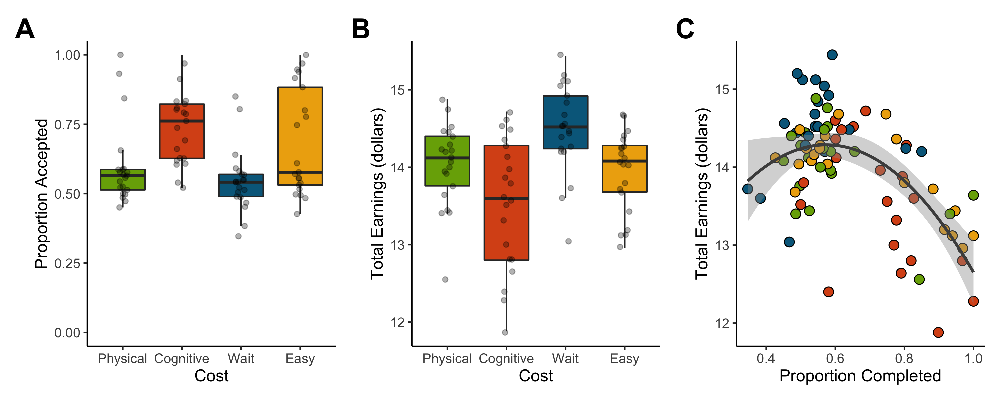
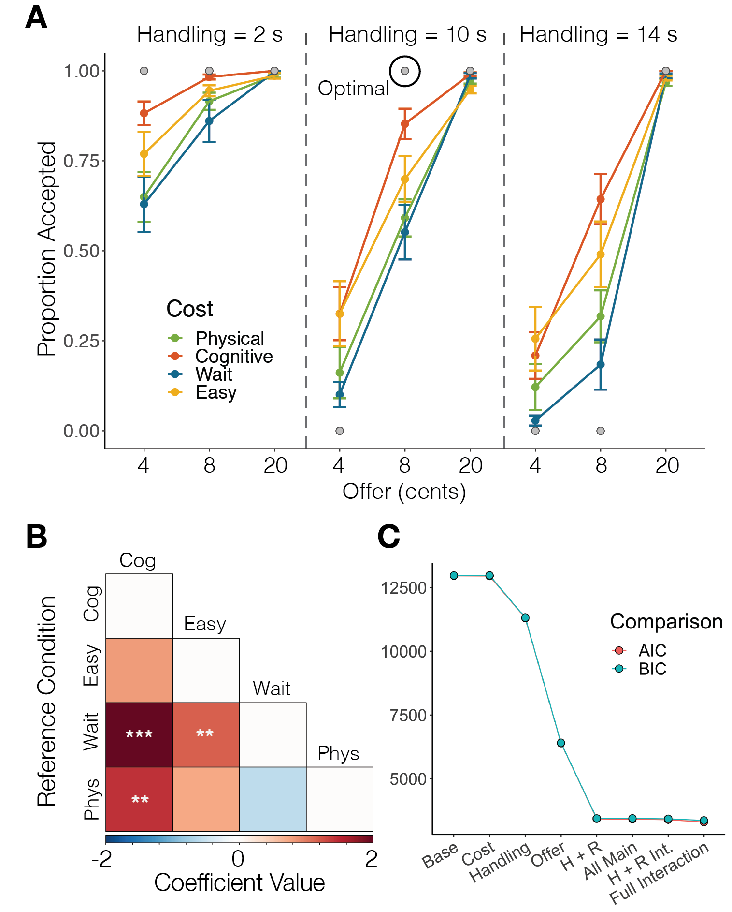
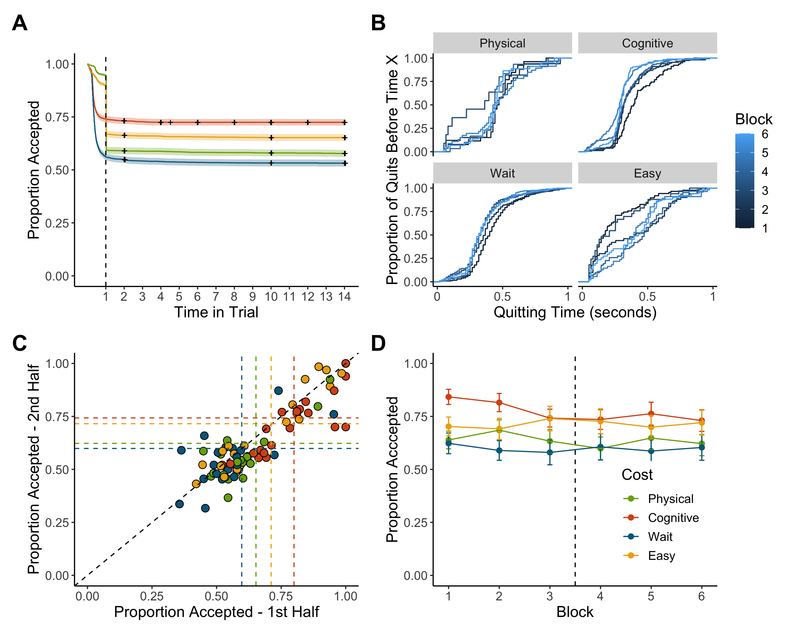
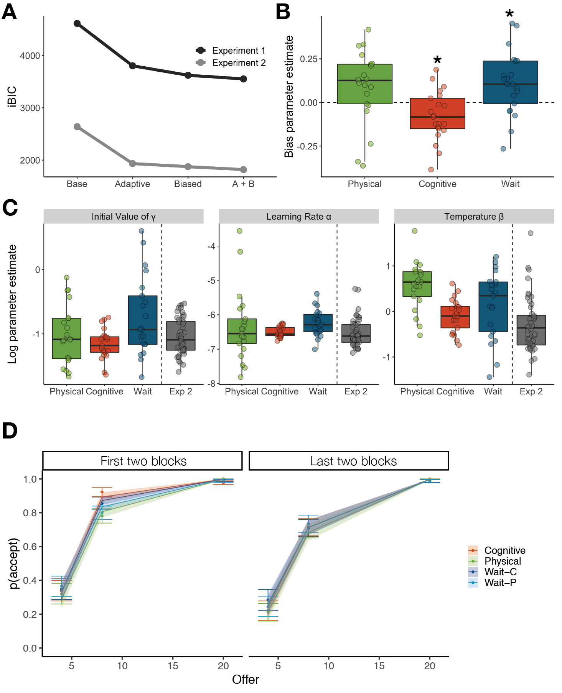

<!-- NOTES: 
- If you're using Rstudio on a mac, you can press 'ctrl + option + o' to compress all chunks and look at the paper + code outline. 
- This script is set so you can run each code snippet independently (after you run the setups and data loading snippets above the institutional affiliations)
- Numbers on each chunk correspond generally to sections in the preregistrations (https://osf.io/2rsgm/registrations)
- Within the Setups chunk, the 'figsEnd' variable dictates whether figs are shown at the end (T) or intermixed in the text (F)
-->


```{r Global options, include = FALSE}
knitr::opts_chunk$set(echo = FALSE, warning = FALSE, fig.pos = 'H')
```

```{r Setups, include = FALSE, warning = FALSE}
## libraries
library(tidyverse)
library(ggfortify)
library(knitr)
library(pander) 
library(nloptr)
library(pwr)
library(lme4)
#library(lmerTest)
library(gridExtra)
library(reshape2)
library(corrplot)
library(survival)
library(patchwork)
library(data.table)
# library(equatiomatic) # with the dev version, you can extract latex equations for the mixed-effects models using e.g. extract_eq(mixLogis_main_btw$Wait)

## figures at the end of the manuscript?
figsEnd <- F


## aesthetic options
lbls <- c("Wait","Cognitive","Physical","Easy") # between subj
colsBtw = c("#78AB05","#D9541A","deepskyblue4", "darkgoldenrod2") # plot colors (wait, effort)
colsWth <- c("#D9541A", "#78AB05", "dodgerblue4", "deepskyblue3")#"grey30", "grey70") # plot colors (wait, effort)
lthick = 2 # line thickness for plots

## functions
# parameter recovery function
testParams <- function(params = list(Gamma = 1), model = expr(params$Gamma * Handling), subjData, handling = c(2, 10, 14), offer = c(4, 8, 20), plot = F) {
  
  # this just computes choices made by a given parameterized model
  # or compares a putative model with participant choices
  #
  # params: a list of parameters that can be called by the model (besides behavioral observations from subjData)
  # model: must use expr() and call for extra parameters from params if needed (see default)
  # subjData: optional data to be compared
  # handling / offer: in case new experimental parameters should be tested (probably won't use)
  # plot: T/F whether to plot the comparison between modeled and actual behavior
  #
  
  # if no subject data was provided, use the default options and only output the recovered data
  if (missing(subjData)) {
    
    # compute
    df <- expand.grid(Handling = handling, Offer = offer) %>% 
      mutate(OC = eval(model),
             Choice = ifelse(Offer > OC, 1, 0))
    
    # plot
    if (plot) {
      
      ggplot(data = df, aes(interaction(Offer, Handling), Choice, color = Gamma)) +
        geom_line(aes(group = interaction(Handling, Gamma)), size = 1) +
        geom_point(size = 3) +
        labs(x = "Offer.Handling", y = "Proportion Accepted") +
        facet_wrap(vars(Gamma), ncol = 2) +
        theme(legend.key = element_blank(),
              panel.grid.major = element_blank(),
              panel.grid.minor = element_blank(),
              panel.background = element_blank(),
              axis.line = element_line(colour = "black"),
              text = element_text(size = 16))
      
    }
    
    # otherwise give a comparison between recovered and observed choice for a subject's data + gamma
  } else {
    
    # compute
    df <- subjData %>% 
      mutate(OC = eval(model),
             Choice = ifelse(Offer > OC, 1, 0))
    
    # plot
    if (plot) {
      
      print(ggplot(data = df) +
        geom_line(aes(interaction(Offer, Handling), propAccept, group = Handling), size = 1, color = "darkgreen") +
        geom_line(aes(interaction(Offer, Handling), Choice, group = Handling), size = 1, color = "blue") +
        geom_point(aes(interaction(Offer, Handling), propAccept), size = 3, color = "darkgreen") +
        geom_point(aes(interaction(Offer, Handling), Choice), size = 3, color = "blue") +
        labs(x = "Offer.Handling", y = "Proportion Accepted") +
        #scale_color_manual()
        theme(legend.key = element_blank(),
              panel.grid.major = element_blank(),
              panel.grid.minor = element_blank(),
              panel.background = element_blank(),
              axis.line = element_line(colour = "black"),
              text = element_text(size = 16)))
    }
    
  }
  
  return(df)
  
}
  
# get the number of continuous quits before current trial
seqQuits <- function(subjData = 1){
  
    # get the lag
    tempSeq <- sequence(rle(subjData)$lengths) # sequence
    tempSeq[subjData==1] <- 0 # not interested in completed runs, just quits
    tempSeq <- c(0,tempSeq) # lag it so it can be used as a t-1 regressor

    # return data so that the length is equivalent
    out <- tempSeq[1:length(subjData)]
    
    return(out)
    
}

# Cohen's D for 2 groups (could just use DesctTools...)
# for a more flexible approach, make the data input to be a list with entries for n groups, 
# then do length(list) for the number of groups. 
cohenD <- function(group1 = 1, group2 = 2){
  
      # means
      mean1 <- mean(group1, na.rm = T)
      mean2 <- mean(group2, na.rm = T)
      
      # variance
      var1 <- var(group1, na.rm = T)
      var2 <- var(group2, na.rm = T)
      
      # equation
      out <- (mean1 - mean2) / sqrt((var1 + var2)/2)
      
      return(out)
  
}

# generic permutation for 2 groups
permute <- function(group1 = 1, group2 = 2, statType = mean, nPerms = 5000, paired = FALSE, simple = FALSE){
  
    # prep data
    summaryPerm <- list()
    lOne <- length(group1)
    lTwo <- length(group2)
    bigSample <- c(group1,group2)  
    
    if (paired == FALSE) {
      
        
        for (i in 1:nPerms){
          
            # relabel samples
            tempBig <- sample(bigSample)
            tempOne <- tempBig[1:lOne]
            tempTwo <- tempBig[(lOne+1):length(bigSample)]
            
            # stats
            tempDiffs <- statType(tempOne,na.rm=T) - statType(tempTwo,na.rm=T)
            summaryPerm$jointDist[i] <- tempDiffs # statType(tempDiffs, na.rm = T) 
          
        }  
        
    } else {
      
        for (i in 1:nPerms){
          
            # shift labels in a pairwise fashion
            tempDiffs <- statType((-1)^rbinom(lOne,1,0.5) * (group1 - group2))
            summaryPerm$jointDist[i] <- tempDiffs
          
        }
      
    }
  
    # get the observed difference
    diffs <- statType(group1,na.rm=T) - statType(group2,na.rm=T)
    observedAbs <- abs(diffs) # maybe leave it as means here
    observed <- diffs
    summaryPerm$Pval <- 2 * (1 - ecdf(summaryPerm$jointDist)(observedAbs))
    if (length(unique(abs(summaryPerm$jointDist))) == 1) {summaryPerm$Pval <- 1} # if the difference is always the same, then p = 1
    summaryPerm$Observed <- observed
    
    # return the results
    if (simple) {
      
      return(summaryPerm$Pval)
      
    } else if (!simple) {
      
      return(summaryPerm)
      
    }
    
}

# Non-parametric Bootstrap for a single group
bootstrap <- function(group = 1, statType = mean, B = 5000){
  
    # prep param
    bootStats <- rep(0,B)
    
    # iterate
    for(b in 1:B){
      
      # Wait group
      x <- sample(group,length(group),replace=T)  
      bootStats[b] <- statType(x,na.rm = T)
      
    }
    
    return(bootStats)
    
}

# basic power calculation for a one way ANOVA
powerCalc <- function(d = 1.2, Za = 1.96, Zb = 0.842){
  
  out <- 2*((Za + Zb)/d)^2 + (0.25*(Za^2))
  
  return(round(out))
  
}

# OC-specific computation of the negative log likelihood for model optimization
negLogLik <- function(params, choice, handling, reward) {
  gamma <- exp(params[2]) * handling
  model <- exp(params[1]) * (reward - gamma)
  p = 1 / (1 + exp(-model))
  p[p == 1] <- 0.999
  p[p == 0] <- 0.001
  tempChoice <- rep(NA, length(choice))
  tempChoice[choice == 1] <- log(p[choice == 1])
  tempChoice[choice == 0] <- log(1 - p[choice == 0]) # log of probability of choice 1 when choice 0 occurred
  negLL <- -sum(tempChoice) 
  return(negLL)
}

# optimize the OC model
optimizeOCModel <- function(Data, Algorithm = "NLOPT_LN_NEWUOA", simplify = F, optfun = negLogLik) {
  
  # Data: The participant's log
  # Algorithm: probably let be
  # optfun: an external function to minimize (in this case OC, separately defined as negloglik)
  
  # Prep data
  handling <- Data$Handling
  reward <- Data$Offer
  choice <- Data$Choice
  
  # Prep list of results to be returned
  out <- list()
  out$percentQuit <- mean(choice == 0) * 100
  out$percentAccept <- mean(choice == 1) * 100 
  miss <- (choice != 1) & (choice != 0)
  out$percentMiss <- mean(miss)  * 100
  choice <- choice[!miss]
  reward <- as.numeric(reward[!miss])
  handling <- as.numeric(handling[!miss])
  
  # Establish lower and upper bounds
  LB <- round(log((min(reward)/max(handling)) * 0.99), digits = 4)
  UB <- round(log((max(reward)/min(handling)) * 1.01), digits = 4) # in reality this should be the second largest, since no one would reject the highest val
  
  # Begin defining parameters
  # If choices are one-sided (i.e. all accepted), assign the upper or lower bound
  if ((sum(choice) == length(choice)) | (sum(choice) == 0)) {
    ifelse(sum(choice) == length(choice), out$Gamma <- exp(LB), out$Gamma <- exp(UB)) 
    out$temperature <- 1 # it was NA, but in theory a temperature of 1 also indicates noiseless estimates, and allows for easier fit computations
    out$LL <- 0
  } else {
    # Create a feasible region (search space)
    params <- as.matrix(expand.grid(temperature = c(-1, 1), gamma = seq(LB, UB, length = 3)))
    # Create a list to check the minimization of the negative log lik.
    info <- list()
    info$negLL <- Inf
    # Define the options to be used during optimization
    # Consider looking into other optimization algorithms and global minima
    opts <- list("algorithm" = Algorithm,
               "xtol_rel" = 1.0e-8)
    # Optimize the sOC over all possible combinations of starting points
    for (i in seq(nrow(params))) {
      tempInfo <- nloptr(x0 = params[i, ], 
                   eval_f = optfun, 
                   lb = c(log(0.001), LB),
                   ub = c(-log(0.001), UB),
                   opts = opts,
                   choice = choice, 
                   handling = handling,
                   reward = reward)
      if (tempInfo$objective < info$negLL) {
        #print("Minimized")
        info$negLL <- tempInfo$objective
        info$params <- tempInfo$solution
      }
    }
    out$Gamma <- exp(info$params[2])
    out$temperature <- exp(info$params[1])
    out$LL <- -info$negLL
  }
  
  # Summarize the outputs
  out$LL0 <- log(0.5) * length(choice)
  out$Rsquared <- 1 - (out$LL/out$LL0) # pseudo r-squred, quantifying the proportion of deviance reduction vs chance
  out$subjOC <- out$Gamma * handling
  out$probAccept <- 1 / (1 + exp(-(out$Scale*(reward - out$subjOC))))
  out$predicted <- reward > out$subjOC
  out$predicted[out$predicted == TRUE] <- 1
  out$percentPredicted <- mean(out$predicted == choice) 
  
  # adjust the probabilities in case of extreme gammas
  if (out$Gamma <= exp(LB)) {
    out$Gamma <- exp(LB) # temporary condition because Nlopt is not respecting the lower bound
    out$probAccept <- rep(1, length(choice))
  } else if (out$Gamma == exp(UB)) {
    out$probAccept <- rep(0, length(choice))
  } 
  
  # if doing this with dplyr::do(), return a simplified data.frame instead with the important parameters
  if (simplify) {
    out <- data.frame(out[c(seq(8), 12)])
  }   
  
  return(out)

}

# simpler form of optimization that allows inputting any model expression into a single function call
optimizeModel <- function(subjData, params, model, simplify = F) {
  # this function finds the combination of parameter values that minimizes the neg log likelihood of a logistic regression
  # used to rely on NLOPTR, but it's too cumbersome for the low-dimensional estimates I'm performing.
  #
  # subjData: a participant's log
  # params: a list of vectors. Each vector is the possible values a given parameter can take. Names in list must match model expression
  # model: using `expr()`, define the model (use <param>[[1]] for free parameters to be estimated. R limitation.). Ex: expr(temp[[1]] * (reward - (gamma[[1]] * handling)))
  
  
  # extract basic choice information
  handling <- subjData$Handling
  reward <- subjData$Offer
  choice <- subjData$Choice
  rt <- subjData$RT
  cost <- subjData$Cost
  trial <- subjData$TrialN
  rawChoice <- subjData$rawChoice
  
  # combine parameters into every possible combination
  params <- expand.grid(params)
  
  # Prep list of results to be returned
  out <- list()
  out$percentQuit <- mean(choice == 0) * 100
  out$percentAccept <- mean(choice == 1) * 100 
  
  LLs <- sapply(seq(nrow(params)), function(i) {
    
    # isolate the parameters for this iteration
    # and then store them as variables
    # FIGURE OUT HOW TO NOT STORE THEM AS DATAFRAMES
    pars <- params[i, ]
    lapply(seq_along(pars), function(variable) {assign(colnames(pars)[variable], pars[variable], envir = .GlobalEnv)})
    
    # estimate the probability of acceptance per the model
    p = 1 / (1 + exp(-eval(model)))
    p[p == 1] <- 0.999
    p[p == 0] <- 0.001
    
    # get the likelihood of the observations based on the model
    tempChoice <- rep(NA, length(choice))
    tempChoice[choice == 1] <- log(p[choice == 1])
    tempChoice[choice == 0] <- log(1 - p[choice == 0]) # log of probability of choice 1 when choice 0 occurred
    negLL <- -sum(tempChoice)
  })
  
  # chosen parameters  
  out$LL <- min(LLs)
  chosen_params <- params[which(LLs == out$LL), ]
  lapply(seq_along(chosen_params), function(variable) {assign(colnames(chosen_params)[variable], chosen_params[variable], envir = .GlobalEnv)})
  
  # Summarize the outputs
  out$LL0 <- -(log(0.5) * length(choice))
  out$Rsquared <- 1 - (out$LL / out$LL0) # pseudo r-squred, quantifying the proportion of deviance reduction vs chance
  out$probAccept <- 1 / (1 + exp(-eval(model)))
  out$Params <- chosen_params
  #out$predicted <- reward > out$subjOC
  #out$predicted[out$predicted == TRUE] <- 1
  #out$percentPredicted <- mean(out$predicted == choice) 
  
  # if doing this with dplyr::do(), return a simplified data.frame instead with the important parameters
  if (simplify) {
    out <- round(data.frame(out[-6]), digits = 2)
    colnames(out) <- c("percentQuit",
                       "percentAccept",
                       "LL",
                       "LL0",
                       "Rsq",
                       colnames(chosen_params))
  }
  
  return(out)
}

# summary matrices for refrence-changing models
betaMatrix <- function(model, rearrange = NA) {
# get a similarity matrix of the resulting coefficient pairings for the cost conditions
# first, do a full_join based on column names on the list of coefficient vectors from each dummy code relevel
# then match the names of columns and rows so NAs are in the diagonal
  
  # get the names of the reference group per model iteration
  refnames <- names(model)
  
  # coefficient matrix
  temp <- lapply(model, function(data) {coefficients(data)$SubjID[1, 2:4]})
  mixCoeffs <- bind_rows(temp) 
  preln <- ifelse("Cost" %in% substr(names(mixCoeffs), 1, 4), 4, 5) # count how many characters precede the name of each cost (diff across studies)
  dimnames(mixCoeffs) <- list(refnames, substr(names(mixCoeffs), preln + 1, 20))
  mixCoeffs <- as.matrix(mixCoeffs[, match(rownames(mixCoeffs), colnames(mixCoeffs))])
  mixCoeffs[is.na(mixCoeffs)] <- 0
  
  # now the pvals
  temp <- lapply(model, function(data) {as.list(summary(data)$coefficients[2:4, 4])})
  mixPvals <- as.matrix(bind_rows(temp)) 
  dimnames(mixPvals) <- list(refnames, substr(colnames(mixPvals), preln + 1, 20))
  mixPvals <- as.matrix(mixPvals[, match(rownames(mixPvals), colnames(mixPvals))])
  mixPvals[is.na(mixPvals)] <- 1

  # if you would like to re-arrange the coefficient order, supply a vector with the desired sequence
  if (length(rearrange) > 1) {
    mixCoeffs <- mixCoeffs[rearrange, rearrange]
    dimnames(mixCoeffs) <- list(rearrange, rearrange)
    mixPvals <- mixPvals[rearrange, rearrange]
    dimnames(mixPvals) <- list(rearrange, rearrange)
  }
  
  # combine matrices into list to return
  out <- list(Betas = round(mixCoeffs, digits = 2),
              Pvals = round(mixPvals, digits = 5))
  
  return(out)
  
}

# gather basic data (this is better as a function, then rbind)
summarizeData <- function(Data = waitData, nSubs = nSubsW, type = "Wait"){
  
  tempSummary <- data.frame(group = rep(type, nSubs))
  
  if (type == "Cognitive") {
    
    for (subj in seq(nSubs)){
      
        # Choice index
        tempChoice <- Data[[subj]]$Choice
        
        # Proportion complete
        tempSummary[subj,2] <- mean(tempChoice)
      
        # earnings
        tempSummary[subj,3] <- sum(Data[[subj]]$Offer[tempChoice==1])
        
        # RTs
        tempSummary[subj,4] <- median(Data[[subj]]$`Choice RT`[tempChoice==0])
    
        # Mistakes (only for Cognitive group)
        tempMistakes <- sum(cogDataLong[[subj]]$`Trial Outcome`=="Forced travel") # how many forced travel trials
        tempTrialnum <- length(Data[[subj]]$Choice) # how many decision trials
        tempSummary[subj,5] <- tempMistakes / (tempMistakes + tempTrialnum) # proportion of forced travels throughout the exp        
    
    }    
    
  } else {
    
    for (subj in seq(nSubs)){
        
        # choice index
        tempChoice <- Data[[subj]]$Choice
      
        # propotion complete
        tempSummary[subj,2] <- mean(tempChoice)
        
        # earnings
        tempSummary[subj,3] <- sum(Data[[subj]]$Offer[tempChoice==1])
        
        # RTs
        tempSummary[subj,4] <- median(Data[[subj]]$RT[tempChoice==0])
        
        # Mistakes (to allow for mistakes on the Cognitive group)
        tempSummary[subj,5] <- NA
        
    }
  
  }
  
  return(tempSummary)
  
}

# this helps clean p-values for inclusion in text
# it takes the value, and reports < 0.001 if needed, or rounds to the second digit otherwise
report_p <- function(pval) {
  # make sure the p-values entered are numeric (sometimes they can be characters..thanks R)
  pval <- as.numeric(pval)
  
  # do p < 0.001 or round depending on the value
  # maybe adapt with case_when(), so there are three levels: observed, < 0.01, and < 0.001
  adapted_p <- ifelse(pval < 0.001, "< 0.001", paste("=", round(pval, digits = 3)))
  
  return(adapted_p)
}

# remove break time and start counting from 0
standardize_time <- function(subjData) {
  # remove the break time (variable across subjects) and start counting time from 0 (otherwise it can add physical effort calibration)
  breakTime <- min(subjData$ExpTime[subjData$Block == 4]) - max(subjData$ExpTime[subjData$Block == 3])
  subjData$ExpTime[which(subjData$Block > 3)] <- subjData$ExpTime[which(subjData$Block > 3)] - breakTime + 16
  subjData$ExpTime <- subjData$ExpTime - min(subjData$ExpTime)
  
  return(subjData)
}
```

```{r Load data for between-subject experiment, echo = FALSE, warning = F}
### data loading and cleaning up
# forced travels are switched to acceptances, as they reflect a preference for that trial
# rawChoice will be used to compute the # of mistakes
# The RT is upper-bounded because a glitch in the code made two 14s trials last longer (among all p's) 
setwd("./Exp1/data")
files <- dir(pattern = '_log.csv')

# load data
dataBtw <- tibble(SubjID = files) %>%
  mutate(contents = map(SubjID, ~ suppressWarnings(read_csv(., col_types = cols()))))  %>%
  mutate(Cost = substring(SubjID, 5, 8),
         Cost = case_when(Cost == "wait" ~ "Wait",
                          Cost == "cogT" ~ "Cognitive",
                          Cost == "phys" ~ "Physical",
                          Cost == "phea" ~ "Easy"),
         SubjID = as.integer(substring(SubjID, 0, 3))) %>%
  unnest() %>%
  rename(TrialN = X1,
         ExpTime = Experiment.Time) %>%
  mutate(rawChoice = Choice, 
         RT = ifelse(RT > 14.1, 14, RT),
         Choice = ifelse(Choice == 2, 1, Choice), # forced travels (2) become acceptances (1)
         Completed = ifelse(rawChoice == 2, 0, rawChoice),
         Half = ifelse(Block < 4, "Half_1", "Half_2"),
         Cost = factor(Cost, levels = c("Physical", "Cognitive", "Wait", "Easy")),
         optimal = case_when(
          (Handling == 10 & Offer < 8) ~ 0,
          (Handling == 14 & Offer < 20) ~ 0,
          TRUE ~ 1
          )
         ) %>%
  group_by(SubjID) %>% 
  do(standardize_time(.)) %>% 
  group_by(SubjID, Block) %>%
  mutate(blockTime = ExpTime - min(ExpTime),
         blockElapsed = blockTime - dplyr::lag(blockTime, default = 0)) %>% # how much time elapsed between trials, counting per block
  ungroup()

# load the cognitive task performance logs
setwd("./extras")
files <- dir(pattern = '_log.csv')

dataBtw_coglogs <- tibble(SubjID = files) %>%
  mutate(contents = map(SubjID, ~ suppressWarnings(read_csv(., col_types = cols()))))  %>%
  unnest() %>%
  rename(Offer = Reward) %>%
  mutate(SubjID = substring(SubjID, 8, 10),
         Trial_Time = round(Choice.RT),
         Choice = ifelse(Choice == 2, 1, Choice), # forced travels (2) become acceptances (1)
         Half = ifelse(Block < 4, "Half_1", "Half_2"),
         optimal = case_when(
          (Handling == 10 & Offer < 8) ~ 0,
          (Handling == 14 & Offer < 20) ~ 0,
          TRUE ~ 1
          )
         ) 

# get a simple subject list and the number of subjects
subjList_btw <- unique(dataBtw$SubjID)
nSubjs_btw <- length(subjList_btw)

```

```{r Load data for within-subject experiment, echo = FALSE, warning = F}
# First looks at the new data
# The RT is upper-bounded because a glitch in the code made one 10s last 14s
setwd('./Exp2/data/')
files <- dir(pattern = 'main_log.csv')

# load the data and remove extreme subjects
dataWth <- data_frame(SubjID = files) %>% 
  mutate(contents = map(SubjID, ~ suppressWarnings(read_csv(., col_types = cols()))))  %>%
  mutate(SubjID = substring(SubjID, 0, 3)) %>%
  unnest() %>%
  mutate(RT = ifelse(RT > 10.1, 10, RT),
         Half = ifelse(Block < 4, "Half_1", "Half_2"),
         Btype = BlockType) %>%
  unite(Cost, Cost, BlockType) %>%
  rename(TrialN = X1) %>%
  mutate(rawChoice = Choice,
         Choice = ifelse(Choice == 2, 1, Choice),
         Completed = ifelse(rawChoice == 2, 0, rawChoice),
         Cost = case_when(Cost == "WAIT_0" ~ "Wait-C",
                           Cost == "COGNITIVE_0" ~ "Cognitive",
                           Cost == "GRIP_1" ~ "Physical",
                           Cost == "WAIT_1" ~ "Wait-P"),
         Cost = as.factor(Cost)) %>%
  group_by(SubjID) %>%
  mutate(BlockOrder = ifelse(Btype[1] == 0, "Cognitive1st", "Physical1st")) %>%
  group_by(SubjID) %>% 
  do(standardize_time(.)) %>% 
  group_by(SubjID, Block) %>%
  mutate(blockTime = ExpTime - min(ExpTime)) %>%
  ungroup()

# load the cognitive task performance logs
files <- dir(pattern = 'coglog')
colname <- c("Handling", "Offer", "Outcome", "RT", "Trial_Time", "ExpTime", "Trial_outcome","Type", "Setup")

dataWth_coglogs <- data_frame(SubjID = files) %>% 
  mutate(contents = map(SubjID, ~ suppressWarnings(read_csv(., col_names = colname, col_types = cols()))),
         SubjID = substring(SubjID, 8, 10)) %>%
  unnest() %>%
  mutate(Trial_time = ifelse(RT > 10.1, 10, RT),
         Trial_Time = round(Trial_Time)) %>%
  group_by(SubjID) %>%
  mutate(Half = ifelse(ExpTime < (max(ExpTime) / 2), "Half_1", "Half_2")) %>%
  ungroup()


# Get just the subject list and number of subjects
subjList_wth <- unique(dataWth$SubjID)
nSubjs_wth <- length(subjList_wth)
```

1.  Department of Psychological and Brain Sciences, Boston University, Boston, USA

2.  Center for Systems Neuroscience, Boston University, Boston, USA

\bigskip

Corresponding authors: Claudio Toro-Serey (ctoroserey@mclean.harvard.edu) & Joseph T. McGuire (jtmcg@bu.edu)


\newpage

## Abstract

Cognitive and physical effort are typically regarded as costly, but demands for effort also seemingly boost the value of prospects under certain conditions. One contextual factor that might influence the perceived value of effort is the mix of different demand types a decision maker encounters in a given environment. Here, we embedded both cognitive and physical effort in a "prey selection" foraging task, which required decision makers not only to evaluate the magnitude and delay of a focal prospective reward but also to estimate the general opportunity cost of time. In two experiments, participants encountered prospective rewards that required equivalent intervals of cognitive effort, physical effort, or unfilled delay. Monetary offers varied per trial, and the two experiments differed in whether the type of effort or delay cost was the same on every trial (between-participant manipulation, n=21 per condition), or varied across trials (within-participant manipulation, n=48). When each participant faced only one type of cost, cognitive effort persistently produced the highest acceptance rate compared to trials with an equivalent period of either physical effort or unfilled delay. We theorized that if cognitive effort were intrinsically rewarding, we would observe the same pattern of preferences when participants foraged for varying cost types in addition to rewards. Contrary to this prediction, in the within-participant experiment, an initially higher acceptance rate for cognitive effort trials disappeared over time amid an overall decline in acceptance rates as participants gained experience with all three conditions. Our results indicate that cognitive demands may reduce the discounting effect of delays, but not because decision makers assign intrinsic value to cognitive effort. Rather, the results suggest that a cognitive effort requirement might influence contextual factors such as subjective delay duration estimates, which can be recalibrated if multiple forms of demand are interleaved

\newpage

## Introduction

  Evaluating whether to pursue a desirable outcome often entails assessing the time and effort it will require. In psychology and economics, demands for both time and effort have traditionally been identified as costs that detract from the net subjective value of rewards. Decision makers tend to prefer low-effort and immediate rewards over larger rewards that demand longer delays and higher effort [@Ainslie1975; @Hull1943; @Kool2010; @Kool2018; @Treadway2009; @Westbrook2013; @Shenhav2017; @Westbrook2015; @Frederick2002; @Walton2006]. However, people also sometimes appear to favor effortful courses of action in everyday decisions. Experimental and theoretical work has chiefly explained this phenomenon by suggesting a reciprocal relationship between effort and outcomes, whereby exerting effort boosts the perceived value of ensuing outcomes [@HernandezLallement2014; @Kacelnik2002; @Mochon2012], and positive outcomes imbue value into the preceding effortful behavior [i.e. learned industriousness, @Eisenberger1992]. These proposals raise questions about what features can make an effortful task attractive in its own right, and how contextual factors can alter its perceived costs [@Inzlicht2018]. Understanding what governs the intrinsic costs and rewards of effort could improve our ability to motivate completion of effortful daily activities such as schoolwork or physical exercise.
  
  Recent work has proposed that the subjective costs of delay and cognitive effort are modulated by the value of the alternative ways one's time and cognitive resources could otherwise be used, implying that decision makers track *opportunity costs* [@Fawcett2012; @Kurzban2013; @Otto2019]. Preferences for or against effortful courses of action could therefore depend on the presence of other types of demands and opportunities in the same choice environment [@Kool2018]. For example, exerting high effort for a reward might be aversive, but the same level of work might become appealing if the only alternative is the boredom of an equivalent period of passive waiting (for instance, a person might choose to take a cumbersome way home rather than wait for a delayed train, even if the resulting time of arrival is the same). Effects of context on effort preferences have been illustrated by experiments on charitable giving, in a which high-effort donation method (such as a run) attracted larger donations than a low-effort method (such as a picnic) when either was available alone (the “martyrdom effect”), but the high-effort event was disfavored when both options were offered as alternatives [@Olivola2013].
  
  Standard models in neuroeconomics and behavioral economics formalize the effects of effort or delay on valuation in terms of discounting functions [@Ainslie1975; @Frederick2002; @Green1994; @Kable2007; @kleinflugge2015; @Kool2010; @Westbrook2013]. Discounting functions appear to have a similar form for delay and effort [@Massar2015; @Prevost2010; @Seaman2018], although there is ongoing debate about how the shape of the discounting function might vary across types of demands [@Arulpragasam2018; @Biaaszek2017; @Chong2017; @Hartmann2013; @Klein-Flugge2016; @Kool2018; @Prevost2010] and the degree to which discount rates correlate across cost domains [@Seaman2018; @Westbrook2013]. A limitation of the discounting approach is that it does not directly probe how aspects of the decision context, such as opportunity costs, might influence cost evaluation, and constrains the understanding of behavioral demands to one in which such demands necessarily reduce the value of prospects.
  
  Single choice foraging paradigms, in which decision makers choose to accept or reject individually presented prospects, provide a natural way to investigate contextual influences on cost evaluation [@Constantino2015; @Garrett2020; @Krebs1977; @Mobbs2018; @Stephens1986]. Such paradigms require weighing a prospective reward against the perceived opportunity cost of time. Specifically, foragers must decide whether to spend their limited time by harvesting a currently available resource or by seeking out more profitable (or less costly) alternatives instead. This could involve, for example, deciding when to leave a patch of depleting richness (e.g. when to quit a job that provides diminishing opportunities for growth), or choosing whether to pursue or forgo offers presented serially (e.g. whether to accept your first job offer or wait for new potential ones). Here we focus on this latter type of foraging, traditionally called *prey selection* [@Krebs1977], as it provides a means to examine how choices to accept or reject individual prospects are influenced by contextual knowledge about other potentially obtainable alternatives in the same environment.
  
  Foraging has recently attracted high scientific interest due to its ecological validity, which is rooted in evolutionarily conserved choice behaviors [@Hayden2018; @Mobbs2018]. The prey selection foraging paradigm allows for the estimation of optimal, reward maximizing choice patterns on the basis of the opportunity cost of time [@Charnov1976; @Krebs1977]. The opportunity cost depends on the richness of the environment, which can be experimentally manipulated by balancing the amount of time it takes to harvest an offer (*handling time*) and to search for a new one (*travel time*). We can then interpret observed deviations from such optimal behavior, and examine how foraging behavior changes when the handling time is filled with cognitive or physical effort in comparison with an unfilled delay (thus disentangling effort from delay duration). In contrast to multi-alternative economic choice paradigms, which often treat choices as independent events, the sequential nature of foraging encourages individuals to consider both focal and global elements of the decision context. Extensive previous work on modeling foraging decisions provides computational tools to formalize relevant decision variables [@Stephens1986].
  
  Across two behavioral experiments, we tested the overarching hypothesis that preferences would vary depending on whether individuals faced a single type or multiple types of behavioral demands (i.e. cognitive effort, physical effort, and delay). Experiment 1 used a between-subject design in which each participant foraged for rewards of varying magnitudes that imposed varying durations of a single form of demand. Experiment 2 used a within-subject design in which individuals foraged for varying forms of demand in addition to varying reward magnitudes. First, we examined whether the discounting effects consistently observed in multi-alternative economic choice paradigms persisted when these options were presented serially, and whether the resulting foraging patterns depended on the demands imposed to obtain rewards. The existence of a well-defined optimal, reward-maximizing choice strategy helped us identify when demands boosted or detracted from the value of rewards (signified by tendencies to overharvest poor offers or underharvest advantageous offers, respectively). Second, we probed whether the perceived cost (or value) of demands was intrinsic or context-dependent. Varying the level of exposure to multiple types of demands across experiments allowed us to assess whether cost evaluation was dependent on the availability of alternative avenues of action. Further, including cognitive demands and physical demands let us examine whether such effects might apply differently to distinct types of effort.
  
  Our results provided mixed support for our pre-registered hypotheses, which are detailed in https://osf.io/2rsgm/registrations. For Experiment 1, we hypothesized that 1) decision makers would integrate reward and timing information in order to approximate optimal foraging strategies, as reflected by acceptance rates; 2) acceptance rates would be higher for trials that demanded physical effort and cognitive effort than for unfilled delay or effortless engagement (based on results from pilot data and previous findings from single-alternative choice paradigms; e.g., Olivola & Shafir, 2013. See also Eisenberger, 1992; Inzlicht et al., 2018); and 3) acceptance rates for each type of demand would remain stable over time, and participants would rarely exhibit within-trial reversals (accepting a trial but then quitting without receiving the reward). Consistent with our predictions, we found that individuals could approximate optimality by favoring higher rewards and shorter delays. We also found that people in the Cognitive group accepted more trials than optimal, whereas Physical and Wait groups under-accepted, partially matching our predictions but raising the possibility that cognitive effort might add value to outcomes (or attenuate subjective temporal costs). Finally, acceptance rates (and differences in acceptance rates across demands) were stable within each cost condition, in line with expectations. These findings motivated the design of Experiment 2, in which effort and delay trials were intermixed so that rejecting a trial of one type could potentially lead to a trial of the other type. For Experiment 2, we hypothesized that 1) acceptance rates would once again approximate optimality, and would show effects of reward magnitude similar to those seen in Experiment 1; 2) in contrast to Experiment 1, participants would accept unfilled-delay trials at a higher rate than trials with either form of effort; and 3) that choices would be consistent and stable over time. As before, decision makers approached the optimal strategy for the foraging environment, resembling the pattern observed in Experiment 1. Contrary to our second and third hypotheses, we found that acceptance rates were initially higher for cognitive effort than for delay, but this apparent preference disappeared over time as decision makers foraged for types of demands in addition to rewards.
  
  Computational modeling results suggested that the normative predictions of traditional foraging models were insufficient to explain our data. Instead, the data supported a model in which demands imposed a bias on the estimated opportunity cost of time, which converged as individuals gained experience with interleaved types of demands. We hypothesize that this bias arises from modulations of subjective time. For instance, cognitive effort could have become appealing by virtue of compressing the perceived trial time, a perception that could be recalibrated with exposure to alternative demands. A subjective shortening of experienced durations during cognitive effort could be due to the ongoing recruitment of working memory (e.g. preventing individuals from estimating the elapsed time), or because the discrete events within the cognitive task subdivided the time interval. These results expand our understanding of the attractiveness of effort, suggesting potential reward-independent factors that could be leveraged to motivate effort engagement in diverse, everyday scenarios.
  
  
## Experiment 1: Between-subject Manipulation of Subjective Costs During Foraging

### **Methods**
#### *Participants*

&nbsp; 

  The study was preregistered with the Open Science Framework (https://osf.io/2rsgm/registrations). The data and code for all analyses can be found in https://github.com/ctoroserey/Cost_studies. All experimental procedures were approved by the Boston University Institutional Review Board, and written consent was acquired for all participants. For Experiment 1, we recruited individuals until the planned number of 84 eligible participants was achieved (58 Female, median age = 21, range = 18 - 31; number excluded before reaching goal = 8). The sample size was determined by means of power analysis (ANOVA), using a significance level of 0.05, power of 0.8, an effect size of f = 0.45 (estimated from a pilot study), and three groups (one for each cost type). The resulting per-group sample was 20, which we increased to 21 in order to match three possible block orders. We added an extra group of 21 participants who experienced a minimally effortful condition in order to determine whether effort or mere task engagement was driving our results.
  
  Participant data sets could be excluded on the basis of any of the following preregistered criteria: 1) Withdrawal: if the participant did not complete the study (1 participant); 2) Inattentiveness: a catch trial was placed at the end of each experimental block, asking participants to press a key within 3 seconds (time requirement based on pilot study response times). A participant who failed two or more of these checks was excluded and replaced (5 participants). 3) Improbable choice behavior: The task was structured so that the largest reward amount should always be accepted. A participant who quit every trial in at least one block was assumed not to have followed or understood task instructions, or to have disengaged from the task altogether (0 participants). 4) Performance: Participants were forced to travel if they made 2 mistakes in a cognitive effort trial (see task procedures below), or if they gripped below threshold during physical trials. Any participant with more than 30% forced travels was excluded (1 participant).


#### *Foraging Task* 

&nbsp; 

  The experimental task was run using PsychoPy 2 [v1.85.1, @Peirce2019] on a Macbook Pro laptop. Participants foraged for monetary rewards in an environment in which each trial required physical effort, cognitive effort, or passive waiting for a set period of time (the “handling time”) in order to obtain the reward (Fig. 1A). Their goal was to maximize their gains within a fixed total amount of playing time (six 7-minute blocks). On each trial, a monetary offer was displayed for 2 s, and participants had the opportunity to expend time and/or effort during the handling time in order to earn it. Upon completion of a trial, participants saw a 2 s feedback message displaying the reward obtained, which was followed by a travel time to the next offer. Alternatively, the participant could quit at any point during the handling time by pressing the spacebar, and immediately start traveling. Participants received their earnings in the form of a real monetary bonus that was added to a fixed \$12 participation amount (possible range of task-based earnings = \$0 - \$15.50, rounded up to the nearest quarter).
  
  Participants were divided into four groups. Each participant in the first three groups was assigned to one of three types of costs (cognitive effort, physical grip-force effort, or delay), and a fourth group experienced a low-effort physical task that required gripping above a negligible force level. This last condition was added to test the possibility that any differences in acceptances between effort and delay were driven by task engagement alone. Each group was unaware that other cost conditions existed. Participants exerted physical effort by gripping a handheld dynamometer (Biopac Systems, United States) using their dominant hand. Gripping requirements in the physical effort condition were calibrated at 20% of maximum voluntary contraction (acquired at the beginning of the session). The low-effort condition was equivalent except that the grip-force threshold was set to 5%. Cognitive effort entailed switching among Stroop, dot motion judgment, and flanker tasks. Task switching has previously been shown to impose subjective costs (Kool et al., 2010). In the Stroop task, one of three color names was displayed on the screen (red, blue or green), with a font color that was either congruent (e.g. the word red presented in red) or incongruent (e.g. the word red presented in blue). Participants had to select the color of the font (i.e., they had to suppress their tendency to read the word). For the motion judgment task, 100 solid white dots moved on the screen. A fraction of these dots moved coherently to the left or right, while the rest moved in random directions (coherence could be either 30% or 40%, uniformly sampled). Participants had to respond with the direction of the coherent movement. In the flanker task, rows of arrowheads pointed either to the left or the right (maximum of 3 rows, 3 to 13 arrowheads per row). Participants responded with the direction of the center arrowhead, which could point in the same or opposite direction of its neighbors. The tasks were configured so that responses always involved a left or right key press (e.g. for Stroop, two colored circles were presented at each side of the screen). During the handling time, cognitive tasks and their configurations were randomly sampled, and were presented for 1 s followed by a 1 s inter-stimulus interval. Participants were asked to respond within each task’s presentation time (i.e., there was a 1 s response deadline). Before the experiment, participants trained in each cognitive task until they correctly performed six consecutive trials of each type. While in the handling time, if participants failed to maintain an above-threshold grip during the physical effort task (following the 1 s grace period) or made two mistakes during the cognitive task, they were forced to travel and missed the reward.  
  
  There were three block types, in which handling times of 2, 10, or 14 seconds were paired with travel times of 14, 6, and 2 seconds, respectively. All combinations added up to 16 seconds, meaning that accepted trials took the same amount of time in all conditions, but rejected trials were shorter in environments with shorter travel times. Timing parameters were held constant within each 7-min block. Each block type was presented twice in pseudorandom order (total session length = 42 minutes). Reward amounts varied per trial (4, 8, or 20 cents with equal probability), with the constraint that every reward was presented twice every six trials. This prevented sequences from being dominated by a single amount during any window of time. Timing information was disclosed at the beginning of each block, and each trial's reward amount was displayed during a 2 s offer window before the trial began. Participants received training prior to the experimental session and were told about all possible timing conditions and reward amounts in order to avoid any biases that could arise through experience-dependent learning [@Dundon2020; @Garrett2020]. Finally, we encouraged participants to carefully evaluate their options by informing them that accepting all offers would not maximize their rewards.
  

```{r Task Plot (Fig. 1), eval = !figsEnd, out.width = "80%", fig.align = "center", fig.cap= "Task design and optimal behavior. A: General foraging trial structure. On each trial, participants were offered an opportunity to earn money by sustaining effort or waiting during the handling time (2, 10, or 14 s). The end of a trial was followed by a travel time (handling and travel times always added up to 16 s). Participants could skip unfavorable trials and immediately start traveling to a potentially better offer. In Experiment 1, the type of demand was fixed per participant and handling time varied per block. In Experiment 2, handling time was fixed at 10 s, but a combination of effort and delay trials changed per block. B: Possible earnings per second for each acceptance threshold (i.e. the smallest amount accepted) for each handling time in Experiment 1. Circles denote the reward-maximizing threshold for each block, which is described in the table. Experiment 2 presented only the 10 s handling time, for which it was optimal to skip all 4-cent offers."}

include_graphics("./Images/FIG1_task.png")
```


#### *Reward-maximizing Strategy*

&nbsp; 

  Foraging theory posits that the decision to accept a delayed reward should depend on the opportunity cost of time to be incurred in obtaining it, which in turn depends on the richness of the environment [@Charnov1976; @Stephens1986]. In this study, the richness of the environment was manipulated by the length of the handling and travel times. Shorter travel times produced richer environments by making it possible to save more time by skipping low-reward trials. Since time combinations were fixed per block, we calculated each block’s optimal accept/reject strategy by computing the expected rate of gain (g(*)) from all decision strategies according to the following equation:
  
$$\begin{aligned} 
g(*) = \dfrac {\sum p_i R_{i}} { 3T_\text{offer} + \sum p_i (T_\text{handling} + T_\text{reward}) + 3 T_\text{travel}},p \in \{0, 1\}
\end{aligned}$$
  
  where *R* and *p* are the reward magnitude and acceptance probability of offer *i*, respectively, $\text{T}_\text{handling}$ is the handling time for the block, $\text{T}_\text{travel}$ is the travel time, $\text{T}_\text{offer}$ is the duration of the offer window (2 s), and $\text{T}_\text{reward}$ is the duration of the window displaying the reward earned (2 s, only presented for completed trials). This gives the average reward per second attainable in each block as a function of the acceptance threshold (i.e. the lowest amount the participant is willing to accept in a given timing environment). Since an ideal forager should always either accept or reject any given category of prey (Krebs et al., 1977), probabilities other than 0 and 1 were not considered. The resulting possible strategies were to accept only 20 cents, accept 8 and 20 cents, or accept everything. Fig. 1B shows possible earnings per second for each choice strategy, as well as the lowest amount participants should accept in order to maximize their rewards (circled dots). For example, a participant in a 10 s handling-time block should accept 8-cent and 20-cent rewards (and reject 4-cent rewards) to maximize their reward rate; a participant in a 14 s handling-time block should accept only 20-cent rewards, and a participant in a 2 s handling-time block should accept everything. Note that accepting every offer was often detrimental to earnings.

#### *Analyses*

&nbsp; 

  All analyses were performed in R 3.5.2 [@RTeam2018]. First we tested whether decision makers integrated delay and reward information. To address the prediction that participants would be more likely to accept higher reward and shorter handling time trials, we fit a mixed-effects logistic regression to predict trial-wise acceptances [using the lme4 package, @Bates2015], giving a random intercept to each subject to account for biases in participant behavior. We included continuous regressors for handling time and reward, as well as two covariates that probed the influence of recent history on choices. The first was a term containing the number of consecutive unobtained offers prior to a given trial (unobtained offers could be due to quits or forced travels). The second regressor tracked the sum of the reward amounts on the previous *n* offers. We identified the *n* that minimized Akaike's Information Criterion (AIC) among 6 versions of the model (ranging from 2 previous trials up to 7, beyond which the model failed to converge), and report all coefficients from the winning model, which used the sum of the previous 6 offers.
  
  Our foraging task was configured such that over- and under-accepting were detrimental to total earnings. To confirm this, we fit a general linear model with constant, linear, and quadratic terms to estimate the correspondence between proportion of trials completed (independent variable) and total earnings (dependent variable). A significant quadratic coefficient thus would signal that the task statistics operated generally as expected. Next, to determine the optimality of the group’s decisions, we examined whether each cost type produced a bias to over or under-accept offers of 4 and 8 cents (assuming that 20cent-offers would always be accepted, given our design). The reward-maximizing strategy was to always reject these offers for handling times of 14 s, reject 4 cents and accept 8 cents for 10 s, and accept both for 2 s, yielding a combined optimal overall acceptance rate of 50%. We performed a two-sided one-sample chi-squared test of proportions against the null probability of 0.5 for each type of cost (with trials pooled across participants in each group). Therefore, a significant difference indicated that participants either over- or under-accepted rewards. 
  
  The analyses above differed slightly from the pre-registeered plan. Rather than pooling coefficients from individual logistic regressions, we favored obtaining a single coefficient from a mixed model that accounted for participant-level random effects. The chi-squared test was adopted from the Experiment 2 preregistration, as we found it better suited to the question than the original formulation (i.e. individual tests for each combination of experimental parameters).
  
  Next, we compared acceptance rates across cost conditions. We first performed a one-way ANOVA on the proportion of trials accepted using group as a factor. We then compared the proportion completed across all 4 groups using non-parametric permutation contrasts (6 tests). For each test, on each of 5000 permutation iterations, participants' group labels were randomly shuffled without replacement, and the difference in mean acceptance rates across iterations created an empirical null distribution. The unpermuted group mean difference was then evaluated against this permuted distribution. The same approach was used to test differences in total earnings.
  
  In order to further look at the effect of handling time, offer amount, and cost condition, we computed the probability of accepting a trial with a mixed-effects logistic regression. Our a priori model of interest included all three variables as fixed main effects, and a random intercept per subject. Cost condition was modeled with three categorical terms, with the fourth condition as the reference condition. We ran three versions of the model with different reference conditions, in order to test all pairwise differences among the four cost conditions. We then examined whether this a priori model outperformed both simpler and more complex models. We used both AIC and Bayesian Information Criterion (BIC) to determine the model that minimized the negative log-likelihood while penalizing the addition of parameters. The regressors included in the 8 candidate models were: 1) intercept only; 2) cost condition only; 3) handling time only; 4) offer amount only; 5) handling time and offer amount; 6) cost condition, handling time, and offer amount main effects (a priori model from above); 7) adding a handling-time-by-offer-amount interaction; and 8) all possible two-way interactions. We predicted that model 6 would have the lowest AIC and BIC. Nested models with similar AIC were statistically compared using an analysis-of-deviance. The significance test was computed as the probability of the reduction in deviance, based on a chi-square distribution with degrees of freedom equal to the difference in the number of parameters between models.
  
  Reward-maximizing prey foragers should either accept or reject offers based on their profitability relative to the available alternatives [@Krebs1977; @Stephens1986]. However, decision makers often curtail persistence before reaching a delayed prospect based on a continuous reevaluation of the prospect's value or a lapse in self control [@Ainslie1975; @McGuire2012; @McGuire2015; @Mischel1970]. Therefore, we examined whether participants were consistent (not quitting trials that were originally accepted) and stable (maintaining similar acceptance rates over time) in their choices. To evaluate consistency, we visually examined survival curves indicating at what point during the handling time participants quit a trial; large numbers of late quit times would indicate a lack of consistency. We interrogated stability by computing each participant’s total proportion of acceptances in the first and second half of the experiment for every block type, comparing the mean proportion of acceptances using paired permutations (5000 iterations). We then tested whether the observed differences in costs were still present in each half of the experiment by applying the winning model from the mixed-effects logistic regression analysis to each half separately.

### **Results**
#### *Decision Makers Integrate Delay and Reward Information*

``` {r BTW: 16.1.1. Individual logistic, fig.align="center", fig.width = 4, fig.height = 4, echo = FALSE}
# filter out errors and compute R + H logistic per subject, then get coefficients
logisRH <- dataBtw %>%
  filter(Choice < 2) %>%
  plyr::dlply("SubjID", identity) %>%
  lapply(function(data) {glm(Choice ~ Handling + Offer, data = data, family = "binomial")}) %>%
  sapply(coefficients)

# coefficient summaries
coeffRH_mean <- apply(logisRH, 1, mean)
coeffRH_se <- apply(logisRH, 1, sd) / sqrt(nSubjs_btw)

# Rank sum tests
rankHand <- wilcox.test(logisRH["Handling", ])
rankOffer <- wilcox.test(logisRH["Offer", ])

# Plot coeffs
temp <- melt(logisRH[c("Handling", "Offer"), ])
plot_handoffer <- qplot(data = temp, x = Var1, y = value, geom = "boxplot") + 
                    labs(x = "", y = "Coefficients") +
                    geom_hline(yintercept = 0, linetype = "dashed") +
                    theme(legend.position = c(0.9, 0.7),
                         panel.grid.major = element_blank(), 
                         panel.grid.minor = element_blank(), 
                         panel.background = element_blank(), 
                         axis.line = element_line(colour = "black"),
                         text = element_text(size = 22))


# Proportion of performance-based forced travels per subject and cost type
# move to 16.2.1.
propFails <- dataBtw %>% 
  filter(Cost != "Wait") %>% 
  group_by(SubjID, Cost) %>% 
  summarise(propFails = mean(rawChoice == 2), .groups = 'drop') %>%
  group_by(Cost) %>% 
  summarise(meanFT = mean(propFails),
            sdFT = sd(propFails), .groups = 'drop')

# overall acceptances across all conditions
allp <- dataBtw %>%
  group_by(SubjID) %>%
  summarise(p = mean(Choice)) %>%
  ungroup()
```

``` {r BTW: 16.1.2. AR sequential effects, echo = FALSE, include = FALSE}

# history
# Instead of quits, I'm now doing completions. This is because one would expect forced travels to also affect choice.
# First, iterate over the recent history to identify which sum length reduces the AIC the most
# tracing the history beyond 7 trials produces non-convergence
historySize_btw <- lapply(seq(2, 7), function(tail) {
  dat <- dataBtw %>%
    #filter(Cost != "Wait") %>%
    group_by(SubjID) %>%
    mutate(recentTravels = seqQuits(Completed),
           recentOffers = ifelse(TrialN < (tail + 1), Offer, Reduce(`+`, shift(Offer, 1:tail)))) 
  
  glmer(Choice ~ Handling + Offer + recentTravels + recentOffers + (1 | SubjID), data = dat, family = "binomial")
})

# then get the summary of the tail length that reduced the AIC the most
historyIndex_btw <- which(sapply(historySize_btw, function(iter) {AIC(iter)}) == min(sapply(historySize_btw, function(iter) {AIC(iter)})))

historyCoeffs_btw <- round(summary(historySize_btw[[historyIndex_btw]])$coefficients, digits = 2)

```

``` {r BTW: 16.1.3. Earnings, echo = FALSE, fig.align = "center", fig.width = 6, fig.height = 4}
## calculate the proportions and earnings per subject, while keeping group info
temp <- dataBtw %>%
  filter(rawChoice < 2) %>%
  group_by(SubjID, Cost) %>%
  summarise(Earnings = sum(Offer[Choice == 1] / 100),
            pComplete = mean(Choice), .groups = 'drop') %>%
  mutate(pComplete2 = pComplete^2) %>%
  ungroup()


## linear fit of earnings x prop accept
lmEarn <- lm(Earnings ~ pComplete + pComplete2, data = temp)


## plot
earnFitplot_btw <- ggplot(data = temp, aes(pComplete, Earnings)) +
         scale_color_manual(values = colsBtw) +
         geom_point(aes(fill = Cost), pch = 21, color = "black", size = 3, show.legend = F) +
         stat_smooth(aes(y = Earnings), method = "lm", formula = y ~ x + I(x^2), color = "grey30") +
         labs(x = "Proportion Completed", y = "Total Earnings (dollars)") +
         scale_fill_manual(values = colsBtw) +
         theme(panel.grid.major = element_blank(),
           panel.grid.minor = element_blank(),
           panel.background = element_blank(),
           axis.line = element_line(colour = "black"),
           text = element_text(size = 12))


```

&nbsp; 

  Four groups of participants faced with different behavioral demands (physical effort, cognitive effort, low-effort task engagement, or passive delay) chose their preferred strategy to maximize rewards in foraging environments of varying richness. We will refer to the four groups below as Physical, Cognitive, Easy, and Wait. Environmental richness was dictated by the time it took to obtain a reward (the handling time) and the time between trials (the travel time). We hypothesized 1) that participants would approximate reward-maximizing behavior by preferentially accepting higher rewards and shorter delays; 2) that participants confronted with effortful demands would be more likely to accept trials than those faced with passive delay, regardless of handling time and reward amount; and 3) that choices would be stable over time and consistent within trials.
  
  We performed a mixed-effects logistic regression to address the first hypothesis, pooling across the four conditions. Since participants in the effort groups were forced to travel when they failed to perform above threshold (see Methods), we distinguish between acceptances (not explicitly quitting a trial during the handling period) and completions (successfully obtaining a reward). Even so, the proportion of forced travels was low for the Cognitive group (`r round(propFails[2, 2]$meanFT, digits = 2) * 100`% on average across participants) and 0 for the Physical group (i.e. no forced travels in this group). Overall, participants accepted an average of `r round(mean(allp$p), digits = 2) * 100`% of trials (SD = `r round(sd(allp$p), digits = 2) * 100`%, range = `r round(min(allp$p), digits = 2) * 100`% to `r round(max(allp$p), digits = 2) * 100`%). In line with our predictions, larger reward amounts significantly increased acceptance probabilities ($\beta$ = `r historyCoeffs_btw["Offer", "Estimate"]`, SE = `r historyCoeffs_btw["Offer", "Std. Error"]`, *p* `r report_p(historyCoeffs_btw["Offer", "Pr(>|z|)"])`), whereas longer delays decreased them ($\beta$ = `r historyCoeffs_btw["Handling", "Estimate"]`, SE = `r historyCoeffs_btw["Handling", "Std. Error"]`, *p* `r report_p(historyCoeffs_btw["Handling", "Pr(>|z|)"])`). Two additional regressors showed that having missed out on consecutive rewards decreased the probability of acceptance ($\beta$ = `r historyCoeffs_btw["recentTravels", "Estimate"]`, SE = `r historyCoeffs_btw["recentTravels", "Std. Error"]`, *p* `r report_p(historyCoeffs_btw["recentOffers", "Pr(>|z|)"])`), and that participants became more selective when recent offer history was richer ($\beta$ = `r historyCoeffs_btw["recentOffers", "Estimate"]`, SE = `r historyCoeffs_btw["recentOffers", "Std. Error"]`, *p* `r report_p(historyCoeffs_btw["recentOffers", "Pr(>|z|)"])`). The counterintuitive reduction in acceptances following consecutive unobtained rewards was driven by the Wait group (removing this group from the model yielded a *p* > 0.1).

``` {r BTW: 16.1.4. Optimality, echo = FALSE}
# Determine whether groups over or under accepter versus optimal solution (50% for combined 4 and 8 cents)
temp <- dataBtw %>%
  group_by(Cost) %>%
  filter(Offer < 20) %>%
  summarize(propAccept = mean(Choice),
            accept = sum(Choice),
            quit = sum(Choice == 0), .groups = 'drop')

# apply chi-squared test of proportion per group (pooled trials across individuals)
temp2 <- apply(temp, 1, function(row) {prop.test(as.numeric(row[3]), sum(as.numeric(row[3:4])), p = 0.5, conf.level = 0.95)})


# store stats in a dataframe
optimalProp_cost <- data.frame(probability = sapply(temp2, "[[", "estimate"),
                                   chisquared = sapply(temp2, "[[", "statistic"),
                                   confint = t(sapply(temp2, "[[", "conf.int")),
                                   pval = sapply(temp2, "[[", "p.value"))
rownames(optimalProp_cost) <- temp$Cost


```

``` {r BTW: 16.2.1. Overall Proportion/Earnings, fig.align = "center", fig.width = 8, fig.height = 4, echo = FALSE}  
## earnings and proportion accepted per cost type
# note that earnings are based on successful completions, not just acceptances
temp <- dataBtw %>%
        group_by(SubjID, Cost) %>%
        summarise(Earnings = sum(Offer[(Choice == 1) & (rawChoice < 2)] / 100),
                  pAccept = mean(Choice), .groups = 'drop')


## summaries
overallSumms <- temp %>% 
  group_by(Cost) %>% 
  summarise(mProp = mean(pAccept), 
             sdProp = sd(pAccept), 
             mEarn = mean(Earnings), 
             sdEarn = sd(Earnings), .groups = 'drop') %>%
  mutate_if(is.numeric, round, digits = 2)

## formal testing 
# proportion completed
propAov <- summary(aov(pAccept ~ Cost, data = temp))

propTests <- temp %>% 
  plyr::dlply("Cost", identity) %>%
  sapply("[[", "pAccept") %>%
  as.data.frame() %>%
  combn(2, simplify = F) %>%
  sapply(function(x) {
    c(contrast = paste(colnames(x), collapse = ifelse(cohenD(x[, 1], x[, 2]) < 0, " < ", " > ")), 
      permPval = round(permute(x[, 1], x[, 2], simple = T), digits = 3),
      cohenD = abs(round(cohenD(x[, 1], x[, 2]), digits = 2)))
  }) %>% 
  t() %>%
  as_tibble()

# earnings 
earnAov <- summary(aov(Earnings ~ Cost, data = temp))

earnTests <- temp %>% 
  plyr::dlply("Cost", identity) %>%
  sapply("[[", "Earnings") %>%
  as.data.frame() %>%
  combn(2, simplify = F) %>%
  sapply(function(x) {
    c(contrast = paste(colnames(x), collapse = ifelse(cohenD(x[, 1], x[, 2]) < 0, " < ", " > ")), 
      permPval = round(permute(x[, 1], x[, 2], simple = T), digits = 3),
      cohenD = abs(round(cohenD(x[, 1], x[, 2]), digits = 2)))
  }) %>% 
  t() %>%
  as_tibble()

## plots
# pAccepted
prop1 <- ggplot(temp, aes(Cost, pAccept, fill = Cost)) + 
        geom_boxplot(show.legend = F, outlier.shape = NA) +
        geom_jitter(width = 0.1, alpha = 0.3, show.legend = F) +
        scale_fill_manual(values = colsBtw) +
        ylim(c(0, 1)) +
        labs(y = "Proportion Accepted") +
        theme(panel.grid.major = element_blank(), 
            panel.grid.minor = element_blank(), 
            panel.background = element_blank(), 
            axis.line = element_line(colour = "black"),
            text = element_text(size = 12))

# earnings
earnings1 <- ggplot(temp, aes(Cost, Earnings, fill = Cost)) + 
        geom_boxplot(show.legend = F, outlier.shape = NA) +
        geom_jitter(width = 0.1, alpha = 0.3, show.legend = F) +
        scale_fill_manual(values = colsBtw) +
        labs(y = "Total Earnings (dollars)") +
        theme(panel.grid.major = element_blank(), 
            panel.grid.minor = element_blank(), 
            panel.background = element_blank(), 
            axis.line = element_line(colour = "black"),
            text = element_text(size = 12))


```

```{r General prop & earnings plots (Fig. 2), eval = !figsEnd, fig.width = 10, fig.height = 4, fig.align = "center", fig.cap = "Overall choice behavior in Experiment 1. A: Proportion accepted per cost. B: Total number of dollars earned by each group by the end of the experiment (not including the participation reward). C: The relationship between proportion accepted and total earned. Consistent with the foraging design, participants who over and under accepted earned the least. These results suggest that people were willing to pursue cognitively effortful actions at the expense of earnings."}
# plots generated in 16.2.1. and 16.1.3.
# propPlot <- (prop1 | earnings1 | earnFitplot_btw) + 
#     plot_annotation(tag_levels = 'A') &
#     theme(plot.tag = element_text(size = 20, face = "bold"))
# ggsave("./Images/FIG2_props.png", propPlot, device = "png", height = 4, width = 10)



```

  The next set of analyses examined the hypothesis that both Cognitive and Physical groups would uniformly accept more trials than the Wait and Easy groups. Fig. 2A shows that the Cognitive group consistently accepted more offers, which resulted in lower earnings (middle). One-way ANOVAs showed that differences among groups were significant both for overall proportion accepted (F(`r propAov[[1]]$Df[1]`, `r propAov[[1]]$Df[2]`) = `r round(propAov[[1]][1, 4], digits = 2)`, *p* `r report_p(propAov[[1]][1, 5])`), and total earnings (F(`r earnAov[[1]]$Df[1]`, `r earnAov[[1]]$Df[2]`) = `r round(earnAov[[1]][1, 4], digits = 2)`, *p* `r report_p(earnAov[[1]][1, 5])`). Post-hoc permutations (5000 iterations) comparing mean acceptance rates between every pair of costs confirmed that acceptance rates of the Cognitive group (mean = `r filter(overallSumms, Cost == "Cognitive")$mProp`, SD = `r filter(overallSumms, Cost == "Cognitive")$sdProp`) were higher than those of the Physical (mean = `r filter(overallSumms, Cost == "Physical")$mProp`, SD = `r filter(overallSumms, Cost == "Physical")$sdProp`; *p* `r report_p(filter(propTests, contrast == "Physical < Cognitive")$permPval)`, Cohen's D = `r filter(propTests, contrast == "Physical < Cognitive")$cohenD`) and Wait groups (mean = `r filter(overallSumms, Cost == "Wait")$mProp`, SD = `r filter(overallSumms, Cost == "Wait")$sdProp`; *p* `r report_p(filter(propTests, contrast == "Cognitive > Wait")$permPval)`, Cohen's D = `r filter(propTests, contrast == "Cognitive > Wait")$cohenD`). It also showed that those faced with the easy task accepted more than those in the Wait group, although responses from the Easy group were more variable (mean Easy = `r filter(overallSumms, Cost == "Easy")$mProp`, SD = `r filter(overallSumms, Cost == "Easy")$sdProp`; *p* `r report_p(filter(propTests, contrast == "Wait < Easy")$permPval)`, Cohen's D = `r filter(propTests, contrast == "Wait < Easy")$cohenD`) (all other *p* > 0.05). In line with its higher acceptance rates, the Cognitive group had significantly lower earnings (mean = `r filter(overallSumms, Cost == "Cognitive")$mEarn`, SD = `r filter(overallSumms, Cost == "Cognitive")$sdEarn`) than either the Physical group (mean = `r filter(overallSumms, Cost == "Physical")$mEarn`, SD = `r filter(overallSumms, Cost == "Physical")$sdEarn`; *p* `r report_p(filter(earnTests, contrast == "Physical > Cognitive")$permPval)`, Cohen's D = `r filter(earnTests, contrast == "Physical > Cognitive")$cohenD`) or the Wait group (mean = `r filter(overallSumms, Cost == "Wait")$mEarn`, SD = `r filter(overallSumms, Cost == "Wait")$sdEarn`; *p* `r report_p(filter(earnTests, contrast == "Cognitive < Wait")$permPval)`, Cohen's D = `r filter(earnTests, contrast == "Cognitive < Wait")$cohenD`). In addition, the Wait group earned more than the Physical (*p* `r report_p(filter(earnTests, contrast == "Physical < Wait")$permPval)`, Cohen's D = `r filter(earnTests, contrast == "Physical < Wait")$cohenD`) and Easy groups (mean Easy = `r filter(overallSumms, Cost == "Easy")$mEarn`, SD = `r filter(overallSumms, Cost == "Easy")$sdEarn`; *p* `r report_p(filter(earnTests, contrast == "Wait > Easy")$permPval)`, Cohen's D = `r filter(earnTests, contrast == "Wait > Easy")$cohenD`).
  
  We next examined the optimality of these decisions. The foraging task was configured so that there was a single reward-maximizing strategy per block type, and participants were informed that accepting everything would not maximize their gains. Accordingly, participants who over- or under-accepted earned the least (Fig. 2C; general linear model with quadratic term, F = `r round(summary(lmEarn)$fstatistic[1], digits = 2)`, $\beta$ = `r round(summary(lmEarn)$coefficients[3,1], digits = 2)`, SE = `r round(summary(lmEarn)$coefficients[3, 2], digits = 2)`, $R^2$ = `r round(summary(lmEarn)$r.squared, digits = 2)`, *p* `r report_p(summary(lmEarn)$coefficients[3, 4])`). We performed group-level chi-squared tests of proportions (with trials pooled across participants) to examine whether each cost biased decision makers to under- or over-accept 4 and 8 cent offers, which collectively should have been accepted 50% of the time across the three timing environments. We found a significant over-acceptance of these trials by the Cognitive group (proportion accepted = `r round(optimalProp_cost["Cognitive", "probability"], digits = 2)`; $\chi^2$ = `r round(optimalProp_cost["Cognitive", "chisquared"], digits = 2)`, *p* `r report_p(optimalProp_cost["Cognitive", "pval"])`), but under-acceptances by the Physical group (proportion accepted = `r round(optimalProp_cost["Physical", "probability"], digits = 2)`; $\chi^2$ = `r round(optimalProp_cost["Physical", "chisquared"], digits = 2)`, *p* `r report_p(optimalProp_cost["Physical", "pval"])`) and Wait group (proportion accepted = `r round(optimalProp_cost["Wait", "probability"], digits = 2)`; $\chi^2$ = `r round(optimalProp_cost["Wait", "chisquared"], digits = 2)`, *p* `r report_p(optimalProp_cost["Wait", "pval"])`), with no significant difference for the Easy group. Together, the findings discussed so far indicate that although participants reacted appropriately to reward and timing contingencies, departures from optimality were systematically influenced by what form of cost was at stake. The findings raise the possibility that cognitive effort can boost the value of an offer, as reflected by higher acceptances at the expense of earnings.

``` {r BTW: 16.2.2. prop plot for every parameter combo, echo = FALSE, fig.align = "center", fig.width = 10, fig.height = 6}
# # code to calculate the rwd/sec rate for each acceptance threshold per handling (calculate the optimal solution)
# rwd <- c(4, 8, 20)
# handling <- c(14, 10, 2) + 2 # add 2 to H and T to account for offer and reward disclosure windows
# travel <- c(2, 6, 14) + 2
# rwdRates <- sapply(3:1, function(thresh) {(sum(tail(rwd, n = thresh))) / ((handling * thresh) + (travel * 3))}) 
# mean(apply(rwdRates, 1, max))
# 
# as_tibble(rwdRates) %>% 
#   mutate(Handling = handling) %>%
#   rename(Five = V1,
#          Eight = V2,
#          Twenty = V3) %>%
#   gather(Reward, Rate, -Handling) %>%
#   mutate(Reward = factor(Reward, levels = list("Five", "Eight", "Twenty")),
#          Handling = as.character(Handling)) %>%
#   group_by(Handling) %>%
#   mutate(Optimal = ifelse(Rate == max(Rate), max(Rate), -1)) %>%
#   ungroup() %>%
#   ggplot(aes(Reward, Rate, group = Handling, color = Handling)) +
#     geom_point(size = 3) +
#     geom_line(size = 1.5) +
#     geom_point(aes(Reward, Optimal), pch = 21, color = "black", fill = NA, size = 7, show.legend = F) +
#     scale_color_manual(values = c("purple", "grey50", "darkgoldenrod3")) +
#     ylim(0, 1.2) +
#     labs(y = "Expected reward per sec.", x = "Reward acceptance threshold") +
#     theme(legend.position = c(0.85, 0.2),
#           legend.key = element_blank(),
#           panel.grid.major = element_blank(), 
#           panel.grid.minor = element_blank(), 
#           panel.background = element_blank(), 
#           axis.line = element_line(colour = "black"),
#           text = element_text(size = 22))

# and plot
hrPlot_btw <- dataBtw %>%
        filter(Choice < 2, Cost != "Easy") %>%
        group_by(SubjID, Cost, Handling, Offer, optimal) %>%
        summarise(pAccept = mean(Choice), .groups = 'drop') %>%
        group_by(Cost, Handling, Offer, optimal) %>%
        summarise(meanComplete = mean(pAccept),
                  SE = sd(pAccept) / sqrt(length(pAccept)), .groups = 'drop') %>%
   ggplot(aes(interaction(Offer, Handling), meanComplete, color = Cost)) + 
        geom_point(size = 3) + 
        geom_errorbar(aes(ymin = meanComplete - SE, ymax = meanComplete + SE), width = 0.2, size = 1) +
        geom_line(aes(group = interaction(Handling, Cost)), size = 1) +
        geom_point(aes(y = round(optimal)), shape = 21, fill = "grey75", color = "grey30", size = 3, show.legend = F) +
        labs(x = "Offer.Handling", y = "Proportion Accepted") +
        scale_color_manual(values = colsBtw) +
        theme(legend.key = element_blank(),
              panel.grid.major = element_blank(), 
              panel.grid.minor = element_blank(), 
              panel.background = element_blank(), 
              axis.line = element_line(colour = "black"),
              text = element_text(size = 12))

```

``` {r BTW: 16.2.3. Mixed Effects Model, echo = FALSE, fig.align = "center", fig.width = 5, fig.height = 4, include = FALSE}
# clean the data so the total acceptances and quits per subj x handling x reward are ready for modeling
mixLogis_main_btw <- list()
mixData <- dataBtw %>%
  #filter(Choice < 2) %>% analysis performed on acceptances, not completions
  group_by(SubjID, Cost, Handling, Offer) %>%
  summarize(totalChoices = length(Choice),
            totalAccepted = sum(Choice),
            totalQuits = sum(Choice == 0),
            propAccepted = mean(Choice), .groups = 'drop') %>%
  ungroup()


# model with a random intercept, then relevel the cost to get all pairwise comparisons
# the correct way to model a logistic with proportions as dependent vars is by providing n of hits and quits as a matrix
# the pre-registered version has random intercepts per subject: (1 | SubjID) - So, for the SubjID grouping, get a random intercept (1)
# or, for each subject, random intercept and slopes for handling and offer: (1 + Handling + Offer | SubjID)
# one can add random H + R slopes for each Cost group with: (0 + Handling + Offer | Cost)
# so far, the best qualitative and AIC-based fit comes from random HR slopes + intercept per subject, plus random HR slopes per cost group:  (1 + Handling + Offer | SubjID) + (0 + Handling + Offer | Cost)
# though that produces warnings too
mixData <- within(mixData, Cost <- relevel(Cost, ref = "Wait"))
mixLogis_main_btw$Wait <- glmer(cbind(totalAccepted, totalQuits) ~ Cost + Handling + Offer + (1 | SubjID), family = "binomial", data = mixData)
mixData <- within(mixData, Cost <- relevel(Cost, ref = "Cognitive"))
mixLogis_main_btw$Cognitive <- glmer(cbind(totalAccepted, totalQuits) ~ Cost + Handling + Offer + (1 | SubjID), family = "binomial", data = mixData)
mixData <- within(mixData, Cost <- relevel(Cost, ref = "Physical"))
mixLogis_main_btw$Physical <- glmer(cbind(totalAccepted, totalQuits) ~ Cost + Handling + Offer + (1 | SubjID), family = "binomial", data = mixData)
mixData <- within(mixData, Cost <- relevel(Cost, ref = "Easy"))
mixLogis_main_btw$Easy <- glmer(cbind(totalAccepted, totalQuits) ~ Cost + Handling + Offer + (1 | SubjID), family = "binomial", data = mixData)

# matrix of coefficients and pvalues
rearrange <- c("Cognitive", "Easy", "Wait", "Physical") # to kinda match the order in Cost 3
mixSummary_btw <- betaMatrix(mixLogis_main_btw, rearrange = rearrange)
diag(mixSummary_btw$Pvals) <- NA


# plot coefficients and pvalues in a matrix
# invert colors
col2 <- colorRampPalette(c("#053061", "#2166AC", "#4393C3", "#92C5DE", "#D1E5F0", "#FFFFFF", "#FDDBC7", "#F4A582", "#D6604D", "#B2182B", "#67001F"))
# 
# corrplot(mixSummary_btw$Betas,
#          is.corr = F,
#          p.mat = mixSummary_btw$Pvals,
#          type = "lower",
#          outline = T,
#          insig = "label_sig",
#          sig.level = c(.001, .01, .05),
#          pch.col = "white",
#          na.label = "square",
#          na.label.col = "grey",
#          method = "color",
#          tl.col = "black",
#          tl.cex = 0.8,
#          col = col2(200))

```

``` {r BTW: 16.2.4. Model comparison, echo = FALSE, fig.align = "center", fig.width = 6, fig.height = 4}
# relevel, since the wait-reference model is used from the previous section
mixData <- within(mixData, Cost <- relevel(Cost, ref = "Wait"))

## model fitting
mixLogis_compare_btw <- list()
mixLogis_compare_btw$Base <- glmer(cbind(totalAccepted, totalQuits) ~ 1 + (1 | SubjID), family = "binomial", data = mixData) # intercept only
mixLogis_compare_btw$Cost <- glmer(cbind(totalAccepted, totalQuits) ~ Cost + (1 | SubjID), family = "binomial", data = mixData)
mixLogis_compare_btw$Handling <- glmer(cbind(totalAccepted, totalQuits) ~ Handling + (1 | SubjID), family = "binomial", data = mixData)
mixLogis_compare_btw$Offer <- glmer(cbind(totalAccepted, totalQuits) ~ Offer + (1 | SubjID), family = "binomial", data = mixData)
mixLogis_compare_btw$HR <- glmer(cbind(totalAccepted, totalQuits) ~ Offer + Handling + (1 | SubjID), family = "binomial", data = mixData)
mixLogis_compare_btw$AllMain <- mixLogis_main_btw$Wait
mixLogis_compare_btw$HR_interaction <- glmer(cbind(totalAccepted, totalQuits) ~ Cost + Offer * Handling + (1 | SubjID), family = "binomial", data = mixData, control=glmerControl(optimizer="bobyqa",optCtrl=list(maxfun=2e5)))
mixLogis_compare_btw$Interaction <- glmer(cbind(totalAccepted, totalQuits) ~ (Cost + Handling + Offer)^2 + (1 | SubjID), family = "binomial", data = mixData)


## Model selection 
# AIC/BIC
ME_evals <- list()
ME_evals$abicLogis_compare <- data.frame(Model = names(mixLogis_compare_btw),
                                AIC = sapply(mixLogis_compare_btw, AIC),
                                BIC = sapply(mixLogis_compare_btw, BIC)) %>%
                                  mutate_at(vars(AIC:BIC), round)
  
# analysis of deviance for models with similar AIC
ME_evals$HRvMain <- anova(mixLogis_compare_btw$HR, mixLogis_compare_btw$AllMain)
ME_evals$MainvHRint <- anova(mixLogis_compare_btw$AllMain, mixLogis_compare_btw$HR_interaction)
ME_evals$MainvAllint <- anova(mixLogis_compare_btw$AllMain, mixLogis_compare_btw$Interaction)

# effect size for the main model
mixLogis_compare_btw$AllMainRsq <- 1 - (deviance(mixLogis_compare_btw$AllMain)/deviance(mixLogis_compare_btw$Base)) # denominator is the null deviance
```

``` {r BTW: 16.2.4. Plot Deviance comparison, echo = FALSE, fig.align = "center", fig.width = 6,fig.height = 4}
# plot AIC and BIC
ABIC_plot_btw <- ME_evals$abicLogis_compare %>% 
  gather(Comparison, Value, AIC:BIC) %>%
  mutate(Model = factor(Model, levels = names(mixLogis_compare_btw))) %>%
  ggplot(aes(Model, Value, group = Comparison, fill = Comparison)) +
    geom_line(aes(color = Comparison)) +
    geom_point(color = "black", pch = 21, size = 3) +
    labs(x = "", y = "") +
    scale_x_discrete(labels = c("Base", "Cost", "Handling", "Offer", "H + R", "All Main", "H + R Int.", "Full Interaction")) +
    theme(legend.position = c(0.8, 0.7),
          axis.text.x = element_text(angle = 30, hjust = 1),
          panel.grid.major = element_blank(),
          panel.grid.minor = element_blank(),
          panel.background = element_blank(),
          axis.line = element_line(colour = "black"),
          legend.key=element_blank(),
          text = element_text(size = 20))
    
```

```{r mixed effects plots (Fig. 3), eval = !figsEnd, out.width = "80%", fig.align = "center", fig.cap = "Comparison of acceptance rates across cost types for each combination of reward amount and handling time. A: Mean acceptance rate in each group for every combination of handling time and reward (with SEM). Grey points indicate the reward-maximizing acceptance rate for each combination, which was always either 0 or 1. B: Matrix of coefficients that resulted from switching the reference cost condition in a mixed-effects logistic regression model. Each element represents how much more likely a group was to accept offers compared to the reference condition (row). White asterisks denote the p-value for significant comparisons (one, two, and three askterisks correspond to p-values under 0.05, 0.01, and 0.001, respectively). C: AIC and BIC values for a mixed-effects model comparison, ranging from a baseline intercept-only model to a full-interaction model. Both metrics yielded similar values across models."}
#hrPlot_btw / (ABIC_plot_btw | ME_matrix_btw) # doesn't work with corrplot.. oh well

```

  We next probed whether these results held uniformly across reward and timing parameter combinations. Fig. 3A shows the mean proportion of acceptances (± SEM) per combination of handling time, reward, and cost type, with reward-maximizing acceptance rates depicted by the gray circles. Qualitatively, the figure confirms two important predictions. First, participants adapted to the richness of each timing block, gravitating towards optimality regardless of the cost they faced. Second, effects of cost type were consistent across the three timing conditions, and acceptances were uniformly highest for the Cognitive group. We tested these observations with a mixed-effects logistic regression model, which estimated the probability of accepting an offer as a function of handling time, reward amount, and cost type (see Methods for details). The model showed significant main effects of handling time ($\beta$ = `r round(fixef(mixLogis_main_btw$Wait)["Handling"], digits = 2)`, SE = `r round(summary(mixLogis_main_btw$Wait)[[10]]["Handling", "Std. Error"], digits = 2)`, *p* `r report_p(summary(mixLogis_main_btw$Wait)[[10]]["Handling", "Pr(>|z|)"])`) and offer amount ($\beta$ = `r round(fixef(mixLogis_main_btw$Wait)["Offer"], digits = 2)`, SE = `r round(summary(mixLogis_main_btw$Wait)[[10]]["Offer", "Std. Error"], digits = 2)`, *p* `r report_p(summary(mixLogis_main_btw$Wait)[[10]]["Offer", "Pr(>|z|)"])`). Comparisons among all conditions are shown on Fig. 3B. The Cognitive group was significantly more likely to accept offers than the Physical group ($\beta$ = `r round(mixSummary_btw$Betas["Physical", "Cognitive"], digits = 2)`, *p* `r report_p(mixSummary_btw$Pvals["Physical", "Cognitive"])`) or the Wait group ($\beta$ = `r round(mixSummary_btw$Betas["Wait", "Cognitive"], digits = 2)`, *p* `r report_p(mixSummary_btw$Pvals["Wait", "Cognitive"])`), but not the easy group.
  
  These observations were not better explained by simpler or more complex regression models. Fig. 3C shows AIC and BIC values for models of increasing complexity, starting with an intercept-only configuration (see Methods for details). Here we focus on AIC, as both metrics yielded comparable results. As predicted, the a priori model with all main effects performed better than those relying on a single parameter (a priori model pseudo $R^2$ = `r round(mixLogis_compare_btw$AllMainRsq, digits = 2)`), as well as the model with only main effects for handling time and reward amount (AIC~a-priori~ = `r filter(ME_evals$abicLogis_compare, Model == "AllMain")$AIC`, AIC~handling/reward~ = `r filter(ME_evals$abicLogis_compare, Model == "HR")$AIC`, $\chi^2$(`r ME_evals$HRvMain[[7]][2]`) = `r round(ME_evals$HRvMain$Chisq[2], digits = 2)`, *p* `r report_p(ME_evals$HRvMain[[8]][2])`). 
  
  Contrary to our expectations, the a priori model was outperformed by models that added an interaction between handling and reward (AIC~HR_interaction~ = `r filter(ME_evals$abicLogis_compare, Model == "HR_interaction")$AIC`, $\chi^2$(`r ME_evals$MainvHRint[[7]][2]`) = `r round(ME_evals$MainvHRint$Chisq[2], digits = 2)`, *p* `r report_p(ME_evals$MainvHRint[[8]][2])`) as well as one that considered all possible interactions (AIC~all_interactions~ = `r filter(ME_evals$abicLogis_compare, Model == "Interaction")$AIC`, $\chi^2$(`r ME_evals$MainvAllint[[7]][2]`) = `r round(ME_evals$MainvAllint$Chisq[2], digits = 2)`, *p* `r report_p(ME_evals$MainvAllint[[8]][2])`). However, upon examination, neither of these models offered further interpretable insights on the observed differences across costs. The overall pattern of results supported the hypotheses that handling and reward amounts were integrated in the expected fashion, and that the rate of acceptances was affected by the demand faced. The results offered only partial support for the hypothesis that effort would induce higher acceptance rates; higher acceptance rates were observed for cognitive effort but not for physical effort.

#### *Consistency and Stability of Choices*


``` {r BTW: 16.3.1. surv and RTs, echo = FALSE, warning = FALSE, fig.align = "center", fig.width = 10, fig.height = 4, include = FALSE}
# qualitative survival analysis
# this version of a survival curve forces all successful acceptances to have an RT of 14 (i.e. the longest handling time)
# that's to avoid jumps from 2s to 10s to 14s
# 1 - Choice is to reverse the coding of choices, since the survival package assumes 0 = censor?
temp <- dataBtw %>%
    #filter(rawChoice < 2) %>% 
    mutate(#RT = ifelse(Choice == 1, 14, RT),
           Choice = 1 - Choice) 

survData <- survfit(Surv(RT, Choice) ~ Cost, data = temp)

survPlot_btw <- autoplot(survData) +
  geom_vline(xintercept = 1, lty = 2) + # end of the grace period for physical trials
  scale_color_manual(values = colsBtw) +
  scale_fill_manual(values = colsBtw) +
  scale_x_continuous(breaks = seq(14)) +
  ylim(0, 1) +
  labs(x = "Time in Trial", y = "Proportion Accepted", fill = "Cost", color = "Cost") +
  theme(legend.position = "none",
        panel.grid.major = element_blank(),
        panel.grid.minor = element_blank(),
        panel.background = element_blank(),
        axis.line = element_line(colour = "black"),
        text = element_text(size = 14))

# supplemental
# RT ecdfs for the whole group across blocks, with the option to subdivide by cost group
RTplot_btw <- dataBtw %>%
  filter(Choice == 0,
         RT < 1) %>%
  ggplot(aes(RT, group = Block, color = Block)) +
    stat_ecdf() +
    scale_x_continuous(breaks = seq(0, 1, length.out = 3), labels = c(0, 0.5, 1)) +
    labs(y = "Proportion of Quits Before Time X", x = "Quitting Time (seconds)") +
    facet_wrap(vars(Cost)) +
    theme(#legend.position = c(0.9, 0.7),
      panel.grid.major = element_blank(),
      panel.grid.minor = element_blank(),
      panel.background = element_blank(),
      axis.line = element_line(colour = "black"),
      text = element_text(size = 14))

# actual proportion of quits that happened after 1 s (i.e. after the grace period for physical)
handlingQuits_btw <- dataBtw %>%
  filter(rawChoice == 0) %>%
  summarize(r = round(mean(RT > 1.05), digits = 2), .groups = 'drop') # to account for some measurement error for the grace perior during grip


```

``` {r BTW: 16.3.2. Pre/Post Break, echo = FALSE, fig.align = "center", fig.width = 5, fig.height = 5}
## half-wise paired permutations on acceptance rates per group
# group data per experimental half
temp <- dataBtw %>%
  group_by(SubjID, Cost) %>%
  summarise(propAccept_1 = mean(Choice[Half == "Half_1"]),
            propAccept_2 = mean(Choice[Half == "Half_2"]), .groups = 'drop') %>%
  plyr::dlply("Cost", identity) 


# paired perms and effect sizes
prepost_btw <- list()
prepost_btw$CohenD <- sapply(temp, function(data) {DescTools::CohenD(data$propAccept_1, data$propAccept_2)})
prepost_btw$Perms <- sapply(temp, function(data) {permute(data$propAccept_1, data$propAccept_2, paired = T, simple = T)})
```

``` {r BTW: 16.3.2. Plot Pre/Post, echo = FALSE, fig.align = "center", fig.width = 8, fig.height = 4}
# scatter plot of pre/post acceptances
# first calculate the mean acceptances per cost/half to draw horizontal and vertical lines on the plot
df_mean <- dataBtw %>%
            group_by(SubjID, Cost, Block, Half) %>%
            summarise(propAccept = mean(Choice), .groups = 'drop') %>%
            group_by(SubjID, Cost, Half) %>%
            summarise(propAccept = mean(propAccept), .groups = 'drop') %>%
            spread(Half, propAccept) %>%
            group_by(Cost) %>%
            summarise(propAccept_1 = mean(Half_1),
                      propAccept_2 = mean(Half_2), .groups = 'drop')


# and plot
prepost_btw$scatterplot <- dataBtw %>%
                        filter(Choice < 2) %>%
                        group_by(SubjID, Cost) %>%
                        summarise(propAccept_1 = mean(Choice[Half == "Half_1"]),
                                  propAccept_2 = mean(Choice[Half == "Half_2"]), .groups = 'drop') %>%
                        ggplot(aes(propAccept_1, propAccept_2, fill = Cost)) +
                          geom_point(size = 3, pch = 21, color = "black", show.legend = F) +
                          scale_fill_manual(values = colsBtw) +
                          scale_color_manual(values = colsBtw) +
                          xlim(0, 1) +
                          ylim(0, 1) +
                          annotate("text", x = 1, y = 25, label = "A", size = 20) +
                          labs(x = "Proportion Accepted - 1st Half", y = "Proportion Accepted - 2nd Half") +
                          geom_abline(slope = 1, intercept = 0, lty = 2) +
                          geom_hline(data = df_mean, aes(yintercept = propAccept_2, color = Cost), linetype="dashed", show.legend = F) +
                          geom_vline(data = df_mean, aes(xintercept = propAccept_1, color = Cost), linetype="dashed", show.legend = F) +
                          theme(panel.grid.major = element_blank(),
                                panel.grid.minor = element_blank(),
                                panel.background = element_blank(),
                                axis.line = element_line(colour = "black"),
                                text = element_text(size = 14))

# acceptances per cost across blocks
# note that because the same handling/travel time combos repeat in the same order pre/post, 1/4-2/4-3/6 are direct comparisons
prepost_btw$propBlocks <- dataBtw %>%
                         filter(Choice < 2) %>%
                         group_by(SubjID, Cost, Block) %>%
                         summarise(propAccept_subj = mean(Choice), .groups = 'drop') %>%
                         group_by(Cost, Block) %>%
                         summarize(propAccept = mean(propAccept_subj),
                                   seAccept = sd(propAccept_subj)/sqrt(length(propAccept_subj)), .groups = 'drop') %>%
                         ggplot(aes(Block, propAccept, color = Cost)) +
                           geom_vline(xintercept = 3.5, linetype = "dashed") +
                           geom_point(size = 2) +
                           geom_errorbar(aes(ymin = propAccept - seAccept, ymax = propAccept + seAccept, color = Cost), width = 0.1) +
                           geom_line() +
                           ylim(0, 1) +
                           labs(y = "Proportion Acccepted") +
                           scale_x_continuous(breaks = seq(6)) +
                           scale_color_manual(values = colsBtw) +
                           scale_fill_manual(values = colsBtw) +
                           theme(legend.key = element_blank(),
                                 legend.position = c(0.8, 0.3),
                                 panel.grid.major = element_blank(),
                                 panel.grid.minor = element_blank(),
                                 panel.background = element_blank(),
                                 axis.line = element_line(colour = "black"),
                                 text = element_text(size = 14))


# RTs for the cognitive tasks as a function of handling time, offer, and experimental half
prepost_btw$cogtaskRTs <- dataBtw_coglogs %>%
  filter(Choice == 1,
         Handling > 2) %>%
  group_by(SubjID, Handling, Offer, Trial_Time, Half) %>%
  summarise(mRT = mean(Task.RT), .groups = 'drop') %>%
  group_by(Handling, Offer, Trial_Time, Half) %>%
  summarise(meanRT = mean(mRT),
            seRT = sd(mRT, na.rm = T) / sqrt(21), .groups = 'drop') %>%
  ungroup() %>%
  mutate(Offer = factor(Offer, levels = c(4, 8, 20))) %>% 
  ggplot(aes(Trial_Time, meanRT, group = Offer, color = Offer)) +
    geom_line() +
    geom_line(aes(Trial_Time, meanRT + seRT, group = Offer, color = Offer), linetype = "dashed") +
    geom_line(aes(Trial_Time, meanRT - seRT, group = Offer, color = Offer), linetype = "dashed") +
    geom_point(size = 2) +
    ylim(0.2, 1) +
    facet_wrap(vars(Handling, Half)) +
    theme_classic()


```

&nbsp; 

  Next, we tested the hypothesis that foragers would exhibit within-trial consistency and across-trial stability in their choices. Participants were deemed consistent if they tended not to quit after engaging in a trial (that is, if they pressed the spacebar to reject a trial either quickly or not at all). To examine this, we plotted survival curves of trial rejection times across all participants (Fig. 4A), with black crosses signaling censored observations either for completed trials (at 2 s, 10 s, and 14 s) or forced travels. These curves show that most decisions to quit happened within the first second into the handling time, and participants rarely quit afterwards (only `r  handlingQuits_btw$r * 100`% of quits occurred later than 1 s). The pattern of results in the Physical and Easy groups reflected that participants sometimes quit by letting the 1 s initial grace period expire without gripping (rather than by pressing the spacebar); such trials were coded as quits rather than as forced travels. Plotting the quitting time distributions across blocks for the first 1 s of the handling time (ECDFs on Fig. 4A) showed that participants in the Wait and Cognitive groups responded faster as the experiment progressed. These response time observations suggested clarity in participant choices.
  
```{r Survival and prepost plots (Fig. 4), eval = !figsEnd, fig.width = 8, fig.height = 7, fig.align = "center", fig.cap = "Choice consistency and stability in Experiment 1. A: Survival curve plots of trial rejection times. B: Distributions of trial rejection times within the first 1 s of the handling time. C: Acceptance rate in the second half of the session as a function of acceptance rate in the first half of the session. Dashed lines indicate the mean for each group. D: proportion accepted over time per group."}
# individual plots generated in 16.3.1. and 16.3.2.
# to recreate the combined plot and save it:
# historyPlot_btw <- (suppressWarnings(survPlot_btw) | RTplot_btw) / (prepost_btw$scatterplot | prepost_btw$propBlocks) + 
#   plot_annotation(tag_levels = 'A') & 
#   theme(plot.tag = element_text(size = 20, face = "bold"))
# ggsave("./Images/FIG4_survivalbtw.png", historyPlot_btw, device = "png", height = 8, width = 10)

```

  Stability was defined as the maintenance of similar acceptance rates throughout the experimental session. The scatterplot in Fig. 4C shows the overall proportion accepted by each participant before and after the midpoint of the session. Paired permutations showed no change in acceptance rates for the Wait and Easy groups (*p* > 0.05), but we found significantly lower acceptance rates in the second half of the session for the Physical group (*p* `r report_p(prepost_btw$Perms[1])`, Cohen's D = `r round(prepost_btw$CohenD[1], digits = 2)`) and the Cognitive group (*p* `r report_p(prepost_btw$Perms[2])`, Cohen's D = `r round(prepost_btw$CohenD[2], digits = 2)`). Fig. 5A shows that the reduction in acceptance rates in effort groups over time was steeper for longer handling times, a hallmark of effortful demands [@Treadway2009]. We then replicated the mixed-effects logistic regression from the previous section separately for each half of the session, which confirmed that differences among demands were mostly stable (Fig. 5B; a significant difference between Physical and Easy groups during the second half of the session was due to the decrease in acceptance rates by the Physical group). Together, the consistency and stability of behavior suggested that decision makers had a clear representation of the environment.

``` {r BTW: 16.3.2. Plot Pre/Post reward x handling, echo=FALSE, fig.align = "center", fig.width = 8, fig.height = 4}
# this plot divides the proportion of acceptances for each reward/handling combination per half of the experiment
hrprepostPlot_btw <- dataBtw %>%
  group_by(SubjID) %>%
  mutate(Half = ifelse(Half == "Half_1", "First Half", "Second Half"),
         Handling = case_when(
           Handling == 2 ~ "2 s",
           Handling == 10 ~ "10 s",
           Handling == 14 ~ "14 s"
         ),
         Handling = factor(Handling, levels = c("2 s", "10 s", "14 s"))) %>%
  group_by(SubjID, Half, Handling, Cost, Offer) %>%
  summarise(pAccept = mean(Choice), .groups = 'drop') %>%
  group_by(Half, Cost, Handling, Offer) %>%
  summarise(propAccept = mean(pAccept),
            SE = sd(pAccept) / sqrt(length(pAccept)), .groups = 'drop') %>%
  ungroup() %>%
  mutate(Offer = ifelse(Offer == 20, 12, Offer)) %>%  
  ggplot(aes(Offer, propAccept, color = Cost)) +
  geom_point(size = 1.2, show.legend = T) +
  geom_line(size = 0.8, show.legend = F) +
  scale_color_manual(values = colsBtw) +
  scale_fill_manual(values = colsBtw) +
  geom_errorbar(aes(ymin = propAccept - SE, ymax = propAccept + SE), width = 0.3, size = 0.8, show.legend = T) +
  scale_y_continuous(limits = c(0, 1), breaks = c(0, 0.5, 1)) +
  scale_x_continuous(breaks = c(4, 8, 12), labels = c(4, 8, 20)) +
  labs(y = "Proportion Accepted") +
  facet_grid(Handling ~ Half) +
  theme_minimal(base_size = 20) +
  theme(legend.position = "bottom", 
        legend.margin=margin(t = -0.6, unit='cm'),
        strip.text.x = element_blank())


```

``` {r BTW: 16.3.2. mix pre/post separately, echo = FALSE, fig.align="center", fig.width = 5, fig.height = 4}
## compute the same mixed effects logistic for each half
# mixed logistic for the first half
mixLogis_pre_btw <- list()
mixData <- dataBtw %>%
  filter(Half == "Half_1") %>%
  group_by(SubjID, Cost, Handling, Offer) %>%
  summarize(totalChoices = length(Choice),
            totalAccepted = sum(Choice),
            totalQuits = sum(Choice == 0),
            propAccepted = mean(Choice), .groups = 'drop')

mixLogis_pre_btw$Physical <-  glmer(cbind(totalAccepted, totalQuits) ~ Cost + Handling + Offer + (1 | SubjID), family = "binomial", data = mixData)
mixData <- within(mixData, Cost <- relevel(Cost, ref = "Wait"))
mixLogis_pre_btw$Wait <-  glmer(cbind(totalAccepted, totalQuits) ~ Cost + Handling + Offer + (1 | SubjID), family = "binomial", data = mixData)
mixData <- within(mixData, Cost <- relevel(Cost, ref = "Easy"))
mixLogis_pre_btw$Easy <-  glmer(cbind(totalAccepted, totalQuits) ~ Cost + Handling + Offer + (1 | SubjID), family = "binomial", data = mixData)
mixData <- within(mixData, Cost <- relevel(Cost, ref = "Cognitive"))
mixLogis_pre_btw$Cognitive <-  glmer(cbind(totalAccepted, totalQuits) ~ Cost + Handling + Offer + (1 | SubjID), family = "binomial", data = mixData)

# mixed logistic for the second half
mixLogis_post_btw <- list()
mixData <- dataBtw %>%
  filter(Half == "Half_2") %>%
  group_by(SubjID, Cost, Handling, Offer) %>%
  summarize(totalChoices = length(Choice),
            totalAccepted = sum(Choice),
            totalQuits = sum(Choice == 0),
            propAccepted = mean(Choice), .groups = 'drop')

mixLogis_post_btw$Physical <-  glmer(cbind(totalAccepted, totalQuits) ~ Cost + Handling + Offer + (1 | SubjID), family = "binomial", data = mixData)
mixData <- within(mixData, Cost <- relevel(Cost, ref = "Wait"))
mixLogis_post_btw$Wait <-  glmer(cbind(totalAccepted, totalQuits) ~ Cost + Handling + Offer + (1 | SubjID), family = "binomial", data = mixData)
mixData <- within(mixData, Cost <- relevel(Cost, ref = "Easy"))
mixLogis_post_btw$Easy <-  glmer(cbind(totalAccepted, totalQuits) ~ Cost + Handling + Offer + (1 | SubjID), family = "binomial", data = mixData)
mixData <- within(mixData, Cost <- relevel(Cost, ref = "Cognitive"))
mixLogis_post_btw$Cognitive <-  glmer(cbind(totalAccepted, totalQuits) ~ Cost + Handling + Offer + (1 | SubjID), family = "binomial", data = mixData)


## now produce a summary matrix
# get the beta and pvalue matrices 
betasPre <- betaMatrix(mixLogis_pre_btw, rearrange = rearrange)
betasPost <- betaMatrix(mixLogis_post_btw, rearrange = rearrange)

# and combine them
betaMat <- matrix(NA, nrow = nrow(betasPre$Betas), ncol = nrow(betasPre$Betas))
betaMat[lower.tri(betaMat)] <- betasPre$Betas[lower.tri(betasPre$Betas)]
betaMat[upper.tri(betaMat)] <- betasPost$Betas[lower.tri(betasPost$Betas)]
dimnames(betaMat) <- list(rearrange, rearrange)

pvalMat <- matrix(NA, nrow = nrow(betasPre$Pvals), ncol = nrow(betasPre$Pvals))
pvalMat[lower.tri(pvalMat)] <- betasPre$Pvals[lower.tri(betasPre$Pvals)]
pvalMat[upper.tri(pvalMat)] <- betasPost$Pvals[lower.tri(betasPost$Pvals)]
dimnames(pvalMat) <- list(rearrange, rearrange)

# remove uninteresting comparisons 
diag(betaMat) <- 0

# # aand plot pairwise coefficients among costs
# corrplot(betaMat,
#          is.corr = F,
#          p.mat = pvalMat,
#          outline = T,
#          insig = "label_sig",
#          sig.level = c(.001, .01, .05),
#          pch.col = "white",
#          na.label = "square",
#          na.label.col = "grey",
#          method = "color",
#          tl.col = "black",
#          tl.cex = 0.8,
#          col = col2(200))

````

```{r Prepost mixed effects plot (Fig. 5), eval = !figsEnd, fig.align = "center", fig.cap = "Acceptance behavior over time in Experiment 1. A: Offer acceptance rates per handling time, reward amount, cost type, and session half, showing that effortful demands (Cognitive and Physical) were less frequently accepted over time, especially for the longest handling time (14 s). B: Mixed-effects logistic regression model coefficients denoting the comparison of acceptance rates across cost conditions for each half of the experimental session separately (mirrored along the diagonal). Even though acceptance rates decreased in the effort groups, the differences in acceptance rates across cost conditions were mostly preserved."}
# plots in 16.3.2
# ggsave("./Images/prepost_btw.png", hrprepostPlot_btw, device = "png", height = 6, width = 6)


```


## Experiment 2: Within-subject Comparison of Costs

  Experiment 1 demonstrated that human decision makers could appropriately integrate reward and timing information to make single-alternative accept/reject decisions in a foraging environment. In addition, acceptance rates were higher in a group of participants for whom rewards were associated with demands for cognitive effort than in groups for whom rewards were associated with physical effort or mere delay. One possible interpretation of the findings of Experiment 1 might be that cognitive effort was simply intrinsically rewarding. For instance, participants might have enjoyed performing the cognitive tasks and preferred them to a boring, unfilled delay. We reasoned that if this were the case, participants ought to continue preferentially accepting cognitive effort trials in an environment in which effort and non-effort trials were randomly intermixed within-subject, where rejecting a delay trial would potentially lead to an opportunity to accept a subsequent effort trial. On the other hand, if cognitive effort were not preferred, interleaving different types of demand in the same environment might lead to a different pattern of choices. Experiment 2 tested which types of trials decision makers would preferentially accept when they were allowed to forage for different types of demand in addition to different sizes of rewards. The objective was to address how the presence of multiple alternative forms of demand in the same choice environment would impact the subjectively assessed costs of effort and delay. 

### **Methods**
#### *Participants* 

&nbsp; 

  We collected data from a new sample of 48 participants (39 Female, median age = 21, range = 18 - 36; number excluded before reaching goal = 6). Sample size was once again determined by means of a power analysis (repeated measures ANOVA), using a significance level of 0.05, power of 0.8, an anticipated effect size of f = 0.5, and four factors (one for each demand-type condition; see below for details). The resulting sample size was 45, which we increased to 48 in order to balance the potential order of blocks. We excluded participants using the same criteria as in Experiment 1 (4 participants were excluded because they failed the inter-block attention checks).

#### *Within-participant Manipulation of Cost Type*

&nbsp; 

  The original between-subjects task from Experiment 1 was modified so that participants foraged for cost types in addition to rewards. Every participant experienced all forms of cost (delay, physical effort, and cognitive effort). There were two block types, in which delay trials were interspersed with either physical-effort or cognitive-effort trials. This setup prevented participants from having to rapidly switch between response modalities across trials (i.e. keyboard and handgrip). Each block combination (Physical/Wait and Cognitive/Wait) was experienced three times by each participant in 7-minute-long, interleaved blocks, for a total session duration of 42 minutes. Half of the participants experienced a block sequence that started with the Physical/Wait block and the other half experienced a sequence that started with the Cognitive/Wait block. Timing parameters were held fixed throughout the experiment and were matched to the middle condition from Experiment 1 (10 s handling time and 6 s travel time). Participants were informed that this timing combination would be constant prior to beginning the experiment. The upcoming effort type was disclosed at the beginning of each block, and reward/cost offers were displayed at the start of each trial (e.g. “8 cents for physical effort”). Unlike the previous experiment, participants could express their decision to quit by pressing the spacebar during the offer window (not only during the handling time), in which case the travel time would begin immediately at the end of the 2 s offer window. Participants were trained in each type of demand until they reached the same criteria as in Experiment 1.

#### *Analyses*

&nbsp; 

  The analytical pipeline was mostly preserved from Experiment 1. We first tested whether decision makers integrated reward information. We performed a mixed-effects logistic regression with regressors for offer amount, number of consecutive offer misses, and the sum of the *n* previously observed offers (we identified *n* by comparing the AIC of different history lengths). We then confirmed that under- and over-acceptance were detrimental to total earnings by fitting the same quadratic linear model discussed above. The optimal strategy was to reject 4-cent offers and accept 8-cent offers, yielding an ideal overall acceptance rate of 50% (not counting 20-cent offers, which should have always been accepted). For these trials, we performed a two-sided one-sample chi-squared test of proportions against the null probability of 0.5 for each cost condition.
  
  To compare acceptance rates among cost conditions, we first estimated acceptance probabilities using a mixed-effects logistic regression. The model included cost condition and reward amount as fixed main effects, and participant as a random intercept (handling time was not modeled, as participants experienced a single time combination). Cost condition was modeled with three categorical terms, with the fourth condition as the reference condition (two effort conditions, and a delay condition paired with each effort type). We ran three versions of the model with different reference conditions, in order to test all relevant pairwise differences among the four cost conditions. We compared the a priori model to alternative parameterizations using AIC and BIC, varying model complexity as follows: 1) intercept only; 2) cost condition only; 3) reward only; 4) cost condition and reward main effects (a priori model); and 5) adding a two-way interaction of cost condition and reward. We predicted that model 4 would have the last appreciable decrease in the negative log-likelihood. Models with similar AIC were formally compared using the analysis-of-deviance approach from Experiment 1.
  
  Next, we probed within-trial consistency and across-trial stability of choice behavior. First, we visualized the number of quit responses during the handling time with a survival curve, and plotted the quit response time distribution as a function of block to examine choice consistency over time. Next, we computed the proportion of quits that occurred during the choice window versus during the handling time. Earlier quits were seen as signifying greater consistency. We then computed each participant’s total acceptance rate in the first two and last two blocks, and compared them using a paired permutation analysis (5000 iterations). This analysis did not include the third and fourth block because the alternating, counterbalanced sequence of block types would have led to unequal numbers in the first three and last three blocks for individual participants.


### **Results**
#### *Decision Makers Integrate Reward Information*

&nbsp; 

  In Experiment 2, we tested decision makers' preferences for cognitive effort or physical effort relative to unfilled delay delay. We modified the prey-selection foraging task, so each participant experienced every type of demand in blocks that interleaved wait trials with either physical or cognitive effort (with a fixed 10 s handling time and 6 s travel time, to allow for comparisons between experiments). We separately analyzed Wait trials from the two block types, labeling the two sets of Wait trials according to the type of effort with which they were paired (“Wait-C” for cognitive, and “Wait-P” for physical). We hypothesized that 1) reward offer amounts would influence decisions in the same way as in Experiment 1; 2) interleaving effort and delay would produce higher acceptance rates for wait trials than for cognitive or physical effort trials, in contrast to the pattern observed in Experiment 1. and 3) that choice patterns would remain stable over time and consistent within trials.
  
  
``` {r WTH: 16.1.1. reward coefficients, fig.align = "center", fig.width = 4, fig.height = 4, echo = FALSE}
# adapt the data so the fits are only performed on choices, not failed attempts (revisit?)
dataList <- dataWth %>% 
  plyr::dlply("SubjID", identity)

# fits
logisticFits_base <- lapply(dataList, function(data) {suppressWarnings(glm(Choice ~ Offer, data = data, family = "binomial"))})

# Summarize
baseCoeffs <- as.data.frame(t(sapply(logisticFits_base, "[[", "coefficients")))
baseCoeffs$ConvIters <- sapply(logisticFits_base, function(x) {summary(x)$iter})
baseCoeffs$R2 <- sapply(logisticFits_base, function(x) {1 - (summary(x)$deviance / summary(x)$null.deviance)})
baseCoeffs$aic <- sapply(logisticFits_base, function(x) {summary(x)$aic})
baseCoeffs$propAccept_total <- sapply(dataList, function(data) {mean(data$Choice)})
baseCoeffs$propAccept_totalSQRD <- baseCoeffs$propAccept_total^2
baseCoeffs$totalEarned <- (dataWth %>% group_by(SubjID) %>% summarize(totalEarned = sum(Offer[Choice == 1]), .groups = 'drop'))$totalEarned
baseCoeffs$SubjID <- subjList_wth # add subject list column to join the demographics by it below

# # plot to match the one in Exp 1, even though we only have offer as an influence
# ggplot(data = baseCoeffs, aes(x = "Offer", y = Offer)) +
#   geom_boxplot() +
#   ylim(-10, 10) +
#   labs(x = "", y = "Coefficients") +
#   geom_hline(yintercept = 0, linetype = "dashed") +
#   theme(legend.position = c(0.9, 0.7),
#         panel.grid.major = element_blank(), 
#         panel.grid.minor = element_blank(), 
#         panel.background = element_blank(), 
#         axis.line = element_line(colour = "black"),
#         text = element_text(size = 16))

```

``` {r WTH: 16.1.2. AR + sequential effects, echo = FALSE, include = FALSE}
# tracing the history beyond 7 trials produces non-convergence
historySize_wth <- lapply(seq(2, 7), function(tail) {
  dat <- dataWth %>%
    group_by(SubjID) %>%
    mutate(recentTravels = seqQuits(Completed),
           recentOffers = ifelse(TrialN < (tail + 1), Offer, Reduce(`+`, shift(Offer, 1:tail)))) 
  
  glmer(Choice ~ Offer + recentTravels + recentOffers + (1 | SubjID), data = dat, family = "binomial")
})

# then get the summary of the tail length that reduced the AIC the most
historyIndex_wth <- which(sapply(historySize_wth, function(iter) {AIC(iter)}) == min(sapply(historySize_wth, function(iter) {AIC(iter)})))

historyCoeffs_wth <- round(summary(historySize_wth[[historyIndex_wth]])$coefficients, digits = 3)

```

``` {r WTH: 16.1.3. prop accept x earnings, echo = FALSE, include = T, fig.align="center",fig.width = 4, fig.height = 4}
# Notes: I also performed this comparing halves and block types x half, and it doesn't look like participants were accepting less to make more.
# calculate the proportions and earnings per subject, while keeping group info
temp <- dataWth %>%
  filter(rawChoice < 2) %>%
  group_by(SubjID) %>%
  summarise(Earnings = sum(Offer[Choice == 1] / 100),
            pComplete = mean(Choice), .groups = 'drop') %>%
  mutate(pComplete2 = pComplete^2) %>%
  ungroup()

# linear fit of earnings x prop accept
# adding a regressor for half shows no diffs in earnings
lmEarn <- lm(Earnings ~ pComplete + pComplete2, data = temp)

# plot
earnFitplot_wth <- ggplot(data = temp, aes(pComplete, Earnings)) + 
         scale_color_manual(values = colsWth) + 
         geom_point(pch = 21, color = "black", size = 3, show.legend = T) + 
         stat_smooth(aes(y = Earnings), method = "lm", formula = y ~ x + I(x^2), color = "grey30") +
         labs(x = "Proportion Completed", y = "Total Earnings (dollars)") +
         scale_fill_manual(values = colsWth) +
         ylim(12, 16) +
         theme(panel.grid.major = element_blank(), 
           panel.grid.minor = element_blank(), 
           panel.background = element_blank(), 
           axis.line = element_line(colour = "black"),
           text = element_text(size = 22))

```

``` {r WTH: 16.1.4. optimality, echo = FALSE, fig.align = "center", fig.width = 6, fig.height = 4}
# get quits and acceptances per cost type 
temp <- dataWth %>%
  group_by(Cost) %>%
  filter(Offer < 20) %>%
  summarize(propAccept = mean(Choice),
            accept = sum(Choice),
            quit = sum(Choice == 0), .groups = 'drop')

# perform a prop.test based on the group's acceptances and quits per cost
temp2 <- apply(temp, 1, function(row) {prop.test(as.numeric(row[3]), sum(as.numeric(row[3:4])), p = 0.5, conf.level = 0.95)})
  
  
# store stats in a dataframe and round up to the second digits for reporting
summary_costvsreward <- data.frame(probability = sapply(temp2, "[[", "estimate"),
                                   chisquared = sapply(temp2, "[[", "statistic"),
                                   confint = t(sapply(temp2, "[[", "conf.int")),
                                   pval = sapply(temp2, "[[", "p.value")) %>% round(., digits = 2)
rownames(summary_costvsreward) <- temp$Cost

rm(temp2)


## no differences in earnings
earnings_within <- dataWth %>%
  group_by(SubjID, Cost) %>%
  filter(rawChoice == 1) %>%
  summarise(earning = sum(Offer) / 100, .groups = 'drop') %>%
  group_by(Cost) %>%
  summarise(mEarn = mean(earning),
            sdEarn = sd(earning), .groups = 'drop') %>%
  mutate_if(is.numeric, round, digits = 2)


```

  We first tested the hypothesis that participants would successfully integrate reward and timing information. A mixed-effects logistic regression showed that larger reward amounts significantly increased acceptance probabilities ($\beta$ = `r historyCoeffs_wth["Offer", "Estimate"]`, SE = `r historyCoeffs_wth["Offer", "Std. Error"]`, *p* `r report_p(historyCoeffs_wth["Offer", "Pr(>|z|)"])`), and that participants became more selective if they had recently observed large offers ($\beta$ = `r historyCoeffs_wth["recentOffers", "Estimate"]`, SE = `r historyCoeffs_wth["recentOffers", "Std. Error"]`, *p* `r report_p(historyCoeffs_wth["recentOffers", "Pr(>|z|)"])`). Model comparisons suggested that participants were influenced by the `r historyIndex_wth + 1` most recent rewards. Unlike Experiment 1, participants were unaffected by the preceding number of consecutive unobtained rewards (*p* `r report_p(historyCoeffs_wth["recentTravels", "Pr(>|z|)"])`). As before, a linear model predicting earnings showed that participants who completed too few or too many trials earned the least, in line with the experimental design (Fig. 6A; general linear model with quadratic term, F = `r round(summary(lmEarn)$fstatistic[1], digits = 2)`, $\beta$ = `r round(summary(lmEarn)$coefficients[3,1], digits= 2)`, SE = `r round(summary(lmEarn)$coefficients[3, 2], digits = 2)`, $R^2$ = `r round(summary(lmEarn)$r.squared, digits = 2)`, *p* `r report_p(summary(lmEarn)$coefficients[3, 4])`). When assessing the optimality of acceptances for 4 and 8 cents (99% of 20 cent offers were correctly accepted), chi-squared tests against the optimal rate of 50% showed that participants under-accepted physical effort trials (proportion accepted = `r round(summary_costvsreward["Physical", "probability"], digits = 2)`, $\chi^2$ = `r round(summary_costvsreward["Physical", "chisquared"], digits = 2)`, *p* `r report_p(summary_costvsreward["Physical", "pval"])`; all other *p* > 0.05). Despite this deviation, participants earned a similar total amount per cost condition on average (mean Cognitive = `r filter(earnings_within, Cost == "Cognitive")$mEarn`, SD = `r filter(earnings_within, Cost == "Cognitive")$sdEarn`; mean Wait-C = `r filter(earnings_within, Cost == "Wait-C")$mEarn`, SD = `r filter(earnings_within, Cost == "Wait-C")$sdEarn`; mean Physical = `r filter(earnings_within, Cost == "Physical")$mEarn`, SD = `r filter(earnings_within, Cost == "Physical")$sdEarn`; mean Wait-P = `r filter(earnings_within, Cost == "Wait-P")$mEarn`, SD = `r filter(earnings_within, Cost == "Wait-P")$sdEarn`). These results convey that, in contrast to Experiment 1, participants were similarly successful across the different cost conditions.


``` {r WTH: 16.2.1. mixed effect models, echo = FALSE, fig.align = "center", fig.width = 6, fig.height = 5}
# mixed effects logistics, rotating the reference cost condition
mixLogis_main_wth <- list()
mixData <- dataWth %>%
  group_by(SubjID, Cost, Offer) %>%
  summarize(totalChoices = length(Choice),
            totalAccepted = sum(Choice),
            totalQuits = sum(Choice == 0),
            propAccepted = mean(Choice), .groups = 'drop')

# rotate reference (cost group) to assess all pairwise comparisons
mixLogis_main_wth$Cognitive <-  glmer(cbind(totalAccepted, totalQuits) ~ Cost + Offer + (1 | SubjID), family = "binomial", data = mixData)
mixData <- within(mixData, Cost <- relevel(Cost, ref = "Wait-C"))
mixLogis_main_wth$`Wait-C` <-  glmer(cbind(totalAccepted, totalQuits) ~ Cost + Offer + (1 | SubjID), family = "binomial", data = mixData)
mixData <- within(mixData, Cost <- relevel(Cost, ref = "Wait-P"))
mixLogis_main_wth$`Wait-P` <-  glmer(cbind(totalAccepted, totalQuits) ~ Cost + Offer + (1 | SubjID), family = "binomial", data = mixData)
mixData <- within(mixData, Cost <- relevel(Cost, ref = "Physical"))
mixLogis_main_wth$Physical <-  glmer(cbind(totalAccepted, totalQuits) ~ Cost + Offer + (1 | SubjID), family = "binomial", data = mixData)


# plot proportion accepted per trial/offer combo
hrPlot_wth <- dataWth %>%
        filter(Choice < 2) %>%
        group_by(Cost, Offer) %>%
        summarise(propAccept = mean(Choice),
                  SE = sd(Choice) / sqrt(nSubjs_wth), .groups = 'drop') %>%
        ungroup() %>%
        mutate(Optimal = rep(c(0, 1, 1), length(unique(dataWth$Cost))),
               #BlockType = as.factor(rep(c(0,1,0,1), each = 3)),
               Offer = ifelse(Offer == 20, 12, Offer)) %>%
        ggplot(aes(Offer, propAccept, color = Cost)) +
          geom_point(size = 3, show.legend = T) +
          geom_point(aes(y = Optimal), size = 3, pch = 21, fill = "grey75", color = "grey30") +
          geom_line(lwd = 1, show.legend = T) +
          scale_color_manual(values = colsWth) +
          scale_fill_manual(values = colsWth) +
          geom_errorbar(aes(ymin = propAccept - SE, ymax = propAccept + SE), width = 0.4, size = 1) +
          scale_y_continuous(limits = c(0, 1), breaks = c(0,0.5,1)) +
          scale_x_continuous(breaks = c(4, 8, 12), labels = c("4", "8", "20")) +
          labs(y = "Proportion Accepted") +
          theme(legend.position = c(0.8, 0.25),
                legend.key = element_blank(),
                panel.grid.major = element_blank(),
                panel.grid.minor = element_blank(),
                panel.background = element_blank(),
                axis.line = element_line(colour = "black"),
                text = element_text(size = 22))

```

``` {r WTH: 16.2.1. mixed effects matrix, echo = FALSE, fig.align = "center", fig.width = 5,  fig.height = 4}
# get summary of coeffs
rearrange <- c("Cognitive", "Wait-C", "Wait-P", "Physical")
mixSummary_wth <- betaMatrix(mixLogis_main_wth, rearrange = rearrange)
diag(mixSummary_wth$Pvals) <- NA

# remove uninteresting comparisons
mixSummary_wth$Betas[rbind(c(3, 1), c(4,2))] <- NA
mixSummary_wth$Pvals[rbind(c(3, 1), c(4,2))] <- NA

# corrplot makes it difficult to use this in complex layouts, so the code has been commented out to save resources

# # invert colors
# col2 <- colorRampPalette(c("#053061", "#2166AC", "#4393C3", "#92C5DE", "#D1E5F0", "#FFFFFF", "#FDDBC7", "#F4A582", "#D6604D", "#B2182B", "#67001F"))

# corrplot(mixSummary_wth$Betas,
#          is.corr = F,
#          p.mat = mixSummary_wth$Pvals,
#          type = "lower",
#          outline = T,
#          insig = "label_sig",
#          sig.level = c(.001, .01, .05),
#          pch.col = "white",
#          na.label = "square",
#          na.label.col = "grey",
#          method = "color",
#          tl.col = "black",
#          tl.cex = 0.8,
#          cl.length = 5,
#          col = col2(200))
         
```

``` {r WTH: 16.2.2. ME model comparison, echo = FALSE, fig.align="center", fig.width = 6, fig.height = 4}
# fit ME logistic at increasing model complexities
mixLogis_compare_wth <- list()
mixLogis_compare_wth$Base <- glmer(cbind(totalAccepted, totalQuits) ~ 1 + (1 | SubjID), family = "binomial", data = mixData) # intercept only
mixLogis_compare_wth$Cost <- glmer(cbind(totalAccepted, totalQuits) ~ Cost + (1 | SubjID), family = "binomial", data = mixData)
mixLogis_compare_wth$Reward <- glmer(cbind(totalAccepted, totalQuits) ~ Offer + (1 | SubjID), family = "binomial", data = mixData)
mixLogis_compare_wth$AllMain <- mixLogis_main_wth$Cognitive
mixLogis_compare_wth$Interaction <- glmer(cbind(totalAccepted, totalQuits) ~ Cost * Offer + (1 | SubjID), family = "binomial", data = mixData)

# Model selection 
abicLogis_compare <- data.frame(Model = names(mixLogis_compare_wth),
                                AIC = sapply(mixLogis_compare_wth, AIC),
                                BIC = sapply(mixLogis_compare_wth, BIC)) %>%
                                  mutate_at(vars(AIC:BIC), round)


# plot 
mixLogis_compare_wth$plot <- abicLogis_compare %>% 
  gather(Comparison, Value, AIC:BIC) %>%
  mutate(Model = factor(Model, levels = names(mixLogis_compare_wth))) %>%
  ggplot(aes(Model, Value, group = Comparison, fill = Comparison)) +
    labs(x = "", y = "") +
    geom_line(aes(color = Comparison)) +
    geom_point(color = "black", pch = 21, size = 3) +
    theme(legend.position = c(0.75, 0.7),
          legend.key = element_blank(),
          axis.text.x = element_text(angle = 30, hjust = 1),
          panel.grid.major = element_blank(),
          panel.grid.minor = element_blank(),
          panel.background = element_blank(),
          axis.line = element_line(colour = "black"),
          text = element_text(size = 22))

# analysis of deviance
mixLogis_compare_wth$aod <- anova(mixLogis_compare_wth$Reward, mixLogis_compare_wth$AllMain, mixLogis_compare_wth$Interaction)

# effect size
mixLogis_compare_wth$Rsq <- 1 - (deviance(mixLogis_compare_wth$AllMain)/deviance(mixLogis_compare_wth$Base)) # denominator is the null deviance
```

```{r Earnings/prop completed/ME plots (Fig. 6), eval = !figsEnd, fig.width = 7, fig.height = 6, fig.align = "center", fig.cap = "Within-subject acceptance behavior. A: Quadratic relationship between trial completions and total earnings. B: Proportion of acceptances of each reward per cost condition. C: Matrix of mixed-effects coefficients showing comparisons among cost conditions (while controlling for reward amount). Cognitive and Physical trials were compared to one another and were each compared to Wait trials from the same block (Wait-C and Wait-P, respectively). We omitted comparisons to Wait trials in the opposite block type (gray cells), which have little interpretability and were not addressed in our predictions. Asterisks mark statistically significant comparisons. D: AIC and BIC values for models of increasing complexity (AllMain refers to the a priori model which included main effects of cost condition and reward offer amount.)"}
# earnFitplot_wth, hrPlot_wth, mixLogis_compare_wth$plot
#ggsave("./Images/aic_wth.png", mixLogis_compare_wth$plot, device = "png", height = 5, width = 5)
include_graphics("./Images/FIG6_wthlogistic.png")
```

""

  Next, we addressed the hypothesis that passive waiting trials would be preferentially accepted relative to effortful trials. Even though the overall reward acceptance pattern was similar to the 10 s handling time condition in Experiment 1 (Fig. 6B), differences among cost conditions were less evident. Moreover, these differences contradicted our predictions, as cognitive effort continued to be accepted at the highest rate. A mixed effects logistic regression confirmed once again that increases in offer amount made acceptances significantly more likely ($\beta$ = `r round(fixef(mixLogis_main_wth$Cognitive)["Offer"], digits = 2)`, SE = `r round(summary(mixLogis_main_wth$Cognitive)[[10]]["Offer", "Std. Error"], digits = 2)`, *p* `r report_p(summary(mixLogis_main_wth$Cognitive)[[10]]["Offer", "Pr(>|z|)"])`), but that the only significant difference across cost conditions was a higher acceptance rate for cognitive-effort offers than physical-effort offers (Fig. 6C; $\beta$ = `r round(mixSummary_wth$Betas["Physical", "Cognitive"], digits = 2)`, *p* `r report_p(mixSummary_wth$Pvals["Physical", "Cognitive"])`). Neither Cognitive trials nor Physical trials had significantly different acceptance rates from the Wait trials that were interleaved in the same block (Cognitive versus Wait-C: $\beta$ = `r round(mixSummary_wth$Betas["Wait-C", "Cognitive"], digits = 2)`, *p* `r report_p(mixSummary_wth$Pvals["Wait-C", "Cognitive"])`; Physical versus Wait-P: $\beta$ = `r round(mixSummary_wth$Betas["Wait-P", "Physical"], digits = 2)`, *p* `r report_p(mixSummary_wth$Pvals["Wait-P", "Physical"])`). Model comparisons showed that a model with all main effects explained a large portion of the variance ($R^2$ = `r round(mixLogis_compare_wth$Rsq, digits = 2)`), and there were similar AIC and BIC values for any model including reward amount (Fig. 6D). An analysis of deviance among the three models showed that adding cost condition to reward amount significantly improved the fit (AIC~reward~ = `r filter(abicLogis_compare, Model == "Reward")$AIC`, AIC~a-priori~ = `r filter(abicLogis_compare, Model == "AllMain")$AIC`, $\chi^2$(`r mixLogis_compare_wth$aod[[7]][2]`) = `r round(mixLogis_compare_wth$aod$Chisq[2], digits = 2)`, *p* `r report_p(mixLogis_compare_wth$aod[[8]][2])`) and that including a term for the interaction between reward amount and cost condition improved the fit still further (AIC~Interaction~ = `r filter(abicLogis_compare, Model == "Interaction")$AIC`, $\chi^2$(`r mixLogis_compare_wth$aod[[7]][3]`) = `r round(mixLogis_compare_wth$aod$Chisq[3], digits = 2)`, *p* `r report_p(mixLogis_compare_wth$aod[[8]][3])`). These results contradicted our hypothesis that Wait trials would be favored, but also did not indicate participants had a straightforward preference for Cognitive trials relative to the corresponding Wait-C trials. Instead, cost condition had only relatively small effects on acceptance rates when cost conditions varied within-participant. To shed further light on the dynamics underlying the small overall effect, we next examined how it varied over the course of the experimental session.


#### *Consistency and Stability of Choices*

``` {r WTH: 16.3.1. surv and RT, echo = FALSE, fig.align = "center", fig.width = 6, fig.height = 4, include = FALSE}
# Survival curve for quits and response time ECDFs across blocks
# 1 - Choice is to reverse the coding of choices, since the survival package assumes 0 = censor
# to note re: x-axis. In this exp, p's could quit within the 2s offer window. Cost 2 didn't allow that, so it counts from when trial begins.
temp <- dataWth %>%
    mutate(RT = ifelse(ResponseType != "OfferQuit", RT + 2, RT)) %>%
    #filter(rawChoice < 2) %>% 
    mutate(#RT = ifelse(Choice == 1, 14, RT),
           Choice = 1 - Choice) 

survData <- survfit(Surv(RT, Choice) ~ Cost, data = temp)

survPlot_wth <- autoplot(survData) +
  geom_vline(xintercept = 2, lty = 2) + # end of the grace period for physical trials
  scale_color_manual(values = colsWth) +
  scale_fill_manual(values = colsWth) +
  scale_x_continuous(breaks = seq(12)) +
  ylim(0, 1) +
  scale_x_continuous(breaks = seq(0, 12), labels = seq(-2, 10)) +
  labs(x = "Time in Trial", y = "Proportion Accepted", fill = "Cost", color = "Cost") +
  theme(legend.position = "none",
        panel.grid.major = element_blank(),
        panel.grid.minor = element_blank(),
        panel.background = element_blank(),
        axis.line = element_line(colour = "black"),
        text = element_text(size = 16))

# ecdf of RTs across blocks for all subjects combined
RTplot_wth <- dataWth %>%
  mutate(RT = ifelse(ResponseType != "OfferQuit", RT + 2, RT)) %>%
  mutate(Choice = 1 - Choice)  %>%
  filter(ResponseType == "OfferQuit") %>%
  ggplot(aes(RT, group = Block, color = Block)) +
    stat_ecdf() +
    labs(y = "Proportion of Quits Before Time X", x = "Quitting Time") +
    #facet_wrap(vars(Cost)) +
    theme(legend.position = c(0.8, 0.3),
      panel.grid.major = element_blank(),
      panel.grid.minor = element_blank(),
      panel.background = element_blank(),
      axis.line = element_line(colour = "black"),
      text = element_text(size = 16))

```

``` {r WTH: 16.3.2. quits in offer vs handling, echo = FALSE}
# Proportion of forced travels per subject and cost type
propFails_wth <- dataWth %>%
  filter(!Cost %in% c("Wait-C", "Wait-P")) %>%
  group_by(SubjID, Cost) %>%
  summarise(propFails = mean(rawChoice == 2) * 100, .groups = 'drop')


# Proportion of quits once the trial started per subject
# ResponseType distinguished between offer quits and handling quits
propQuits_wth <- dataWth %>%
  filter(!(ResponseType %in% c("Forced Travel", "Forced travel", "Reward"))) %>%
  group_by(SubjID) %>%
  summarise(propAccept = mean(ResponseType == "Quit") * 100, .groups = 'drop')

```

&nbsp; 

  Consistent with Experiment 1, a survival analysis showed that participants made most of their choices quickly within the offer window (Fig. 7A). The median percentage of quits during the handling time was `r round(median(propQuits_wth$propAccept), digits = 2)`% (SD = `r round(sd(propQuits_wth$propAccept), digits = 2)`), with only `r sum(propQuits_wth$propAccept > 20)` participants quitting over 20% of trials during the handling time. Cumulative quitting time distributions showed that responses during the offer window became faster over time (Fig. 7B). Once in the handling time, the overall percentage of forced travels was low for both Cognitive trials (median = `r round(median(filter(propFails_wth, Cost == "Cognitive")$propFails), digits = 2)`%, SD = `r round(sd(filter(propFails_wth, Cost == "Cognitive")$propFails), digits = 2)`) and Physical trials (median = `r round(median(filter(propFails_wth, Cost == "Physical")$propFails), digits = 2)`%, SD = `r round(sd(filter(propFails_wth, Cost == "Physical")$propFails), digits = 2)`). The results suggest that decision makers were consistent in their adopted strategies, and were able to perform the tasks well.

``` {r WTH: 16.3.3. pre-post, echo = FALSE, fig.align = "center", fig.width = 8, fig.height = 4, include = F}
## paired tests for first versus last block per cost type
## PRE/POST PAIRED PERMUTATIONS
temp <- dataWth %>%
  filter(!(Block %in% c(3, 4))) %>%
  group_by(SubjID, Cost) %>%
  summarise(propAccept_1 = mean(Choice[Half == "Half_1"]),
            propAccept_2 = mean(Choice[Half == "Half_2"]), .groups = 'drop') %>%
  plyr::dlply("Cost", identity) 


# paired perms and effect sizes
prepost_wth <- list()
prepost_wth$CohenD <- sapply(temp, function(data) {DescTools::CohenD(data$propAccept_1, data$propAccept_2)})
prepost_wth$Perms <- sapply(temp, function(data) {permute(data$propAccept_1, data$propAccept_2, paired = T, simple = T)})


# correlation between the difference in acceptance rates and mistakes
accDiff <- dataWth %>%
  filter(!(Block %in% c(3, 4)), 
         Cost %in% c("Cognitive", "Physical")) %>%
  group_by(SubjID, Cost) %>%
  summarise(propAccept_1 = mean(Choice[Half == "Half_1"]),
            propAccept_2 = mean(Choice[Half == "Half_2"]), .groups = 'drop') %>%
  mutate(Diff = propAccept_2 - propAccept_1)
  
corDiff <- cor(accDiff$Diff, propFails_wth$propFails)

# no differences in forced travels across halves
temp <- dataWth %>%
  filter(!Cost %in% c("Wait-C", "Wait-P")) %>%
  group_by(SubjID,  Half) %>%
  summarise(propFails = mean(rawChoice == 2), .groups = 'drop') %>%
  spread(Half, propFails)

failDiffs_wth <- permute(temp$Half_1, temp$Half_2, paired = T)

```

``` {r WTH: 16.3.3. pre-post plots, echo = FALSE, fig.align = "center", fig.width = 8, fig.height = 4}
# various plots
# acceptances across blocks
prepost_wth$propBlocks <- dataWth %>%
    filter(Choice < 2) %>%
    group_by(SubjID) %>%
    mutate(Block = case_when(
      Block %in% c(1, 2) ~ 1,
      Block %in% c(3, 4) ~ 2,
      Block %in% c(5, 6) ~ 3
    )) %>%
    group_by(SubjID, Cost, Block) %>%
    summarise(propAccept_subj = mean(Choice), .groups = 'drop') %>%
    group_by(Cost, Block) %>%
    summarize(propAccept = mean(propAccept_subj),
              seAccept = sd(propAccept_subj)/sqrt(nSubjs_wth), .groups = 'drop') %>%
    ggplot(aes(Block, propAccept, color = Cost)) +
      geom_point(size = 2) +
      geom_errorbar(aes(ymin = propAccept - seAccept, ymax = propAccept + seAccept, color = Cost), width = 0.1) +
      geom_line() +
      ylim(0, 1) +
      labs(y = "Proportion Accepted") +
      scale_x_continuous(breaks = c(1, 2, 3)) +
      scale_color_manual(values = colsWth) +
      scale_fill_manual(values = colsWth) +
      theme(legend.key = element_blank(),
         legend.position = c(0.8, 0.3),
         panel.grid.major = element_blank(),
         panel.grid.minor = element_blank(),
         panel.background = element_blank(),
         axis.line = element_line(colour = "black"),
         text = element_text(size = 16))

# Pre-post midpoint
# calculate mean per trial type to draw horizontal/vertical lines pre/post
df_mean <- dataWth %>%
            filter(Choice < 2, !(Block %in% c(3,4))) %>%
            group_by(SubjID, Cost) %>%
            summarise(pAccept_1 = mean(Choice[Half=="Half_1"]),
                      pAccept_2 = mean(Choice[Half=="Half_2"]), .groups = 'drop') %>%
            group_by(Cost) %>%
            summarise(propAccept_1 = round(mean(pAccept_1), digits = 2),
                      sdAccept_1 = round(sd(pAccept_1), digits = 2),
                      propAccept_2 = round(mean(pAccept_2), digits = 2),
                      sdAccept_2 = round(sd(pAccept_2), digits = 2), .groups = 'drop')

prepost_wth$scatterplot <- dataWth %>%
  filter(Choice < 2, !(Block %in% c(3,4))) %>%
  group_by(SubjID, Cost) %>%
  summarise(propAccept_1 = mean(Choice[Half=="Half_1"]),
            propAccept_2 = mean(Choice[Half=="Half_2"]), .groups = 'drop') %>%
  ggplot(aes(propAccept_1, propAccept_2, fill = Cost)) +
    geom_point(size = 3, pch = 21, color = "black", show.legend = F) +
    labs(x = "Prop. Accepted - First Two Blocks", y = "Prop. Accepted - Last Two Blocks") +
    scale_fill_manual(values = colsWth) +
    scale_color_manual(values = colsWth) +
    xlim(0, 1) +
    ylim(0, 1) +
    geom_abline(slope = 1, intercept = 0, lty = 2) +
    geom_hline(data = df_mean, aes(yintercept = propAccept_2, color = Cost), linetype="dashed", show.legend = F) +
    geom_vline(data = df_mean, aes(xintercept = propAccept_1, color = Cost), linetype="dashed", show.legend = F) +
    theme(legend.key = element_blank(),
       legend.position = c(0.8, 0.25),
       panel.grid.major = element_blank(),
       panel.grid.minor = element_blank(),
       panel.background = element_blank(),
       axis.line = element_line(colour = "black"),
       text = element_text(size = 16))


prepost_wth$cogtaskRTs <- dataWth_coglogs %>%
  filter(Outcome > 0) %>%
  mutate(Outcome = ifelse(Outcome == 2, 0, Outcome)) %>%
  group_by(SubjID, Offer, Trial_Time, Half) %>%
  summarise(mRT = mean(RT),
            pComplete = mean(Outcome), .groups = 'drop') %>%
  group_by(Offer, Trial_Time, Half) %>%
  summarise(meanRT = mean(mRT),
            seRT = sd(mRT, na.rm = T) / sqrt(48),
            meanProp = mean(pComplete),
            seProp = sd(pComplete) / sqrt(48), .groups = 'drop') %>%
  ungroup() %>%
  mutate(Offer = factor(Offer, levels = c(4, 8, 20))) %>%
  ggplot(aes(Trial_Time, meanRT, group = Offer, color = Offer)) +
    geom_line() +
    geom_line(aes(Trial_Time, meanRT + seRT, group = Offer, color = Offer), linetype = "dashed") +
    geom_line(aes(Trial_Time, meanRT - seRT, group = Offer, color = Offer), linetype = "dashed") +
    geom_point(size = 2) +
    ylim(0.2, 1) +
    facet_wrap(vars(Half)) +
    theme_classic()

#### Exploratory analyses (plots that give more info, but are not straightforward to interpret) ####
# ## PROPORTION OF COGNITIVE ACCEPTANCES NOT DIFFERENT BETWEEN FIRST HALF OF BOTH EXPERIMENTS
# btw <- dataBtw %>%
#   filter(Handling == 10) %>%
#   group_by(SubjID, Cost) %>%
#   summarise(pAccept = mean(Choice)) %>%
#   plyr::dlply("Cost", identity)
# 
# wth <- dataWth %>%
#   filter(Block < 3) %>%
#   mutate(Exp1 = ifelse(Cost %in% c("Wait-P", "Wait-C"), "Wait", Cost)) %>%
#   group_by(SubjID, Exp1) %>%
#   summarise(pAccept = mean(Choice)) %>%
#   plyr::dlply("Exp1", identity)
# 
# 
# permute(btw$Cognitive$pAccept, wth$`1`$pAccept, simple = T)
# 
# permute(btw$Physical$pAccept, wth$`2`$pAccept, simple = T)
# 
# permute(btw$Wait$pAccept, wth$Wait$pAccept, simple = T)

# # wait vs effort across effort conditions
# pAll <- dataWth %>%
#   filter(Choice < 2) %>%
#   mutate(Exp1 = ifelse(!(Cost %in%  c("Wait-C", "Wait-P")), "EFFORT", "WAIT"),
#          BlockType = ifelse(gsub(".*_", "", Cost) == 1, "Physical", "Cognitive")) %>%
#   group_by(SubjID, BlockType) %>%
#   summarise(Wait_accept = mean(Choice[Exp1 == "WAIT"]),
#             Effort_accept = mean(Choice[Exp1 == "EFFORT"])) %>%
#   ggplot(aes(Wait_accept, Effort_accept, color = SubjID, shape = BlockType)) +
#     geom_point(size = 5, show.legend = T) +
#     xlim(0,1) +
#     ylim(0,1) +
#     geom_abline(slope = 1, intercept = 0, lty = 2) +
#     scale_color_manual(values = colsWth) +
#     scale_fill_manual(values = colsWth) +
#     theme_classic()

# # load the plots
# grid.arrange(mid, propBlocks, ncol = 2)


# # plot showing the difference in proportion of acceptances between first and last block, effort vs delay for each block type
# # lines connect the same subject between the blocks
# dataWth %>%
#   group_by(SubjID) %>%
#   mutate(Block = case_when(
#     Block %in% c(1, 2) ~ 1,
#     Block %in% c(3, 4) ~ 2,
#     Block %in% c(5, 6) ~ 3
#   )) %>%
#   #filter(Half == "Half_1", Offer < 20) %>%
#   filter(Block != 2) %>%
#   mutate(Block = ifelse(Block == 1, "First Block", "Last Block")) %>%
#   group_by(SubjID, Cost, Block, Offer) %>%
#   summarise(propAccept = mean(Choice)) %>%
#   ungroup() %>%
#   #mutate(Offer = ifelse(Offer == 20, 12, Offer)) %>%
#   spread(Block, propAccept) %>%
#   mutate(Difference = `Last Block` - `First Block`) %>%
#   group_by(SubjID, Cost) %>%
#   summarise(Diffscore = sum(Difference)/3) %>%
#   mutate(Type = ifelse(Cost %in% c("Cognitive", "Physical"), "Effort", "Delay"),
#          Cost = ifelse(Cost %in% c("Cognitive", "Wait-C"), "Cognitive", "Physical")) %>%
#   spread(Type, Diffscore) %>%
#   ggplot(aes(Effort, Delay, group = SubjID, fill = Cost)) +
#     geom_hline(yintercept = 0) +
#     geom_vline(xintercept = 0) +
#     geom_path(show.legend = F, alpha = 0.5, linetype = "dashed") +
#     geom_point(show.legend = T, pch = 21, color = "black", size = 4) +
#     scale_fill_manual(values = colsWth) +
#     annotate("text", x = -0.4, y = 0.6, label = "Increased preference for delay over time", size = 5, color = "grey30") +
#     annotate("text", x = -0.5, y = -0.6, label = "All acceptances decreased", size = 5, color = "grey30") +
#     annotate("text", x = 0.5, y = 0.6, label = "All acceptances increased", size = 5, color = "grey30") +
#     annotate("text", x = 0.4, y = -0.6, label = "Increased preference for effort over time", size = 5, color = "grey30") +
#     labs(x = "P(Effort): Last - First Block", y = "P(Delay): Last - First Block", fill = "Block type") +
#     ylim(-0.7, 0.7) +
#     xlim(-0.7, 0.7) +
#     theme(legend.key = element_blank(),
#           legend.position = c(0.9, 0.35),
#           panel.grid.major = element_blank(), 
#           panel.grid.minor = element_blank(), 
#           panel.background = element_blank(), 
#           axis.line = element_line(colour = "black"),
#           text = element_text(size = 20))


```

``` {r WTH: 16.3.3. Plot Pre/Post reward x handling, echo = FALSE, fig.align = "center", fig.width = 8, fig.height = 4}
# pre-post for everyone per reward x handling
hrprepostPlot_wth <- dataWth %>%
  group_by(SubjID) %>%
  mutate(Block = case_when(
    Block %in% c(1, 2) ~ 1,
    Block %in% c(3, 4) ~ 2,
    Block %in% c(5, 6) ~ 3
  )) %>%
  #filter(Half == "Half_1", Offer < 20) %>%
  filter(Block != 2) %>%
  mutate(Block = ifelse(Block == 1, "First Two Blocks", "Last Two Blocks")) %>%
  group_by(Cost, Block, Offer) %>%
  summarise(propAccept = mean(Choice),
            SE = sd(Choice) / sqrt(nSubjs_wth), .groups = 'drop') %>%
  ungroup() %>%
  mutate(Offer = ifelse(Offer == 20, 12, Offer)) %>%
  ggplot(aes(Offer, propAccept, color = Cost)) +
    geom_point(size = 3, show.legend = F) +
    #geom_point(aes(y = Optimal), size = 3, pch = 21, color = "darkgrey") +
    geom_line(size = 1, show.legend = F) +
    scale_color_manual(values = colsWth) +
    scale_fill_manual(values = colsWth) +
    geom_errorbar(aes(ymin = propAccept - SE, ymax = propAccept + SE), width = 0.3, size = 1, show.legend = F) +
    scale_y_continuous(limits = c(0, 1), breaks = c(0, 0.5, 1)) +
    scale_x_continuous(breaks = c(4, 8, 12), labels = c(4, 8, 20)) +
    labs(x = "Offer", y = "Proportion Accepted") +
    facet_wrap(vars(Block)) +
    theme_classic(base_size = 22)

# with block order
blockOrder_wth <- dataWth %>%
  group_by(SubjID) %>%
  mutate(Block = case_when(
    Block %in% c(1, 2) ~ 1,
    Block %in% c(3, 4) ~ 2,
    Block %in% c(5, 6) ~ 3
  )) %>%
  filter(Block != 2) %>%
  mutate(Block = ifelse(Block == 1, "First Two Blocks", "Last Two Blocks")) %>%
  group_by(Cost, BlockOrder, Block, Offer) %>%
  summarise(propAccept = mean(Choice),
            SE = sd(Choice) / sqrt(nSubjs_wth), .groups = 'drop') %>%
  ungroup() %>%
  mutate(Offer = ifelse(Offer == 20, 12, Offer)) %>% 
  ggplot(aes(Offer, propAccept, color = Cost)) +
    geom_point(size = 3, show.legend = F) +
    geom_line(size = 1, show.legend = F) +
    scale_color_manual(values = colsWth) +
    scale_fill_manual(values = colsWth) +
    geom_errorbar(aes(ymin = propAccept - SE, ymax = propAccept + SE), width = 0.3, size = 1, show.legend = F) +
    scale_y_continuous(limits = c(0, 1), breaks = c(0, 0.5, 1)) +
    scale_x_continuous(breaks = c(4, 8, 12), labels = c(4, 8, 20)) +
    labs(x = "Offer", y = "Proportion Accepted") +
    facet_grid(BlockOrder ~ Block) +
    theme_classic(base_size = 22)
```

``` {r WTH: 16.3.3. mix pre/post separately, echo = FALSE, fig.align="center", fig.width=5, fig.height=4}
## compute the same mixed effects logistic for each half
# mixed logistic for the first half
mixLogis_pre_wth <- list()
mixData <- dataWth %>%
  filter(Half == "Half_1") %>%
  group_by(SubjID, Cost, Offer) %>%
  summarize(totalChoices = length(Choice),
            totalAccepted = sum(Choice),
            totalQuits = sum(Choice == 0),
            propAccepted = mean(Choice), .groups = 'drop')

mixLogis_pre_wth$Cognitive <-  glmer(cbind(totalAccepted, totalQuits) ~ Cost + Offer + (1 | SubjID), family = "binomial", data = mixData)
mixData <- within(mixData, Cost <- relevel(Cost, ref = "Wait-C"))
mixLogis_pre_wth$`Wait-C` <-  glmer(cbind(totalAccepted, totalQuits) ~ Cost + Offer + (1 | SubjID), family = "binomial", data = mixData)
mixData <- within(mixData, Cost <- relevel(Cost, ref = "Wait-P"))
mixLogis_pre_wth$`Wait-P` <-  glmer(cbind(totalAccepted, totalQuits) ~ Cost + Offer + (1 | SubjID), family = "binomial", data = mixData)
mixData <- within(mixData, Cost <- relevel(Cost, ref = "Physical"))
mixLogis_pre_wth$Physical <-  glmer(cbind(totalAccepted, totalQuits) ~ Cost + Offer + (1 | SubjID), family = "binomial", data = mixData)


# mixed logistic for the second half
mixLogis_post_wth <- list()
mixData <- dataWth %>%
  filter(Half == "Half_2") %>%
  group_by(SubjID, Cost, Offer) %>%
  summarize(totalChoices = length(Choice),
            totalAccepted = sum(Choice),
            totalQuits = sum(Choice == 0),
            propAccepted = mean(Choice), .groups = 'drop')

mixLogis_post_wth$Cognitive <-  glmer(cbind(totalAccepted, totalQuits) ~ Cost + Offer + (1 | SubjID), family = "binomial", data = mixData)
mixData <- within(mixData, Cost <- relevel(Cost, ref = "Wait-C"))
mixLogis_post_wth$`Wait-C` <-  glmer(cbind(totalAccepted, totalQuits) ~ Cost + Offer + (1 | SubjID), family = "binomial", data = mixData)
mixData <- within(mixData, Cost <- relevel(Cost, ref = "Wait-P"))
mixLogis_post_wth$`Wait-P` <-  glmer(cbind(totalAccepted, totalQuits) ~ Cost + Offer + (1 | SubjID), family = "binomial", data = mixData)
mixData <- within(mixData, Cost <- relevel(Cost, ref = "Physical"))
mixLogis_post_wth$Physical <-  glmer(cbind(totalAccepted, totalQuits) ~ Cost + Offer + (1 | SubjID), family = "binomial", data = mixData)

## now produce a summary matrix
# get the beta and pvalue matrices 
betasPre <- betaMatrix(mixLogis_pre_wth)
betasPost <- betaMatrix(mixLogis_post_wth)

# and combine them
betaMat <- matrix(NA, nrow = nrow(betasPre$Betas), ncol = nrow(betasPre$Betas))
betaMat[lower.tri(betaMat)] <- betasPre$Betas[lower.tri(betasPre$Betas)]
betaMat[upper.tri(betaMat)] <- betasPost$Betas[upper.tri(betasPost$Betas)]
dimnames(betaMat) <- list(names(mixLogis_pre_wth), names(mixLogis_pre_wth))

pvalMat <- matrix(NA, nrow = nrow(betasPre$Pvals), ncol = nrow(betasPre$Pvals))
pvalMat[lower.tri(pvalMat)] <- betasPre$Pvals[lower.tri(betasPre$Pvals)]
pvalMat[upper.tri(pvalMat)] <- betasPost$Pvals[upper.tri(betasPost$Pvals)]
dimnames(pvalMat) <- list(names(mixLogis_pre_wth), names(mixLogis_pre_wth))

# remove uninteresting comparisons 
diag(betaMat) <- 0
betaMat[rbind(c(1, 3), c(2, 4), c(3, 1), c(4,2))] <- NA
pvalMat[rbind(c(1, 3), c(2, 4), c(3, 1), c(4,2))] <- NA

# aand plot
# corrplot(betaMat, 
#          is.corr = F, 
#          p.mat = pvalMat, 
#          outline = T,
#          #insig = "p-value",
#          sig.level = 0.05, 
#          na.label = "square", 
#          na.label.col = "grey",
#          method = "color", 
#          tl.col = "black",
#          tl.cex = 0.8,
#          col = col2(200))
```

```{r Survival and prepost plots (Fig. 7), eval = !figsEnd, fig.width = 8, fig.height = 7, fig.align = "center", fig.cap = "Choice consistency and stability in Experiment 2. A: Survival curves showing trial rejection times for each cost condition. B: Distribution of trial rejection times within the offer window. C: Acceptance rate in the last two blocks as a function of acceptance rate in the first two blocks. Dashed lines indicate the mean for each cost. D: Acceptance rates in the three successive occurrences of each block type."}
# plots generated in 16.3.1. and 16.3.3.
# historyPlot_wth <- (suppressWarnings(survPlot_wth) | suppressWarnings(RTplot_wth)) / (prepost_wth$scatterplot | prepost_wth$propBlocks) + 
#     plot_annotation(tag_levels = 'A') &
#     theme(plot.tag = element_text(size = 20, face = "bold"))
#ggsave("./Images/FIG7_survivalwth.png", historyPlot_wth, device = "png", height = 8, width = 10)

```

  However, against our predictions, participants accepted significantly fewer trials in the second half of the experiment, regardless of cost condition (paired permutations; Cognitive: mean~pre~ = `r filter(df_mean, Cost == "Cognitive")$propAccept_1`, SD~pre~ = `r filter(df_mean, Cost == "Cognitive")$sdAccept_1`, mean~post~ = `r filter(df_mean, Cost == "Cognitive")$propAccept_2`, SD~post~ = `r filter(df_mean, Cost == "Cognitive")$sdAccept_2`, *p* `r report_p(prepost_wth$Perms[["Cognitive"]])`, Cohen's D = `r round(prepost_wth$CohenD[["Cognitive"]], digits = 2)`; Physical: mean~pre~ = `r filter(df_mean, Cost == "Physical")$propAccept_1`, SD~pre~ = `r filter(df_mean, Cost == "Physical")$sdAccept_1`, mean~post~ = `r filter(df_mean, Cost == "Physical")$propAccept_2`, SD~post~ = `r filter(df_mean, Cost == "Physical")$sdAccept_2`, *p* `r report_p(prepost_wth$Perms[["Physical"]])`, Cohen's D = `r round(prepost_wth$CohenD[["Physical"]], digits = 2)`; Wait-C:  mean~pre~ = `r filter(df_mean, Cost == "Wait-C")$propAccept_1`, SD~pre~ = `r filter(df_mean, Cost == "Wait-C")$sdAccept_1`, mean~post~ = `r filter(df_mean, Cost == "Wait-C")$propAccept_2`, SD~post~ = `r filter(df_mean, Cost == "Wait-C")$sdAccept_2`, *p* `r report_p(prepost_wth$Perms[["Wait-C"]])`, Cohen's D = `r round(prepost_wth$CohenD[["Wait-C"]], digits = 2)`; Wait-P: mean~pre~ = `r filter(df_mean, Cost == "Wait-P")$propAccept_1`, SD~pre~ = `r filter(df_mean, Cost == "Wait-P")$sdAccept_1`, mean~post~ = `r filter(df_mean, Cost == "Wait-P")$propAccept_2`, SD~post~ = `r filter(df_mean, Cost == "Wait-P")$sdAccept_2`, *p* `r report_p(prepost_wth$Perms[["Wait-P"]])`, Cohen's D = `r round(prepost_wth$CohenD[["Wait-P"]], digits = 2)`; Fig. 8). The reduction in acceptances was not driven by a performance decline, as the proportion of forced travels was not significantly different between the first and second half of the experiment (paired permutation with 5000 iterations, *p* `r report_p(failDiffs_wth$Pval)`). Notably, the pattern of choices from the first part of the experiment resembled that from the corresponding 10 s handling-time condition in Experiment 1 (compare Fig. 5A, middle to Fig. 8A). Mixed effects logistic regressions performed on each half separately confirmed that the relative preference for cognitive effort seen previously was preserved at the beginning of the experiment (Fig. 8B, lower triangle), but that it became undetectable over time amid an overall decline in acceptance rates as participants gained experience with cognitive effort, physical effort, and passive waiting trials (upper triangle). This fading preference for cognitive effort was observed regardless of which block participants experienced first, although its magnitude appeared to be reduced for those who experienced the physical block first (Fig. 8, bottom)
  
  Together, our findings show that the stable preferential acceptance of cognitive effort trials that we observed during single-demand foraging slowly faded if alternative demands were introduced. This finding raises the question of how features of the cognitive task might be re-evaluated as a function of other experiences in the same decision context. We probed this question by fitting a series of computational models to data from both Experiments 1 and 2.
  
```{r Prepost mixed effects plots (Fig. 8), eval = !figsEnd, fig.align = "center", fig.cap = "Acceptance rates over time in Experiment 2. A: Proportion accepted in the first two and last two blocks of the experiment. An initial preference for cognitive effort trials faded amid a global decrease in acceptance rates. B: Mixed effects coefficient matrix for early and late trials separately. The pattern for early trials -- but not for late trials -- resembled what was observed in Experiment 1 (Figure 3B). C: Results presented separately for participants who experienced the Cognitive/Wait block type first or who experienced the Physical/Wait block type first."}
# hrprepostPlot_wth, blockOrder_wth
# ggsave("./Images/FIG8_prepostwth.png", hrprepostPlot_wth, device = "png", height = 4, width = 8)
include_graphics("./Images/FIG8_prepostwth.png")

```


## Computational Modeling of Foraging Behavior
  
  We developed a computational model to identify cognitive operations that could explain the complex patterns observed across Experiments 1 and 2. We identified four key aspects of the behavioral results that an adequate computational model should be able to capture: 1) modest under- and over-harvesting of offers relative to the optimal strategy as a function of reward offer amount (e.g. Fig. 3A); 2) dependence of choices on recent offer history; 3) higher acceptance rates if all reward offers were associated with cognitive effort (Experiment 1); and 4) gradual abolishment of the tendency to over-accept cognitive effort trials if other forms of demand were interleaved in the same environment (Experiment 2). These conditions excluded a number of potential explanatory candidates that were not modeled, such as learned industriousness, boredom, fatigue, or asymmetric learning of environmental richness (see Discussion).

### **Methods**
#### *Model Fitting and Model Comparison Procedures*

&nbsp; 

  For each model, both population-level and individual subject-level parameters were fit simultaneously using an Expectation-Maximization algorithm [@Huys2011; @Huys2012]. Briefly, it was assumed that, at the population level, subject-level values for each parameter were distributed according to a Gaussian distribution, defined by a mean and standard deviation. Accordingly, point estimates for the individual subject parameters were found via maximum a posteriori (MAP) estimation using the population distribution for each parameter as the priors, and the variance in each individual subject parameter estimate was calculated by taking the inverse of the Hessian matrix at the MAP estimate. Next, the mean of the prior was updated by taking the weighted mean of individual subject estimates, and the variance of the prior was updated by taking the weighted variance across the parameter estimates of individual subjects. This process was repeated until the mean and variance of the prior for all parameters converged (a change of less than .1% across successive iterations). Full mathematical details of the algorithm can be found in Huys et al. (2011, 2012), and the algorithm was implemented using a custom written R package, GaussExMax, available on GitHub (github.com/gkane26/GaussExMax).
  
  Model comparison was performed by calculating Bayesian Information Criterion at the group level [integrated BIC or iBIC, @Huys2011; @Huys2012; @Kane2019]. iBIC penalizes the likelihood of the data given model parameters, $p(d | \text{model})$, for model flexibility (the number of parameters, $k$), and the size of the penalty depends on the number of observations $o$:
  
$$\begin{aligned}
  iBIC = logp(d | \text{model}) + \frac{k}{2}log(o)
\end{aligned}$$
  
  A Laplace approximation was used to find the log marginal likelihood, the likelihood of the data for each subject given the population level distribution over each parameter (Huys et al., 2011; Huys et al., 2012; Kane et al., 2019).
  
  
#### *Model Definitions*
  
&nbsp; 

  We began by fitting a *base model* derived from the normative predictions of the Marginal Value Theorem [MVT, @Charnov1976], which states that a delayed reward should be accepted if its magnitude surpasses the opportunity cost of time incurred in obtaining it (see Reward-maximizing Strategy for details). This evaluation rule can be expressed as

\begin{align}
  V_{\text{base}_i} = {R}_{i} - \gamma {T}_{\text{handling}_i}
\end{align}

such that the reward $R$ of trial $i$ is favorable if it is larger than the average amount one could earn per second in the environment $\gamma$ (the opportunity cost) during the handling time ${T}_{\text{handling}_i}$, with high values of $\gamma$ promoting selectivity. We fit this and all subsequent models using a softmax decision rule to determine the probability of accepting the offer on a given trial

\begin{align}
  P(\text{accept})_i = \dfrac {1} {1 + e^{-(1/\beta)(V_{\text{base}_i})}}
\end{align}

The value of $\gamma$ in this base model was computed as an individual’s empirical rate of earnings by the time of each offer, with the free temperature parameter $\beta$ indexing decision noise. Differences among the between-subject cost conditions in Experiment 1 could then be due to the impact of each cost on decision noise, which could have also driven the gradual convergence of acceptance rates in Experiment 2. 

  A second possibility is that individuals updated the estimate of gamma at different rates when faced with different demands. Previous accounts have demonstrated biases that can impact the learning of the opportunity cost in foraging paradigms [@Dundon2020; @Garrett2020]. We therefore tested a second candidate model, an *adaptive model* that allowed $\gamma$ to evolve over time, adapting a learning rule from @Constantino2015


\begin{align}
  \gamma_{i+1} = (1 - (1 - \alpha) ^ {\tau_i}) \dfrac{R_{i} A_{i}}{\tau_i} +  (1 - \alpha) ^ {\tau_i} \gamma_{i}
\end{align}


where $A_i$ is an acceptance indicator (0 or 1), and $\tau_i$ is the duration of the trial. The duration was given by 

\begin{align}
  \tau_{i} = {T}_{\text{handling}_i}  A_{i} + {T}_{\text{travel}_i}
\end{align}

such that the handling time was counted only for accepted trials. Higher values of the learning rate $\alpha$ (ranging from 0 to 1) resulted in a larger update toward the current trial's rate of earnings weighted by its duration (first term in the equation). Free parameters for this adaptive model were the learning rate $\alpha$ and the initial value of $\gamma$ in addition to the temperature $\beta$. These modifications allowed for the tracking of recent reward history, while maintaining the same evaluation rule

\begin{align}
  V_{\text{adaptive}_i} = {R}_{i} - \gamma_i {T}_{\text{handling}_i}
\end{align}

where values of $\gamma$ were now updated on each trial $i$ according to Eq. 3, rather than by the empirical rate of earnings.

  A third possibility was that rather than impacting the learning rate, features specific to each cost condition additively biased the estimate of $\gamma$. Such bias could remain stable if only one type of demand was experienced (Experiment 1), but adjust over time as biases from other tasks were experienced (Experiment 2). For example, such biases could reflect an individual’s global estimation of the richness of the environment, could reflect any direct utility or disutility of the experience during the handling time, or could reflect a focal estimation of the passage of time experienced during performance of each task (e.g. how long 10 seconds subjectively feels). Altered perceived time durations have occasionally been associated with levels of cognitive engagement [@Csikszentmihalyi2014; @Wearden2016], and would be expected to impact the subjective estimate of a trial’s reward rate. Intuitively, the subjective duration of a fixed handling time could be recalibrated toward a consensus estimate as decision makers experienced different types of pre-reward demands. Our third candidate model, *biased model*, added a demand-specific term to $\gamma$ that was gradually integrated across tasks for those participants who experienced multiple cost conditions. The overall model took the following form

\begin{align}
  V_{\text{biased}_i} = {R}_{i} - (\gamma + C_i) {T}_{\text{handling}_i}
\end{align}
  
where $\gamma$ was the mean total rate of earnings per subject (mean = 0.55 cents per second, SD = 0.02). Negative values of $C_i$ would therefore suggest a boost in offer value produced by a particular form of demand. On each trial $i$, $C_i$ was the cost bias produced by each demand $c_\text{demand}$ weighted against a global bias estimate $c_\text{global}$
  
\begin{align}
  C_i = c_\text{global} w_i + c_\text{demand} (1 - w_i)
\end{align}
  
with $w_i$ controlling how early participants started integrating the consensus cost $c_\text{global}$ into their decisions. The value of this weight was given by
  
\begin{align}
  w_i = \left (\frac{i}{max(i)} \right ) ^{\alpha_w}
\end{align}

where the term in parentheses was the proportion of the experiment completed so far (note that the organization of the experimental session was fully disclosed), with high values of the free parameter $\alpha_w$ denoting a late integration of the global converging bias. Since participants in Experiment 1 experienced a single type of demand, the values of $c_\text{demand}$ and $c_\text{global}$ where the same and $\alpha_w$ did not play a role. This resulted in fitting only two free parameters, $c_\text{demand}$ and $\beta$, for that data set. For Experiment 2, we fixed each value of $c_\text{demand}$ (i.e. $c_\text{cognitive}$, $c_\text{wait}$, and $c_\text{physical}$) to the mean of the fitted parameters from each demand group from Experiment 1, and fit three free parameters: the global bias $c_\text{global}$, the convergence rate $\alpha_w$, and temperature $\beta$. This dynamic allowed for differences in acceptance rates across cost conditions to remain stable in Experiment 1 but gradually collapse in Experiment 2. 

  Finally, we asked if the biases imposed by each form of demand could be isolated from a flexible computation of the opportunity cost of time. Our fourth candidate model, an *adaptive + biased model*, combined the main features of the adaptive model and the biased model, such that $\gamma$ was estimated on each trial per Eq. 3, with demands imposing distinct and potentially converging biases as described in Eq. 6-8. The form of this fourth model was
  
\begin{align}
  V_{\text{ataptive + biased}_i} = {R}_{i} - (\gamma_i + C_i) {T}_{\text{handling}_i}
\end{align}
 
  We fit four free parameters to Experiment 1 data (the temperature $\beta$, learning rate $\alpha$, initial value of $\gamma$, and demand-specific bias $c_\text{demand}$) and five free parameters to Experiment 2 data (the temperature $\beta$, learning rate $\alpha$, initial value of $\gamma$, consensus bias $c_\text{global}$, and the rate of bias integration $\alpha_w$). The resulting parameters were compared across cost groups (in Experiment 1) and across experiments using ANOVAs, and the $c_\text{demand}$ biases computed in Experiment 1 were compared against 0 using one-sample t-tests.


### **Results**

``` {r BTW and WTH: 16.3. Model fits, echo = FALSE, fig.align = "center", fig.width = 6, fig.height = 4}
## the fitting of these models was performed by a separate script (modeling_btw/wth)
# here we load the results to economize computational power during knitting
# load results from models
load("Models/results/mod_results.Rdata")

### BIC
# keep relevant model results and combine into a single df with generalizable names (delete eventually)
temp_btw <- fits_bic_btw[c(1, 3, 4, 6), ]
temp_wth <- fits_bic_wth[c(1, 3, 13, 15), ]
temp_btw$wth <- temp_wth$bic
colnames(temp_btw) <- c("Model", "Between", "Within")
modelComparison <- temp_btw %>% gather(Exp, BIC, -Model)
rm(temp_btw, temp_wth, fits_bic_btw, fits_bic_wth)

# plot BIC across models for both exps
bicPlot <- ggplot(data = modelComparison, aes(Model, BIC, group = Exp, color = Exp)) +
  geom_line(size = 2) +
  geom_point(size = 4) +
  scale_color_grey(start = 0.2, end = 0.6, name = "", labels = c("Experiment 1", "Experiment 2")) +
  xlab("") +
  ylab("iBIC") +
  scale_x_discrete(labels = c("Base", "Adaptive", "Biased", "A + B")) +
  theme(legend.position = c(0.8, 0.8),
        #axis.text.x = element_text(angle = 20, hjust = 1),
        legend.key=element_blank(),
        panel.grid.major = element_blank(),
        panel.grid.minor = element_blank(),
        panel.background = element_blank(),
        axis.line = element_line(colour = "black"),
        text = element_text(size = 16))


### Model fit summaries
# mean and sd of parameters from winning model (exp some? still confused)
# parameter order for wth: gamma, alpha, C, w_decay, beta
mFits_btw <- sapply(fits_btw$`Adaptive OC + Biased OC`, function(group) {apply(group$x, 1, mean)})
sdFits_btw <- sapply(fits_btw$`Adaptive OC + Biased OC`, function(group) {apply(group$x, 1, sd)})

mFits_wth <- round(fits_wth$`Adaptive OC + Adaptive Between Biased OC`$mus, digits = 2)
sdFits_wth <- round(diag(fits_wth$`Adaptive OC + Adaptive Between Biased OC`$sigma), digits = 2)


### Compare/analyze fits
## Exp 1
# first, divide the group fits into a list of dataframes for each parameter
t <- lapply(fits_btw$`Adaptive OC + Biased OC`, function(group) {melt(group$x, value.name = "Fit")})
n <- names(fits_btw$`Adaptive OC + Biased OC`)
reshaped <- mapply(cbind, t, "Group" = n, SIMPLIFY = F)
aovShape_btw <- do.call(rbind, reshaped) %>% 
                  filter(Group != "pheasy") %>%
                  plyr::dlply("Var1", identity)
rm(t, n)

# then apply anovas
aovBtw <- lapply(aovShape_btw, function(d) {summary(aov(Fit ~ Group, data = d))})
fitFvals <- round(sapply(aovBtw, function(x) {x[[1]]$`F value`[1]}), digits = 2)
fitPvals <- sapply(aovBtw, function(x) {x[[1]]$`Pr(>F)`[1]})

# post-hoc permutations (5k)
# only applied to cost, since alpha was not significant;y diff and other params were not super interesting
fitPerms <- aovShape_btw$cost %>%
  select(Group, Fit) %>%
  plyr::dlply("Group", identity) %>%
  do.call(cbind, .) %>%
  select_if(is.numeric) %>%
  rename(Physical = phys.Fit,
         Cognitive = cogTask.Fit,
         Wait = wait.Fit) %>%
  outer(., ., FUN = Vectorize(permute), simple = T)

# effect sizes
fitES <- aovShape_btw$cost %>%
  select(Group, Fit) %>%
  plyr::dlply("Group", identity) %>%
  do.call(cbind, .) %>%
  select_if(is.numeric) %>%
  rename(Physical = phys.Fit,
         Cognitive = cogTask.Fit,
         Wait = wait.Fit) %>%
  outer(., ., FUN = Vectorize(DescTools::CohenD)) %>%
  abs() %>%
  round(digits = 2)

# and two-sided, one-sample t-test against 0
fitOStest <- aovShape_btw$cost %>%
  group_by(Group) %>%
  summarise(tresults = list(t.test(Fit, mu = 0)), .groups = 'drop')


### plot parameter boxplots
## Exp 1
param <- do.call(rbind, aovShape_btw)
paramPlot <- ggplot(param, aes(Group, Fit, fill = Group)) +
    geom_boxplot(show.legend = F, outlier.shape = NA) +
    geom_jitter(width = 0.1, alpha = 0.5, show.legend = F, pch = 21, size = 3) +
    labs(x = "") +
    facet_wrap(vars(Var1), scales = "free") +
    scale_fill_manual(values = colsBtw) +
    theme(panel.grid.major = element_blank(),
          panel.grid.minor = element_blank(),
          panel.background = element_blank(),
          axis.line = element_line(colour = "black"),
          text = element_text(size = 22))

## Exp 2
paramPlot_wth <- melt(fits_wth$`Adaptive OC + Adaptive Between Biased OC`$x) %>%
  ggplot(aes(Var1, value)) +
    geom_boxplot(show.legend = F, fill = "grey50", outlier.shape = NA) +
    geom_jitter(width = 0.1, alpha = 0.5, show.legend = F, pch = 21, size = 3, fill = "grey50") +
    labs(x = "") +
    ylab("Fitted Value") +
    #scale_fill_grey() +
    #facet_wrap(vars(Var1), scales = "free") +
    theme(panel.grid.major = element_blank(),
          panel.grid.minor = element_blank(),
          panel.background = element_blank(),
          axis.line = element_line(colour = "black"),
          text = element_text(size = 22))


### plots comparing across exps
# cost bias plot
costPlot <- aovShape_btw$cost %>%
  mutate(Group = factor(Group, levels = c("phys", "cogTask", "wait", "pheasy"))) %>%
  ggplot(aes(Group, Fit, fill = Group)) +
    geom_hline(yintercept = 0, linetype = "dashed") +
    geom_boxplot(show.legend = F, outlier.shape = NA) +
    geom_jitter(width = 0.1, alpha = 0.5, show.legend = F, pch = 21, size = 3) +
    labs(x = "", y = "Bias parameter estimate") +
    #facet_wrap(vars(Var1), scales = "free") +
    scale_x_discrete(labels = c("Physical", "Cognitive", "Wait")) +
    scale_fill_manual(values = colsBtw) +
    theme(panel.grid.major = element_blank(),
          panel.grid.minor = element_blank(),
          panel.background = element_blank(),
          axis.line = element_line(colour = "black"),
          text = element_text(size = 16))

# reshape data to combine across exps
t1 <- melt(fits_wth$`Adaptive OC + Adaptive Between Biased OC`$x, value.name = "Fit") %>%
  mutate(Group = "Within")
t2 <- do.call(rbind, aovShape_btw)

# get a new color
tempCols <- colsBtw
tempCols[4] <- "grey50"
supp.labs <- c("Initial Value of γ", "Learning Rate α", "Temperature β")
names(supp.labs) <- c("gamma", "alpha", "beta")

allFitsPlot <- rbind(t1, t2) %>%
  filter(!Var1 %in% c("C", "w_decay", "cost")) %>%
  mutate(Group = factor(Group, levels = c("phys", "cogTask", "wait", "Within", "pheasy"))) %>%
  ggplot(aes(Group, Fit, fill = Group)) +
    geom_boxplot(show.legend = F, outlier.shape = NA) +
    geom_jitter(width = 0.1, alpha = 0.5, show.legend = F, pch = 21, size = 3) +
    labs(x = "", y = "Log parameter estimate") +
    scale_x_discrete(labels = c("Physical", "Cognitive", "Wait", "Exp 2")) +
    geom_vline(xintercept = 3.5, linetype = "dashed") +
    facet_wrap(vars(Var1), scales = "free", ncol = 3, labeller = labeller(Var1 = supp.labs)) +
    scale_fill_manual(values = tempCols) +
    theme(panel.grid.major = element_blank(),
          panel.grid.minor = element_blank(),
          panel.background = element_blank(),
          axis.line = element_line(colour = "black"),
          text = element_text(size = 16))
```

  The fourth model produced the lowest iBIC in both experiments (Fig. 9A; Experiment 1 iBIC = `r round(modelComparison[4, 3], digits = 2)`; Experiment 2 iBIC = `r round(modelComparison[8, 3], digits = 2)`), indicating that the tenets of the Marginal Value Theorem were necessary but not sufficient to explain the observed adaptive behavior. Fig. 9B-C show parameter fits from the winning model for both experiments. The learning rate $\alpha$ and the bias $c_\text{demand}$ were of particular interest, as these parameters distinguished whether different forms of demand globally affected the integration of the environmental richness or directly modulated an offer's perceived cost, respectively. Analyses of variance showed significant differences among Experiment 1 groups only for $c_\text{demand}$ (F(`r aovBtw$cost[[1]]$Df[1]`, `r aovBtw$cost[[1]]$Df[2]`) = `r fitFvals["cost"]`, *p* `r report_p(fitPvals["cost"])`), with $\alpha$ being similar for all groups. Pairwise post-hoc permutations confirmed that the Cognitive group (mean = `r round(mFits_btw["cost", "cogTask"], digits = 2)`, SD = `r round(sdFits_btw["cost", "cogTask"], digits = 2)`) had lower values for the bias parameter than either the Wait group (mean = `r round(mFits_btw["cost", "wait"], digits = 2)`, SD = `r round(sdFits_btw["cost", "wait"], digits = 2)`; *p* `r report_p(fitPerms["Cognitive", "Wait"])`; Cohen's D = `r fitES["Cognitive", "Wait"]`) or the Physical group (mean = `r round(mFits_btw["cost", "phys"], digits = 2)`, SD = `r round(sdFits_btw["cost", "phys"], digits = 2)`; *p* `r report_p(fitPerms["Cognitive", "Physical"])`; Cohen's D = `r fitES["Cognitive", "Physical"]`). Parameter estimates were significantly greater than zero for the Wait group (t(`r fitOStest$tresults[[1]]$parameter`) = `r round(fitOStest$tresults[[1]]$statistic, digits = 2)`, *p* `r report_p(fitOStest$tresults[[1]]$p.value)`), and marginally significantly lower than zero for the Cognitive group (t(`r fitOStest$tresults[[2]]$parameter`) = `r round(fitOStest$tresults[[2]]$statistic, digits = 2)`, *p* `r report_p(fitOStest$tresults[[2]]$p.value)`).


```{r iBIC and parameter comparison (Fig. 9), eval = !figsEnd, fig.align = "center", fig.height = 5, fig.width = 7, fig.cap = "Computational modeling results. A: iBIC values for four candidate models of choice behavior for both experiments. Lower values indicate better fit. B: Estimates of the bias parameter c-demand for participants in the Physical, Cognitive, and Wait cost conditions of Experiment 1. Negative values suggest the Cognitive group acted as if cognitive demands attenuated the perceived opportunity cost of the delay. C: Estimates of other model parameters indicated consistent foraging behavior across conditions and experiments. D: Synthetic behavior for Experiment 2 generated by the winning model. Error bars correspond to the empirical mean acceptance rate ± SEM per cost type, whereas lines and shaded areas show the model-generated mean acceptance rate and its SEM, respectively. The model's behavior recapitulated the initial apparent preference for cognitive effort and the eventual convergence of acceptance rates by the end of the session."}
# modelPlot <- (bicPlot + costPlot) / allFitsPlot
# ggsave("./Images/FIG9_modelresult_part.png", modelPlot, device = "png", height = 8, width = 11)



```

  The mean values of $c_\text{demand}$ from each group were carried over to the model of Experiment 2, and were aggregated over time according to a weighted decay into a final $c_\text{global}$ value. As can be seen in Fig. 9C, other parameter values were comparable across experiments, pointing to consistency in the way decision makers approached our foraging scenarios. In addition, values of $\alpha_w$ suggested that $c_\text{demand}$ estimates converged towards the second half of the experiment (mean = `r mFits_wth[4]`, SD = `r sdFits_wth[4]`), gradually reducing bias by the end of the experimental session ($c_\text{global}$ mean = `r mFits_wth[3]`, SD = `r sdFits_wth[3]`). Model fits provided good qualitative resemblance to the observed choice dynamics in each experiment. This is illustrated in Fig. 9, in which 95% confidence intervals from within-subject fits are overlaid on empirical choices from Experiment 2.

## Discussion

  Understanding the sporadic attractiveness of effort remains elusive. In this study, we sought to identify factors underlying this phenomenon, and tested the hypothesis that the perceived cost or value of effort could depend on whether the decision environment contains opportunities to achieve the same outcome through different means. We conducted two foraging experiments that exposed individuals to a single or intermixed types of demands (cognitive effort, physical effort, or passive delay). We found a tendency toward engaging with cognitively effortful prospects when individuals faced a single form of demand, which faded over time when other costs were also experienced.
  
  Our findings provided partial support for our pre-registered hypotheses (https://osf.io/2rsgm/registrations). In accord with our predictions, decision makers in both experiments successfully approximated reward-maximizing strategies, as evidenced by acceptance rates near optimal levels. This is in line with previous foraging experiments, where the main deviation from optimality has been a tendency to overharvest [@Constantino2015; @Wikenheiser2013]. In contrast, our prediction that effort requirements would lead to greater acceptance rates only held for the Cognitive group, and this tendency did not reverse as predicted in Experiment 2. These hypotheses originally stemmed from prevalent proposals that incentivized work should become more appealing when presented in isolation [@Eisenberger1992; @Inzlicht2018], but that people would opt for the easiest way to achieve desired outcomes when multiple alternatives are available [@Hull1943; @Kool2010; @Olivola2013]. Instead, our novel use of foraging paradigms, in addition to our inclusion of types of effort that are often studied separately, highlighted that reward-independent task characteristics can promote or inhibit the pursuit of effortful prospects.

  The observed choice dynamics ruled out a number of candidate explanations. For instance, if the subjective costs and benefits of effort or delay were intrinsic, we would not have expected to observe the gradual convergence in acceptances when all three forms of demand were intermixed in the same environment. This line of reasoning also speaks against a direct role of boredom in our results. The aversiveness of boredom can lead people to attempt any available activity in order to avoid it [@westgate2020; @Wilson2014]. In our paradigm, such a tendency would have been expected to lead to a persistent preference for either effortful condition. Lastly, the gradual convergence of acceptance rates across cost conditions  rules out the possibility that our sample was mostly composed of demand seekers. Some individuals express a strong need for cognition, which can bias studies of mental labor [@Cacioppo1996; @Sayali2019]. Even though the prevalence of this trait in our college-level population could have driven the preferences for cognitive effort observed in both experiments, we would have expected such individuals to maintain this preference in the face of alternatives. Another unlikely candidate is fatigue. Even though participants decreased their acceptance rates for effort in both experiments, we would have expected participants in Experiment 2 to increase engagement with Wait trials, substituting Wait trials for effort trials in order to preserve their earnings. Our observations are unlikely to be due to the risk of failing to successfully complete effortful trials, as participants remained accurate throughout both experiments, and efficacy was consistent across cost conditions and experiments [@Fromer2021]. Finally, we cannot conclude that cognitive effort gained value from its rewarding outcomes, as has been proposed in the past [@Eisenberger1996]. This phenomenon would not have been expected to benefit a single type of demand differentially because cognitive effort, physical effort, and unfilled delay were rewarded at the same rate.

  Traditional foraging models, in which a reward is weighed against the earnings foregone by pursuing it [@Charnov1976; @Constantino2015], were also not sufficient to explain our results. Instead, our results were consistent with a computational model in which each type of demand distinctly biased the estimation of the opportunity cost, and such biases could be gradually recalibrated over time as decision makers gained experience with additional demands. In this formulation, passive delay and physical effort added to the opportunity cost, whereas cognitive effort reduced it. This raises the question of how these biases arise. We hypothesize that demands altered the perceived duration of the delay interval. Immersive activities can subjectively speed up the passage of time [@Csikszentmihalyi2014], and this effect appears to scale with the amount of cognitive processing required by a task [@Wearden2016]. Moreover, adjusting for time sensitivity has been shown to improve fits for delay discounting models [@Mckerchar2009]. Therefore, even though participants knew the nominal handling times, cognitive effort might have promoted higher acceptance rates by subjectively compressing the perceived durations. We speculate that this construal of elapsed time could then be adjusted with the experience of alternative demands, as participants learned how long the 10-second handling time felt in the context of various activities. This could help explain why preferences for cognitive effort were smaller for those participants in Experiment 2 who started with the physical effort block, as they had already begun to form an estimate of the handling time before they experienced their first cognitive effort trial. The cognitive effort task might have shortened subjective durations for several reasons, either because it divided the handling time into discrete, 2 s trials, or because taxing cognitive resources distracted individuals from estimating the passage of time [@Zakay1989]. These hypotheses will have to be experimentally probed in the future. 
  
  Relying on foraging paradigms enabled us to address several gaps in the existing literature of effort-based decision making. For example, even though engaging with a demanding offer encompasses the evaluation, pursuit, and receipt of the outcome, investigations of the pursuit and receipt stages have been limited. Many studies have sought to isolate the evaluation stage by presenting individuals with offers that are not realized until the end of the experimental session, deliberately setting aside the question of how the ongoing experience of cost and outcome affects subsequent choices [@Kable2007; @Chong2016; @Massar2015; @Apps2015a]. However, discrepancies between expected and experienced value are well known [@Kahneman2006], and choosing immediate or low-effort outcomes could be due to factors other than time preference, such as a perceived risk of being unable to redeem the future rewards, or hoping to find better offers in the near future [@Fawcett2012; @Frederick2002; @Sozou1998]. We circumvented these pitfalls by providing participants with an opportunity to actively experience the demands they accepted, and giving them full knowledge of the available options. Another challenge in comparing effort and delay is that increments in the required effort are often paired with a longer execution time. We avoided this issue by imposing consistent handling times for all demands, allowing us manipulate temporal durations and demands for effort independently. Finally, the existence of well-defined optimal strategies provided a useful reference point for evaluating choice behavior. The apparent attractiveness of cognitive effort was reflected both by a higher proportion of acceptances at the expense of earnings, and by parameter estimates capturing bias in the estimation of opportunity costs.
  
  A potential limitation of this work is that we examined only a single combination of cognitively effortful tasks. Future work should investigate whether other ways of operationalizing cognitive and physical effort would be more aversive or more engaging and would resultingly have different effects on decision making. A potentially relevant factor is the way in which we calibrated cognitive and physical tasks. For physical demands, we adjusted the gripping threshold to people's maximum strength, whereas we trained participants in the cognitive tasks until they reached criterion. Training might have improved response automaticity and reduced error-related risk. In addition, attributes such as the efficacy to complete a task, or the diversity of its components, have been reported to promote engagement [@Bandura2010; @Eisenberger1996]. However, hand grip tasks have frequently been used to probe physical effort in previous work [@Chong2017; @Hogan2018; @Prevost2010], and task switching has been shown to impose subjective costs [@Kool2010; @Shenhav2017]. Furthermore, the observed decrease in acceptance rates over time for both effort domains is consistent with patterns seen for other forms of effortful exertion [@Treadway2009]. 
  
  The present findings have important implications for everyday and clinical scenarios. Excessive aversion to delay and effort can manifest as impulsivity and apathy, respectively [@Ainslie1975; @Bonnelle2016; @Chong2016; @Cummings1993], fluctuations in which are hallmark symptoms of various mental illnesses and substance use disorders [@Paulus2007]. Lack of motivation to exert effort or wait for delayed prospects is a distinguishing factor of conditions such as depression and schizophrenia [@Barch2019]. In depression, medicated patients in remission are more sensitive to effort than control participants, and this sensitivity is predictive of relapse [@Berwian2020]. Encouraging patients to engage in activities has been found to be a helpful treatment for depression [@Dimidjian2006]. Tailored reward schedules can successfully achieve this [@Eisenberger1996]. However, since depressed patients also show insensitivity to rewards [@Huys2013], identifying what makes effort appealing in its own right can help address treatment-resistant cases. Our work suggests that voluntary effortful engagement can be encouraged by removing cognitively less-effortful paths to reward from the immediate decision context, and suggests it would be useful for future work to test directly for effects of effortful tasks on concurrent time estimation. These same principles can potentially be applied to increasing productivity at work or adherence to physical exercise routines.
  
### **Conclusion**

  In this study, we have examined the factors that motivate engagement with different behavioral demands, emphasizing how engagement can be influenced by features of the decision environment. Complementing work that has focused on the role of incentives and retrospective justifications [@Eisenberger1996; @Inzlicht2018], our work highlights outcome-independent and task-specific features that can motivate the pursuit of effortful courses of action.
  
\newpage

## Acknowledgments 

We thank Andrew Westbrook, the Shenhav lab, and the Daw lab for helpful discussions. This work was supported by grants from the National Science Foundation (BCS-1755757) and the Office of Naval Research (MURI award N00014-16-1-2832 and DURIP award N00014-17-1-2304). 


`r if(figsEnd){"## Figures"}`

```{r New Task Plot (Fig. 1), eval = figsEnd, out.width = "80%", fig.align = "center", fig.cap= "Task design and optimal behavior. A: General foraging trial structure. On each trial, participants were offered an opportunity to earn money by sustaining effort or waiting during the handling time (2, 10, or 14 s). The end of a trial was followed by a travel time (handling and travel times always added up to 16 s). Participants could skip unfavorable trials and immediately start traveling to a potentially better offer. In Experiment 1, the type of demand was fixed per participant and handling time varied per block. In Experiment 2, handling time was fixed at 10 s, but a combination of effort and delay trials changed per block. B: Possible earnings per second for each acceptance threshold (i.e. the smallest amount accepted) for each handling time in Experiment 1. Circles denote the reward-maximizing threshold for each block, which is described in the table. Experiment 2 presented only the 10 s handling time, for which it was optimal to skip all 4-cent offers."}

include_graphics("./Images/FIG1_task.png")
```

\newpage

```{r New General prop & earnings plots (Fig. 2), eval = figsEnd, fig.width = 10, fig.height = 4, fig.align = "center", fig.cap = "Overall choice behavior in Experiment 1. A: Proportion accepted per cost. B: Total number of dollars earned by each group by the end of the experiment (not including the participation reward). C: The relationship between proportion accepted and total earned. Consistent with the foraging design, participants who over and under accepted earned the least. These results suggest that people were willing to pursue cognitively effortful actions at the expense of earnings."}
# plots generated in 16.2.1. and 16.1.3.
# propPlot <- (prop1 | earnings1 | earnFitplot_btw) + 
#     plot_annotation(tag_levels = 'A') &
#     theme(plot.tag = element_text(size = 20, face = "bold"))
# ggsave("./Images/FIG2_props.png", propPlot, device = "png", height = 4, width = 10)


```

\newpage

```{r New mixed effects plots (Fig. 3), eval = figsEnd, out.width = "70%", fig.align = "center", fig.cap = "Comparison of acceptance rates across cost types for each combination of reward amount and handling time. A: Mean acceptance rate in each group for every combination of handling time and reward (with SEM). Grey points indicate the reward-maximizing acceptance rate for each combination, which was always either 0 or 1. B: Matrix of coefficients that resulted from switching the reference cost condition in a mixed-effects logistic regression model. Each element represents how much more likely a group was to accept offers compared to the reference condition (row). White asterisks denote the p-value for significant comparisons (one, two, and three askterisks correspond to p-values under 0.05, 0.01, and 0.001, respectively). C: AIC and BIC values for a mixed-effects model comparison, ranging from a baseline intercept-only model to a full-interaction model. Both metrics yielded similar values across models."}
#hrPlot_btw / (ABIC_plot_btw | ME_matrix_btw) # doesn't work with corrplot.. oh well

```

\newpage

```{r New Survival and prepost plots (Fig. 4), eval = figsEnd, fig.width = 8, fig.height = 7, fig.align = "center", fig.cap = "Choice consistency and stability in Experiment 1. A: Survival curve plots of trial rejection times. B: Distributions of trial rejection times within the first 1 s of the handling time. C: Acceptance rate in the second half of the session as a function of acceptance rate in the first half of the session. Dashed lines indicate the mean for each group. D: proportion accepted over time per group."}
# individual plots generated in 16.3.1. and 16.3.2.
# to recreate the combined plot and save it:
# historyPlot_btw <- (suppressWarnings(survPlot_btw) | RTplot_btw) / (prepost_btw$scatterplot | prepost_btw$propBlocks) + 
#   plot_annotation(tag_levels = 'A') & 
#   theme(plot.tag = element_text(size = 20, face = "bold"))
# ggsave("./Images/FIG4_survivalbtw.png", historyPlot_btw, device = "png", height = 8, width = 10)

```

\newpage

```{r New Prepost mixed effects plot (Fig. 5), eval = figsEnd, fig.align = "center", fig.cap = "Acceptance behavior over time in Experiment 1. A: Offer acceptance rates per handling time, reward amount, cost type, and session half, showing that effortful demands (Cognitive and Physical) were less frequently accepted over time, especially for the longest handling time (14 s). B: Mixed-effects logistic regression model coefficients denoting the comparison of acceptance rates across cost conditions for each half of the experimental session separately (mirrored along the diagonal). Even though acceptance rates decreased in the effort groups, the differences in acceptance rates across cost conditions were preserved."}
# plots in 16.3.2
# ggsave("./Images/prepost_btw.png", hrprepostPlot_btw, device = "png", height = 6, width = 6)

```

\newpage

```{r New Earnings/prop completed/ME plots (Fig. 6), eval = figsEnd, fig.width = 8, fig.height = 7, fig.align = "center", fig.cap = "Within-subject acceptance behavior. A: Quadratic relationship between trial completions and total earnings. B: Proportion of acceptances of each reward per cost condition. C: Matrix of mixed-effects coefficients showing comparisons among cost conditions (while controlling for reward amount). Cognitive and Physical trials were compared to one another and were each compared to Wait trials from the same block (Wait-C and Wait-P, respectively). We omitted comparisons to Wait trials in the opposite block type (gray cells), which have little interpretability and were not addressed in our predictions. Asterisks mark statistically significant comparisons. D: AIC and BIC values for models of increasing complexity (AllMain refers to the a priori model which included main effects of cost condition and reward offer amount.)"}
# earnFitplot_wth, hrPlot_wth, mixLogis_compare_wth$plot
#ggsave("./Images/aic_wth.png", mixLogis_compare_wth$plot, device = "png", height = 5, width = 5)
include_graphics("./Images/FIG6_wthlogistic.png")
```

\newpage

```{r New Survival and prepost plots (Fig. 7), eval = figsEnd, fig.width = 8, fig.height = 7, fig.align = "center", fig.cap = "Choice consistency and stability in Experiment 2. A: Survival curves showing trial rejection times for each cost condition. B: Distribution of trial rejection times within the offer window. C: Acceptance rate in the last two blocks as a function of acceptance rate in the first two blocks. Dashed lines indicate the mean for each cost. D: Acceptance rates in the three successive occurrences of each block type."}
# plots generated in 16.3.1. and 16.3.3.
# historyPlot_wth <- (suppressWarnings(survPlot_wth) | suppressWarnings(RTplot_wth)) / (prepost_wth$scatterplot | prepost_wth$propBlocks) +
#     plot_annotation(tag_levels = 'A') &
#     theme(plot.tag = element_text(size = 20, face = "bold"))
#ggsave("./Images/FIG7_survivalwth.png", historyPlot_wth, device = "png", height = 8, width = 10)

```

\newpage
  
```{r New Prepost mixed effects plots (Fig. 8), eval = figsEnd, fig.align = "center", fig.cap = "Acceptance rates over time in Experiment 2. A: Proportion accepted in the first two and last two blocks of the experiment. An initial preference for cognitive effort trials faded amid a global decrease in acceptance rates. B: Mixed effects coefficient matrix for early and late trials separately. The pattern for early trials -- but not for late trials -- resembled what was observed in Experiment 1 (Figure 3B). C: Results presented separately for participants who experienced the Cognitive/Wait block type first or who experienced the Physical/Wait block type first."}
# hrprepostPlot_wth, blockOrder_wth
# ggsave("./Images/FIG8_prepostwth.png", hrprepostPlot_wth, device = "png", height = 4, width = 8)
include_graphics("./Images/FIG8_prepostwth.png")
```

\newpage

```{r New BIC and parameter comparison (Fig. 9), eval = figsEnd, fig.align = "center", fig.height = 5, fig.width = 7, fig.cap = "Computational modeling results. A: iBIC values for four candidate models of choice behavior for both experiments. Lower values indicate better fit. B: Estimates of the bias parameter c-demand for participants in the Physical, Cognitive, and Wait cost conditions of Experiment 1. Negative values suggest the Cognitive group acted as if cognitive demands attenuated the perceived opportunity cost of the delay. C: Estimates of other model parameters indicated consistent foraging behavior across conditions and experiments. D: Synthetic behavior for Experiment 2 generated by the winning model. Error bars correspond to the empirical mean acceptance rate ± SEM per cost type, whereas lines and shaded areas show the model-generated mean acceptance rate and its SEM, respectively. The model's behavior recapitulated the initial apparent preference for cognitive effort and the eventual convergence of acceptance rates by the end of the session."}
# modelPlot <- (bicPlot + costPlot) / allFitsPlot
# ggsave("./Images/FIG9_modelresult_part.png", modelPlot, device = "png", height = 8, width = 11)

```

\newpage

## References

